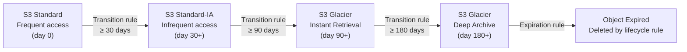
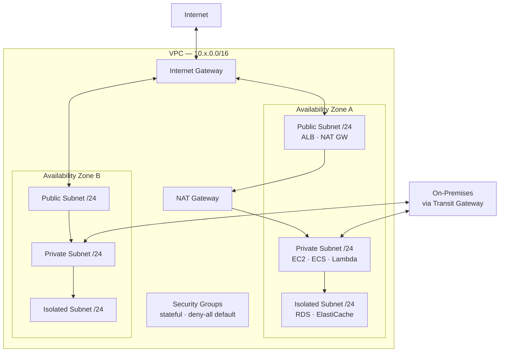

---
tags:
  - architecture
  - aws
---
# AWS — Standards


<div class="kb-summary">
Part of the [Architecture](../index.md) section.
</div>

---

## Tagging Policy

All AWS resources must carry these mandatory tags (enforced via AWS Config + SCPs):

| Tag Key | Example Value | Notes |
|---|---|---|
| `Environment` | `prod`, `staging`, `dev` | Lowercase; no abbreviations |
| `Owner` | `infra-team` | Team name, not individual |
| `CostCentre` | `CC-1234` | Finance cost centre code |
| `Application` | `erp-frontend` | Application or service name |

AWS Config rule `required-tags` flags non-compliant resources. SCP denies creation of EC2, RDS, S3 without tags.

## Naming Convention

Pattern: `<env>-<region>-<service>-<name>`

| Resource | Example |
|---|---|
| EC2 Instance | `prod-euw1-ec2-appserver-01` |
| RDS Instance | `prod-euw1-rds-orders` |
| S3 Bucket | `corp-prod-euw1-app-assets` |
| VPC | `prod-euw1-vpc` |
| Security Group | `prod-euw1-sg-alb-inbound` |
| IAM Role | `prod-ec2-role-appserver` |

Region abbreviations: `euw1` = eu-west-1, `use1` = us-east-1, `apse1` = ap-southeast-1.

## IAM Policy Standards

| Principle | Standard |
|---|---|
| No long-lived access keys | Humans use IAM Identity Center (SSO); machines use IAM Roles |
| Least privilege | All IAM policies scoped to minimum required actions and resources |
| No wildcard `*` on actions | Exception: read-only roles; document justification |
| SCP guardrails | Deny: root access without MFA, actions outside approved regions, disabling CloudTrail |
| Permission boundary | Apply to all IAM roles created by automation |

## S3 Object Lifecycle


```text
┌───────────────────────────────── AWS Architecture — Design Standards ─────────────────────────────────┐
│                                                                                                       │
│  Standards covering account structure, tagging, naming, networking, and security baseline.            │
│                                                                                                       │
│   ┌──────────────────────────────────────────────┐  ┌─────────────────────────────────────────────┐   │
│   │              Account Standards               │  │              Tagging Standards              │   │
│   │           One workload per account           │  │          Required: env, owner, team         │   │
│   │          No production in mgmt acct          │  │          Required: cost-centre, app         │   │
│   │           OU hierarchy: env-based            │  │          Enforce: SCP deny untagged         │   │
│   │          Separate audit + log accts          │  │         Naming: kebab-case standard         │   │
│   │           Email alias per account            │  │          Automation: tag on create          │   │
│   └──────────────────────────────────────────────┘  └─────────────────────────────────────────────┘   │
│                                                                                                       │
│  Account and tagging standards enforced via SCPs and AWS Config rules                                 │
│                                                                                                       │
│                          ▼                                                 ▼                          │
│                                                                                                       │
│   ┌──────────────────────────────────────────────┐  ┌─────────────────────────────────────────────┐   │
│   │             Networking Standards             │  │              Security Baseline              │   │
│   │          Non-overlapping VPC CIDRs           │  │             MFA: enforced by SCP            │   │
│   │        Private subnets for workloads         │  │          Root: no programmatic keys         │   │
│   │           Public: only LB + NAT GW           │  │            CloudTrail: always on            │   │
│   │            VPC flow logs: enabled            │  │            GuardDuty: org-wide on           │   │
│   │           TGW: centralised egress            │  │          CIS AWS Benchmark: target          │   │
│   └──────────────────────────────────────────────┘  └─────────────────────────────────────────────┘   │
│                                                                                                       │
│  Physical Infrastructure (the hardware everything above runs on):                                     │
│  AWS Regions · Availability Zones · data centres · DirectConnect · internet edge                      │
│                                                                                                       │
│  Key terms:                                                                                           │
│                                                                                                       │
│  CIS AWS Benchmark= Center for Internet Security prescriptive AWS security controls                   │
│  Non-overlapping CIDR= VPC address ranges that do not conflict; required for TGW                      │
│  Private subnet = No internet gateway route; workloads access internet via NAT GW                     │
│  Public subnet  = Has internet gateway route; only load balancers and NAT GW placed here              │
│  Centralised egress= All internet-bound traffic routed through shared inspection VPC                  │
│  Email alias    = Shared mailbox per account; avoids personal email ownership                         │
│  Kebab-case     = Naming convention using lowercase words separated by hyphens                        │
│  SCP deny untagged= Preventive control blocking resource creation without required tags               │
│  Cost-centre tag= Tag linking resources to financial cost allocation unit                             │
│  VPC flow logs  = Network traffic metadata logs; required for security investigations                 │
│  Audit account  = Dedicated account for security tooling (Security Hub, Config agg.)                  │
│  OU hierarchy   = Organizational Unit tree: Root → Security → Workloads → env OUs                     │
│                                                                                                       │
└───────────────────────────────────────────────────────────────────────────────────────────────────────┘
```

## Security Standards

| Control | Standard |
|---|---|
| CloudTrail | All-region trail in all accounts; logs to centralised S3 in log-archive account |
| Config | Enabled in all regions; conformance pack with CIS AWS Foundations Benchmark |
| GuardDuty | Enabled in all accounts via Organizations; alert forwarded to Security Tooling account |
| Security Hub | Enabled org-wide; aggregate to Security Tooling account |
| VPC Flow Logs | Enabled on all VPCs; logs to S3 or CloudWatch |
| Default VPC | Deleted from all regions on account creation |

## Approved Regions

AWS resources may only be deployed in approved regions (enforced via SCP):
- `eu-west-1` (Dublin) — primary
- `eu-west-2` (London) — secondary
- `us-east-1` — if required for global AWS services

Deploying to other regions requires an exception approved by InfoSec.

## VPC Architecture



## Network Standards

| Setting | Standard |
|---|---|
| VPC CIDR | /16 per account per region; no overlapping CIDRs across accounts |
| Subnet sizing | /24 per AZ per tier |
| NAT Gateway | One per AZ (not one per VPC) |
| Security Groups | Stateful; deny all inbound by default; explicit allow rules only |
| NACLs | Stateless; use as additional layer for subnet boundaries |
| Flow Logs | Enabled on all VPCs; ALL traffic, not REJECT only |
