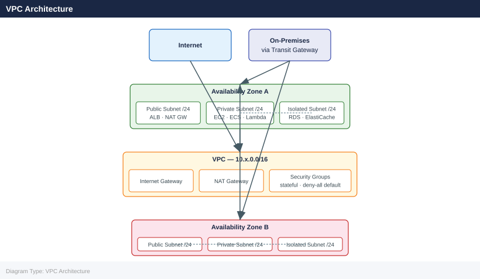

---
tags:
  - architecture
  - aws
---
# AWS — Standards

<div class="kb-summary">
AWS architecture design standards: multi-account landing zone layout, VPC CIDR allocation, transit gateway design, IAM boundary policies, and tagging strategy.

*Applies to: AWS*
</div>

---

```d2
direction: down

tagging_policy: "Tagging Policy" {shape: rectangle}
naming_convention: "Naming Convention" {shape: rectangle}
iam_policy_standards: "IAM Policy Standards" {shape: rectangle}
s3_object_lifecycle: "S3 Object Lifecycle" {shape: rectangle}
security_standards: "Security Standards" {shape: rectangle}
approved_regions: "Approved Regions" {shape: rectangle}

tagging_policy -> naming_convention: hardens
naming_convention -> iam_policy_standards: hardens
iam_policy_standards -> s3_object_lifecycle: hardens
s3_object_lifecycle -> security_standards: hardens
security_standards -> approved_regions: hardens
```

## Tagging Policy

All AWS resources must carry these mandatory tags (enforced via AWS Config + SCPs):

| Tag Key | Example Value | Notes |
|---|---|---|
| `Environment` | `prod`, `staging`, `dev` | Lowercase; no abbreviations |
| `Owner` | `infra-team` | Team name, not individual |
| `CostCentre` | `CC-1234` | Finance cost centre code |
| `Application` | `erp-frontend` | Application or service name |

AWS Config rule `required-tags` flags non-compliant resources. SCP denies creation of EC2, RDS, S3 without tags.

## Naming Convention

Pattern: `<env>-<region>-<service>-<name>`

| Resource | Example |
|---|---|
| EC2 Instance | `prod-euw1-ec2-appserver-01` |
| RDS Instance | `prod-euw1-rds-orders` |
| S3 Bucket | `corp-prod-euw1-app-assets` |
| VPC | `prod-euw1-vpc` |
| Security Group | `prod-euw1-sg-alb-inbound` |
| IAM Role | `prod-ec2-role-appserver` |

Region abbreviations: `euw1` = eu-west-1, `use1` = us-east-1, `apse1` = ap-southeast-1.

## IAM Policy Standards

| Principle | Standard |
|---|---|
| No long-lived access keys | Humans use IAM Identity Center (SSO); machines use IAM Roles |
| Least privilege | All IAM policies scoped to minimum required actions and resources |
| No wildcard `*` on actions | Exception: read-only roles; document justification |
| SCP guardrails | Deny: root access without MFA, actions outside approved regions, disabling CloudTrail |
| Permission boundary | Apply to all IAM roles created by automation |

## S3 Object Lifecycle

```d2
direction: right

standard: "S3 Standard\nFrequent access\n(day 0" {shape: rectangle}
ia: "S3 Standard-IA\nInfrequent access\n(day 30+" {shape: rectangle}
glacier: "S3 Glacier\nInstant Retrieval\n(day 90+" {shape: rectangle}
deepArchive: "S3 Glacier\nDeep Archive\n(day 180+" {shape: rectangle}
expire: "Object Expired\nDeleted by lifecycle rule" {shape: rectangle}

standard -> ia
ia -> glacier
glacier -> deepArchive
deepArchive -> expire
```

## Security Standards

| Control | Standard |
|---|---|
| CloudTrail | All-region trail in all accounts; logs to centralised S3 in log-archive account |
| Config | Enabled in all regions; conformance pack with CIS AWS Foundations Benchmark |
| GuardDuty | Enabled in all accounts via Organizations; alert forwarded to Security Tooling account |
| Security Hub | Enabled org-wide; aggregate to Security Tooling account |
| VPC Flow Logs | Enabled on all VPCs; logs to S3 or CloudWatch |
| Default VPC | Deleted from all regions on account creation |

## Approved Regions

AWS resources may only be deployed in approved regions (enforced via SCP):
- `eu-west-1` (Dublin) — primary
- `eu-west-2` (London) — secondary
- `us-east-1` — if required for global AWS services

Deploying to other regions requires an exception approved by InfoSec.

## VPC Architecture



## Network Standards

| Setting | Standard |
|---|---|
| VPC CIDR | /16 per account per region; no overlapping CIDRs across accounts |
| Subnet sizing | /24 per AZ per tier |
| NAT Gateway | One per AZ (not one per VPC) |
| Security Groups | Stateful; deny all inbound by default; explicit allow rules only |
| NACLs | Stateless; use as additional layer for subnet boundaries |
| Flow Logs | Enabled on all VPCs; ALL traffic, not REJECT only |

---

## See also

- [Aws — Deploy](../../deploy/)
