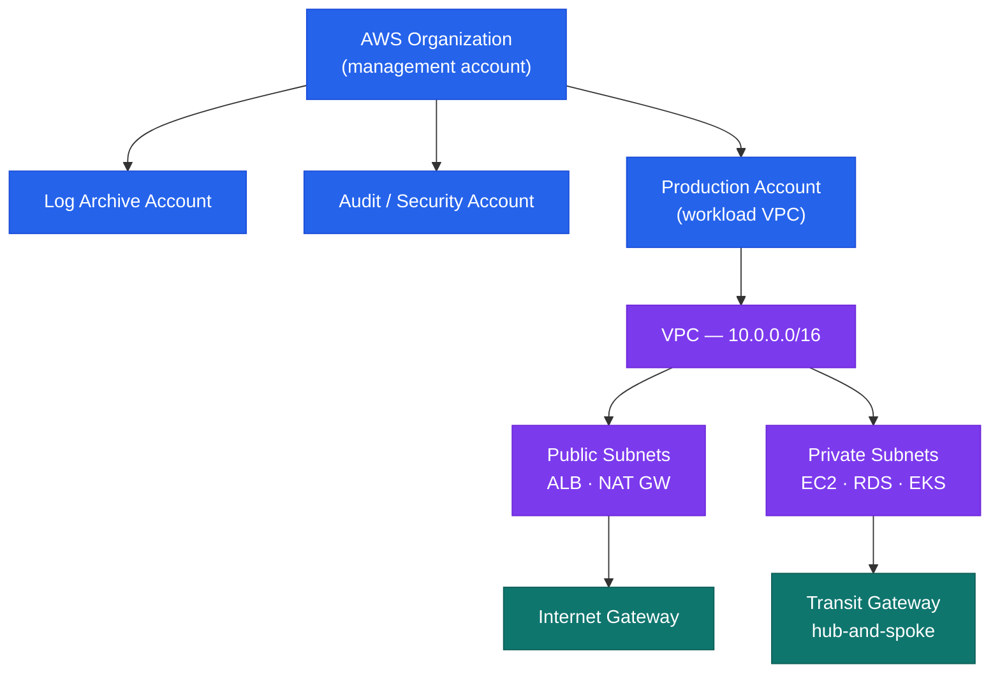

# AWS — How It Works


<div class="kb-summary">
How It Works reference covering Overview, Account Structure, IAM Structure, High Availability, Disaster Recovery.
</div>

## Overview

AWS is deployed as a multi-account organisation via AWS Organizations. All production workloads run in dedicated member accounts. A management account holds only SCPs and consolidated billing — no workloads. An audit account aggregates CloudTrail and Config findings; a log archive account stores centralised log retention.

## Account Structure


```
┌─────────────────────────────────── AWS Architecture — How It Works ───────────────────────────────────┐
│                                                                                                       │
│  Multi-account org: management root governs OUs; workload accounts isolated by purpose.               │
│                                                                                                       │
│   ┌──────────────────────────────────────────────┐  ┌─────────────────────────────────────────────┐   │
│   │                Account Layer                 │  │               Networking Layer              │   │
│   │        Management: org root + billing        │  │          Transit Gateway: hub-spoke         │   │
│   │          Log Archive: central logs           │  │          VPC per account: isolation         │   │
│   │           Audit: security tooling            │  │         DirectConnect: on-prem link         │   │
│   │         Workload: env/team accounts          │  │        VPC endpoints: private S3/SSM        │   │
│   │          SCPs: OU-level guardrails           │  │        Route 53: DNS across accounts        │   │
│   └──────────────────────────────────────────────┘  └─────────────────────────────────────────────┘   │
│                                                                                                       │
│  Accounts provide blast-radius isolation; Transit Gateway connects without peering mesh               │
│                                                                                                       │
│                          ▼                                                 ▼                          │
│                                                                                                       │
│   ┌──────────────────────────────────────────────┐  ┌─────────────────────────────────────────────┐   │
│   │             Identity and Access              │  │                Observability                │   │
│   │           IAM Identity Center: SSO           │  │         CloudTrail: org-wide API log        │   │
│   │        Permission sets → member accts        │  │          CloudWatch: metrics + logs         │   │
│   │          SAML federation: IdP → AWS          │  │          Config: resource inventory         │   │
│   │           IAM roles: cross-account           │  │           Security Hub: aggregated          │   │
│   │          MFA: enforced org-wide SCP          │  │         GuardDuty: threat detection         │   │
│   └──────────────────────────────────────────────┘  └─────────────────────────────────────────────┘   │
│                                                                                                       │
│  Physical Infrastructure (the hardware everything above runs on):                                     │
│  AWS Regions · Availability Zones · data centres · DirectConnect physical ports · backbone            │
│                                                                                                       │
│  Key terms:                                                                                           │
│                                                                                                       │
│  OU             = Organisational Unit; logical grouping of accounts with shared SCPs                  │
│  SCP            = Service Control Policy; preventive guardrail at OU or account level                 │
│  Transit Gateway= Regional hub router connecting multiple VPCs without full mesh                      │
│  IAM Identity Center= AWS SSO; assigns permission sets to users in member accounts                    │
│  Permission set = IAM policy bundle assigned to user/group for specific account                       │
│  DirectConnect  = Dedicated private link from on-premises to AWS; bypasses internet                   │
│  VPC endpoint   = Private connection to AWS services without internet traversal                       │
│  CloudTrail org = Management-account trail capturing all API calls across every account               │
│  AWS Config     = Records resource configuration changes; evaluates compliance rules                  │
│  Security Hub   = Aggregates findings from GuardDuty, Inspector, Config across accounts               │
│  GuardDuty      = Threat detection; analyses CloudTrail, VPC Flow Logs, DNS queries                   │
│  Log archive    = Dedicated account receiving all central logs; immutable S3 bucket                   │
│                                                                                                       │
└───────────────────────────────────────────────────────────────────────────────────────────────────────┘
```

- **Humans**: IAM Identity Center — no direct IAM users in member accounts
- **Machines**: IAM Roles with instance profiles or OIDC federation
- **Break-glass**: IAM user in management account with credentials in CyberArk

## High Availability

- All stateful services deployed Multi-AZ: RDS, ElastiCache, EFS, ELB
- EC2 in Auto Scaling Groups spanning ≥ 2 AZs
- ALB with target group health checks — unhealthy instances replaced automatically

## Disaster Recovery

| Pattern | Services | RPO / RTO |
|---|---|---|
| Cross-region S3 replication | S3 CRR | Near-zero RPO |
| RDS automated backups | RDS to secondary region | < 1 hour RPO |
| Route 53 health-check failover | Route 53 + secondary ALB | < 5 minutes RTO |

---

## AWS Global Infrastructure

```
┌──────────────────── AWS Global Infrastructure — Regions, AZs, and Edge Locations ─────────────────────┐
│                                                                                                       │
│    33+ Regions, 105+ AZs, 400+ CloudFront edge locations; foundation of all AWS services.             │
│                                                                                                       │
│   ┌──────────────────────────────────────────────┐  ┌─────────────────────────────────────────────┐   │
│   │             AWS Regions (33+)                │  │          Availability Zones (105+)          │   │
│   │  Isolated geographic area (sovereign)        │  │  One or more independent data centres       │   │
│   │  Contains 2 to 6 Availability Zones          │  │  Separate power, cooling, networking        │   │
│   │  Data stays in Region by default             │  │  Low-latency fibre links between AZs        │   │
│   │  Choose by: latency, compliance, $           │  │  Fault-isolated; independent failure        │   │
│   │  Opt-in Regions disabled by default          │  │  AZ ID is consistent cross-account          │   │
│   └──────────────────────────────────────────────┘  └─────────────────────────────────────────────┘   │
│                                                                                                       │
│    Regions are data-sovereignty boundaries; AZs provide HA within a Region.                           │
│                                                                                                       │
│                          ▼                                                 ▼                          │
│                                                                                                       │
│   ┌──────────────────────────────────────────────┐  ┌─────────────────────────────────────────────┐   │
│   │            Edge Locations (400+)             │  │          Special Infrastructure             │   │
│   │  CloudFront PoP: cache + WAF/Shield          │  │  Local Zone: sub-ms latency in city         │   │
│   │  Route 53: anycast DNS resolution            │  │  Wavelength: 5G mobile edge compute         │   │
│   │  Lambda@Edge: code at CloudFront PoP         │  │  Outposts: AWS rack in customer DC          │   │
│   │  Global Accelerator: Anycast IPs             │  │  GovCloud US: FedRAMP/ITAR compliant        │   │
│   │  Shield Standard: free L3/L4 DDoS            │  │  China: separate partition, ICP req         │   │
│   └──────────────────────────────────────────────┘  └─────────────────────────────────────────────┘   │
│                                                                                                       │
│    Physical Infrastructure (the hardware everything above runs on):                                   │
│    AWS data centres worldwide · submarine cables · backbone fibre · internet exchange points          │
│                                                                                                       │
│    Key terms:                                                                                         │
│                                                                                                       │
│    Region         = Isolated geo area; 2+ AZs; data stays in Region; 33+ globally                     │
│    AZ             = Availability Zone; 1+ DCs with independent power/cooling/network                  │
│    Edge Location  = CloudFront PoP; caches content; applies WAF and Shield at edge                    │
│    Local Zone     = AWS infrastructure extension to major cities for low-latency apps                 │
│    Wavelength     = AWS compute embedded in telecom 5G network for ultra-low latency                  │
│    Outposts       = AWS rack on-premises; extends AWS APIs to customer data centre                    │
│    GovCloud       = US-only Regions meeting FedRAMP High, ITAR, DoD requirements                      │
│    Global Accelerator = Anycast IPs routing users to nearest healthy AWS endpoint                     │
│    PoP            = Point of Presence; CloudFront edge node for caching/DDoS defence                  │
│    AZ ID          = Consistent cross-account AZ identifier (e.g., use1-az1)                           │
│    Opt-in Region  = Region disabled by default; must be enabled per account                           │
│    Partition      = Isolated AWS infrastructure group: standard, GovCloud, China                      │
│                                                                                                       │
└───────────────────────────────────────────────────────────────────────────────────────────────────────┘
```


---

## AWS Shared Responsibility Model

```
┌──────────────────── AWS Shared Responsibility Model — Security OF vs IN the Cloud ────────────────────┐
│                                                                                                       │
│    AWS secures the infrastructure; customers secure what they run on it.                              │
│                                                                                                       │
│   ┌──────────────────────────────────────────────┐  ┌─────────────────────────────────────────────┐   │
│   │        AWS Responsibility (OF the cloud)     │  │     Customer Responsibility (IN the cloud)  │   │
│   │  Physical hardware + data centres            │  │  Data: classification and encryption        │   │
│   │  Network and hypervisor layer                │  │  Identity and access management             │   │
│   │  Compute / storage / database infra          │  │  OS patches (for EC2/IaaS only)             │   │
│   │  Regions, AZs, and edge locations            │  │  Application code and configuration         │   │
│   │  Managed service security (RDS/S3)           │  │  Network config: SGs, NACLs, routes         │   │
│   └──────────────────────────────────────────────┘  └─────────────────────────────────────────────┘   │
│                                                                                                       │
│    For managed services (RDS, Lambda), AWS takes more responsibility; EC2 is IaaS.                    │
│                                                                                                       │
│                          ▼                                                 ▼                          │
│                                                                                                       │
│   ┌──────────────────────────────────────────────┐  ┌─────────────────────────────────────────────┐   │
│   │      IaaS (EC2): Customer manages most       │  │      PaaS/SaaS: AWS manages most            │   │
│   │  Guest OS: customer patches/updates          │  │  RDS: OS/engine patched by AWS              │   │
│   │  Security groups: customer configures        │  │  S3: infra/durability managed by AWS        │   │
│   │  Application: customer deploys/secures       │  │  Lambda: runtime managed by AWS             │   │
│   │  IAM roles: customer defines access          │  │  DynamoDB: fully managed by AWS             │   │
│   │  Encryption: customer enables/manages        │  │  Customer manages data and IAM only         │   │
│   └──────────────────────────────────────────────┘  └─────────────────────────────────────────────┘   │
│                                                                                                       │
│    Physical Infrastructure (the hardware everything above runs on):                                   │
│    AWS-owned hardware, data centres, network; customers have no physical access                       │
│                                                                                                       │
│    Key terms:                                                                                         │
│                                                                                                       │
│    Shared model    = AWS owns security of the cloud; customer owns security in the cloud              │
│    IaaS            = Infrastructure as a Service; e.g., EC2 — customer manages OS up                  │
│    PaaS            = Platform as a Service; e.g., Elastic Beanstalk, RDS                              │
│    SaaS            = Software as a Service; e.g., Chime, WorkMail                                     │
│    Security of     = Hardware, software, networking, facilities managed by AWS                        │
│    Security in     = Data, platform, applications, identity managed by customer                       │
│    Managed service = AWS handles patching, HA, backups; customer handles data/access                  │
│    Encryption keys = Customer may manage via KMS CMK; AWS manages default keys                        │
│                                                                                                       │
└───────────────────────────────────────────────────────────────────────────────────────────────────────┘
```


---

## AWS Well-Architected Framework — 6 Pillars

```
┌───────────────────────────── AWS Well-Architected Framework — 6 Pillars ──────────────────────────────┐
│                                                                                                       │
│    Framework guides cloud architecture decisions; assessed via Well-Architected Tool.                 │
│                                                                                                       │
│   ┌──────────────────────────────────────────────┐  ┌─────────────────────────────────────────────┐   │
│   │      Operational Excellence                  │  │      Security                               │   │
│   │  Run + monitor workloads effectively         │  │  Protect data, systems, and assets          │   │
│   │  Improve operations through small            │  │  Apply security at all layers               │   │
│   │  frequent reversible changes                 │  │  Enable traceability via logging            │   │
│   │  Annotate docs; anticipate failure           │  │  Automate security best practices           │   │
│   │  Perform operations as code (IaC)            │  │  Protect data in transit and at rest        │   │
│   └──────────────────────────────────────────────┘  └─────────────────────────────────────────────┘   │
│                                                                                                       │
│                          ▼                                                 ▼                          │
│                                                                                                       │
│   ┌──────────────────────────────────────────────┐  ┌─────────────────────────────────────────────┐   │
│   │      Reliability                             │  │      Performance Efficiency                 │   │
│   │  Recover from failures automatically         │  │  Use compute resources efficiently          │   │
│   │  Scale horizontally for availability         │  │  Select right resource types/sizes          │   │
│   │  Manage change via automation                │  │  Monitor performance; adapt/evolve          │   │
│   │  Test recovery procedures regularly          │  │  Use advanced tech democratized             │   │
│   │  Design for multi-AZ and multi-region        │  │  Go global quickly with AWS Regions         │   │
│   └──────────────────────────────────────────────┘  └─────────────────────────────────────────────┘   │
│                                                                                                       │
│                          ▼                                                 ▼                          │
│                                                                                                       │
│   ┌──────────────────────────────────────────────┐  ┌─────────────────────────────────────────────┐   │
│   │      Cost Optimization                       │  │      Sustainability (6th pillar, 2021)      │   │
│   │  Avoid unnecessary costs                     │  │  Minimise environmental impact              │   │
│   │  Measure efficiency; use managed svcs        │  │  Understand your impact footprint           │   │
│   │  Analyse and attribute expenditure           │  │  Maximise resource utilisation              │   │
│   │  Use Reserved/Savings Plans wisely           │  │  Use managed services (lower footpt)        │   │
│   │  Right-size and eliminate idle rsrcs         │  │  Choose Regions with clean energy           │   │
│   └──────────────────────────────────────────────┘  └─────────────────────────────────────────────┘   │
│                                                                                                       │
│    Physical Infrastructure (the hardware everything above runs on):                                   │
│    All 6 pillars apply to services running on AWS hardware in Regions and AZs                         │
│                                                                                                       │
│    Key terms:                                                                                         │
│                                                                                                       │
│    Well-Architected Tool  = Free AWS service to review workloads against 6 pillars                    │
│    Well-Architected Review = Formal assessment producing improvement action plan                      │
│    Pillar                 = One of 6 design domains; each has design principles + questions           │
│    High Risk Issue (HRI)  = WAF finding requiring immediate attention                                 │
│    Medium Risk Issue (MRI)= WAF finding to address in upcoming sprint                                 │
│    IaC                    = Infrastructure as Code; operations as code principle                      │
│    Sustainability pillar  = Added 2021; focuses on energy use and carbon footprint                    │
│                                                                                                       │
└───────────────────────────────────────────────────────────────────────────────────────────────────────┘
```


---

## AWS Cloud Adoption Framework — 6 Perspectives

```
┌───────────────────────── AWS Cloud Adoption Framework (CAF) — 6 Perspectives ─────────────────────────┐
│                                                                                                       │
│    CAF organises guidance into Business and Technology perspectives for cloud adoption.               │
│                                                                                                       │
│   ┌──────────────────────────────────────────────┐  ┌─────────────────────────────────────────────┐   │
│   │      Business Perspectives (outcomes)        │  │      Technology Perspectives (delivery)     │   │
│   │  Business: value / strategy / KPIs           │  │  Platform: architecture / IaC / CI/CD       │   │
│   │  People: change mgmt / org readiness         │  │  Security: IAM / detection / response       │   │
│   │  Governance: risk / compliance / fin         │  │  Operations: monitoring / ITSM / DR         │   │
│   └──────────────────────────────────────────────┘  └─────────────────────────────────────────────┘   │
│                                                                                                       │
│    Business side drives why; Technology side drives how. Both needed for success.                     │
│                                                                                                       │
│                          ▼                                                 ▼                          │
│                                                                                                       │
│   ┌──────────────────────────────────────────────┐  ┌─────────────────────────────────────────────┐   │
│   │      CAF Capabilities by Perspective         │  │      Transformation Domains                 │   │
│   │  Business: portfolio mgmt, data monet        │  │  Technology: modernise IT platforms         │   │
│   │  People: HR trans, leadership align          │  │  Process: digitise, automate, optimise      │   │
│   │  Governance: prog mgmt, benefit real         │  │  Organisation: lead cloud teams             │   │
│   │  Platform: platform eng, data estate         │  │  Product: innovate, experiment fast         │   │
│   │  Security: threat intel, vuln mgmt           │  │  Outcomes: reduce cost + risk, speed        │   │
│   └──────────────────────────────────────────────┘  └─────────────────────────────────────────────┘   │
│                                                                                                       │
│    Physical Infrastructure (the hardware everything above runs on):                                   │
│    CAF is a methodology; underlying infra = AWS Regions, AZs, and managed services                    │
│                                                                                                       │
│    Key terms:                                                                                         │
│                                                                                                       │
│    CAF          = Cloud Adoption Framework; AWS guidance for org cloud transformation                 │
│    Perspective  = One of 6 CAF domains grouping related capabilities                                  │
│    Capability   = Specific business or technology ability needed for cloud adoption                   │
│    Business side= Business + People + Governance; aligned to business outcomes                        │
│    Tech side    = Platform + Security + Operations; aligned to technical delivery                     │
│    Transformation domain = Area of organisational change: technology, process, org, product           │
│    MRA          = Migration Readiness Assessment; CAF-based readiness scoring                         │
│                                                                                                       │
└───────────────────────────────────────────────────────────────────────────────────────────────────────┘
```


---

## AWS Migration Strategies — 7 Rs

```
┌───────────────────────────────── AWS Migration Strategies — The 7 Rs ─────────────────────────────────┐
│                                                                                                       │
│    7 Rs describe how an application moves to or is handled in the cloud migration.                    │
│                                                                                                       │
│   ┌──────────────────────────────────────────────┐  ┌─────────────────────────────────────────────┐   │
│   │         Retire / Retain (no move)            │  │         Rehost / Relocate (lift-shift)      │   │
│   │  Retire: decommission the app                │  │  Rehost: move to EC2 with no changes        │   │
│   │  No migration needed; end of life            │  │  Fastest path; no refactoring needed        │   │
│   │  Retain: keep on-premises for now            │  │  Relocate: move VMware VMs to VMC           │   │
│   │  Revisit later; compliance/technical         │  │  Hyper-V/VMware to cloud via migrate        │   │
│   │  Review at next migration cycle              │  │  Good for large legacy app portfolios       │   │
│   └──────────────────────────────────────────────┘  └─────────────────────────────────────────────┘   │
│                                                                                                       │
│    Retire/Retain need no cloud resources; Rehost/Relocate need minimal changes.                       │
│                                                                                                       │
│                          ▼                                                 ▼                          │
│                                                                                                       │
│   ┌──────────────────────────────────────────────┐  ┌─────────────────────────────────────────────┐   │
│   │      Replatform / Repurchase                 │  │      Refactor / Re-architect                │   │
│   │  Replatform: lift-tinker-shift               │  │  Refactor: re-write as cloud-native         │   │
│   │  e.g., RDS instead of self-managed DB        │  │  e.g., move to Lambda/containers/EKS        │   │
│   │  Minor optimisations; same app code          │  │  Highest effort; highest cloud value        │   │
│   │  Repurchase: drop and shop to SaaS           │  │  Best for apps needing scale/agility        │   │
│   │  e.g., CRM on-prem to Salesforce             │  │  Microservices, serverless, event-drv       │   │
│   └──────────────────────────────────────────────┘  └─────────────────────────────────────────────┘   │
│                                                                                                       │
│    Physical Infrastructure (the hardware everything above runs on):                                   │
│    AWS Regions and AZs host migrated workloads; on-prem DC remains for Retain/Retire                  │
│                                                                                                       │
│    Key terms:                                                                                         │
│                                                                                                       │
│    Retire      = Decommission; no longer needed; remove from scope                                    │
│    Retain      = Keep on-premises; revisit later; compliance or technical blocker                     │
│    Rehost      = Lift and shift to EC2; no application changes; fastest                               │
│    Relocate    = Move to cloud without buying new hardware (e.g., VMware Cloud on AWS)                │
│    Replatform  = Lift tinker and shift; minor optimisations without code changes                      │
│    Repurchase  = Replace with SaaS product; drop and shop; e.g., on-prem CRM to SaaS                  │
│    Refactor    = Re-architect as cloud-native; highest effort; microservices/serverless               │
│    MGN         = AWS Application Migration Service; automates rehost migrations                       │
│                                                                                                       │
└───────────────────────────────────────────────────────────────────────────────────────────────────────┘
```
