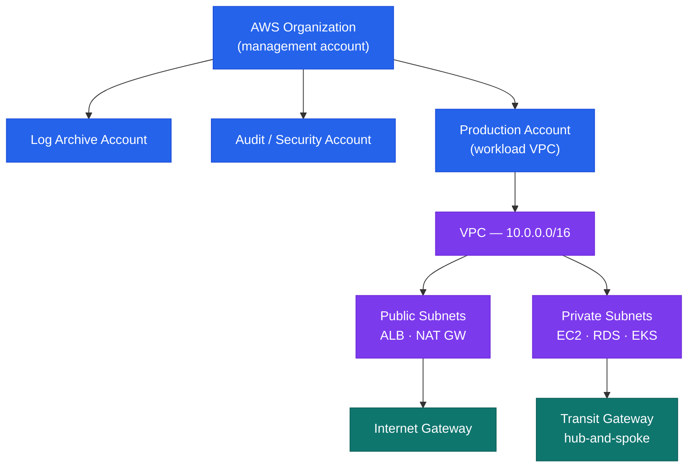

# AWS — How It Works


<div class="kb-summary">
How It Works reference covering Overview, Account Structure, IAM Structure, High Availability, Disaster Recovery.
</div>

## Overview

AWS is deployed as a multi-account organisation via AWS Organizations. All production workloads run in dedicated member accounts. A management account holds only SCPs and consolidated billing — no workloads. An audit account aggregates CloudTrail and Config findings; a log archive account stores centralised log retention.

## Account Structure


```
┌─────────────────────────────────── AWS Architecture — How It Works ───────────────────────────────────┐
│                                                                                                       │
│  Multi-account org: management root governs OUs; workload accounts isolated by purpose.               │
│                                                                                                       │
│   ┌──────────────────────────────────────────────┐  ┌─────────────────────────────────────────────┐   │
│   │                Account Layer                 │  │               Networking Layer              │   │
│   │        Management: org root + billing        │  │          Transit Gateway: hub-spoke         │   │
│   │          Log Archive: central logs           │  │          VPC per account: isolation         │   │
│   │           Audit: security tooling            │  │         DirectConnect: on-prem link         │   │
│   │         Workload: env/team accounts          │  │        VPC endpoints: private S3/SSM        │   │
│   │          SCPs: OU-level guardrails           │  │        Route 53: DNS across accounts        │   │
│   └──────────────────────────────────────────────┘  └─────────────────────────────────────────────┘   │
│                                                                                                       │
│  Accounts provide blast-radius isolation; Transit Gateway connects without peering mesh               │
│                                                                                                       │
│                          ▼                                                 ▼                          │
│                                                                                                       │
│   ┌──────────────────────────────────────────────┐  ┌─────────────────────────────────────────────┐   │
│   │             Identity and Access              │  │                Observability                │   │
│   │           IAM Identity Center: SSO           │  │         CloudTrail: org-wide API log        │   │
│   │        Permission sets → member accts        │  │          CloudWatch: metrics + logs         │   │
│   │          SAML federation: IdP → AWS          │  │          Config: resource inventory         │   │
│   │           IAM roles: cross-account           │  │           Security Hub: aggregated          │   │
│   │          MFA: enforced org-wide SCP          │  │         GuardDuty: threat detection         │   │
│   └──────────────────────────────────────────────┘  └─────────────────────────────────────────────┘   │
│                                                                                                       │
│  Physical Infrastructure (the hardware everything above runs on):                                     │
│  AWS Regions · Availability Zones · data centres · DirectConnect physical ports · backbone            │
│                                                                                                       │
│  Key terms:                                                                                           │
│                                                                                                       │
│  OU             = Organisational Unit; logical grouping of accounts with shared SCPs                  │
│  SCP            = Service Control Policy; preventive guardrail at OU or account level                 │
│  Transit Gateway= Regional hub router connecting multiple VPCs without full mesh                      │
│  IAM Identity Center= AWS SSO; assigns permission sets to users in member accounts                    │
│  Permission set = IAM policy bundle assigned to user/group for specific account                       │
│  DirectConnect  = Dedicated private link from on-premises to AWS; bypasses internet                   │
│  VPC endpoint   = Private connection to AWS services without internet traversal                       │
│  CloudTrail org = Management-account trail capturing all API calls across every account               │
│  AWS Config     = Records resource configuration changes; evaluates compliance rules                  │
│  Security Hub   = Aggregates findings from GuardDuty, Inspector, Config across accounts               │
│  GuardDuty      = Threat detection; analyses CloudTrail, VPC Flow Logs, DNS queries                   │
│  Log archive    = Dedicated account receiving all central logs; immutable S3 bucket                   │
│                                                                                                       │
└───────────────────────────────────────────────────────────────────────────────────────────────────────┘
```
```

- **Humans**: IAM Identity Center — no direct IAM users in member accounts
- **Machines**: IAM Roles with instance profiles or OIDC federation
- **Break-glass**: IAM user in management account with credentials in CyberArk

## High Availability

- All stateful services deployed Multi-AZ: RDS, ElastiCache, EFS, ELB
- EC2 in Auto Scaling Groups spanning ≥ 2 AZs
- ALB with target group health checks — unhealthy instances replaced automatically

## Disaster Recovery

| Pattern | Services | RPO / RTO |
|---|---|---|
| Cross-region S3 replication | S3 CRR | Near-zero RPO |
| RDS automated backups | RDS to secondary region | < 1 hour RPO |
| Route 53 health-check failover | Route 53 + secondary ALB | < 5 minutes RTO |
