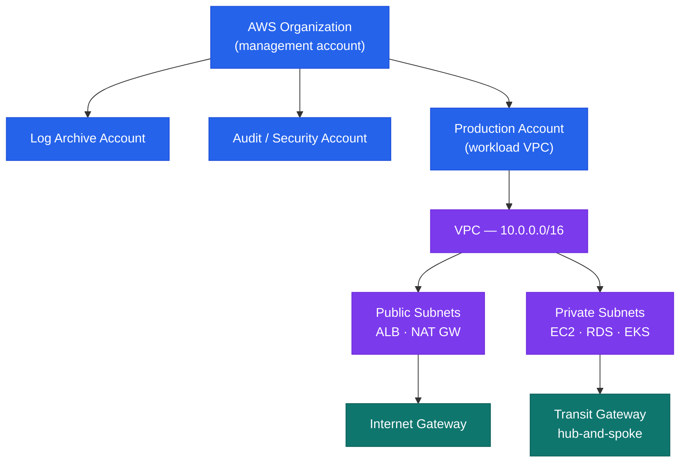
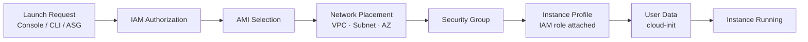

# AWS — How It Works

## Overview

AWS is deployed as a multi-account organisation via AWS Organizations. All production workloads run in dedicated member accounts. A management account holds only SCPs and consolidated billing — no workloads. An audit account aggregates CloudTrail and Config findings; a log archive account stores centralised log retention.

## Account Structure



SCPs enforce guardrails: deny root access, enforce encryption, restrict regions to an approved list.

## Network Architecture

Hub-and-spoke via Transit Gateway:

Subnet tiers per VPC:

| Tier | Contents | Internet access |
|---|---|---|
| Public | ALB, NAT Gateway — no EC2 instances | Yes via IGW |
| Private | EC2, ECS, Lambda | Outbound via NAT GW |
| Isolated | RDS, ElastiCache | None |

## Networking Services

| Service | Purpose | Key Config |
|---|---|---|
| VPC | Isolated virtual network | CIDR, subnets, route tables, NACLs |
| Transit Gateway | Hub connecting VPCs and on-prem | TGW attachments, route domains |
| Direct Connect | Dedicated private circuit from on-prem | VIFs (private/public), BGP, DXGW |
| Route 53 | DNS — public/private zones, health checks | Alias records, resolver endpoints |
| ALB / NLB | Layer 7 / Layer 4 load balancing | Target groups, listener rules, WAF |
| CloudFront | CDN for static content and API acceleration | Distributions, origins, OAC |

## Compute Services

| Service | Use Case | Notes |
|---|---|---|
| EC2 (Auto Scaling Groups) | Stateful apps, legacy workloads | Launch templates, target-tracking scaling |
| EKS | Kubernetes workloads | Node groups vs Fargate profiles, IRSA via OIDC |
| ECS / Fargate | Container orchestration | Task definitions, services, capacity providers |
| Lambda | Event-driven functions | 15-min max, 128 MB–10 GB memory, X-Ray tracing |

## Storage Services

| Service | Purpose | Notes |
|---|---|---|
| S3 | Object storage | Bucket policies, versioning, lifecycle rules, CRR |
| EBS | Block storage for EC2 | gp3 default; io2 Block Express for high IOPS; snapshots |
| EFS | Shared NFS — multi-AZ | General Purpose vs Max I/O; Bursting vs Provisioned |
| FSx for Windows | Managed SMB file server | AD integration, DFS replication |
| FSx for ONTAP | Managed NetApp ONTAP | Multi-protocol, SnapMirror, S3 tiering |

## Database Services

| Service | Purpose | Notes |
|---|---|---|
| RDS | Managed relational DB | MySQL, PostgreSQL, SQL Server, Oracle; Multi-AZ; read replicas |
| Aurora | MySQL/PostgreSQL-compatible | Higher throughput; Aurora Serverless v2 for variable workloads |
| DynamoDB | Managed NoSQL | On-demand vs provisioned capacity, DAX cache, global tables |
| ElastiCache | In-memory cache | Redis Cluster mode, auth tokens, encryption in transit |

## Security Services

| Service | Purpose | Notes |
|---|---|---|
| IAM | Identity and access management | Roles, policies, permission boundaries, OIDC federation |
| KMS | Key management — encryption at rest | CMK vs AWS-managed keys; key policies; key rotation |
| Secrets Manager | Secret rotation and storage | Auto-rotation for RDS; cross-account via resource policy |
| WAF | Web Application Firewall | Managed rule sets (AWS + OWASP core) |
| GuardDuty | Threat detection | VPC flow logs, DNS, CloudTrail → EventBridge → response |
| Security Hub | Aggregated findings across accounts | CIS Benchmark, AWS Foundational Security Standard |

## Management and Observability

| Service | Purpose | Notes |
|---|---|---|
| CloudWatch | Metrics, logs, alarms | Log groups, metric filters, composite alarms, dashboards |
| CloudTrail | API audit log | Multi-region trail to S3; CloudWatch Logs integration |
| AWS Config | Resource configuration history and compliance | Config rules, conformance packs, remediation |
| Systems Manager | Fleet management without bastions | Session Manager, Patch Manager, Parameter Store |
| CloudFormation | Infrastructure as code | Stacks, nested stacks, change sets, drift detection |

## EC2 Launch Flow



## IAM Structure

```text
AWS Organizations SCPs (deny dangerous actions globally)
    │
IAM Identity Center (SSO — maps AD groups to permission sets)
    │
IAM Roles (assumed by EC2, Lambda, ECS, CI/CD via OIDC)
    │
No long-lived IAM user access keys in production
```

- **Humans**: IAM Identity Center — no direct IAM users in member accounts
- **Machines**: IAM Roles with instance profiles or OIDC federation
- **Break-glass**: IAM user in management account with credentials in CyberArk

## High Availability

- All stateful services deployed Multi-AZ: RDS, ElastiCache, EFS, ELB
- EC2 in Auto Scaling Groups spanning ≥ 2 AZs
- ALB with target group health checks — unhealthy instances replaced automatically

## Disaster Recovery

| Pattern | Services | RPO / RTO |
|---|---|---|
| Cross-region S3 replication | S3 CRR | Near-zero RPO |
| RDS automated backups | RDS to secondary region | < 1 hour RPO |
| Route 53 health-check failover | Route 53 + secondary ALB | < 5 minutes RTO |
