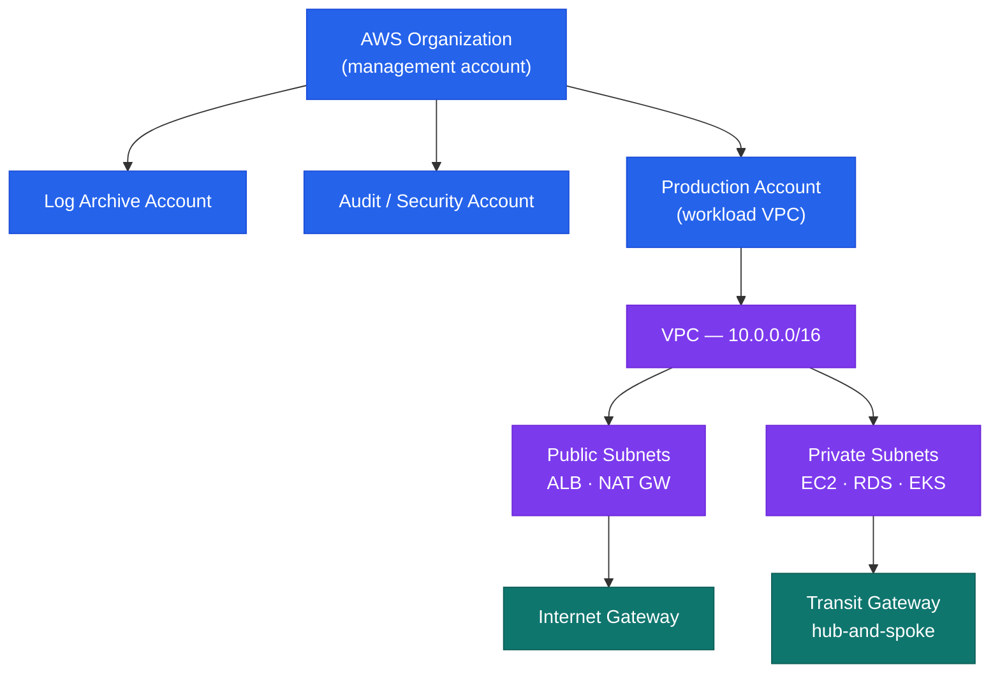

---
tags:
  - architecture
  - aws
---
# AWS — How It Works

How It Works reference covering Overview, Account Structure, IAM Structure, High Availability, Disaster Recovery.

*Applies to: AWS*

## Overview

AWS is deployed as a multi-account organisation via AWS Organizations. All production workloads run in dedicated member accounts. A management account holds only SCPs and consolidated billing — no workloads. An audit account aggregates CloudTrail and Config findings; a log archive account stores centralised log retention.

## Account Structure

- **Humans**: IAM Identity Center — no direct IAM users in member accounts
- **Machines**: IAM Roles with instance profiles or OIDC federation
- **Break-glass**: IAM user in management account with credentials in CyberArk

## High Availability

- All stateful services deployed Multi-AZ: RDS, ElastiCache, EFS, ELB
- EC2 in Auto Scaling Groups spanning ≥ 2 AZs
- ALB with target group health checks — unhealthy instances replaced automatically

## Disaster Recovery

| Pattern | Services | RPO / RTO |
|---|---|---|
| Cross-region S3 replication | S3 CRR | Near-zero RPO |
| RDS automated backups | RDS to secondary region | < 1 hour RPO |
| Route 53 health-check failover | Route 53 + secondary ALB | < 5 minutes RTO |

---

## AWS Global Infrastructure

---

## AWS Shared Responsibility Model

---

## AWS Well-Architected Framework — 6 Pillars

---

## AWS Cloud Adoption Framework — 6 Perspectives

---

## AWS Migration Strategies — 7 Rs

---

## See also

- [Aws — Design Standards](../design-standards/)
- [Aws — Integrations](../integrations/)
- [Aws — Deploy](../../deploy/)
