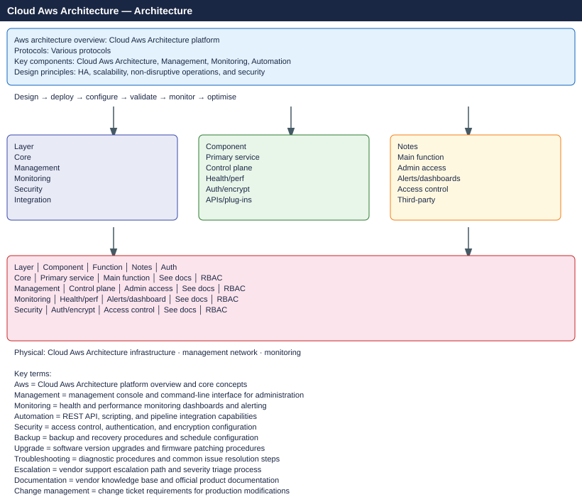
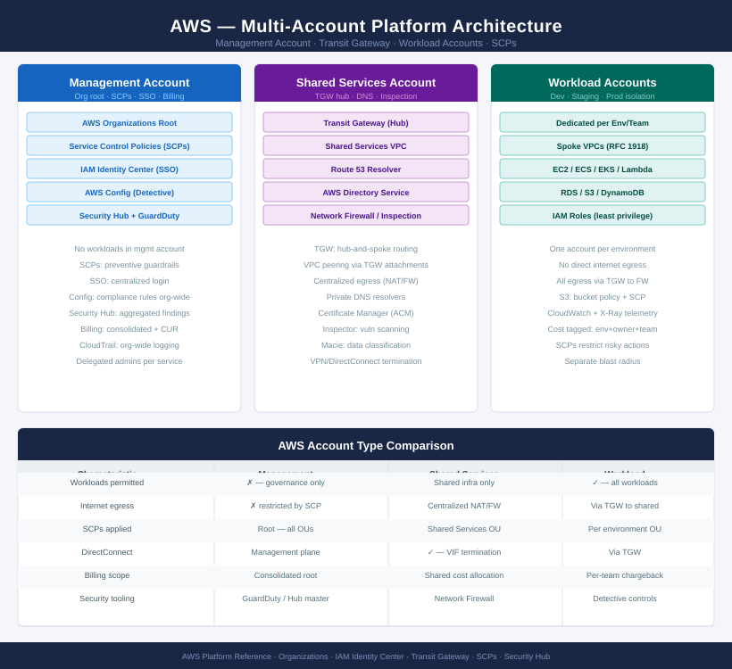

---
tags:
  - architecture
  - aws
---
# AWS — Architecture

Multi-account AWS platform managed through AWS Organizations with SCPs, IAM Identity Center SSO, and Transit Gateway hub-and-spoke networking. All production workloads run in dedicated member accounts; no workloads in the management account.

*Applies to: AWS*

<a class="kb-card" href="how-it-works/">
  <strong>How It Works</strong>
  Organizations, IAM Identity Center, Transit Gateway, and SCPs.
</a>

<a class="kb-card" href="integrations/">
  <strong>Integrations</strong>
  DirectConnect, IdP federation, GuardDuty, and billing integrations.
</a>

<a class="kb-card" href="design-standards/">
  <strong>Design Standards</strong>
  Account structure, tagging, naming, and security baselines.
</a>

