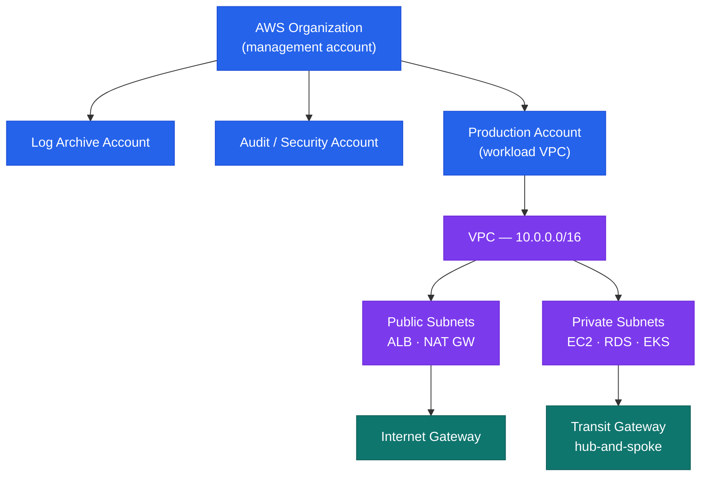
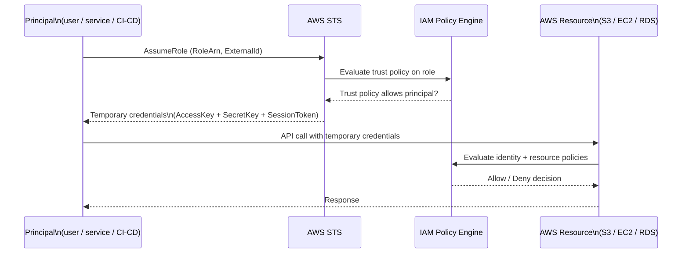

# AWS — Architecture Overview

> Part of the [Architecture](../) section.

---

## Account Structure

AWS Organizations with a management account at the root; all production workloads in member accounts:



- Management account hosts no workloads — only SCPs and consolidated billing
- SCPs enforce guardrails: deny root access, enforce encryption, restrict regions to approved list

## Network Architecture

Hub-and-spoke via Transit Gateway:

```
On-Premises ←→ Direct Connect ←→ Transit Gateway
                                        │
              ┌─────────────────────────┼─────────────────────────┐
              ▼                         ▼                         ▼
      Shared Services VPC         Production VPC            Dev/Staging VPC
      (10.0.0.0/16)               (10.1.0.0/16)             (10.2.0.0/16)
      ├── Public Subnet           ├── Public Subnet (ALB)
      ├── Private Subnet          ├── Private Subnet (EC2, RDS)
      └── Isolated Subnet         └── Isolated Subnet (DB, no internet)
```

Subnet tiers per VPC:
- **Public**: ALB, NAT Gateway — no EC2 instances
- **Private**: EC2, ECS, Lambda — internet via NAT Gateway
- **Isolated**: RDS, ElastiCache — no internet access

## Compute

| Service | Use Case |
|---|---|
| EC2 (Auto Scaling Groups) | Stateful apps, legacy workloads |
| ECS (Fargate) | Containerised microservices |
| Lambda | Event-driven functions, short-lived tasks |
| EKS | Kubernetes workloads requiring fine-grained node control |

## High Availability

- All stateful services deployed Multi-AZ: RDS, ElastiCache, EFS, ELB
- EC2 in Auto Scaling Groups spanning ≥ 2 AZs
- ALB with target group health checks; unhealthy instances replaced automatically

## Disaster Recovery

| Pattern | Services | RPO / RTO |
|---|---|---|
| Cross-region S3 replication | S3 CRR | Near-zero RPO |
| RDS automated backups | RDS automated backup to secondary region | < 1 hour RPO |
| Route 53 health-check failover | Route 53 + secondary ALB | < 5 minutes RTO |

## EC2 Launch Flow

```mermaid
flowchart LR
    request["Launch Request\nConsole / CLI / ASG"]
    iamCheck["IAM Authorization\niam:RunInstances check"]
    amiSelect["AMI Selection\nAMI ID + EBS snapshot"]
    networkPlace["Network Placement\nVPC · Subnet · AZ"]
    sgApply["Security Group\napply inbound/outbound rules"]
    instanceProfile["Instance Profile\nIAM role attached"]
    userData["User Data\ncloud-init / bootstrap"]
    running["Instance Running\nEC2 metadata available"]

    request --> iamCheck --> amiSelect --> networkPlace --> sgApply --> instanceProfile --> userData --> running
```



## IAM Assume-Role Sequence



## IAM Structure

```
AWS Organizations SCPs (guardrails — deny dangerous actions globally)
    │
    ▼
IAM Identity Center (SSO) — maps AD groups to permission sets
    │
    ▼
IAM Roles (assumed by EC2, Lambda, ECS, CI/CD pipelines)
    │
No long-lived IAM user access keys in production
```

- Humans: IAM Identity Center (SSO) — no direct IAM users
- Machines: IAM Roles with instance profiles or OIDC federation
- Emergency: break-glass IAM user in management account; credentials in CyberArk

---

## In this section

<div class="kb-grid kb-grid-3">
<a class="kb-card" href="components/"><strong>Components</strong><span>Core components, services, and technical specifications.</span></a>
<a class="kb-card" href="integrations/"><strong>Integrations</strong><span>Integration with other platforms and external systems.</span></a>
<a class="kb-card" href="standards/"><strong>Standards</strong><span>Sizing guidelines, design standards, and best practices.</span></a>
</div>
