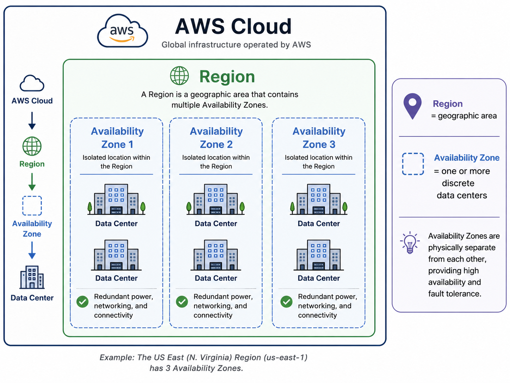

# AWS — Architecture

<div class="kb-summary">
Multi-account AWS platform managed through AWS Organizations with SCPs, IAM Identity Center SSO, and Transit Gateway hub-and-spoke networking. All production workloads run in dedicated member accounts; no workloads in the management account.
</div>

```
┌────────────────────────────────────── AWS Platform Architecture ──────────────────────────────────────┐
│                                                                                                       │
│   ┌───────────────────────────────────────────────────────────────────────────────────────────────┐   │
│   │      AWS Platform Architecture — Multi-Account Organisation with Hub-and-Spoke Networking     │   │
│   │     Management Account: AWS Organizations root · SCPs · IAM Identity Center SSO · billing     │   │
│   │    Networking: Transit Gateway hub connects spoke VPCs across accounts and on-premises via    │   │
│   │  Workload accounts: dedicated member accounts per environment (dev/staging/prod) or per team  │   │
│   │ Guardrails: SCPs (preventive) + AWS Config (detective) + Security Hub (aggregated compliance) │   │
│   └───────────────────────────────────────────────────────────────────────────────────────────────┘   │
│                                                                                                       │
│    Management account controls governance · networking hub connects spokes                            │
│                                                                                                       │
│                  ▼                                ▼                                ▼                  │
│                                                                                                       │
│   ┌─────────────────────────────┐  ┌─────────────────────────────┐  ┌─────────────────────────────┐   │
│   │         How It Works        │  │         Integrations        │  │       Design Standards      │   │
│   │  Organizations: root + OUs  │  │    On-prem: DirectConnect   │  │ Account structure: OU layout│   │
│   │   IAM Identity Center: SSO  │  │  IdP: Azure AD / Okta SAML  │  │   Tagging: env+owner+team   │   │
│   │  Transit Gateway: hub-spoke │  │ Monitoring: CloudWatch/SIEM │  │  Naming: account + resource │   │
│   │  SCPs: OU-level guardrails  │  │   Security: GuardDuty+Hub   │  │ Security baselines: CIS AWS │   │
│   │  Config: resource inventory │  │  Billing: CUR + Cost Expl.  │  │  No workloads in mgmt acct  │   │
│   └─────────────────────────────┘  └─────────────────────────────┘  └─────────────────────────────┘   │
│                                                                                                       │
│    Architecture defines OU layout and networking · Integrations connect IdP and on-prem               │
│                                                                                                       │
│                  ▼                                ▼                                ▼                  │
│                                                                                                       │
│   ┌───────────────────────────────────────────────────────────────────────────────────────────────┐   │
│   │  Account Layer   │    Networking    │      Identity     │    Guardrails    │  Observability   │   │
│   │   Mgmt account   │ Transit Gateway  │  IAM Identity Ctr │   SCPs on OUs    │  CloudTrail org  │   │
│   │  Audit account   │ VPC per account  │     SSO groups    │    AWS Config    │ CloudWatch logs  │   │
│   │ Log archive acct │  DirectConnect   │  Permission sets  │   Security Hub   │  Cost Explorer   │   │
│   │Workload accounts │  VPC Endpoints   │    MFA enforced   │  GuardDuty org   │  Budgets+alerts  │   │
│   └───────────────────────────────────────────────────────────────────────────────────────────────┘   │
│                                                                                                       │
│  Physical Infrastructure (the hardware everything above runs on):                                     │
│  AWS Regions · Availability Zones · Data Centres · Global backbone · DirectConnect physical ports     │
│                                                                                                       │
│  Key terms:                                                                                           │
│                                                                                                       │
│  Organizations = AWS service for multi-account management; root contains management account and OUs   │
│  OU            = Organisational Unit; logical grouping of accounts; SCPs applied at OU level          │
│  SCP           = Service Control Policy; preventive guardrail; restricts what actions accounts can    │
│  IAM Identity Center= AWS SSO service; assigns permission sets to users/groups in member accounts     │
│  Transit Gateway= Regional hub router; connects VPCs across accounts and to on-premises via DX/VPN    │
│  DirectConnect = Dedicated private network connection from on-premises to AWS; bypasses internet      │
│  AWS Config    = Tracks resource configuration history; evaluates rules; records compliance state     │
│  Security Hub  = Aggregates findings from GuardDuty, Inspector, Config; scores security posture       │
│  GuardDuty     = Threat detection service; analyses CloudTrail, VPC Flow Logs, DNS logs for threats   │
│  CUR           = Cost and Usage Report; detailed billing data for chargeback and FinOps analysis      │
│  Permission set= IAM Identity Center policy assigned to a user/group for a specific member account    │
│  Management account= Root of the AWS Organization; no workloads; used for billing and org-level policy│
│                                                                                                       │
└───────────────────────────────────────────────────────────────────────────────────────────────────────┘
```
```text
┌────────────────────────────────────── AWS Platform Architecture ──────────────────────────────────────┐
│                                                                                                       │
│   ┌───────────────────────────────────────────────────────────────────────────────────────────────┐   │
│   │      AWS Platform Architecture — Multi-Account Organisation with Hub-and-Spoke Networking     │   │
│   │     Management Account: AWS Organizations root · SCPs · IAM Identity Center SSO · billing     │   │
│   │    Networking: Transit Gateway hub connects spoke VPCs across accounts and on-premises via    │   │
│   │  Workload accounts: dedicated member accounts per environment (dev/staging/prod) or per team  │   │
│   │ Guardrails: SCPs (preventive) + AWS Config (detective) + Security Hub (aggregated compliance) │   │
│   └───────────────────────────────────────────────────────────────────────────────────────────────┘   │
│                                                                                                       │
│    Management account controls governance · networking hub connects spokes                            │
│                                                                                                       │
│                  ▼                                ▼                                ▼                  │
│                                                                                                       │
│   ┌─────────────────────────────┐  ┌─────────────────────────────┐  ┌─────────────────────────────┐   │
│   │         How It Works        │  │         Integrations        │  │       Design Standards      │   │
│   │  Organizations: root + OUs  │  │    On-prem: DirectConnect   │  │ Account structure: OU layout│   │
│   │   IAM Identity Center: SSO  │  │  IdP: Azure AD / Okta SAML  │  │   Tagging: env+owner+team   │   │
│   │  Transit Gateway: hub-spoke │  │ Monitoring: CloudWatch/SIEM │  │  Naming: account + resource │   │
│   │  SCPs: OU-level guardrails  │  │   Security: GuardDuty+Hub   │  │ Security baselines: CIS AWS │   │
│   │  Config: resource inventory │  │  Billing: CUR + Cost Expl.  │  │  No workloads in mgmt acct  │   │
│   └─────────────────────────────┘  └─────────────────────────────┘  └─────────────────────────────┘   │
│                                                                                                       │
│    Architecture defines OU layout and networking · Integrations connect IdP and on-prem               │
│                                                                                                       │
│                  ▼                                ▼                                ▼                  │
│                                                                                                       │
│   ┌───────────────────────────────────────────────────────────────────────────────────────────────┐   │
│   │  Account Layer   │    Networking    │      Identity     │    Guardrails    │  Observability   │   │
│   │   Mgmt account   │ Transit Gateway  │  IAM Identity Ctr │   SCPs on OUs    │  CloudTrail org  │   │
│   │  Audit account   │ VPC per account  │     SSO groups    │    AWS Config    │ CloudWatch logs  │   │
│   │ Log archive acct │  DirectConnect   │  Permission sets  │   Security Hub   │  Cost Explorer   │   │
│   │Workload accounts │  VPC Endpoints   │    MFA enforced   │  GuardDuty org   │  Budgets+alerts  │   │
│   └───────────────────────────────────────────────────────────────────────────────────────────────┘   │
│                                                                                                       │
│  Physical Infrastructure (the hardware everything above runs on):                                     │
│  AWS Regions · Availability Zones · Data Centres · Global backbone · DirectConnect physical ports     │
│                                                                                                       │
│  Key terms:                                                                                           │
│                                                                                                       │
│  Organizations = AWS service for multi-account management; root contains management account and OUs   │
│  OU            = Organisational Unit; logical grouping of accounts; SCPs applied at OU level          │
│  SCP           = Service Control Policy; preventive guardrail; restricts what actions accounts can    │
│  IAM Identity Center= AWS SSO service; assigns permission sets to users/groups in member accounts     │
│  Transit Gateway= Regional hub router; connects VPCs across accounts and to on-premises via DX/VPN    │
│  DirectConnect = Dedicated private network connection from on-premises to AWS; bypasses internet      │
│  AWS Config    = Tracks resource configuration history; evaluates rules; records compliance state     │
│  Security Hub  = Aggregates findings from GuardDuty, Inspector, Config; scores security posture       │
│  GuardDuty     = Threat detection service; analyses CloudTrail, VPC Flow Logs, DNS logs for threats   │
│  CUR           = Cost and Usage Report; detailed billing data for chargeback and FinOps analysis      │
│  Permission set= IAM Identity Center policy assigned to a user/group for a specific member account    │
│  Management account= Root of the AWS Organization; no workloads; used for billing and org-level policy│
│                                                                                                       │
└───────────────────────────────────────────────────────────────────────────────────────────────────────┘
## Global Infrastructure



```text
┌─────────────────────────────── AWS Global Infrastructure Hierarchy ───────────────────────────────────┐
│                                                                                                       │
│  AWS Cloud  →  Region  →  Availability Zone  →  Data Centre                                          │
│                                                                                                       │
│  ┌───────────────────────────────────────────────────────────────────────────────────────────────┐   │
│  │                              AWS Cloud (Global)                                               │   │
│  │          Global infrastructure operated by AWS — 30+ regions, 100+ AZs worldwide             │   │
│  │          All services, APIs, and the global backbone network                                  │   │
│  └───────────────────────────────────────────────────────────────────────────────────────────────┘   │
│                                          │                                                            │
│                                          ▼                                                            │
│  ┌───────────────────────────────────────────────────────────────────────────────────────────────┐   │
│  │                         Region  (e.g. us-east-1, eu-west-1)                                  │   │
│  │          Geographic area containing 2–6 Availability Zones                                   │   │
│  │          All AZs in a Region are connected by low-latency, high-bandwidth private fibre       │   │
│  │          Services are Region-scoped unless explicitly global (IAM, Route 53, CloudFront)      │   │
│  │                                                                                               │   │
│  │   ┌─────────────────────┐   ┌─────────────────────┐   ┌─────────────────────┐               │   │
│  │   │  Availability Zone 1│   │  Availability Zone 2│   │  Availability Zone 3│               │   │
│  │   │  Isolated location  │   │  Isolated location  │   │  Isolated location  │               │   │
│  │   │  within the Region  │   │  within the Region  │   │  within the Region  │               │   │
│  │   │                     │   │                     │   │                     │               │   │
│  │   │  ┌───────────────┐  │   │  ┌───────────────┐  │   │  ┌───────────────┐  │               │   │
│  │   │  │  Data Centre  │  │   │  │  Data Centre  │  │   │  │  Data Centre  │  │               │   │
│  │   │  │ Redundant pwr │  │   │  │ Redundant pwr │  │   │  │ Redundant pwr │  │               │   │
│  │   │  │ Redundant net │  │   │  │ Redundant net │  │   │  │ Redundant net │  │               │   │
│  │   │  └───────────────┘  │   │  └───────────────┘  │   │  └───────────────┘  │               │   │
│  │   │  ┌───────────────┐  │   │  ┌───────────────┐  │   │  ┌───────────────┐  │               │   │
│  │   │  │  Data Centre  │  │   │  │  Data Centre  │  │   │  │  Data Centre  │  │               │   │
│  │   │  │ Redundant pwr │  │   │  │ Redundant pwr │  │   │  │ Redundant pwr │  │               │   │
│  │   │  │ Redundant net │  │   │  │ Redundant net │  │   │  │ Redundant net │  │               │   │
│  │   │  └───────────────┘  │   │  └───────────────┘  │   │  └───────────────┘  │               │   │
│  │   └─────────────────────┘   └─────────────────────┘   └─────────────────────┘               │   │
│  │                                                                                               │   │
│  │   AZs are physically separate · separate power · separate networking · fault-isolated        │   │
│  └───────────────────────────────────────────────────────────────────────────────────────────────┘   │
│                                                                                                       │
│  Key terms:                                                                                           │
│  Region        = Geographically distinct area; data stays within Region unless you replicate it      │
│  AZ            = Availability Zone; one or more discrete data centres with redundant infrastructure   │
│  Data Centre   = Physical facility with compute, storage, power, cooling, and network hardware       │
│  Local Zone    = AWS infrastructure placed in metro areas closer to end users (extends a Region)     │
│  Wavelength    = AWS infrastructure embedded in telecom 5G networks for ultra-low latency            │
│  Outposts      = AWS-managed hardware installed on-premises; same APIs as cloud Regions              │
│                                                                                                       │
└───────────────────────────────────────────────────────────────────────────────────────────────────────┘
```
