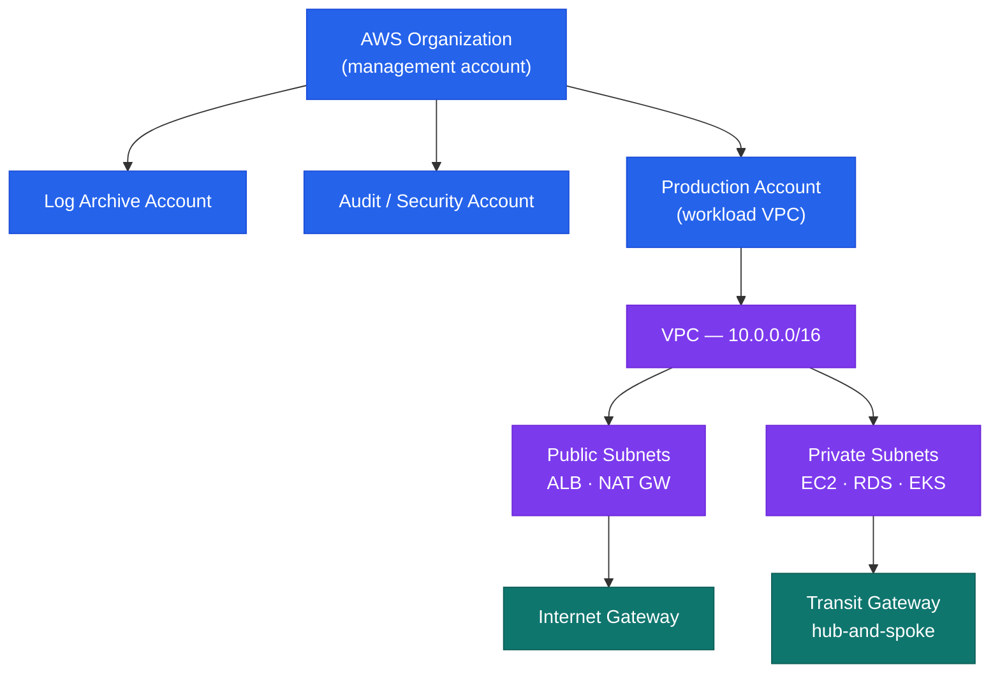

# AWS — Architecture

<div class="kb-summary">
Multi-account AWS platform managed through AWS Organizations with SCPs, IAM Identity Center SSO, and Transit Gateway hub-and-spoke networking. All production workloads run in dedicated member accounts; no workloads in the management account.
</div>

```
┌─────────────────────────────────────────────────────────┐
│              AWS Multi-Account Architecture             │
│                                                         │
│  AWS Organizations (management account — SCPs only)     │
│  ├── Log Archive Account  (CloudTrail · Config logs)    │
│  ├── Audit Account        (Security Hub · GuardDuty)    │
│  └── Production Account   (workload VPC)                │
│       └── Transit Gateway ◄─── On-Premises (DX/VPN)    │
│            ├── Shared Services VPC (10.0.0.0/16)        │
│            ├── Production VPC      (10.1.0.0/16)        │
│            └── Dev/Staging VPC     (10.2.0.0/16)        │
└─────────────────────────────────────────────────────────┘
```

<div class="kb-grid kb-grid-3">
<a class="kb-card" href="how-it-works/"><strong>How It Works</strong><span>How it works, integrations, and design standards.</span></a>
<a class="kb-card" href="integrations/"><strong>Integrations</strong><span>Integration with on-premises, identity providers, and monitoring tools.</span></a>
<a class="kb-card" href="design-standards/"><strong>Design Standards</strong><span>Account structure standards, tagging, naming, and security guardrails.</span></a>
</div>

## AWS Platform Overview


## Service Domains

| Domain | Key Services |
|---|---|
| Networking | VPC, Transit Gateway, Direct Connect, Route 53, ALB/NLB, CloudFront |
| Compute | EC2, Auto Scaling, EKS, ECS/Fargate, Lambda |
| Storage | S3, EBS, EFS, FSx for Windows, FSx for ONTAP |
| Database | RDS, Aurora, DynamoDB, ElastiCache |
| Security | IAM, KMS, Secrets Manager, WAF, GuardDuty, Security Hub |
| Management | CloudWatch, CloudTrail, AWS Config, Systems Manager, CloudFormation |

## Account Structure


