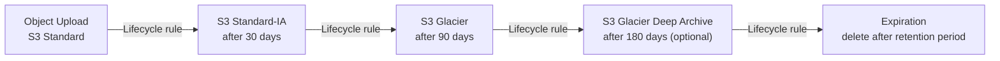
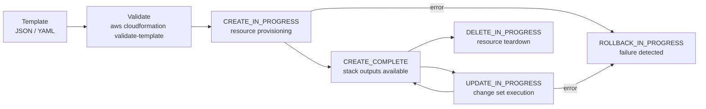

# AWS — Integrations


<div class="kb-summary">
> Part of the [Architecture](../index.md) section.
</div>

---

## S3 Object Lifecycle


┌─────────────────────────────────── AWS Architecture — Integrations ───────────────────────────────────┐
│                                                                                                       │
│  AWS platform integrates with on-prem identity, monitoring, ITSM, and CI/CD tooling.                  │
│                                                                                                       │
│   ┌──────────────────────────────────────────────┐  ┌─────────────────────────────────────────────┐   │
│   │            Identity Integrations             │  │             Network Integrations            │   │
│   │          Azure AD / Okta: SAML IdP           │  │         DirectConnect: dedicated WAN        │   │
│   │           SCIM: user provisioning            │  │           Site-to-site VPN: backup          │   │
│   │           AD Connector: on-prem AD           │  │        Route 53 resolver: hybrid DNS        │   │
│   │         CyberArk: privileged access          │  │         ELB: external load balancing        │   │
│   │        Venafi: certificate lifecycle         │  │             WAF: edge protection            │   │
│   └──────────────────────────────────────────────┘  └─────────────────────────────────────────────┘   │
│                                                                                                       │
│  Identity and network integrations established first; tooling integrations built on top               │
│                                                                                                       │
│                          ▼                                                 ▼                          │
│                                                                                                       │
│   ┌──────────────────────────────────────────────┐  ┌─────────────────────────────────────────────┐   │
│   │           Monitoring Integrations            │  │           Automation Integrations           │   │
│   │          Datadog/Splunk: CloudWatch          │  │         Terraform: IaC provisioning         │   │
│   │         PagerDuty: CloudWatch alarms         │  │         GitHub Actions: OIDC deploy         │   │
│   │          ServiceNow: CMDB AWS sync           │  │           Ansible: Systems Manager          │   │
│   │         Security Hub → Jira tickets          │  │          CloudFormation: IaC native         │   │
│   │           Cost alerts: SNS → Slack           │  │          EventBridge: event routing         │   │
│   └──────────────────────────────────────────────┘  └─────────────────────────────────────────────┘   │
│                                                                                                       │
│  Physical Infrastructure (the hardware everything above runs on):                                     │
│  AWS backbone · DirectConnect port · on-prem IdP server · CI/CD runner · ITSM server                  │
│                                                                                                       │
│  Key terms:                                                                                           │
│                                                                                                       │
│  SCIM           = System for Cross-domain Identity Management; auto-provisions users                  │
│  AD Connector   = AWS proxy to on-prem Active Directory; no user sync required                        │
│  Route 53 resolver= Hybrid DNS: resolves on-prem names from VPC and vice versa                        │
│  WAF            = Web Application Firewall; deployed at CloudFront or ALB edge                        │
│  OIDC deploy    = GitHub Actions assumes IAM role via OIDC without static keys                        │
│  EventBridge    = Serverless event bus routing AWS events to targets or 3rd parties                   │
│  SSM            = AWS Systems Manager; fleet management without SSH/RDP                               │
│  CyberArk       = PAM tool; brokers privileged AWS console/CLI access                                 │
│  Venafi         = Certificate lifecycle manager; issues and renews ACM/EC2 certs                      │
│  SNS → Slack    = Cost alerts published to SNS topic then forwarded to Slack webhook                  │
│  CMDB AWS sync  = ServiceNow discovery pulling AWS resource inventory via API                         │
│  CloudFormation = AWS native IaC; stack-based resource provisioning and updates                       │
│                                                                                                       │
└───────────────────────────────────────────────────────────────────────────────────────────────────────┘
```
┌─────────────────────────────────── AWS Architecture — Integrations ───────────────────────────────────┐
│                                                                                                       │
│  AWS platform integrates with on-prem identity, monitoring, ITSM, and CI/CD tooling.                  │
│                                                                                                       │
│   ┌──────────────────────────────────────────────┐  ┌─────────────────────────────────────────────┐   │
│   │            Identity Integrations             │  │             Network Integrations            │   │
│   │          Azure AD / Okta: SAML IdP           │  │         DirectConnect: dedicated WAN        │   │
│   │           SCIM: user provisioning            │  │           Site-to-site VPN: backup          │   │
│   │           AD Connector: on-prem AD           │  │        Route 53 resolver: hybrid DNS        │   │
│   │         CyberArk: privileged access          │  │         ELB: external load balancing        │   │
│   │        Venafi: certificate lifecycle         │  │             WAF: edge protection            │   │
│   └──────────────────────────────────────────────┘  └─────────────────────────────────────────────┘   │
│                                                                                                       │
│  Identity and network integrations established first; tooling integrations built on top               │
│                                                                                                       │
│                          ▼                                                 ▼                          │
│                                                                                                       │
│   ┌──────────────────────────────────────────────┐  ┌─────────────────────────────────────────────┐   │
│   │           Monitoring Integrations            │  │           Automation Integrations           │   │
│   │          Datadog/Splunk: CloudWatch          │  │         Terraform: IaC provisioning         │   │
│   │         PagerDuty: CloudWatch alarms         │  │         GitHub Actions: OIDC deploy         │   │
│   │          ServiceNow: CMDB AWS sync           │  │           Ansible: Systems Manager          │   │
│   │         Security Hub → Jira tickets          │  │          CloudFormation: IaC native         │   │
│   │           Cost alerts: SNS → Slack           │  │          EventBridge: event routing         │   │
│   └──────────────────────────────────────────────┘  └─────────────────────────────────────────────┘   │
│                                                                                                       │
│  Physical Infrastructure (the hardware everything above runs on):                                     │
│  AWS backbone · DirectConnect port · on-prem IdP server · CI/CD runner · ITSM server                  │
│                                                                                                       │
│  Key terms:                                                                                           │
│                                                                                                       │
│  SCIM           = System for Cross-domain Identity Management; auto-provisions users                  │
│  AD Connector   = AWS proxy to on-prem Active Directory; no user sync required                        │
│  Route 53 resolver= Hybrid DNS: resolves on-prem names from VPC and vice versa                        │
│  WAF            = Web Application Firewall; deployed at CloudFront or ALB edge                        │
│  OIDC deploy    = GitHub Actions assumes IAM role via OIDC without static keys                        │
│  EventBridge    = Serverless event bus routing AWS events to targets or 3rd parties                   │
│  SSM            = AWS Systems Manager; fleet management without SSH/RDP                               │
│  CyberArk       = PAM tool; brokers privileged AWS console/CLI access                                 │
│  Venafi         = Certificate lifecycle manager; issues and renews ACM/EC2 certs                      │
│  SNS → Slack    = Cost alerts published to SNS topic then forwarded to Slack webhook                  │
│  CMDB AWS sync  = ServiceNow discovery pulling AWS resource inventory via API                         │
│  CloudFormation = AWS native IaC; stack-based resource provisioning and updates                       │
│                                                                                                       │
└───────────────────────────────────────────────────────────────────────────────────────────────────────┘
```

**AD Connector** (proxy authentication to on-premises AD without replication):
```bash
aws ds create-ad-connector --name corp.local --password <svc-account-pwd> \
    --connect-settings VpcId=<vpc>,SubnetIds=<sub1>,<sub2>,CustomerDnsIps=<dc1-ip>,<dc2-ip>,CustomerUserName=svc_aws_connector
```

## IAM Identity Center (SSO)

```bash
# List permission sets
aws sso-admin list-permission-sets --instance-arn <sso-instance-arn>

# List account assignments for a permission set
aws sso-admin list-account-assignments --instance-arn <sso-arn> \
    --account-id <account-id> --permission-set-arn <permission-set-arn>
```

## CloudTrail to SIEM

Centralise CloudTrail logs to the log-archive account:

```bash
# Verify CloudTrail is enabled in all regions
aws cloudtrail describe-trails --include-shadow-trails

# Verify log delivery is healthy
aws cloudtrail get-trail-status --name <trail-name> | jq '{LatestDeliveryTime, LatestDeliveryError}'
```

Stream to Splunk/Elastic via Kinesis Firehose:
1. Create Kinesis Data Firehose delivery stream to SIEM endpoint
2. Configure CloudWatch Logs subscription filter → Kinesis Firehose
3. Or use EventBridge → Lambda → SIEM API for enriched forwarding

## AWS Backup

```bash
# List backup plans
aws backup list-backup-plans

# Create backup plan for EC2 and RDS
aws backup create-backup-plan --backup-plan '{
  "BackupPlanName": "prod-daily",
  "Rules": [{
    "RuleName": "Daily",
    "TargetBackupVaultName": "prod-vault",
    "ScheduleExpression": "cron(0 2 * * ? *)",
    "DeleteAfterDays": 30
  }]
}'

# Enable cross-account backup (to log-archive account)
aws backup put-backup-vault-access-policy --backup-vault-name prod-vault --policy file://vault-policy.json
```

## CloudFormation Stack Lifecycle



## GitHub Actions + OIDC

No static access keys — use OIDC federation:

```yaml
# .github/workflows/deploy.yml
- uses: aws-actions/configure-aws-credentials@v4
  with:
    role-to-assume: arn:aws:iam::<account-id>:role/github-actions-deploy
    aws-region: eu-west-1
```

IAM trust policy for the role:
```json
{
  "Condition": {
    "StringEquals": {
      "token.actions.githubusercontent.com:sub": "repo:org/repo:ref:refs/heads/main"
    }
  }
}
```

## Terraform Remote State

```hcl
# backend.tf
terraform {
  backend "s3" {
    bucket         = "corp-terraform-state-prod"
    key            = "prod/vpc/terraform.tfstate"
    region         = "eu-west-1"
    dynamodb_table = "corp-terraform-locks"
    encrypt        = true
  }
}
```

One state bucket per environment; versioning and MFA-delete enabled on state bucket.
