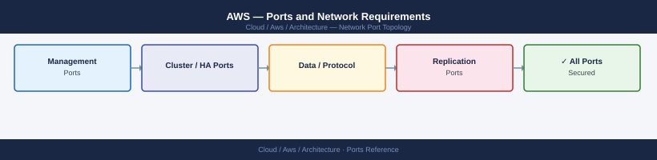
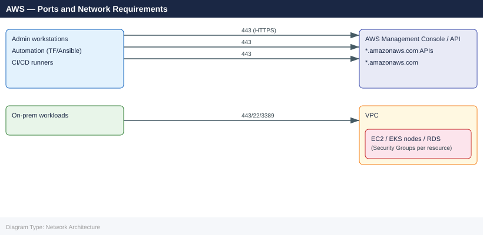

---
tags:
  - aws
  - cloud
  - networking
  - firewall
  - ports
  - security-groups
description: "Firewall and security-group port reference for AWS infrastructure. Covers management access to EC2 instances, VPC-level security group design, AWS API..."
---
# AWS — Ports and Network Requirements

<div class="kb-summary">
Firewall and security-group port reference for AWS infrastructure. Covers management access to EC2 instances, VPC-level security group design, AWS API access from on-premises automation tools, and common service ports. AWS uses security groups (stateful, instance-level) and Network ACLs (stateless, subnet-level) rather than traditional host firewalls.

*Applies to: AWS VPC, EC2, ELB, RDS, S3, IAM*
</div>


## Network Zones



## Before you begin

- AWS security groups are **stateful** — return traffic is automatically allowed; you only need to specify inbound/outbound rules for the initiating direction.
- **Network ACLs** are stateless — both inbound and outbound rules must be specified; applies to entire subnets.
- For EC2 management: use **Systems Manager (SSM) Session Manager** to eliminate inbound SSH/RDP exposure — requires only outbound 443 from the instance to `ssm.<region>.amazonaws.com`.
- All AWS API calls (SDK, CLI, Terraform, Ansible) use HTTPS 443 to `*.amazonaws.com` or `*.aws.amazon.com`.

## Outbound — On-Premises to AWS APIs

| Port | Protocol | Source | Destination | Purpose |
|---|---|---|---|---|
| 443 | TCP | Admin workstations, automation servers | *.amazonaws.com | AWS API (EC2, S3, IAM, RDS, EKS, etc.) |
| 443 | TCP | Admin workstations | *.aws.amazon.com | AWS Console and documentation |

## EC2 Instance Management

| Port | Protocol | Source | Purpose |
|---|---|---|---|
| 22 | TCP | Bastion host / VPN IPs | SSH — Linux instance access |
| 3389 | TCP | Bastion host / VPN IPs | RDP — Windows instance access |
| 443 | TCP | VPC endpoints / internet | SSM Session Manager — eliminates need for 22/3389 if SSM agent is installed |

## Load Balancer (ALB / NLB) — Public-Facing

| Port | Protocol | Source | Purpose |
|---|---|---|---|
| 443 | TCP | Internet / client IPs | HTTPS — production application traffic via ALB |
| 80 | TCP | Internet / client IPs | HTTP — redirect to HTTPS or plain HTTP workloads |

## RDS / Database

| Port | Protocol | Source | Purpose |
|---|---|---|---|
| 5432 | TCP | Application security group | PostgreSQL (RDS) |
| 3306 | TCP | Application security group | MySQL / MariaDB (RDS) |
| 1433 | TCP | Application security group | SQL Server (RDS) |
| 27017 | TCP | Application security group | DocumentDB (MongoDB-compatible) |

## S3 — Endpoint Access

| Method | Port | Destination | Purpose |
|---|---|---|---|
| Internet gateway | 443 | s3.<region>.amazonaws.com | S3 over internet |
| VPC endpoint (gateway type) | No additional ports | Internal routing | S3 via VPC endpoint — preferred (no internet egress) |

## SSM / EC2 Instance Connect (Outbound from Instance)

| Port | Protocol | Source | Destination | Purpose |
|---|---|---|---|---|
| 443 | TCP | EC2 instance | ssm.<region>.amazonaws.com | SSM agent — Session Manager connectivity |
| 443 | TCP | EC2 instance | ec2messages.<region>.amazonaws.com | EC2 Instance Connect |
| 443 | TCP | EC2 instance | s3.<region>.amazonaws.com | SSM session logging to S3 |

## Direct Connect / VPN — On-Premises to AWS

| Port | Protocol | Notes |
|---|---|---|
| BGP 179 | TCP | Direct Connect BGP peering between DX router and VGW |
| IKE 500, NAT-T 4500 | UDP | Site-to-Site VPN — IPsec tunnel establishment |
| ESP | Protocol 50 | Site-to-Site VPN — encrypted tunnel traffic |

## Firewall Zone Summary

| From | To | Ports | Notes |
|---|---|---|---|
| Admin / automation | *.amazonaws.com | 443 | All AWS API calls |
| Bastion / VPN users | EC2 Linux | 22 | SSH (or use SSM instead) |
| Bastion / VPN users | EC2 Windows | 3389 | RDP (or use SSM instead) |
| Internet clients | ALB | 443, 80 | Application traffic |
| App security group | RDS security group | Per DB engine | Internal VPC traffic |
| EC2 instances | ssm.region.amazonaws.com | 443 | SSM Session Manager egress |

## Verify

```bash
# From on-premises — test AWS API connectivity
curl -sk -o /dev/null -w "%{http_code}" https://ec2.us-east-1.amazonaws.com/

# AWS CLI connectivity test
aws sts get-caller-identity

# From EC2 Linux instance — test SSM connectivity
curl -sk -o /dev/null -w "%{http_code}" https://ssm.us-east-1.amazonaws.com/

# Check security group rules for an instance
aws ec2 describe-security-groups --group-ids <sg-id>

# Verify VPC flow logs for traffic analysis
aws ec2 describe-flow-logs --filter Name=resource-id,Values=<vpc-id>
```


```text title="Expected output"
200
{
    "UserId": "AIDACKCEVSQ6C2EXAMPLE",
    "Account": "123456789012",
    "Arn": "arn:aws:iam::123456789012:user/admin"
}
200
{
    "SecurityGroups": [
        {
            "GroupId": "sg-0a1b2c3d4e5f6g7h8",
            "GroupName": "web-tier-sg",
            "IpPermissions": [
                {
                    "IpProtocol": "tcp",
                    "FromPort": 443,
                    "ToPort": 443,
                    "IpRanges": [{"CidrIp": "10.0.0.0/8"}]
                },
                {
                    "IpProtocol": "tcp",
                    "FromPort": 80,
                    "ToPort": 80,
                    "IpRanges": [{"CidrIp": "0.0.0.0/0"}]
                }
            ]
        }
    ]
}
{
    "FlowLogs": [
        {
            "FlowLogId": "fl-0a1b2c3d4e5f6g7h8",
            "ResourceId": "vpc-12345678",
            "TrafficType": "ALL",
            "LogDestinationType": "cloud-watch-logs",
            "FlowLogStatus": "ACTIVE"
        }
    ]
}
```

!!! warning "Common errors"
    | Error | Fix |
    |---|---|
    | `curl: (7) Failed to connect to ec2.us-east-1.amazonaws.com port 443: Connection timed out` | Verify on-premises firewall allows outbound HTTPS (port 443) to AWS API endpoints, or check if the instance has internet connectivity. |
    | `An error occurred (UnauthorizedOperation) when calling the DescribeSecurityGroups operation: You are not authorized to perform: ec2:DescribeSecurityGroups` | Ensure the IAM user or role has the `ec2:DescribeSecurityGroups` permission attached via an inline or managed policy. |
    | `Invalid id: "sg-invalid" does not exist` | Verify the security group ID is correct and exists in the current AWS region by running `aws ec2 describe-security-groups --region <region>`. |
## See also

- [AWS EVS — Ports](../evs/architecture/ports.md)
- [AWS — Architecture](../how-it-works/)
- [Terraform — Ports](../../../automation/terraform/architecture/ports.md)
- [Ansible — Ports](../../../automation/ansible/architecture/ports.md)
