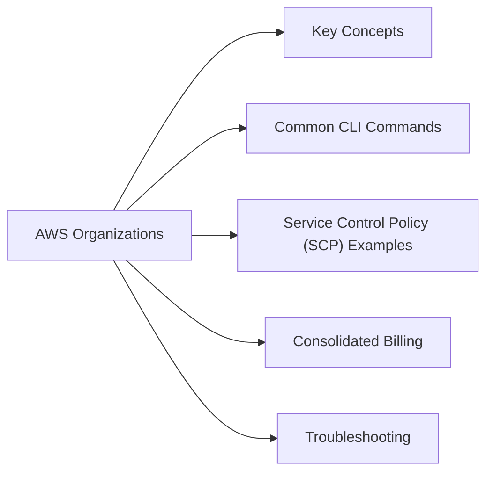

# AWS Organizations

AWS Organizations — multi-account management, service control policies (SCPs), and consolidated billing.



## Key Concepts

| Concept | Description |
|---|---|
| Organization | Root container for all accounts |
| Management account | Root account that owns the org (formerly "master") |
| Member account | Any other account in the org |
| Organizational Unit (OU) | Group of accounts for policy targeting |
| Service Control Policy (SCP) | Permission guardrails — limit what member accounts can do |
| Delegated admin | Member account authorized to manage specific AWS services |

## Common CLI Commands

```bash
# List accounts in the organization
aws organizations list-accounts \
  --query 'Accounts[*].{ID:Id,Name:Name,Email:Email,Status:Status}' --output table

# List OUs under root
aws organizations list-organizational-units-for-parent \
  --parent-id $(aws organizations list-roots --query 'Roots[0].Id' --output text) \
  --query 'OrganizationalUnits[*].{Name:Name,ID:Id}' --output table

# List SCPs attached to an OU
aws organizations list-policies-for-target \
  --target-id <ou-id> \
  --filter SERVICE_CONTROL_POLICY \
  --query 'Policies[*].{Name:Name,ID:Id}' --output table

# Get SCP content
aws organizations describe-policy --policy-id <policy-id> \
  --query 'Policy.Content' --output text | python3 -m json.tool

# List AWS services with delegated admin
aws organizations list-delegated-administrators \
  --query 'DelegatedAdministrators[*].{Account:Id,Services:DelegationEnabledDate}' --output table

# Move account to a different OU
aws organizations move-account \
  --account-id <account-id> \
  --source-parent-id <current-ou-id> \
  --destination-parent-id <target-ou-id>
```

## Service Control Policy (SCP) Examples

SCPs define the maximum permissions for member accounts — they don't grant permissions, only restrict.

**Deny disabling CloudTrail:**
```json
{
  "Version": "2012-10-17",
  "Statement": [
    {
      "Sid": "DenyCloudTrailDisable",
      "Effect": "Deny",
      "Action": [
        "cloudtrail:StopLogging",
        "cloudtrail:DeleteTrail",
        "cloudtrail:UpdateTrail"
      ],
      "Resource": "*"
    }
  ]
}
```

**Deny creation of resources outside approved regions:**
```json
{
  "Version": "2012-10-17",
  "Statement": [
    {
      "Sid": "DenyNonApprovedRegions",
      "Effect": "Deny",
      "NotAction": [
        "iam:*", "sts:*", "support:*", "organizations:*"
      ],
      "Resource": "*",
      "Condition": {
        "StringNotEquals": {
          "aws:RequestedRegion": ["eu-west-1", "us-east-1"]
        }
      }
    }
  ]
}
```

## Consolidated Billing

```bash
# View account costs from management account
aws ce get-cost-and-usage \
  --time-period Start=2026-05-01,End=2026-05-06 \
  --granularity DAILY \
  --metrics BlendedCost \
  --group-by Type=DIMENSION,Key=LINKED_ACCOUNT \
  --query 'ResultsByTime[*].Groups[*].{Account:Keys[0],Cost:Metrics.BlendedCost.Amount}' \
  --output table
```

## Troubleshooting

| Symptom | Check | Action |
|---|---|---|
| Action denied despite IAM allowing it | SCP in effect? | `aws organizations describe-effective-policy` — find restrictive SCP |
| Can't create account | Organization quota | Request limit increase via Support |
| SCP change not taking effect | Propagation time | Allow 30 seconds; check SCP is attached to correct OU/account |
| Account can't leave org | Management account restriction | Only management account can remove member accounts |
