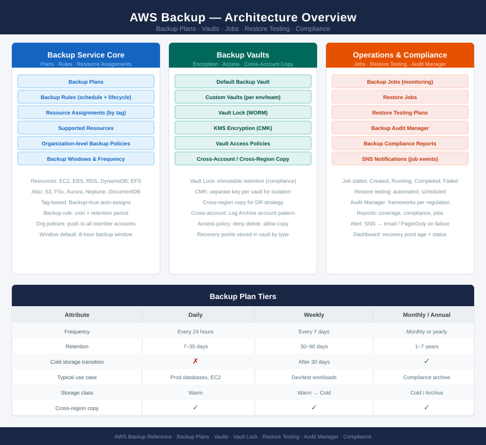

# AWS Backup

<div class="kb-summary">
AWS Backup provides centralised backup management across EC2, EBS, RDS, DynamoDB, EFS, FSx, and S3, with Backup Plans defining schedules and Vault Lock enforcing immutable retention. Coverage includes backup job monitoring, restore testing, and compliance reporting.
</div>

```
┌───────────────────────────────────────── AWS Backup Overview ─────────────────────────────────────────┐
│                                                                                                       │
│   ┌───────────────────────────────────────────────────────────────────────────────────────────────┐   │
│   │                 AWS Backup — Centralised Backup Management Across AWS Services                │   │
│   │  Backup Plans: define schedules, lifecycle, copy rules, and resource assignments per service  │   │
│   │  Supported resources: EC2 · EBS · RDS · Aurora · DynamoDB · EFS · FSx · S3 · Storage Gateway  │   │
│   │ Backup Vaults: encrypted storage for recovery points; Vault Lock enforces immutable retention │   │
│   │  Compliance: backup reports via Audit Manager; cross-region and cross-account copy supported  │   │
│   └───────────────────────────────────────────────────────────────────────────────────────────────┘   │
│                                                                                                       │
│    Backup Plans trigger jobs · Jobs produce recovery points in Vaults · compliance validates coverage │
│                                                                                                       │
│                  ▼                                ▼                                ▼                  │
│                                                                                                       │
│   ┌─────────────────────────────┐  ┌─────────────────────────────┐  ┌─────────────────────────────┐   │
│   │         Backup Plans        │  │        Backup Vaults        │  │         Backup Jobs         │   │
│   │   Rules: schedule + window  │  │    KMS-encrypted storage    │  │   Status: Completed/Failed  │   │
│   │    Lifecycle: warm → cold   │  │   Vault Lock: WORM policy   │  │ Monitor: EventBridge events │   │
│   │   Resource assignment: tag  │  │   Cross-region copy vault   │  │  Alerts: CloudWatch alarms  │   │
│   │  Copy rules: X-region/acct  │  │   Access policy: IAM+vault  │  │   Restore testing: monthly  │   │
│   │  Retention: daily/wk/mo/yr  │  │   Recovery point: RPO time  │  │  Compliance: Audit Manager  │   │
│   └─────────────────────────────┘  └─────────────────────────────┘  └─────────────────────────────┘   │
│                                                                                                       │
│    Plans define schedules · Vaults store recovery points securely                                     │
│                                                                                                       │
│                  ▼                                ▼                                ▼                  │
│                                                                                                       │
│   ┌───────────────────────────────────────────────────────────────────────────────────────────────┐   │
│   │   Backup Plans   │  Backup Vaults   │    Backup Jobs    │ Restore Testing  │    Compliance    │   │
│   │  Daily + weekly  │  KMS key assign  │   Monitor status  │  Restore by RPO  │  Audit reports   │   │
│   │  Cold lifecycle  │ Vault Lock WORM  │   Failed: retry?  │ Test validation  │  Coverage gaps   │   │
│   │ Tag-based assign │  X-region vault  │  EventBridge hook │    RTO verify    │  Backup report   │   │
│   │  Org-level plan  │  Access policy   │  Alert on failure │ Compliance test  │  Org framework   │   │
│   └───────────────────────────────────────────────────────────────────────────────────────────────┘   │
│                                                                                                       │
│  Physical Infrastructure (the hardware everything above runs on):                                     │
│  AWS Regions · S3-backed Backup Vaults · EC2/EBS/RDS source resources · KMS key infrastructure        │
│                                                                                                       │
│  Key terms:                                                                                           │
│                                                                                                       │
│  Backup Plan    = Policy that defines backup rules: schedule, lifecycle, copy destinations, retention │
│  Backup Vault   = Encrypted container for recovery points; access controlled by vault policy + IAM    │
│  Vault Lock     = WORM protection on a vault; prevents deletion even by account root; compliance mode │
│  Recovery Point = Snapshot/backup of a resource at a point in time; stored in vault; restorable       │
│  Backup Job     = Single backup execution; status tracked as Pending/Running/Completed/Failed/Aborted │
│  Restore Job    = Recovery of a resource from a recovery point; creates a new resource copy           │
│  RPO            = Recovery Point Objective; maximum age of backup acceptable for restore after failure│
│  RTO            = Recovery Time Objective; maximum acceptable time to restore service after failure   │
│  Lifecycle rule = Moves recovery points from warm (standard) to cold (cheaper) storage after N days   │
│  X-region copy  = Cross-region replication of recovery points for DR; configured in backup plan rule  │
│  Audit Manager  = AWS service generating backup compliance reports against defined frameworks         │
│  Backup Compliance Report= scheduled report showing backup coverage, job success rates, and gaps      │
│                                                                                                       │
└───────────────────────────────────────────────────────────────────────────────────────────────────────┘
```
```text
┌───────────────────────────────────────── AWS Backup Overview ─────────────────────────────────────────┐
│                                                                                                       │
│   ┌───────────────────────────────────────────────────────────────────────────────────────────────┐   │
│   │                 AWS Backup — Centralised Backup Management Across AWS Services                │   │
│   │  Backup Plans: define schedules, lifecycle, copy rules, and resource assignments per service  │   │
│   │  Supported resources: EC2 · EBS · RDS · Aurora · DynamoDB · EFS · FSx · S3 · Storage Gateway  │   │
│   │ Backup Vaults: encrypted storage for recovery points; Vault Lock enforces immutable retention │   │
│   │  Compliance: backup reports via Audit Manager; cross-region and cross-account copy supported  │   │
│   └───────────────────────────────────────────────────────────────────────────────────────────────┘   │
│                                                                                                       │
│    Backup Plans trigger jobs · Jobs produce recovery points in Vaults · compliance validates coverage │
│                                                                                                       │
│                  ▼                                ▼                                ▼                  │
│                                                                                                       │
│   ┌─────────────────────────────┐  ┌─────────────────────────────┐  ┌─────────────────────────────┐   │
│   │         Backup Plans        │  │        Backup Vaults        │  │         Backup Jobs         │   │
│   │   Rules: schedule + window  │  │    KMS-encrypted storage    │  │   Status: Completed/Failed  │   │
│   │    Lifecycle: warm → cold   │  │   Vault Lock: WORM policy   │  │ Monitor: EventBridge events │   │
│   │   Resource assignment: tag  │  │   Cross-region copy vault   │  │  Alerts: CloudWatch alarms  │   │
│   │  Copy rules: X-region/acct  │  │   Access policy: IAM+vault  │  │   Restore testing: monthly  │   │
│   │  Retention: daily/wk/mo/yr  │  │   Recovery point: RPO time  │  │  Compliance: Audit Manager  │   │
│   └─────────────────────────────┘  └─────────────────────────────┘  └─────────────────────────────┘   │
│                                                                                                       │
│    Plans define schedules · Vaults store recovery points securely                                     │
│                                                                                                       │
│                  ▼                                ▼                                ▼                  │
│                                                                                                       │
│   ┌───────────────────────────────────────────────────────────────────────────────────────────────┐   │
│   │   Backup Plans   │  Backup Vaults   │    Backup Jobs    │ Restore Testing  │    Compliance    │   │
│   │  Daily + weekly  │  KMS key assign  │   Monitor status  │  Restore by RPO  │  Audit reports   │   │
│   │  Cold lifecycle  │ Vault Lock WORM  │   Failed: retry?  │ Test validation  │  Coverage gaps   │   │
│   │ Tag-based assign │  X-region vault  │  EventBridge hook │    RTO verify    │  Backup report   │   │
│   │  Org-level plan  │  Access policy   │  Alert on failure │ Compliance test  │  Org framework   │   │
│   └───────────────────────────────────────────────────────────────────────────────────────────────┘   │
│                                                                                                       │
│  Physical Infrastructure (the hardware everything above runs on):                                     │
│  AWS Regions · S3-backed Backup Vaults · EC2/EBS/RDS source resources · KMS key infrastructure        │
│                                                                                                       │
│  Key terms:                                                                                           │
│                                                                                                       │
│  Backup Plan    = Policy that defines backup rules: schedule, lifecycle, copy destinations, retention │
│  Backup Vault   = Encrypted container for recovery points; access controlled by vault policy + IAM    │
│  Vault Lock     = WORM protection on a vault; prevents deletion even by account root; compliance mode │
│  Recovery Point = Snapshot/backup of a resource at a point in time; stored in vault; restorable       │
│  Backup Job     = Single backup execution; status tracked as Pending/Running/Completed/Failed/Aborted │
│  Restore Job    = Recovery of a resource from a recovery point; creates a new resource copy           │
│  RPO            = Recovery Point Objective; maximum age of backup acceptable for restore after failure│
│  RTO            = Recovery Time Objective; maximum acceptable time to restore service after failure   │
│  Lifecycle rule = Moves recovery points from warm (standard) to cold (cheaper) storage after N days   │
│  X-region copy  = Cross-region replication of recovery points for DR; configured in backup plan rule  │
│  Audit Manager  = AWS service generating backup compliance reports against defined frameworks         │
│  Backup Compliance Report= scheduled report showing backup coverage, job success rates, and gaps      │
│                                                                                                       │
└───────────────────────────────────────────────────────────────────────────────────────────────────────┘
```



<div class="kb-grid kb-grid-3">

<a class="kb-card" href="aws-backup/">
  <strong>AWS Backup</strong>
  <span>Backup service overview, configuration, and operations.</span>
</a>

<a class="kb-card" href="backup-plans/">
  <strong>Backup Plans</strong>
  <span>Backup plan creation, rules, schedules, and lifecycle policies.</span>
</a>

<a class="kb-card" href="backup-vaults/">
  <strong>Backup Vaults</strong>
  <span>Vault management, access policies, and encryption.</span>
</a>

<a class="kb-card" href="backup-jobs/">
  <strong>Backup Jobs</strong>
  <span>Job monitoring, troubleshooting, and status checks.</span>
</a>

<a class="kb-card" href="restore-testing/">
  <strong>Restore Testing</strong>
  <span>Restore validation, testing procedures, and recovery checks.</span>
</a>

<a class="kb-card" href="backup-compliance/">
  <strong>Backup Compliance</strong>
  <span>Compliance frameworks, reporting, and audit readiness.</span>
</a>

</div>
