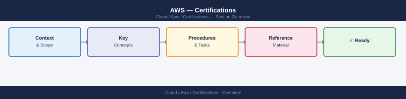

# AWS — Certifications


<div class="kb-summary">
Certifications reference covering Overview, Core Certification Paths, Daily Study Focus, Useful Commands, Renewal Notes.
</div>



<div class="kb-grid kb-grid-1">

<a class="kb-card" href="cloud-practitioner/">
  <strong>Cloud Practitioner CLF-C02</strong>
  <span>14-day study plan — 3 hrs/day, 50 Q&A per day. Covers all 4 domains.</span>
</a>


<a class="kb-card" href="exam-tracking/">
  <strong>Exam Tracking</strong>
  <span>Exam scheduling, scores, and certification tracking.</span>
</a>

<a class="kb-card" href="practice-notes/">
  <strong>Practice Notes</strong>
  <span>Practice exam notes and study materials.</span>
</a>

<a class="kb-card" href="review-plan/">
  <strong>Review Plan</strong>
  <span>Study plan and review schedule.</span>
</a>

<a class="kb-card" href="weak-areas/"><strong>Weak Areas</strong><span>Topics needing additional study and focus.</span></a>
<a class="kb-card" href="services/"><strong>Services</strong><span>Per-service study notes — IAM, EC2, VPC, S3, RDS, Lambda, and more.</span></a>

</div>

```d2
direction: right

center: "AWS" {shape: hexagon}
core_certification_paths: "Core Certification Paths" {shape: rectangle}
daily_study_focus: "Daily Study Focus" {shape: rectangle}
useful_commands: "Useful Commands" {shape: rectangle}
renewal_notes: "Renewal Notes" {shape: rectangle}

center -> core_certification_paths
center -> daily_study_focus
center -> useful_commands
center -> renewal_notes
```

## Overview

AWS certifications validate skills in designing, deploying, operating, and securing workloads in Amazon Web Services environments.

## Core Certification Paths

- Cloud Practitioner
- Solutions Architect Associate
- Solutions Architect Professional
- SysOps Administrator
- DevOps Engineer
- Security Specialty

## Daily Study Focus

- Review core AWS services
- Practice architecture design scenarios
- Study cost and security best practices
- Use hands-on labs

## Useful Commands

```bash
aws configure
aws ec2 describe-instances
aws s3 ls
aws iam list-users
```

## Renewal Notes

AWS certifications typically require renewal every 3 years.
