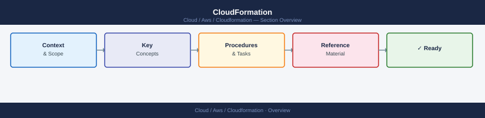

---
tags:
  - aws
---
# CloudFormation


<div class="kb-summary">
AWS CloudFormation CLI reference — stack lifecycle, change set preview, drift detection, and StackSet operations.

*Applies to: AWS*
</div>



```d2
direction: right

center: "AWS" {shape: hexagon}
component_a: "Component A" {shape: rectangle}
component_b: "Component B" {shape: rectangle}
component_c: "Component C" {shape: rectangle}

center -> component_a
center -> component_b
center -> component_c
```

## See also

- [AWS CLI Reference](../index.md)
- [AWS Operations](../../operations/index.md)
- [AWS Governance](../../governance/index.md)
