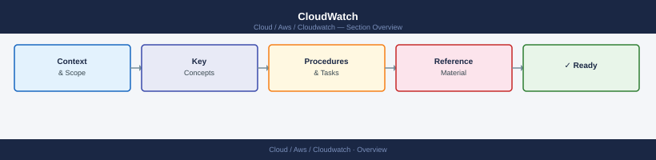

---
tags:
  - aws
---
# CloudWatch

AWS CloudWatch CLI reference — metrics queries, alarm management, log group operations, and Insights queries.

*Applies to: AWS*

## See also

- [AWS CLI Reference](../index.md)
- [AWS Monitoring](../../monitoring/index.md)
- [AWS Operations](../../operations/index.md)
