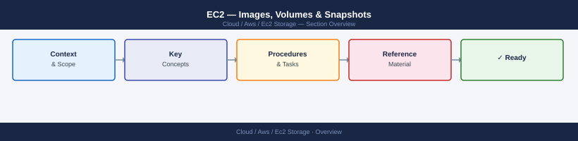

---
tags:
  - aws
---
# EC2 — Images, Volumes & Snapshots


<div class="kb-summary">
EC2 images, volumes & snapshots CLI: `aws ec2 describe-images`, `create-snapshot`, `create-volume`, `register-image`, `modify-volume`, and copy/deregister operations.

*Applies to: AWS*
</div>



```d2
direction: right

center: "AWS" {shape: hexagon}
component_a: "Component A" {shape: rectangle}
component_b: "Component B" {shape: rectangle}
component_c: "Component C" {shape: rectangle}

center -> component_a
center -> component_b
center -> component_c
```

## See also

- [AWS CLI Reference](../index.md)
- [AWS Storage](../../storage/index.md)
- [AWS Compute](../../compute/index.md)
