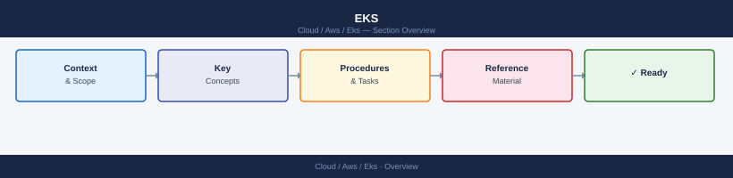

---
tags:
  - aws
---
# EKS


<div class="kb-summary">
EKS reference covering Node Groups, Fargate Profiles, IAM OIDC Provider, Access Entries and Auth Mode, Add-ons and 1 more sections.

*Applies to: AWS*
</div>



```d2
direction: right

center: "AWS" {shape: hexagon}
fargate_profiles: "Fargate Profiles" {shape: rectangle}
iam_oidc_provider: "IAM OIDC Provider" {shape: rectangle}
access_entries_and_auth_mode: "Access Entries and Auth Mode" {shape: rectangle}
addons: "Add-ons" {shape: rectangle}
pod_identity_associations: "Pod Identity Associations" {shape: rectangle}

center -> fargate_profiles
center -> iam_oidc_provider
center -> access_entries_and_auth_mode
center -> addons
center -> pod_identity_associations
```

## Fargate Profiles

```bash
# List Fargate profiles
aws eks list-fargate-profiles --cluster-name <cluster>

# Describe a profile
aws eks describe-fargate-profile \
  --cluster-name <cluster> \
  --fargate-profile-name <profile>

# Create a Fargate profile
aws eks create-fargate-profile \
  --cluster-name <cluster> \
  --fargate-profile-name <profile> \
  --pod-execution-role-arn arn:aws:iam::<account_id>:role/<FargatePodExecutionRole> \
  --selectors namespace=<namespace>
```

## IAM OIDC Provider

```bash
# Check if an OIDC provider is already associated
aws eks describe-cluster --name <cluster> \
  --query "cluster.identity.oidc.issuer" --output text

# Associate an IAM OIDC provider with the cluster (requires eksctl)
eksctl utils associate-iam-oidc-provider \
  --cluster <cluster> \
  --region <region> \
  --approve

# List existing OIDC providers in the account
aws iam list-open-id-connect-providers
```

## Access Entries and Auth Mode

```bash
# Get the current authentication mode
aws eks describe-cluster --name <cluster> \
  --query "cluster.accessConfig.authenticationMode" --output text

# Update cluster to use API auth mode (enables access entries)
aws eks update-cluster-config \
  --name <cluster> \
  --access-config authenticationMode=API_AND_CONFIG_MAP

# List access entries
aws eks list-access-entries --cluster-name <cluster>

# Create an access entry for an IAM principal
aws eks create-access-entry \
  --cluster-name <cluster> \
  --principal-arn arn:aws:iam::<account_id>:role/<RoleName>

# Associate an access policy with an entry
aws eks associate-access-policy \
  --cluster-name <cluster> \
  --principal-arn arn:aws:iam::<account_id>:role/<RoleName> \
  --policy-arn arn:aws:eks::aws:cluster-access-policy/AmazonEKSClusterAdminPolicy \
  --access-scope type=cluster
```

## Add-ons

```bash
# List available add-ons for a cluster version
aws eks describe-addon-versions --kubernetes-version 1.29

# List installed add-ons
aws eks list-addons --cluster-name <cluster>

# Describe an installed add-on
aws eks describe-addon --cluster-name <cluster> --addon-name vpc-cni

# Install an add-on
aws eks create-addon \
  --cluster-name <cluster> \
  --addon-name coredns \
  --resolve-conflicts OVERWRITE

# Update an add-on to a specific version
aws eks update-addon \
  --cluster-name <cluster> \
  --addon-name vpc-cni \
  --addon-version v1.18.0-eksbuild.1 \
  --resolve-conflicts OVERWRITE

# Delete an add-on
aws eks delete-addon --cluster-name <cluster> --addon-name coredns
```

## Pod Identity Associations

```bash
# List pod identity associations for a cluster
aws eks list-pod-identity-associations --cluster-name <cluster>

# Describe a specific association
aws eks describe-pod-identity-association \
  --cluster-name <cluster> \
  --association-id <association_id>

# Create a pod identity association
aws eks create-pod-identity-association \
  --cluster-name <cluster> \
  --namespace <namespace> \
  --service-account <service_account_name> \
  --role-arn arn:aws:iam::<account_id>:role/<RoleName>

# Delete a pod identity association
aws eks delete-pod-identity-association \
  --cluster-name <cluster> \
  --association-id <association_id>
```

## See also

- [AWS CLI Reference](../index.md)
- [AWS Compute](../../compute/index.md)
- [AWS Networking](../../networking/index.md)
