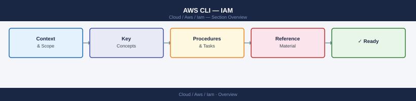

# AWS CLI — IAM


<div class="kb-summary">
AWS CLI commands for IAM — users, groups, roles, policies, STS assume-role, access key rotation, and permission boundaries.

*Applies to: AWS*
</div>



```d2
direction: right

center: "AWS" {shape: hexagon}
component_a: "Component A" {shape: rectangle}
component_b: "Component B" {shape: rectangle}
component_c: "Component C" {shape: rectangle}

center -> component_a
center -> component_b
center -> component_c
```

## See also

- [AWS CLI Reference](../index.md)
- [AWS Security](../../security/index.md)
- [AWS Identity](../../identity/index.md)
