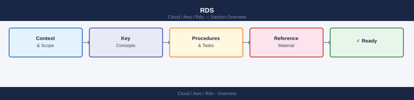

---
tags:
  - aws
---
# RDS


<div class="kb-summary">
RDS reference covering Snapshots, Parameter Groups, Subnet Groups, Events and Event Subscriptions, Read Replicas and 2 more sections.

*Applies to: AWS*
</div>



## Parameter Groups

```bash
# List all DB parameter groups
aws rds describe-db-parameter-groups

# Describe parameters inside a group
aws rds describe-db-parameters --db-parameter-group-name <group_name>

# Create a custom parameter group (e.g. for MySQL 8.0)
aws rds create-db-parameter-group \
  --db-parameter-group-name my-mysql80-params \
  --db-parameter-group-family mysql8.0 \
  --description "Custom MySQL 8.0 parameters"

# Modify a parameter inside a group
aws rds modify-db-parameter-group \
  --db-parameter-group-name my-mysql80-params \
  --parameters "ParameterName=max_connections,ParameterValue=500,ApplyMethod=immediate"

# Apply a parameter group to an instance (takes effect at next maintenance window)
aws rds modify-db-instance \
  --db-instance-identifier <id> \
  --db-parameter-group-name my-mysql80-params \
  --apply-immediately
```

## Subnet Groups

```bash
# List all DB subnet groups
aws rds describe-db-subnet-groups

# Describe a specific subnet group
aws rds describe-db-subnet-groups --db-subnet-group-name <group_name>

# Create a subnet group spanning two AZs
aws rds create-db-subnet-group \
  --db-subnet-group-name my-subnet-group \
  --db-subnet-group-description "Multi-AZ subnet group" \
  --subnet-ids subnet-aaa111 subnet-bbb222
```

## Events and Event Subscriptions

```bash
# List recent RDS events (last 60 minutes)
aws rds describe-events \
  --duration 60

# Filter events for a specific instance
aws rds describe-events \
  --source-identifier <id> \
  --source-type db-instance \
  --duration 1440

# List existing event subscriptions
aws rds describe-event-subscriptions

# Create an SNS event subscription for instance failures
aws rds create-event-subscription \
  --subscription-name prod-failure-alerts \
  --sns-topic-arn arn:aws:sns:<region>:<account_id>:<topic-name> \
  --source-type db-instance \
  --event-categories failure \
  --enabled
```

## Read Replicas

```bash
# Create a read replica in the same region
aws rds create-db-instance-read-replica \
  --db-instance-identifier <replica_id> \
  --source-db-instance-identifier <source_id>

# Create a cross-region read replica
aws rds create-db-instance-read-replica \
  --db-instance-identifier <replica_id> \
  --source-db-instance-identifier arn:aws:rds:<source_region>:<account_id>:db:<source_id> \
  --region <target_region>

# Promote a read replica to a standalone instance
aws rds promote-read-replica \
  --db-instance-identifier <replica_id>
```

## Aurora Clusters

```bash
# List Aurora DB clusters
aws rds describe-db-clusters

# Describe a specific cluster
aws rds describe-db-clusters --db-cluster-identifier <cluster_id>

# Failover to a specific reader instance (promotes it to writer)
aws rds failover-db-cluster \
  --db-cluster-identifier <cluster_id> \
  --target-db-instance-identifier <reader_instance_id>

# Failover without specifying a target (Aurora picks automatically)
aws rds failover-db-cluster --db-cluster-identifier <cluster_id>

# Create a cluster snapshot
aws rds create-db-cluster-snapshot \
  --db-cluster-identifier <cluster_id> \
  --db-cluster-snapshot-identifier <snap_name>
```

## Log Export and Monitoring

```bash
# List available log files for an instance
aws rds describe-db-log-files --db-instance-identifier <id>

# Download the last 1 MB of the error log
aws rds download-db-log-file-portion \
  --db-instance-identifier <id> \
  --log-file-name error/mysql-error.log \
  --output text

# Stream log file pages (paginate with --marker)
aws rds download-db-log-file-portion \
  --db-instance-identifier <id> \
  --log-file-name error/mysql-error.log \
  --number-of-lines 200

# Enable enhanced monitoring (60-second granularity)
aws rds modify-db-instance \
  --db-instance-identifier <id> \
  --monitoring-interval 60 \
  --monitoring-role-arn arn:aws:iam::<account_id>:role/rds-monitoring-role \
  --apply-immediately
```

## See also

- [AWS CLI Reference](../index.md)
- [AWS Storage](../../storage/index.md)
- [AWS Operations](../../operations/index.md)
