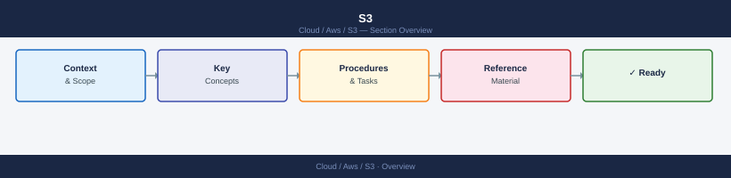

---
tags:
  - aws
---
# S3


<div class="kb-summary">
AWS CLI S3 command reference: high-level s3 commands (cp, mv, sync, ls, rm) and low-level s3api operations for bucket management, object handling, versioning, encryption, lifecycle rules, and access policy configuration.

*Applies to: AWS*
</div>



```d2
direction: right

center: "AWS" {shape: hexagon}
component_a: "Component A" {shape: rectangle}
component_b: "Component B" {shape: rectangle}
component_c: "Component C" {shape: rectangle}

center -> component_a
center -> component_b
center -> component_c
```

## See also

- [AWS CLI Reference](../index.md)
- [AWS Storage](../../storage/index.md)
