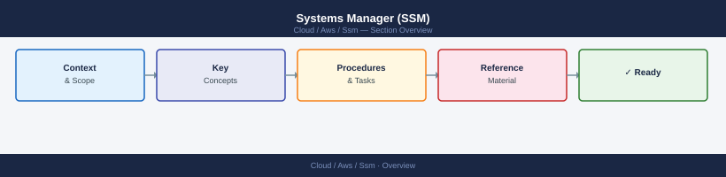

---
tags:
  - aws
---
# Systems Manager (SSM)


<div class="kb-summary">
Systems Manager (SSM) reference covering Run Command, Parameter Store, Maintenance Windows, Patch Management, Inventory and 2 more sections.

*Applies to: AWS*
</div>



## Parameter Store

```bash
# Read a parameter (decrypt SecureString)
aws ssm get-parameter --name /my/param --with-decryption

# Write a parameter
aws ssm put-parameter --name /my/param --value "value" --type SecureString

# Read all parameters under a path hierarchy
aws ssm get-parameters-by-path --path /my/
```

## Maintenance Windows

```bash
# List maintenance windows
aws ssm describe-maintenance-windows

# Create a maintenance window (runs Sundays 03:00 UTC, 2-hour cutoff, 4-hour duration)
aws ssm create-maintenance-window \
  --name "sunday-patching" \
  --schedule "cron(0 3 ? * SUN *)" \
  --duration 4 \
  --cutoff 2 \
  --allow-unassociated-targets

# Register a Run Command task against a window
aws ssm register-task-with-maintenance-window \
  --window-id <window_id> \
  --task-arn "AWS-RunShellScript" \
  --task-type RUN_COMMAND \
  --targets Key=InstanceIds,Values=<instance_id> \
  --service-role-arn arn:aws:iam::<account_id>:role/<MaintenanceWindowRole> \
  --max-concurrency 2 \
  --max-errors 1

# List tasks registered to a window
aws ssm describe-maintenance-window-tasks --window-id <window_id>
```

## Patch Management

```bash
# List available patch baselines
aws ssm describe-patch-baselines

# Describe a specific baseline
aws ssm get-patch-baseline --baseline-id <baseline_id>

# Scan instances for patch compliance (Scan only, no install)
aws ssm send-command \
  --instance-ids <id> \
  --document-name "AWS-RunPatchBaseline" \
  --parameters Operation=Scan

# Install patches on instances
aws ssm send-command \
  --instance-ids <id> \
  --document-name "AWS-RunPatchBaseline" \
  --parameters Operation=Install

# View patch compliance summary for an instance
aws ssm describe-instance-patch-states --instance-ids <id>
```

## Inventory

```bash
# List inventory entries for a specific type on an instance
aws ssm list-inventory-entries \
  --instance-id <instance_id> \
  --type-name AWS:Application

# Query inventory across all managed instances
aws ssm get-inventory \
  --filters Key=AWS:InstanceInformation.PlatformType,Values=Linux,Type=Equal

# List all inventory types collected
aws ssm get-inventory-schema
```

## OpsItems

```bash
# Create an OpsItem (e.g. from a CloudWatch alarm trigger)
aws ssm create-ops-item \
  --title "High CPU on prod-web-01" \
  --description "CPU exceeded 90% for 10 minutes" \
  --source "custom" \
  --severity "2" \
  --priority 2 \
  --operational-data '{"alarm":{"Value":"CPUUtilization","Type":"SearchableString"}}'

# Get details of an OpsItem
aws ssm get-ops-item --ops-item-id <ops_item_id>

# List open OpsItems
aws ssm describe-ops-items \
  --ops-item-filters Key=Status,Values=Open,Operator=Equal
```

## Automation Documents

```bash
# List available Automation runbooks
aws ssm list-documents \
  --document-filter-list key=DocumentType,value=Automation

# Start an automation execution
aws ssm start-automation-execution \
  --document-name "AWS-RestartEC2Instance" \
  --parameters InstanceId=<instance_id>

# List running or completed executions
aws ssm describe-automation-executions \
  --filters Key=DocumentNamePrefix,Values=AWS-RestartEC2Instance

# Get execution detail and step status
aws ssm get-automation-execution \
  --automation-execution-id <execution_id>

# Stop a running automation
aws ssm stop-automation-execution \
  --automation-execution-id <execution_id>
```

## See also

- [AWS CLI Reference](../index.md)
- [AWS Operations](../../operations/index.md)
- [AWS Compute](../../compute/index.md)
