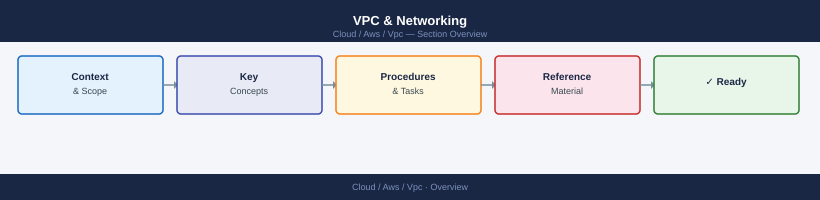

---
tags:
  - aws
---
# VPC & Networking


<div class="kb-summary">
VPC & networking CLI: `aws ec2 describe-vpcs`, `create-subnet`, `describe-route-tables`, `authorize-security-group-ingress`, and peering/NAT gateway management.

*Applies to: AWS*
</div>



```d2
direction: right

center: "AWS" {shape: hexagon}
component_a: "Component A" {shape: rectangle}
component_b: "Component B" {shape: rectangle}
component_c: "Component C" {shape: rectangle}

center -> component_a
center -> component_b
center -> component_c
```

## See also

- [AWS CLI Reference](../index.md)
- [AWS Networking](../../networking/index.md)
- [AWS Security](../../security/index.md)
