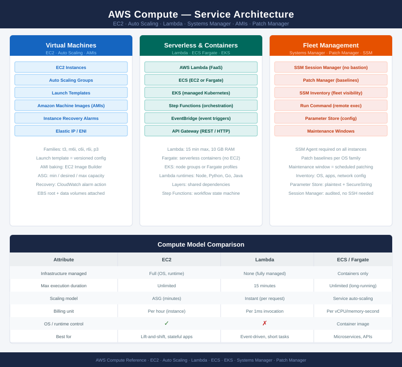

# AWS Compute

<div class="kb-summary">
AWS compute spans EC2 virtual machines, Auto Scaling groups, Lambda serverless functions, and ECS/EKS containers. Fleet management runs through Systems Manager — no bastion hosts required. AMI standardisation and Patch Manager enforce OS hygiene across the fleet.
</div>

```
┌──────────────────────────────────────── AWS Compute Overview ─────────────────────────────────────────┐
│                                                                                                       │
│   ┌───────────────────────────────────────────────────────────────────────────────────────────────┐   │
│   │         AWS Compute — EC2, Auto Scaling, Lambda, and Systems Manager Fleet Management         │   │
│   │ EC2: virtual machines in 400+ instance types across general, compute, memory, storage families│   │
│   │     Auto Scaling: launch templates + scaling policies maintain desired capacity across AZs    │   │
│   │  Systems Manager: fleet management without SSH — session manager, patch manager, run command  │   │
│   │   Lambda: serverless functions; event-driven; up to 15 min timeout; 10 GB RAM; no servers to  │   │
│   └───────────────────────────────────────────────────────────────────────────────────────────────┘   │
│                                                                                                       │
│    Compute spans persistent VMs (EC2), elastic fleets (ASG), and serverless (Lambda) managed by SSM   │
│                                                                                                       │
│                  ▼                                ▼                                ▼                  │
│                                                                                                       │
│   ┌─────────────────────────────┐  ┌─────────────────────────────┐  ┌─────────────────────────────┐   │
│   │             EC2             │  │         Auto Scaling        │  │       Systems Manager       │   │
│   │  Instance types: t/m/c/r/x  │  │  Launch template: AMI+type  │  │   Session Manager: no SSH   │   │
│   │  AMI: OS + config snapshot  │  │  Min / desired / max count  │  │   Patch Manager: baselines  │   │
│   │   EBS: root + data volumes  │  │  Scaling policies: CPU/SQS  │  │   Run Command: remote exec  │   │
│   │  Instance profile: IAM role │  │   Health check: EC2 or ELB  │  │   Inventory: installed SW   │   │
│   │    Metadata: IMDSv2 only    │  │  Instance refresh: rolling  │  │   Parameter Store: config   │   │
│   └─────────────────────────────┘  └─────────────────────────────┘  └─────────────────────────────┘   │
│                                                                                                       │
│    EC2 provides persistent VMs · Auto Scaling elastically manages fleets                              │
│                                                                                                       │
│                  ▼                                ▼                                ▼                  │
│                                                                                                       │
│   ┌───────────────────────────────────────────────────────────────────────────────────────────────┐   │
│   │       EC2        │   Auto Scaling   │       Lambda      │ Systems Manager  │  Patch Manager   │   │
│   │   Start / stop   │ Desired capacity │ Runtime: py/js/go │ Session: connect │ Baseline: rules  │   │
│   │ AMI: launch cfg  │   Scale in/out   │  Trigger: events  │   Run command    │ Patch: schedule  │   │
│   │  Snapshot: EBS   │ Launch template  │   CW Logs output  │ Inventory: list  │ Compliance: view │   │
│   │Resize: change typ│ Instance refresh │   X-acct trigger  │ Param Store: get │   Reboot: post   │   │
│   └───────────────────────────────────────────────────────────────────────────────────────────────┘   │
│                                                                                                       │
│  Physical Infrastructure (the hardware everything above runs on):                                     │
│  AWS bare-metal hosts · Nitro hypervisor · Availability Zones · VPC network · EBS storage fabric      │
│                                                                                                       │
│  Key terms:                                                                                           │
│                                                                                                       │
│  EC2            = Elastic Compute Cloud; virtual machines running on AWS Nitro hypervisor             │
│  AMI            = Amazon Machine Image; snapshot of OS + config used to launch new EC2 instances      │
│  Instance type  = Defines vCPU, RAM, network, and storage; families: t (burstable), m (general), c    │
│  Launch template= Versioned EC2 config (AMI, type, SG, IAM, user-data) used by ASG and manual launches│
│  Auto Scaling Group= Maintains desired instance count; replaces unhealthy; scales on policies or      │
│  Instance profile= IAM role attached to EC2; grants AWS API permissions to the instance itself        │
│  IMDSv2         = Instance Metadata Service v2; token-based; required; prevents SSRF metadata theft   │
│  Session Manager= SSM feature replacing SSH; browser or CLI access; no inbound ports needed on SG     │
│  Patch Manager  = SSM feature applying OS patches on schedule; records compliance per instance        │
│  Run Command    = SSM feature executing scripts/commands on fleets without SSH; output to CloudWatch  │
│  Lambda         = Serverless compute; no servers to manage; billed per invocation and duration (ms)   │
│  EBS            = Elastic Block Store; persistent block volumes attached to EC2; survives instance    │
│                                                                                                       │
└───────────────────────────────────────────────────────────────────────────────────────────────────────┘
```



<div class="kb-grid kb-grid-3">

<a class="kb-card" href="ec2/">
  <strong>EC2</strong>
  <span>Virtual machines, instance lifecycle, access, sizing, and operations.</span>
</a>

<a class="kb-card" href="auto-scaling/">
  <strong>Auto Scaling</strong>
  <span>Scaling groups, launch templates, desired capacity, and health checks.</span>
</a>

<a class="kb-card" href="lambda/">
  <strong>Lambda</strong>
  <span>Serverless functions, triggers, logs, permissions, and runtime checks.</span>
</a>

<a class="kb-card" href="systems-manager/">
  <strong>Systems Manager</strong>
  <span>Fleet operations, inventory, session access, and automation.</span>
</a>

<a class="kb-card" href="amis/">
  <strong>AMIs</strong>
  <span>Image standards, lifecycle, patch baselines, and recovery use cases.</span>
</a>

<a class="kb-card" href="patch-manager/">
  <strong>Patch Manager</strong>
  <span>Patch baselines, maintenance windows, compliance, and reporting.</span>
</a>

<a class="kb-card" href="instance-recovery/">
  <strong>Instance Recovery</strong>
  <span>Recovery alarms, instance checks, and workload recovery steps.</span>
</a>

</div>
