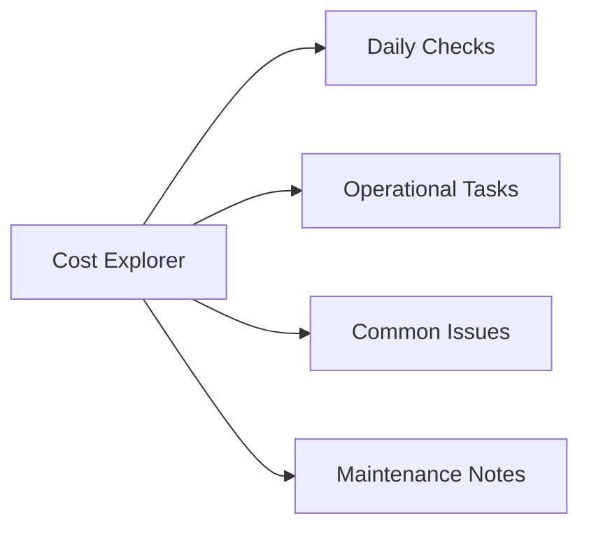

# AWS Cost Explorer

## Overview

AWS Cost Explorer is a core cloud infrastructure service used for production operations, automation, monitoring, and platform support.

## Daily Checks

| Check | Command | Notes |
|---|---|---|
| Review service health |  |  |
| Check active alerts |  |  |
| Validate access permissions |  |  |
| Confirm backup or recovery coverage where applicable |  |  |
| Review recent configuration changes |  |  |

## Operational Tasks

| Task | Command |
|---|---|
| Confirm resource status |  |
| Review logs and metrics |  |
| Validate security configuration |  |
| Check cost or capacity trends |  |
| Document changes |  |

## Common Issues

| Symptom | Likely Cause | Action |
|---|---|---|
| Access denied | IAM or RBAC issue | Review permissions |
| Service unavailable | Regional or dependency issue | Check service health |
| High cost | Resource growth or unused assets | Review usage and tagging |
| Connectivity failure | Network or security rule issue | Validate routes and rules |

## Maintenance Notes

- Review configuration before changes
- Validate rollback plan
- Test in non-production where possible
- Confirm monitoring after changes
