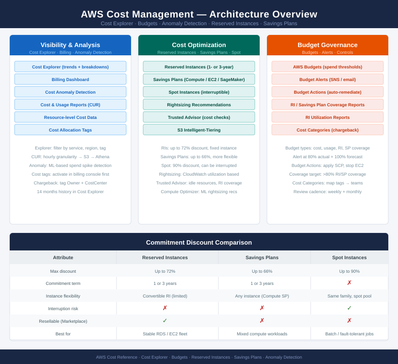

# AWS Cost

<div class="kb-summary">
AWS cost management combines visibility tools (Cost Explorer, Anomaly Detection) with spend optimisation (Reserved Instances, Savings Plans) and governance via Budgets and cost allocation tags. Coverage includes chargeback tagging, RI/Savings Plan planning, and anomaly investigation workflows.
</div>

```
  AWS Account Usage
        │
        ▼
  ┌─────────────────────┐    ┌──────────────────────────────┐
  │  Cost Explorer      │    │  Cost Anomaly Detection      │
  │                     │    │                              │
  │ Service/acct/region │    │ ML baseline ──► spike found  │
  │ tag breakdowns      │    │ alert ──► SNS ──► triage     │
  │ forecast            │    └──────────────────────────────┘
  └─────────────────────┘
        │
        ▼
  ┌─────────────────────┐    ┌──────────────────────────────┐
  │  Budgets            │    │  Cost Allocation Tags        │
  │                     │    │                              │
  │ threshold ──► alert │    │ tag: env, owner, cost-centre │
  │ SNS ──► email/slack │    │ activate ──► filter in CE    │
  │ action: deny new    │    └──────────────────────────────┘
  └─────────────────────┘
        │
        ▼
  ┌─────────────────────────────────────────────────────┐
  │  Savings Commitments                                │
  │  Reserved Instances  │  Savings Plans               │
  │  1yr / 3yr term      │  Compute / EC2 / SageMaker   │
  │  utilisation track   │  commitment vs flexibility   │
  └─────────────────────────────────────────────────────┘
```



<div class="kb-grid kb-grid-3">

<a class="kb-card" href="cost-explorer-billing/">
  <strong>Cost Explorer / Billing</strong>
  <span>Billing review, trends, service cost, and chargeback notes.</span>
</a>

<a class="kb-card" href="budgets/">
  <strong>Budgets</strong>
  <span>Budget alerts, thresholds, owners, and review cadence.</span>
</a>

<a class="kb-card" href="cost-anomaly-detection/">
  <strong>Cost Anomaly Detection</strong>
  <span>Unexpected spend detection and investigation workflow.</span>
</a>

<a class="kb-card" href="reserved-instances/">
  <strong>Reserved Instances</strong>
  <span>RI planning, coverage, utilization, and renewal notes.</span>
</a>

<a class="kb-card" href="savings-plans/">
  <strong>Savings Plans</strong>
  <span>Savings Plan coverage, commitments, utilization, and review.</span>
</a>

<a class="kb-card" href="cost-allocation-tags/">
  <strong>Cost Allocation Tags</strong>
  <span>Cost tag activation, reporting, and ownership mapping.</span>
</a>

</div>
