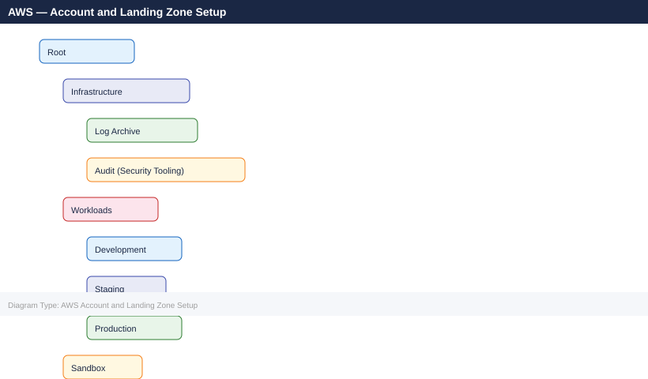

---
tags:
  - aws
  - deployment
search:
  boost: 1.5
---

```d2
direction: right

plan: "Plan" {shape: oval}
prerequisites: "Prerequisites" {shape: rectangle}
create_aws_organization_and_enable_a: "Create AWS Organization and Enable AWS SSO" {shape: rectangle}
create_accounts_and_ous: "Create Accounts and OUs" {shape: rectangle}
configure_cloudtrail_all_regions: "Configure CloudTrail (All Regions)" {shape: rectangle}
configure_aws_config: "Configure AWS Config" {shape: rectangle}
set_up_vpc_and_networking: "Set Up VPC and Networking" {shape: rectangle}
validate: "Validate" {shape: oval}

plan -> prerequisites
prerequisites -> create_aws_organization_and_enable_a
create_aws_organization_and_enable_a -> create_accounts_and_ous
create_accounts_and_ous -> configure_cloudtrail_all_regions
configure_cloudtrail_all_regions -> configure_aws_config
configure_aws_config -> set_up_vpc_and_networking
set_up_vpc_and_networking -> validate
```

## Before you begin

- **Access:** admin credentials for the target system and any upstream dependencies (DNS, NTP, vCenter, directory services)
- **Timing:** safe to run during a scheduled maintenance window; allow 1-2 hours for initial deployment
- **Dependencies:** network connectivity verified; DNS resolvable; NTP configured; any licence keys available
- **Logging:** record every IP address, hostname, and credential set assigned during this deployment

---

# AWS — Account and Landing Zone Setup

This guide covers building a multi-account AWS Landing Zone from scratch: AWS Organizations, IAM Identity Center, CloudTrail, AWS Config, VPC networking, IAM roles, GuardDuty, and Security Hub.

---

## Prerequisites

| Requirement | Notes |
|-------------|-------|
| AWS management account | Root account; used only for org-level administration |
| MFA on root | Enable before any other step |
| Identity Provider | Azure AD, Okta, or another SAML 2.0 IdP for SSO (optional but recommended) |
| Logging S3 bucket | Pre-create in a dedicated Log Archive account |
| AWS CLI | Installed and configured with management account credentials |

Before creating any accounts, define your OU structure on paper:



---

## Create AWS Organization and Enable AWS SSO

**Create the organization from the management account:**

```bash
aws organizations create-organization --feature-set ALL
```


```text title="Expected output"
{
    "Organization": {
        "Arn": "arn:aws:organizations::123456789012:organization/o-a1b2c3d4e5",
        "Id": "o-a1b2c3d4e5",
        "FeatureSet": "ALL",
        "MasterAccountArn": "arn:aws:organizations::123456789012:account/o-a1b2c3d4e5/123456789012",
        "MasterAccountId": "123456789012",
        "MasterAccountEmail": "admin@example.com",
        "RootId": "r-a1b2",
        "CreatedTime": "2024-01-15T10:23:45.123000+00:00"
    }
}
```

!!! warning "Common errors"
    **`An error occurred (AlreadyExistsException) when calling the CreateOrganization operation: Organization already exists`** — An organization already exists in this AWS account; use `aws organizations describe-organization` to view it instead.
    **`An error occurred (AccessDeniedException) when calling the CreateOrganization operation: User is not authorized to perform: organizations:CreateOrganization`** — Ensure the IAM user or role has the `organizations:CreateOrganization` permission attached.
**Enable all features** (required for SCPs):

```bash
aws organizations enable-all-features
```


```text title="Expected output"
{
    "Organization": {
        "Arn": "arn:aws:organizations::123456789012:organization/o-exampleorgid",
        "Id": "o-exampleorgid",
        "MasterAccountArn": "arn:aws:organizations::123456789012:account/o-exampleorgid/123456789012",
        "MasterAccountEmail": "admin@example.com",
        "MasterAccountId": "123456789012",
        "FeatureSet": "ALL"
    },
    "Handshake": {
        "Id": "h-examplehandshakeid",
        "Arn": "arn:aws:organizations::123456789012:handshake/o-exampleorgid/enable-all-features/h-examplehandshakeid",
        "Parties": [
            {
                "Id": "123456789012",
                "Type": "ACCOUNT"
            }
        ],
        "State": "OPEN",
        "RequestedTimestamp": "2024-01-15T10:32:47.123000+00:00",
        "ExpirationTimestamp": "2024-01-29T10:32:47.123000+00:00",
        "Action": "ENABLE_ALL_FEATURES"
    }
}
```

!!! warning "Common errors"
    **`An error occurred (AlreadyEnabledException) when calling the EnableAllFeatures operation: All features are already enabled`** — Verify the organization's current feature set with `aws organizations describe-organization` before attempting to enable.
    **`An error occurred (AccessDeniedException) when calling the EnableAllFeatures operation: User is not authorized to perform: organizations:EnableAllFeatures`** — Ensure the IAM principal has the `organizations:EnableAllFeatures` permission attached to their policy.
**Enable IAM Identity Center (AWS SSO):**

1. Console → IAM Identity Center → Enable.
2. Choose your identity source:
   - **Identity Center directory** — built-in, suitable for small environments.
   - **External IdP (SAML 2.0)** — recommended for enterprise; connect Azure AD or Okta.
3. Configure attribute mappings and provision groups from your IdP.

Verify the organization:

```bash
aws organizations describe-organization
aws organizations list-accounts
```


```text title="Expected output"
{
    "Organization": {
        "Arn": "arn:aws:organizations::123456789012:organization/o-a1b2c3d4e5",
        "Id": "o-a1b2c3d4e5",
        "MasterAccountId": "123456789012",
        "MasterAccountArn": "arn:aws:organizations::123456789012:account/o-a1b2c3d4e5/123456789012",
        "FeatureSet": "ALL",
        "MemberAccountsCount": 4,
        "AllFeaturesEnabled": true,
        "DefaultManagementAccountId": "123456789012"
    }
}
{
    "Accounts": [
        {
            "Id": "123456789012",
            "Arn": "arn:aws:organizations::123456789012:account/o-a1b2c3d4e5/123456789012",
            "Email": "root@example.com",
            "Name": "Management",
            "Status": "ACTIVE",
            "JoinedMethod": "INVITED",
            "JoinedTimestamp": "2023-01-15T10:22:33.000000+00:00"
        },
        {
            "Id": "210987654321",
            "Arn": "arn:aws:organizations::123456789012:account/o-a1b2c3d4e5/210987654321",
            "Email": "prod@example.com",
            "Name": "Production",
            "Status": "ACTIVE",
            "JoinedMethod": "INVITED",
            "JoinedTimestamp": "2023-02-20T14:45:12.000000+00:00"
        },
        {
            "Id": "345678901234",
            "Arn": "arn:aws:organizations::123456789012:account/o-a1b2c3d4e5/345678901234",
            "Email": "dev@example.com",
            "Name": "Development",
            "Status": "ACTIVE",
            "JoinedMethod": "INVITED",
            "JoinedTimestamp": "2023-03-10T09:15:44.000000+00:00"
        },
        {
            "Id": "456789012345",
            "Arn": "arn:aws:organizations::123456789012:account/o-a1b2c3d4e5/456789012345",
            "Email": "staging@example.com",
            "Name": "Staging",
            "Status": "ACTIVE",
            "JoinedMethod": "INVITED",
            "JoinedTimestamp": "2023-04-05T16:30:22.000000+00:00"
        }
    ]
}
```

!!! warning "Common errors"
    **`An error occurred (AWSOrganizationsNotInUseException) when calling the DescribeOrganization operation: Your AWS organization does not exist`** — Enable AWS Organizations in your AWS account by visiting the Organizations console or use `aws organizations create-organization`.
    **`An error occurred (AccessDeniedException) when calling the ListAccounts operation: You don't have permissions to access this operation`** —
---

## Create Accounts and OUs

**Create OUs:**

```bash
# Get the Root ID
ROOT_ID=$(aws organizations list-roots --query 'Roots[0].Id' --output text)

# Create top-level OUs
aws organizations create-organizational-unit --parent-id $ROOT_ID --name Infrastructure
aws organizations create-organizational-unit --parent-id $ROOT_ID --name Workloads
aws organizations create-organizational-unit --parent-id $ROOT_ID --name Sandbox
```


```text title="Expected output"
ou-a1b2-c3d4e5f6
{
    "OrganizationalUnit": {
        "Id": "ou-a1b2-7g8h9i0j",
        "Arn": "arn:aws:organizations::123456789012:ou/o-a1b2c3d4e5/ou-a1b2-7g8h9i0j",
        "Name": "Infrastructure",
        "ParentId": "ou-a1b2-c3d4e5f6"
    }
}
{
    "OrganizationalUnit": {
        "Id": "ou-a1b2-k1l2m3n4",
        "Arn": "arn:aws:organizations::123456789012:ou/o-a1b2c3d4e5/ou-a1b2-k1l2m3n4",
        "Name": "Workloads",
        "ParentId": "ou-a1b2-c3d4e5f6"
    }
}
{
    "OrganizationalUnit": {
        "Id": "ou-a1b2-o5p6q7r8",
        "Arn": "arn:aws:organizations::123456789012:ou/o-a1b2c3d4e5/ou-a1b2-o5p6q7r8",
        "Name": "Sandbox",
        "ParentId": "ou-a1b2-c3d4e5f6"
    }
}
```

!!! warning "Common errors"
    **`An error occurred (AWSOrganizationsNotInUseException) when calling the ListRoots operation: Your AWS organization does not exist`** — Enable AWS Organizations first by running `aws organizations create-organization`.
    **`An error occurred (AccessDeniedException) when calling the CreateOrganizationalUnit operation: User is not authorized to perform: organizations:CreateOrganizationalUnit`** — Ensure your IAM user has the `organizations:CreateOrganizationalUnit` permission attached via an appropriate policy.
**Create member accounts:**

```bash
aws organizations create-account \
    --email log-archive@corp.com \
    --account-name "Log Archive"

aws organizations create-account \
    --email security-tooling@corp.com \
    --account-name "Security Tooling"

aws organizations create-account \
    --email dev@corp.com \
    --account-name "Development"

aws organizations create-account \
    --email prod@corp.com \
    --account-name "Production"
```


```text title="Expected output"
{
    "CreateAccountStatus": {
        "Id": "car-1a2b3c4d5e6f7g8h9",
        "AccountName": "Log Archive",
        "Email": "log-archive@corp.com",
        "State": "IN_PROGRESS",
        "RequestedTimestamp": "2024-01-15T14:32:18.451000+00:00"
    }
}
{
    "CreateAccountStatus": {
        "Id": "car-2x3y4z5a6b7c8d9e0",
        "AccountName": "Security Tooling",
        "Email": "security-tooling@corp.com",
        "State": "IN_PROGRESS",
        "RequestedTimestamp": "2024-01-15T14:32:19.823000+00:00"
    }
}
{
    "CreateAccountStatus": {
        "Id": "car-3p4q5r6s7t8u9v0w1",
        "AccountName": "Development",
        "Email": "dev@corp.com",
        "State": "IN_PROGRESS",
        "RequestedTimestamp": "2024-01-15T14:32:21.105000+00:00"
    }
}
{
    "CreateAccountStatus": {
        "Id": "car-4m5n6o7p8q9r0s1t2",
        "AccountName": "Production",
        "Email": "prod@corp.com",
        "State": "IN_PROGRESS",
        "RequestedTimestamp": "2024-01-15T14:32:22.456000+00:00"
    }
}
```

!!! warning "Common errors"
    **`An error occurred (AccessDeniedException) when calling the CreateAccount operation: You do not have permissions to invoke CreateAccount`** — Ensure the calling principal has the `organizations:CreateAccount` permission in the management account.
    **`An error occurred (InvalidInputException) when calling the CreateAccount operation: Invalid email address provided`** — Verify the email addresses are valid and properly formatted (e.g., no spaces or special characters).
    **`An error occurred (ConstraintViolationException) when calling the CreateAccount operation: You have exceeded the maximum number of accounts you can create in this organization`** — Wait for pending account creation requests to complete or contact AWS Support to increase the account limit.
**Move accounts into OUs:**

```bash
# Get account ID and OU ID, then move
aws organizations move-account \
    --account-id <account-id> \
    --source-parent-id $ROOT_ID \
    --destination-parent-id <ou-id>
```


```text title="Expected output"
(no output — command completes silently)
```

!!! warning "Common errors"
    **`An error occurred (AccountNotFound) when calling the MoveAccount operation: You provided an invalid account id <account-id>`** — Verify the account ID is correct and exists in your organization with `aws organizations list-accounts`.
    **`An error occurred (ParentNotFoundException) when calling the MoveAccount operation: Parent with id ou-12345678-1234-1234-1234-123456789012 does not exist`** — Confirm the destination OU ID is valid and accessible by running `aws organizations list-organizational-units-for-parent --parent-id $ROOT_ID`.
---

## Configure CloudTrail (All Regions)

Create an organisation-wide, multi-region trail that logs to the Log Archive account S3 bucket.

**Create the S3 bucket in the Log Archive account (run as Log Archive account):**

```bash
aws s3 mb s3://org-cloudtrail-logs-<account-id> --region us-east-1
```


```text title="Expected output"
make_bucket: org-cloudtrail-logs-123456789012
```

!!! warning "Common errors"
    **`An error occurred (BucketAlreadyExists) when calling the MakeBucket operation: The requested bucket name is not available. The bucket namespace is shared by all AWS accounts.`** — Choose a globally unique bucket name by adding a timestamp or random suffix (e.g., `org-cloudtrail-logs-123456789012-$(date +%s)`).
    **`An error occurred (AccessDenied) when calling the MakeBucket operation: User: arn:aws:iam::123456789012:user/deployer is not authorized to perform: s3:CreateBucket`** — Ensure the IAM user or role has the `s3:CreateBucket` permission in their policy.
Apply a bucket policy that allows CloudTrail to write from the management account:

```json
{
  "Version": "2012-10-17",
  "Statement": [
    {
      "Sid": "AWSCloudTrailAclCheck",
      "Effect": "Allow",
      "Principal": {"Service": "cloudtrail.amazonaws.com"},
      "Action": "s3:GetBucketAcl",
      "Resource": "arn:aws:s3:::org-cloudtrail-logs-<account-id>"
    },
    {
      "Sid": "AWSCloudTrailWrite",
      "Effect": "Allow",
      "Principal": {"Service": "cloudtrail.amazonaws.com"},
      "Action": "s3:PutObject",
      "Resource": "arn:aws:s3:::org-cloudtrail-logs-<account-id>/AWSLogs/*"
    }
  ]
}
```

**Create the organisation trail (run as management account):**

```bash
aws cloudtrail create-trail \
    --name org-trail \
    --s3-bucket-name org-cloudtrail-logs-<account-id> \
    --is-multi-region-trail \
    --is-organization-trail \
    --enable-log-file-validation

aws cloudtrail start-logging --name org-trail
```


```text title="Expected output"
{
    "Name": "org-trail",
    "S3BucketName": "org-cloudtrail-logs-123456789012",
    "IncludeGlobalServiceEvents": true,
    "IsMultiRegionTrail": true,
    "HomeRegion": "us-east-1",
    "TrailArn": "arn:aws:cloudtrail:us-east-1:123456789012:trail/org-trail",
    "LogFileValidationEnabled": true,
    "HasCustomEventSelectors": false,
    "HasInsightSelectors": false,
    "IsOrganizationTrail": true
}
(no output — command completes silently)
```

!!! warning "Common errors"
    **`An error occurred (S3BucketDoesNotExist) when calling the CreateTrail operation: S3 bucket does not exist`** — Create the S3 bucket first with `aws s3 mb s3://org-cloudtrail-logs-<account-id>` and ensure CloudTrail has permission via a bucket policy.
    **`An error occurred (InvalidParameterException) when calling the CreateTrail operation: Organization trail cannot be created in non-organization account`** — Verify the AWS account is the organization master account and that AWS Organizations is enabled with `aws organizations describe-organization`.
    **`An error occurred (TrailAlreadyExists) when calling the CreateTrail operation: Trail already exists`** — Either delete the existing trail with `aws cloudtrail delete-trail --name org-trail` or use a different trail name.
Verify:

```bash
aws cloudtrail get-trail-status --name org-trail
```


```text title="Expected output"
{
    "IsLogging": true,
    "LatestDeliveryTime": "2024-01-15T14:32:18Z",
    "LatestDeliveryAttemptTime": "2024-01-15T14:32:18Z",
    "LatestDeliveryAttemptSucceeded": true,
    "LatestDigestDeliveryTime": "2024-01-15T14:15:00Z",
    "LatestDigestDeliveryAttemptTime": "2024-01-15T14:15:00Z",
    "LatestDigestDeliveryAttemptSucceeded": true,
    "TimeLoggingStarted": "2023-11-20T09:45:22Z",
    "TimeLoggingStopped": "",
    "HasCustomEventSelectors": true,
    "HasInsightSelectors": false,
    "IncludeGlobalServiceEvents": true,
    "IsMultiRegionTrail": true,
    "HomeRegion": "us-east-1"
}
```

!!! warning "Common errors"
    **`An error occurred (TrailNotFoundException) when calling the GetTrailStatus operation: Unknown trail: org-trail`** — Verify the trail name matches exactly with `aws cloudtrail describe-trails` and confirm it exists in the current AWS region.
    **`An error occurred (InvalidTrailNameException) when calling the GetTrailStatus operation: Invalid trail name`** — Use the full ARN format `arn:aws:cloudtrail:region:account-id:trail/trail-name` or ensure the trail name contains only alphanumeric characters and hyphens.
    **`An error occurred (AccessDenied) when calling the GetTrailStatus operation: User: arn:aws:iam::123456789012:user/admin is not authorized to perform: cloudtrail:GetTrailStatus`** — Add the `cloudtrail:GetTrailStatus` permission to the IAM user or role's policy.
`IsLogging` should be `true`.

---

## Configure AWS Config

Enable AWS Config in each account and region to record configuration changes and evaluate compliance rules.

```bash
# Create Config delivery channel and recorder (per account, per region)
aws configservice put-configuration-recorder \
    --configuration-recorder name=default,roleARN=arn:aws:iam::<account-id>:role/AWSConfigRole

aws configservice put-delivery-channel \
    --delivery-channel name=default,s3BucketName=org-config-logs-<account-id>

aws configservice start-configuration-recorder --configuration-recorder-name default
```


```text title="Expected output"
(no output — command completes silently)
(no output — command completes silently)
(no output — command completes silently)
```

!!! warning "Common errors"
    **`An error occurred (InvalidParameterValueException) when calling the PutConfigurationRecorder operation: The role ARN arn:aws:iam::<account-id>:role/AWSConfigRole is invalid or does not exist.`** — Verify the IAM role exists in the target account and has the correct trust relationship with the AWS Config service.
    **`An error occurred (InvalidS3KeyPrefixException) when calling the PutDeliveryChannel operation: The S3 bucket org-config-logs-<account-id> does not exist or you do not have permission to write to it.`** — Create the S3 bucket in the same region and account, or verify your IAM user has `s3:PutObject` and `s3:GetBucketVersioning` permissions on it.
    **`An error occurred (NoSuchConfigurationRecorderException) when calling the StartConfigurationRecorder operation: The configuration recorder 'default' does not exist.`** — Run the `put-configuration-recorder` command first to create the recorder before attempting to start it.
**Enable CIS benchmark conformance pack:**

```bash
aws configservice put-conformance-pack \
    --conformance-pack-name CIS-AWS-Foundations \
    --template-s3-uri s3://aws-configurules-us-east-1/packages/CIS_Top_20.yaml
```


```text title="Expected output"
{
    "ConformancePackArn": "arn:aws:config:us-east-1:123456789012:conformance-pack/CIS-AWS-Foundations/abcd1234-ef56-7890-ghij-klmnopqrstuv"
}
```

!!! warning "Common errors"
    **`An error occurred (ValidationException) when calling the PutConformancePack operation: S3 bucket does not exist or you do not have permission to access it.`** — Verify the S3 bucket exists in the same region and your AWS credentials have `s3:GetObject` permissions on that bucket.
    **`An error occurred (AccessDenied) when calling the PutConformancePack operation: User is not authorized to perform: config:PutConformancePack`** — Add the `config:PutConformancePack` permission to your IAM user or role policy.
    **`An error occurred (ConformancePackAlreadyExistsException) when calling the PutConformancePack operation: Conformance pack with name CIS-AWS-Foundations already exists.`** — Either delete the existing conformance pack first or use a different conformance pack name.
Verify compliance status:

```bash
aws configservice describe-conformance-pack-compliance \
    --conformance-pack-name CIS-AWS-Foundations
```


```text title="Expected output"
{
    "ConformancePackCompliances": [
        {
            "ConformancePackName": "CIS-AWS-Foundations",
            "ConformancePackId": "cis-aws-foundations-abcd1234",
            "ConformancePackArn": "arn:aws:config:us-east-1:123456789012:conformance-pack/cis-aws-foundations-abcd1234",
            "CompliantResourceCount": {
                "CappedCount": 87,
                "CapExceeded": false
            },
            "NonCompliantResourceCount": {
                "CappedCount": 12,
                "CapExceeded": false
            },
            "LastUpdateTime": "2024-01-15T14:32:18.000000+00:00"
        }
    ]
}
```

!!! warning "Common errors"
    **`An error occurred (ConformancePackNotFoundException) when calling the DescribeConformancePack operation: Conformance pack with name CIS-AWS-Foundations does not exist`** — Verify the conformance pack name matches exactly using `aws configservice list-conformance-packs` and check the correct AWS region is configured.
    **`An error occurred (AccessDenied) when calling the DescribeConformancePack operation: User is not authorized to perform: config:DescribeConformancePack`** — Ensure your IAM user or role has the `config:DescribeConformancePack` permission attached via an appropriate policy.
---

## Set Up VPC and Networking

Create a standard VPC with public and private subnets across two Availability Zones.

```bash
# Create VPC
VPC_ID=$(aws ec2 create-vpc --cidr-block 10.0.0.0/16 \
    --query 'Vpc.VpcId' --output text)
aws ec2 modify-vpc-attribute --vpc-id $VPC_ID --enable-dns-hostnames

# Create subnets
aws ec2 create-subnet --vpc-id $VPC_ID --cidr-block 10.0.1.0/24 \
    --availability-zone us-east-1a --tag-specifications 'ResourceType=subnet,Tags=[{Key=Name,Value=Public-1a}]'

aws ec2 create-subnet --vpc-id $VPC_ID --cidr-block 10.0.2.0/24 \
    --availability-zone us-east-1b --tag-specifications 'ResourceType=subnet,Tags=[{Key=Name,Value=Public-1b}]'

aws ec2 create-subnet --vpc-id $VPC_ID --cidr-block 10.0.11.0/24 \
    --availability-zone us-east-1a --tag-specifications 'ResourceType=subnet,Tags=[{Key=Name,Value=Private-1a}]'

aws ec2 create-subnet --vpc-id $VPC_ID --cidr-block 10.0.12.0/24 \
    --availability-zone us-east-1b --tag-specifications 'ResourceType=subnet,Tags=[{Key=Name,Value=Private-1b}]'

# Internet Gateway
IGW_ID=$(aws ec2 create-internet-gateway --query 'InternetGateway.InternetGatewayId' --output text)
aws ec2 attach-internet-gateway --vpc-id $VPC_ID --internet-gateway-id $IGW_ID

# NAT Gateway (requires Elastic IP)
EIP_ALLOC=$(aws ec2 allocate-address --domain vpc --query 'AllocationId' --output text)
aws ec2 create-nat-gateway --subnet-id <public-subnet-1a-id> --allocation-id $EIP_ALLOC
```


```text title="Expected output"
vpc-0a7f2c1d9e4b3f2a1
{
    "Return": true
}
{
    "Subnet": {
        "SubnetId": "subnet-0c5d8e2f1a9b4g3h2",
        "VpcId": "vpc-0a7f2c1d9e4b3f2a1",
        "CidrBlock": "10.0.1.0/24",
        "AvailabilityZone": "us-east-1a",
        "Tags": [{"Key": "Name", "Value": "Public-1a"}]
    }
}
{
    "Subnet": {
        "SubnetId": "subnet-0d6e9f3g2b0c5h4i3",
        "VpcId": "vpc-0a7f2c1d9e4b3f2a1",
        "CidrBlock": "10.0.2.0/24",
        "AvailabilityZone": "us-east-1b",
        "Tags": [{"Key": "Name", "Value": "Public-1b"}]
    }
}
{
    "Subnet": {
        "SubnetId": "subnet-0e7f0g4h3c1d6i5j4",
        "VpcId": "vpc-0a7f2c1d9e4b3f2a1",
        "CidrBlock": "10.0.11.0/24",
        "AvailabilityZone": "us-east-1a",
        "Tags": [{"Key": "Name", "Value": "Private-1a"}]
    }
}
{
    "Subnet": {
        "SubnetId": "subnet-0f8g1h5i4d2e7j6k5",
        "VpcId": "vpc-0a7f2c1d9e4b3f2a1",
        "CidrBlock": "10.0.12.0/24",
        "AvailabilityZone": "us-east-1b",
        "Tags": [{"Key": "Name", "Value": "Private-1b"}]
    }
}
igw-0b2c3d4e5f6g7h8i9
{
    "Return": true
}
eipalloc-0a1b2c3d4e5f6g7h8
An error occurred (InvalidSubnetID.NotFound) when calling the CreateNatGateway operation: The subnet ID 'subnet-<public-subnet-1a-id>' does not exist
```

!!! warning "Common errors"
    **`An error occurred (InvalidSubnetID.NotFound) when calling the CreateNatGateway operation: The subnet ID 'subnet-<public-subnet-1a-id>' does not exist`** — Replace `<public-subnet-1a-id>` with the actual subnet ID from the first public subnet creation output (e.g., `subnet-0c5d8e2f1a9b4g3h2`).
    **`An error occurred (InvalidParameterValue) when calling the CreateNatGateway operation: The Elastic IP address 'eipalloc-...' is already associated`** —
---

## Configure IAM Roles and SCPs

**Create job-function IAM roles:**

```bash
aws iam create-role --role-name InfraAdmin \
    --assume-role-policy-document file://trust-policy.json

aws iam attach-role-policy --role-name InfraAdmin \
    --policy-arn arn:aws:iam::aws:policy/AdministratorAccess
```


```text title="Expected output"
{
    "Role": {
        "Path": "/",
        "RoleName": "InfraAdmin",
        "RoleId": "AIDACKCEVSQ6C2EXAMPLE",
        "Arn": "arn:aws:iam::123456789012:role/InfraAdmin",
        "CreateDate": "2024-01-15T14:32:18+00:00",
        "AssumeRolePolicyDocument": {
            "Version": "2012-10-17",
            "Statement": [...]
        }
    }
}
(no output — command completes silently)
```

!!! warning "Common errors"
    **`An error occurred (NoSuchEntity) when calling the CreateRole operation: The trust policy document you provided is invalid.`** — Validate the JSON syntax in trust-policy.json using `jq . < trust-policy.json` or the AWS IAM Policy Simulator.
    **`An error occurred (EntityAlreadyExists) when calling the CreateRole operation: Role with name InfraAdmin already exists.`** — Use a unique role name or delete the existing role with `aws iam delete-role --role-name InfraAdmin` first.
    **`An error occurred (AccessDenied) when calling the AttachRolePolicyOperation: User: arn:aws:iam::123456789012:user/deployer is not authorized to perform: iam:AttachRolePolicy`** — Ensure your IAM user has `iam:AttachRolePolicy` and `iam:CreateRole` permissions in your policy.
**Apply a Deny-region SCP to restrict to approved regions only:**

```json
{
  "Version": "2012-10-17",
  "Statement": [
    {
      "Sid": "DenyNonApprovedRegions",
      "Effect": "Deny",
      "NotAction": [
        "iam:*", "organizations:*", "support:*", "cloudfront:*"
      ],
      "Resource": "*",
      "Condition": {
        "StringNotEquals": {
          "aws:RequestedRegion": ["us-east-1", "eu-west-1"]
        }
      }
    }
  ]
}
```

```bash
aws organizations create-policy \
    --name DenyNonApprovedRegions \
    --type SERVICE_CONTROL_POLICY \
    --content file://deny-regions-scp.json

aws organizations attach-policy \
    --policy-id <policy-id> \
    --target-id <workloads-ou-id>
```


```text title="Expected output"
{
    "Policy": {
        "PolicySummary": {
            "Id": "p-xxxxxxxxxx",
            "Arn": "arn:aws:organizations::123456789012:policy/o-a1b2c3d4e5/service_control_policy/p-xxxxxxxxxx",
            "Name": "DenyNonApprovedRegions",
            "Description": "",
            "Type": "SERVICE_CONTROL_POLICY",
            "AwsManaged": false,
            "Status": "ACTIVE"
        },
        "Content": "{\"Version\":\"2012-10-17\",\"Statement\":[{\"Effect\":\"Deny\",\"NotAction\":[\"organizations:*\",\"iam:*\"],\"Resource\":\"*\",\"Condition\":{\"StringNotEquals\":{\"aws:RequestedRegion\":[\"us-east-1\",\"us-west-2\"]}}}]}"
    }
}
(no output — command completes silently)
```

!!! warning "Common errors"
    **`An error occurred (PolicyNotFoundException) when calling the AttachPolicy operation: You provided a policy that could not be found.`** — Verify the policy ID from the create-policy output matches the `--policy-id` parameter exactly.
    **`An error occurred (TargetNotFoundException) when calling the AttachPolicy operation: You provided a target that could not be found.`** — Confirm the OU ID exists by running `aws organizations list-organizational-units-for-parent --parent-id r-xxxx` and use the correct `Id` value.
    **`An error occurred (PolicyTypeNotEnabledException) when calling the AttachPolicy operation: SERVICE_CONTROL_POLICY is not enabled in this root.`** — Enable SCPs at the root level with `aws organizations enable-policy-type --root-id r-xxxx --policy-type SERVICE_CONTROL_POLICY`.
---

## Enable GuardDuty

Enable GuardDuty as an organisation-level service so all member accounts are automatically enrolled.

```bash
# Enable in management account (designate Security Tooling as delegated admin first)
aws guardduty create-detector --enable --finding-publishing-frequency FIFTEEN_MINUTES

# Designate delegated admin
aws guardduty enable-organization-admin-account --admin-account-id <security-tooling-account-id>
```


```text title="Expected output"
{
    "DetectorId": "12a34b56c78d90e1f2a3b4c5d6e7f8a9"
}
{
    "DetectorId": "12a34b56c78d90e1f2a3b4c5d6e7f8a9"
}
```

!!! warning "Common errors"
    **`An error occurred (BadRequestException) when calling the CreateDetector operation: Detector already exists`** — Run `aws guardduty list-detectors` to check for existing detectors; if one exists, skip the create-detector command.
    **`An error occurred (InvalidInputException) when calling the EnableOrganizationAdminAccount operation: The account provided is not a member of the organization`** — Verify the security-tooling-account-id is a valid AWS Organization member account and matches the account ID format exactly.
Configure findings export to S3:

```bash
aws guardduty update-detector \
    --detector-id <detector-id> \
    --finding-publishing-frequency FIFTEEN_MINUTES
```


```text title="Expected output"
(no output — command completes silently)
```

!!! warning "Common errors"
    **`An error occurred (InvalidInputException) when calling the UpdateDetector operation: Invalid detector ID`** — Verify the detector ID exists in your region with `aws guardduty list-detectors` and ensure you're using the correct region via `--region`.
    **`An error occurred (AccessDeniedException) when calling the UpdateDetector operation: User is not authorized to perform: guardduty:UpdateDetector`** — Add the `guardduty:UpdateDetector` permission to your IAM user or role policy.
Verify:

```bash
aws guardduty list-detectors
aws guardduty get-detector --detector-id <detector-id>
```


```text title="Expected output"
{
    "DetectorIds": [
        "12a34b56c78d90e1f2a3b4c5d6e7f8a9",
        "98f7e6d5c4b3a2f1e0d9c8b7a6f5e4d3"
    ]
}
{
    "DetectorId": "12a34b56c78d90e1f2a3b4c5d6e7f8a9",
    "CreatedAt": 1634567890000,
    "UpdatedAt": 1702345678000,
    "ServiceRole": "arn:aws:iam::123456789012:role/aws-guardduty-service-role",
    "Status": "ENABLED",
    "FindingPublishingFrequency": "FIFTEEN_MINUTES",
    "Tags": {
        "Environment": "production",
        "Team": "security"
    }
}
```

!!! warning "Common errors"
    **`An error occurred (InvalidInput) when calling the ListDetectors operation: Invalid input received`** — Verify your AWS credentials are configured correctly with `aws configure` and you have GuardDuty permissions.
    **`An error occurred (BadRequest) when calling the GetDetector operation: The request is invalid`** — Replace `<detector-id>` with an actual detector ID from the list-detectors output.
`Status` should be `ENABLED`.

---

## Configure Security Hub

Security Hub aggregates findings from GuardDuty, Config, Inspector, and third-party tools.

```bash
# Enable Security Hub
aws securityhub enable-security-hub \
    --enable-default-standards \
    --control-finding-generator SECURITY_CONTROL

# Verify enabled standards
aws securityhub describe-standards-subscriptions
```


```text title="Expected output"
{
    "SecurityHubArn": "arn:aws:securityhub:us-east-1:123456789012:hub/default"
}
{
    "StandardsSubscriptions": [
        {
            "StandardsSubscriptionArn": "arn:aws:securityhub:us-east-1:123456789012:subscription/aws-foundational-security-best-practices/v/1.0.0",
            "StandardsArn": "arn:aws:securityhub:::standards/aws-foundational-security-best-practices/v/1.0.0",
            "StandardsControlArn": "arn:aws:securityhub:us-east-1:123456789012:control/aws-foundational-security-best-practices/v/1.0.0/...",
            "StandardsName": "AWS Foundational Security Best Practices",
            "StandardsStatus": "READY"
        },
        {
            "StandardsSubscriptionArn": "arn:aws:securityhub:us-east-1:123456789012:subscription/cis-aws-foundations-benchmark/v/1.2.0",
            "StandardsArn": "arn:aws:securityhub:::standards/cis-aws-foundations-benchmark/v/1.2.0",
            "StandardsName": "CIS AWS Foundations Benchmark",
            "StandardsStatus": "READY"
        }
    ]
}
```

!!! warning "Common errors"
    **`An error occurred (ResourceConflictException) when calling the EnableSecurityHub operation: Security Hub is already enabled in this account.`** — Security Hub is already active; remove the enable command or use `describe-standards-subscriptions` alone to verify current state.
    **`An error occurred (InvalidInputException) when calling the EnableSecurityHub operation: Invalid control finding generator: SECURITY_CONTROL`** — Use a valid value like `SECURITY_CONTROL` or `STANDARD_CONTROL`, or omit the parameter to use the default.
Enable the CIS AWS Foundations standard explicitly if not auto-enabled:

```bash
aws securityhub batch-enable-standards \
    --standards-subscription-requests \
    StandardsArn=arn:aws:securityhub:::ruleset/cis-aws-foundations-benchmark/v/1.4.0
```


```text title="Expected output"
{
    "StandardsSubscriptionRequests": [
        {
            "StandardsArn": "arn:aws:securityhub:::ruleset/cis-aws-foundations-benchmark/v/1.4.0",
            "StandardsSubscriptionArn": "arn:aws:securityhub:us-east-1:123456789012:standards-subscription/cis-aws-foundations-benchmark/v/1.4.0/subscription/a1b2c3d4-e5f6-7890-abcd-ef1234567890",
            "StandardsStatus": "PENDING",
            "StandardsStatusReason": {
                "StatusCode": "STANDARD_SUBSCRIPTION_IN_PROGRESS"
            }
        }
    ],
    "UnprocessedStandardsSubscriptionRequests": []
}
```

!!! warning "Common errors"
    **`An error occurred (InvalidInputException) when calling the BatchEnableStandards operation: StandardsArn is invalid`** — Verify the standards ARN format matches your AWS region and Security Hub supports that benchmark version in your account.
    **`An error occurred (ResourceNotFoundException) when calling the BatchEnableStandards operation: SecurityHub is not enabled`** — Enable Security Hub in your account first using `aws securityhub enable-security-hub`.
    **`An error occurred (AccessDeniedException) when calling the BatchEnableStandards operation: User is not authorized to perform: securityhub:BatchEnableStandards`** — Add the `securityhub:BatchEnableStandards` permission to your IAM user or role policy.
Review initial findings:

```bash
aws securityhub get-findings \
    --filters '{"SeverityLabel":[{"Value":"CRITICAL","Comparison":"EQUALS"}]}' \
    --query 'Findings[].{Title:Title,Severity:Severity.Label,AccountId:AwsAccountId}' \
    --output table
```

Address all `CRITICAL` findings before workloads are deployed into the accounts.

---

## Verify

- Confirm the service or component is running and reachable
- Check management UI for any errors or warnings
- Run a basic functional test (login, read, write) to confirm end-to-end operation

---

## See also

- [Aws — Procedures](../operations/procedures/)
- [Aws — Common Issues](../troubleshooting/common-issues/)
- [Aws — How It Works](../architecture/how-it-works/)
