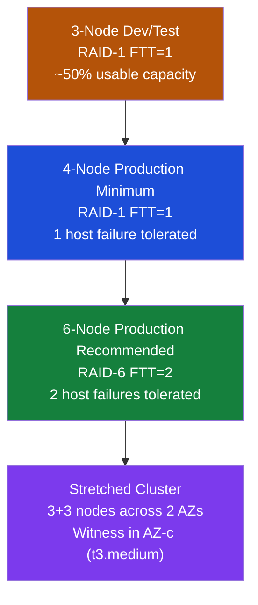

---
tags:
  - architecture
  - aws
---
# Amazon EVS — Design Standards

<div class="kb-summary">
EVS cluster sizing, AZ placement, CIDR planning, Direct Connect bandwidth requirements, and VPC design rules for production EVS deployments.

*Applies to: Amazon EVS*
</div>

```text
┌──────────────────────────────────── Amazon EVS — Design Standards ────────────────────────────────────┐
│                                                                                                       │
│   ┌───────────────────────────────────────────────────────────────────────────────────────────────┐   │
│   │   Minimum: 3 hosts (FTT=1 RAID-1); production: 4+ hosts; stretched: 6+ (3 per AZ + witness)  │    │
│   │   CIDR: reserve /20 for management + /20 for NSX-T VTEP + /16 for workload segments           │   │
│   │   Direct Connect: minimum 1 Gbps per 100 VMs being migrated with HCX                          │   │
│   └───────────────────────────────────────────────────────────────────────────────────────────────┘   │
│                                                                                                       │
│   ┌─────────────────────────────┐  ┌─────────────────────────────┐  ┌─────────────────────────────┐   │
│   │      Host Sizing            │  │      Network Design          │  │      AZ Placement           │  │
│   │      ─────────────          │  │      ─────────────           │  │      ─────────────          │  │
│   │  i4i.metal: 128vCPU/1TB    │  │  /20 management subnet       │  │  Single AZ: simplest        │   │
│   │  3 hosts min, 16 hosts max │  │  /20 VTEP overlay subnet     │  │  Multi-AZ: stretched vSAN   │   │
│   │  vSAN ESA on NVMe          │  │  /16+ for workload VMs       │  │  Witness: t3.medium in 3rd  │   │
│   │  Scale: add 1 host at time │  │  Avoid overlap with on-prem  │  │  AZ: DR isolation           │   │
│   └─────────────────────────────┘  └─────────────────────────────┘  └─────────────────────────────┘   │
│                                                                                                       │
│  Key terms:                                                                                           │
│                                                                                                       │
│  i4i.metal    = EVS bare-metal host; 128 vCPU, 1 TB RAM, 30 TB NVMe — standard choice                 │
│  i3en.metal   = Storage-heavy EVS host; 96 vCPU, 768 GB RAM, 60 TB NVMe                               │
│  FTT          = Failures to Tolerate; FTT=1 (RAID-1) needs 3 hosts; FTT=2 needs 5 hosts               │
│  vSAN ESA     = Express Storage Architecture; NVMe-optimised single tier; no cache/capacity split     │
│  HCI          = Hyper-Converged Infrastructure; compute + storage on the same bare-metal hosts        │
│  AZ           = Availability Zone; physically isolated AWS data center with independent power         │
│  Stretched cluster = vSAN across 2 AZs; requires witness VM in a third AZ for quorum                  │
│  Witness VM   = Lightweight t3.medium EC2 in 3rd AZ; holds tiebreaker vote; no data stored            │
│  VTEP subnet  = Dedicated /20 for NSX-T Geneve overlay tunnel endpoints on each host ENI              │
│  Direct Connect = Private dedicated link from on-prem to AWS; required for HCX production use         │
│  CIDR         = Plan 3 non-overlapping IP ranges: management / VTEP overlay / workload VMs            │
│  Admission control = vSphere HA policy reserving cluster capacity for host failure recovery           │
│                                                                                                       │
└───────────────────────────────────────────────────────────────────────────────────────────────────────┘
```



## Host Type Selection

| Instance | vCPU | RAM | Raw Storage | Use Case |
|---|---|---|---|---|
| i3en.metal | 96 | 768 GB | 60 TB NVMe (15×4TB) | Large vSAN capacity |
| i4i.metal | 128 | 1024 GB | 30 TB NVMe (8×3.75TB) | High-performance (vSAN ESA) |
| r6i.metal | 128 | 1024 GB | EBS only (not vSAN) | External storage (NFS/iSCSI) |

- Start with i4i.metal for new deployments (vSAN ESA support)
- All hosts in a cluster must be the same instance type

## Cluster Sizing

```text
Minimum (dev/test):
  3 hosts × i4i.metal
  vSAN policy: RAID-1 FTT=1
  Usable capacity: ~50% raw (metadata + slack)

Production baseline:
  4 hosts — FTT=1 can survive 1 host failure
  Hosts: i4i.metal

Production recommended:
  6 hosts — allows FTT=2 (2 concurrent host failures tolerated)
  Or: FTT=1 with capacity headroom for host replacement without evacuation

Stretched (multi-AZ):
  6 hosts minimum: 3 in AZ-a, 3 in AZ-b
  1 witness appliance in AZ-c (t3.medium EC2 or dedicated)
  vSAN policy: RAID-1 FTT=1 (site-level) + FTT=0 host
```

## vSAN Policy Selection

Storage Policy Based Management (SPBM) governs how vSAN protects data. Choose the policy based on the number of hosts in the cluster and the tolerance requirements for each workload.

| Policy | Protection Method | Min Hosts Required | Failure Tolerance | Overhead |
|---|---|---|---|---|
| RAID-1 FTT=1 | Mirroring — 2 data copies | 3 | 1 host failure | 2× raw space |
| RAID-5 FTT=1 | Erasure coding (4+1P) | 4 | 1 host failure | 1.33× raw space |
| RAID-6 FTT=2 | Erasure coding (4+2P) | 6 | 2 host failures | 1.5× raw space |
| RAID-1 FTT=2 | Mirroring — 3 data copies | 5 | 2 host failures | 3× raw space |

**When to use each policy:**

- **RAID-1 FTT=1** — dev/test and 3-node clusters where erasure coding is not available; also appropriate for latency-sensitive workloads where EC parity overhead is undesirable.
- **RAID-5 FTT=1** — the most space-efficient option for single-failure tolerance; use for general production workloads on 4-node or larger clusters.
- **RAID-6 FTT=2** — recommended for production workloads on 6-node clusters; protects against two simultaneous host failures; best balance of protection and space efficiency at scale.
- **RAID-1 FTT=2** — maximum protection for tier-1 databases or boot VMs; use when RAID-6 latency overhead is unacceptable and raw capacity is available.

All policies can coexist in the same cluster. Assign policies per VM via vCenter storage policy assignment. Changing a policy on a running VM triggers a background vSAN rebalance.

## Stretched Cluster Design

A stretched cluster distributes EVS hosts across two Availability Zones within the same AWS region, providing site-level failure tolerance. EVS implements this as a vSAN stretched cluster with the following three-site model:

- **AZ-a**: primary site — hosts 1-3 (or more); vSAN data component stored here
- **AZ-b**: secondary site — hosts 4-6 (or more); vSAN data component stored here
- **AZ-c**: witness site — a single t3.medium EC2 instance running the vSAN witness appliance; holds the metadata tiebreaker vote; no VM data is stored here

The vSAN stretched policy is PFTT=1 (site-level failures to tolerate = 1) + SFTT=0 (host-level failures within a site = 0). This means vSAN writes one data copy to each AZ, and the witness breaks ties if one AZ becomes unreachable. If AZ-b fails, AZ-a retains quorum and workloads continue with no interruption.

NSX-T Edge nodes must be deployed in both sites. Place at least one Edge node in AZ-a and one in AZ-b so that north-south traffic can continue when either site is the active site. The T0 gateway uses an active-standby uplink model between the two site Edge nodes.

Direct Connect connectivity must reach both AZs. If you use a single Direct Connect location, confirm that the connection can reach the VPC subnets in both AZs (VPC subnets in the same VPC span all AZs by design, so routing typically works automatically through the VPC).

## VPC and CIDR Design

```text
Subnet allocation per EVS cluster:

  10.0.0.0/20  — Management (vCenter, SDDC Manager, NSX Manager, ESXi mgmt VMkernel)
  10.0.16.0/20 — NSX-T VTEP (Geneve tunnel overlay; one ENI per host)
  10.0.32.0/20 — vMotion VMkernel (dedicated subnet recommended)
  10.0.48.0/20 — vSAN VMkernel (dedicated for performance isolation)
  10.1.0.0/16  — Workload VM segments (NSX-T logical networks, routed via T0)

Rules:
  - No overlap with on-premises CIDR ranges
  - VPC must be in the same region as the EVS cluster
  - Security groups on ENIs: allow VMware ports (443, 902, 8301, etc.)
  - VPC route table: workload subnets routed to ENI of T0 uplink
```

A /20 per management subnet accommodates up to 4,094 host addresses, which provides enough room for all VCF management VMs, ESXi VMkernel IPs, and future expansion without renumbering. Do not use smaller blocks — some VCF components require non-contiguous address reservations within the management range.

For multi-cluster EVS deployments, each cluster needs its own independent set of /20 blocks. Clusters share a VPC but use separate subnets; overlapping CIDR ranges between clusters cause routing conflicts at the VPC level. A common pattern is to use a /16 per cluster for all VMkernel subnets (four /20s fit within a /16 with room to spare).

EVS supports dual-stack on workload segments. NSX-T logical segments can carry both IPv4 and IPv6 traffic for workload VMs. Management infrastructure (vCenter, SDDC Manager, NSX Manager) remains IPv4-only; the dual-stack capability applies only to T1-attached workload segments.

## High Availability Design

vSphere HA protects workload VMs against host failures. Configure admission control using the percentage-based reservation model rather than the slot-based model — percentage-based correctly accounts for the variable RAM footprint of VCF management VMs.

Recommended admission control settings:
- Reserve CPU and memory equivalent to 1 host (for 4-node clusters: ~25%; for 6-node: ~17%)
- Set host isolation response to "Power off and restart VMs" for production clusters
- Enable datastore heartbeating using the vSAN datastore

| Component | HA Mechanism | Notes |
|---|---|---|
| vSphere HA | Admission control, percentage-based | Restarts VMs on surviving hosts after host failure |
| NSX Manager | 3-node active-active cluster | Automatic failover; N+1 resilience; no manual action |
| SDDC Manager | vSphere HA restart | Single VM; HA restarts it on another host automatically |
| vCenter VCHA | Active-passive pair + witness | Optional but recommended for production; zero-downtime failover |
| vSAN | Policy-driven redundancy | Automatic rebuild after host failure; requires ≥30% free capacity |

vCenter VCHA (vCenter High Availability) deploys a passive clone of vCenter Server and a witness node. If the active vCenter fails, the passive node promotes automatically within 30-60 seconds. This is optional for EVS but recommended for clusters managing more than 50 VMs.

## Direct Connect Bandwidth

```text
Purpose                     Minimum bandwidth
────────────────────────────────────────────────────────────
Management reachability     10 Mbps (vCenter, SDDC access)
HCX cold migration          100 Mbps per concurrent migration
HCX vMotion (live)          1 Gbps per 100 VMs actively moving
HCX bulk migration (WAN opt)100 Mbps (compressed; effective rate higher)
Production workload access  Size for peak VM traffic + 30% headroom
````

Use Direct Connect dedicated connection (1 Gbps or 10 Gbps) for production. VPN is acceptable for small test clusters.

## Operational Design Rules

- **Maintenance windows**: host upgrades are one host at a time via vSAN evacuation; plan for 30-60 min per host
- **Replacement nodes**: when AWS replaces a failed host, vSAN rebuilds data automatically; time depends on data volume
- **vSAN slack**: keep ≥ 30% free capacity to allow host replacement without policy downgrade
- **NSX Edge sizing**: for high-throughput workloads use dedicated Edge cluster (separate hosts); don't co-locate Edge VMs on compute hosts
- **DNS**: create Route 53 private hosted zone or use on-premises DNS reachable via Direct Connect for VCF component names

## See also

- [Amazon EVS — How It Works](how-it-works/)
- [Amazon EVS — Deploy](../deploy/)
