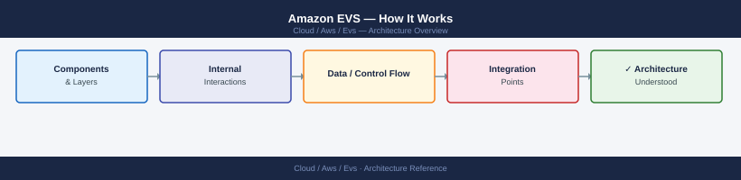
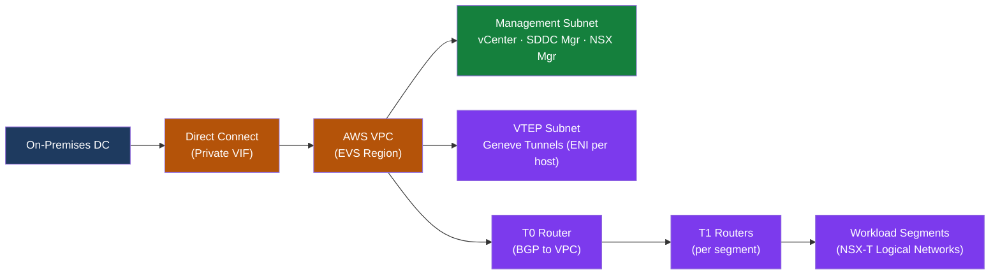
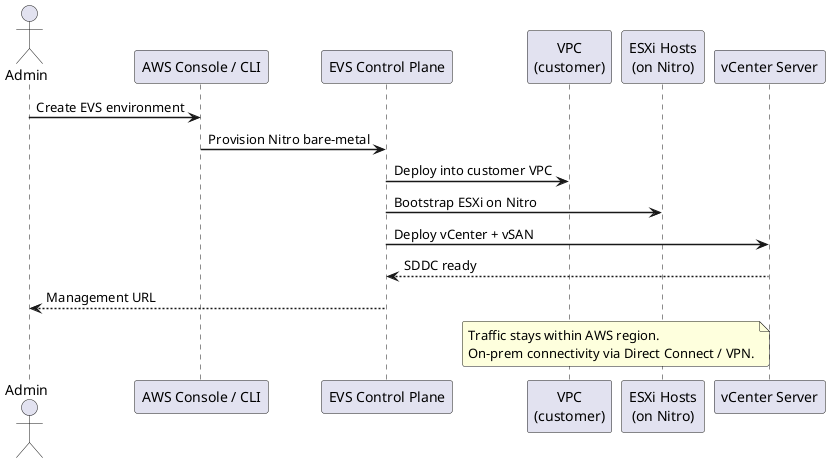

---
tags:
  - architecture
  - aws
---
# Amazon EVS — How It Works

<div class="kb-summary">
Amazon EVS runs VMware Cloud Foundation on dedicated bare-metal EC2 instances inside your VPC. The cluster nodes are physical hosts you don't share with other tenants; VMware components run natively, not in VMs.

*Applies to: Amazon EVS*
</div>






## Bare-Metal Host Model

EVS allocates dedicated physical EC2 bare-metal instances (i3en.metal or i4i.metal) to the cluster. These instances use the AWS dedicated tenancy model — the physical server is never shared with another AWS customer, which satisfies VMware's bare-metal licensing and hypervisor certification requirements.

| Instance | vCPU | RAM | NVMe Storage | vSAN Mode |
|---|---|---|---|---|
| i3en.metal | 96 | 768 GB | 60 TB (15 × 4 TB) | OSA (cache + capacity tiers) |
| i4i.metal | 128 | 1024 GB | 30 TB (8 × 3.75 TB) | ESA (single NVMe tier, preferred) |

When you create an EVS cluster, AWS provisions ESXi on each selected bare-metal instance automatically. You never interact with a bare-metal console or install an OS. By the time the cluster reaches the CREATED state, you have a fully-formed vCenter cluster visible in vSphere Client — hosts joined, vSAN configured, and NSX-T Manager reachable. Each host:

- Runs ESXi directly on hardware (no hypervisor underneath)
- Has multiple ENIs: one per VMkernel type, one or more for NSX-T VTEP overlay
- Contributes local NVMe disks to a vSAN cluster (HCI model, same as on-premises)
- Is billed per-hour; minimum 3 hosts required

## VPC Integration

Each VMkernel on an EVS host is attached to its own Elastic Network Interface (ENI). AWS attaches ENIs directly to the bare-metal instance; the ENI is just another NIC from ESXi's perspective. This means VPC-native features — security groups, route tables, flow logs — apply to each VMkernel individually.

| VMkernel | Purpose | Subnet |
|---|---|---|
| Management | ESXi host management, DCUI access, vCenter communication | Management /20 |
| vMotion | Live VM migration traffic between hosts | vMotion /20 |
| vSAN | vSAN storage traffic between disk group contributors | vSAN /20 |
| VTEP | NSX-T Geneve tunnel endpoints for overlay traffic | VTEP /20 |

The VPC route table is the underlay. It controls how bare-metal ENIs reach other subnets, Direct Connect, or Transit Gateway. NSX-T is a pure overlay that tunnels workload traffic inside Geneve frames on top of the VPC underlay — you never configure VPC routes for individual workload VM IPs; you only route the T0 uplink ENI.

```text
VPC → Subnet per VMkernel type:
  Management subnet: vCenter, SDDC Manager, ESXi DCUI, vSAN management VMkernel
  VTEP subnet:       NSX-T Geneve tunnel traffic between hosts
  VM network:        T1 router downlinks; workload VM traffic exits via T0 → ENI → VPC routing
  Transit Gateway:   Connect EVS VPC to other VPCs or on-premises via Direct Connect
```

## vSAN Architecture

EVS supports two vSAN storage architectures. The choice depends on host type and workload profile.

**OSA (Original Storage Architecture)** — used on i3en.metal hosts. Storage is split into two tiers: a cache tier (fast NVMe or SSD for read/write acceleration) and a capacity tier (bulk storage). OSA is the classical vSAN model and is well-suited to mixed read/write workloads where cache absorption is important.

**ESA (Express Storage Architecture)** — used on i4i.metal hosts. All NVMe drives form a single storage pool; there is no separate cache tier. Compression and deduplication are built into the I/O path and run inline. ESA delivers lower latency and higher throughput than OSA for the same raw capacity, and is the recommended choice for new EVS deployments.

vSAN protection is governed by Storage Policy Based Management (SPBM) policies:

| Policy | Method | Min Hosts | Failure Tolerance |
|---|---|---|---|
| RAID-1 FTT=1 | Mirroring (2 copies) | 3 | 1 host failure |
| RAID-5 FTT=1 | Erasure coding (4+1P) | 4 | 1 host failure, less capacity used |
| RAID-6 FTT=2 | Erasure coding (4+2P) | 6 | 2 host failures |
| RAID-1 FTT=2 | Mirroring (3 copies) | 5 | 2 host failures |

```bash
# EVS uses vSAN OSA (Original Storage Architecture) or vSAN ESA (Express Storage Architecture)
# i4i.metal hosts with NVMe: recommended for vSAN ESA
# Minimum cluster: 3 hosts (RF=1 FTT) — production: 4+ hosts (RF=1, FTT=1 or FTT=2)

# Storage policy example for EVS workloads
# SPBM policy: RAID-1 FTT=1 (2 copies; 1 host failure tolerated)
# For stretched cluster: RAID-1 FTT=1 site + FTT=0 host (vSAN Stretched Cluster)
```

## NSX-T Overlay Network

NSX-T on EVS uses the Geneve tunneling protocol. Each ESXi host has a dedicated VTEP ENI attached in the VTEP subnet. Geneve frames encapsulate workload VM traffic and are forwarded between hosts through VPC routing — the VPC treats the frames as ordinary IP packets.

The logical router topology follows a two-tier model:

- **T0 Gateway (Tier-0)**: the north-south perimeter router. It has one or more uplink interfaces connected to ENIs in the VPC. The T0 peers with the VPC subnet router via BGP. When BGP is established, the T0 advertises workload segment CIDRs to the VPC, and AWS automatically adds routes in the VPC route table pointing those prefixes to the T0 uplink ENI. This is how on-premises hosts or other VPC resources reach EVS workload VMs.
- **T1 Gateways (Tier-1)**: one per tenant, application, or network zone. T1 routers connect to logical segments on the south side and peer with the T0 on the north side. Distributed routing happens at the hypervisor level; inter-segment traffic never leaves the host for east-west flows.

```text
NSX-T on EVS uses Geneve tunnels over dedicated ENIs:

  On-premises DC → Direct Connect → AWS → VPC ENI (T0 uplink)
                                           T0 Router (BGP to VPC)
                                           T1 Routers (per tenant/segment)
                                           Logical Segments (VM networks)
                                           Distributed Firewall (micro-segmentation)

Key difference from on-prem: No physical switches managed by you.
AWS VPC routing tables = underlay network. NSX-T is pure overlay on top.
```

## VCF Management Stack

All VCF management components run as VMs on the EVS cluster itself — they consume vSAN storage and ESXi compute from the same cluster they manage. AWS provisions these VMs as part of cluster creation.

| Component | Role | HA Model |
|---|---|---|
| SDDC Manager | Host lifecycle, patching, upgrades, VCF domain management | Single VM; protected by vSphere HA |
| vCenter Server | VM inventory, DRS, vSphere HA, vSAN cluster management | Single VM; VCHA optional for active-passive HA |
| NSX Manager (3-node) | SDN control plane, policy API, distributed firewall enforcement | 3-node active-active cluster; N+1 resilience |
| NSX Edge nodes | T0/T1 data plane for north-south traffic, BGP peering | 2+ VMs in Edge cluster |

SDDC Manager controls the entire VCF domain lifecycle: host commissioning, decommissioning, VCF bundle downloads, and coordinated upgrades across vCenter, NSX, and ESXi. Because SDDC Manager runs inside the cluster, you access it through the management subnet — the same ENI used for vCenter access.

## VCF Component Versions

EVS runs a specific VCF version aligned with the AWS service launch. AWS manages:
- ESXi host OS provisioning (you do not install ESXi)
- AWS-side networking (VPC ENI attachment)
- Hardware failures (host replacement via AWS console or API)

You manage:
- VCF lifecycle (SDDC Manager upgrades)
- VM workloads
- NSX-T policies
- vSAN storage policies

## See also

- [Amazon EVS — Design Standards](../design-standards/)
- [Amazon EVS — Deploy](../deploy/)
- [Amazon EVS — Integrations](../integrations/)
