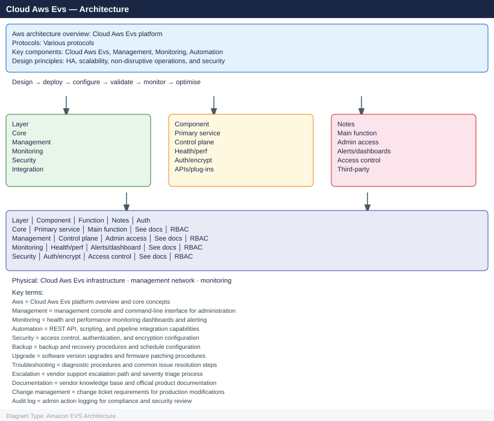

---
tags:
  - architecture
  - aws
---
# Amazon EVS — Architecture

<!-- diagram:evs-architecture -->

EVS architecture: bare-metal EC2 instances running VCF, VPC-native networking, vSAN HCI storage, NSX-T overlay, and on-premises connectivity via Direct Connect or HCX.

*Applies to: Amazon EVS*

  <a class="kb-card" href="how-it-works/">
    How It Works
    Bare-metal host model, VPC integration, vSAN datastore, NSX-T overlay
  </a>
  <a class="kb-card" href="design-standards/">
    Design Standards
    Cluster sizing, AZ placement, CIDR planning, Direct Connect bandwidth
  </a>
  <a class="kb-card" href="integrations/">
    Integrations
    HCX migration, Direct Connect, AWS native services, IAM
  </a>

