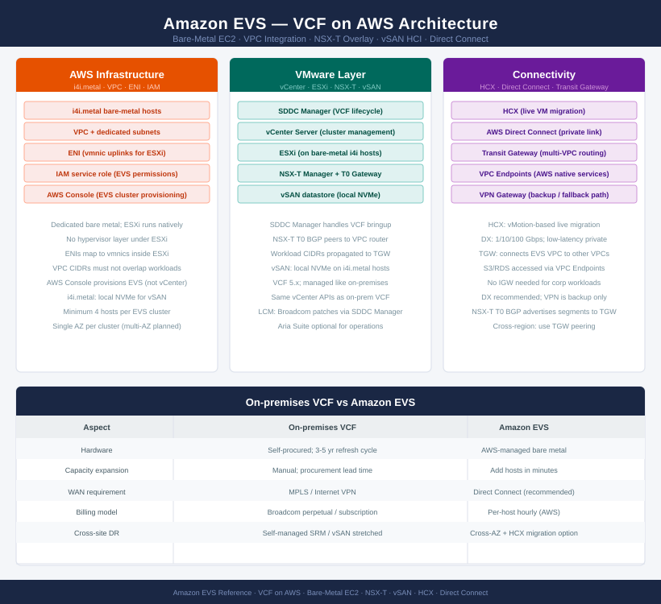

# Amazon EVS — Architecture

<!-- diagram:evs-architecture -->

<div class="kb-summary">
EVS architecture: bare-metal EC2 instances running VCF, VPC-native networking, vSAN HCI storage, NSX-T overlay, and on-premises connectivity via Direct Connect or HCX.
</div>



```text
┌─────────────────────────────────────── Amazon EVS Architecture ───────────────────────────────────────┐
│                                                                                                       │
│   ┌───────────────────────────────────────────────────────────────────────────────────────────────┐   │
│   │                                   EVS Architecture Overview                                   │   │
│   │      Three sub-sections: How It Works (bare-metal model), Design Standards, Integrations      │   │
│   │         Hosts: dedicated i4i.metal; ESXi runs natively on hardware in your VPC subnet         │   │
│   │         NSX-T overlay on ENIs; T0 router BGP to VPC; workload CIDRs propagated to TGW         │   │
│   └───────────────────────────────────────────────────────────────────────────────────────────────┘   │
│                                                                                                       │
│                 ▼                               ▼                                 ▼                   │
│                                                                                                       │
│   ┌────────────────────────────┐  ┌────────────────────────────┐  ┌───────────────────────────────┐   │
│   │        How It Works        │  │      Design Standards      │  │          Integrations         │   │
│   │    Bare-metal host model   │  │     Cluster sizing rules   │  │          HCX migration        │   │
│   │      VPC subnet layout     │  │        CIDR planning       │  │          Direct Connect       │   │
│   │     NSX-T Geneve overlay   │  │         AZ placement       │  │         Transit Gateway       │   │
│   │       vSAN HCI storage     │  │      DX bandwidth guide    │  │       AWS native services     │   │
│   └────────────────────────────┘  └────────────────────────────┘  └───────────────────────────────┘   │
│                                                                                                       │
```
<div class="kb-grid">
  <a class="kb-card" href="how-it-works/">
    <span class="kb-card-title">How It Works</span>
    <span class="kb-card-desc">Bare-metal host model, VPC integration, vSAN datastore, NSX-T overlay</span>
  </a>
  <a class="kb-card" href="design-standards/">
    <span class="kb-card-title">Design Standards</span>
    <span class="kb-card-desc">Cluster sizing, AZ placement, CIDR planning, Direct Connect bandwidth</span>
  </a>
  <a class="kb-card" href="integrations/">
    <span class="kb-card-title">Integrations</span>
    <span class="kb-card-desc">HCX migration, Direct Connect, AWS native services, IAM</span>
  </a>
</div>
