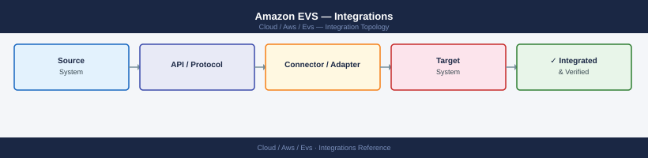

---
tags:
  - architecture
  - aws
description: "EVS integration with on-premises infrastructure via HCX and Direct Connect, AWS native services (S3, Route 53, IAM), and cross-account VPC connectivity..."
---
# Amazon EVS — Integrations

<div class="kb-summary">
EVS integration with on-premises infrastructure via HCX and Direct Connect, AWS native services (S3, Route 53, IAM), and cross-account VPC connectivity via Transit Gateway.

*Applies to: Amazon EVS*
</div>


```d2
direction: right

ONPREM: "ONPREM" {shape: rectangle}
DX: "DX" {shape: rectangle}
TGW: "TGW" {shape: rectangle}
EVSVPC: "EVSVPC" {shape: rectangle}
SPOKEVPC: "SPOKEVPC" {shape: rectangle}
S3: "S3" {shape: rectangle}
R53: "R53" {shape: rectangle}
CW: "CW" {shape: rectangle}

ONPREM -> DX
DX -> TGW
TGW -> EVSVPC
TGW -> SPOKEVPC
EVSVPC -> S3
EVSVPC -> R53
EVSVPC -> CW
```

## HCX (VMware Hybrid Cloud Extension)

HCX is the primary migration tool for moving VMs from on-premises vSphere to EVS.

### License Tiers

| Tier | Key Capabilities | Typical Use |
|---|---|---|
| HCX Advanced | vMotion, cold migration, bulk migration, Network Extension, WAN optimization | Standard EVS migrations |
| HCX Enterprise | All Advanced features + OS-assisted migration (P2V/cross-hypervisor), Mobility Groups, Replication Assisted vMotion (RAV) | Large-scale migrations, phased wave planning |

HCX Enterprise is required for Replication Assisted vMotion (RAV), which decouples the data copy phase from the switchover phase — the VM replicates in the background using vSphere Replication, then a final vMotion completes the cutover with minimal downtime. This is the preferred method for large VMs (> 500 GB) where a live vMotion would take too long.

### Service Mesh Appliance Sizing

The HCX Service Mesh deploys three paired appliances between on-premises and EVS:

| Appliance | CPU | RAM | Notes |
|---|---|---|---|
| Interconnect (IX) | 4 vCPU | 3 GB | One pair handles up to 100 concurrent migrations |
| WAN Optimizer | 4 vCPU | 7 GB | Optional; provides deduplication and compression for bulk migrations |
| Network Extension (NE) | 4 vCPU | 3 GB | One NE pair stretches one L2 network; deploy multiple pairs for multiple segments |

For migrations exceeding 100 concurrent VMs, deploy multiple Service Mesh instances (each with its own IX/WAN Opt/NE set).

### Migration Workflow

The complete HCX migration workflow follows these phases:

1. **Pre-checks**: verify HCX Manager version compatibility, confirm Direct Connect or VPN connectivity, validate firewall rules (port 443 and 8301 between sites)
2. **Compute profile**: define which vCenter clusters, datastores, and networks are eligible for migration on both the source and EVS side
3. **Service Mesh deployment**: HCX deploys IX, WAN Optimizer, and NE appliances; verify all pairs show green status in HCX Manager
4. **Network Extension (NE)**: stretch the on-premises segment to EVS so migrated VMs retain their IP addresses; the L2 extension bridges the segment over the HCX IX tunnel
5. **Migration**: select VMs and schedule vMotion (live), cold, bulk (background copy + final switchover), or RAV depending on VM size and downtime tolerance
6. **NE removal**: after all VMs on a stretched segment are migrated and DNS/routing is updated, remove the NE and let the EVS T1 segment become the authoritative network for that IP range

**Bulk migration vs RAV**: bulk migration copies data in the background using HCX's own replication engine, then performs a brief powered-off switchover. RAV uses vSphere Replication for the copy phase and vMotion for the final switchover — RAV achieves near-zero downtime even for large VMs, but requires HCX Enterprise.

```text
HCX components:
  HCX Manager (on-premises): deployed as OVA on on-prem vCenter; manages HCX service mesh
  HCX Cloud (EVS side):      auto-deployed by EVS; mirrors on-prem HCX Manager
  Service Mesh:              Interconnect (IX) + WAN Opt + Network Extension (NE) appliances

Migration types:
  vMotion         Live migration, no downtime. Requires 1 Gbps DX or sufficient bandwidth.
  Cold migration  Powered-off VM copy. Faster bulk data transfer.
  Bulk migration  Background copy with final vMotion switchover. Uses WAN optimization.
  OS-assisted     P2V or cross-hypervisor (requires HCX Enterprise license)

Network Extension (NE):
  Stretches on-prem L2 networks to EVS; VMs keep their IP addresses during migration.
  Remove NE after migration is complete (routing optimization).
```

```bash
# Verify HCX connectivity (run from HCX Manager UI or API)
# Check: HCX Manager → Interconnect → Service Mesh → Status = Green

# HCX vMotion requires port 443 and 8301 open between on-prem and EVS HCX Cloud
# Direct Connect private VIF or VPN must have these ports allowed
```

## Direct Connect

Direct Connect provides the private, dedicated network path between on-premises and EVS. It is required for HCX vMotion (live migration) in production environments.

### Connection Types and LAG

| Option | Bandwidth | Notes |
|---|---|---|
| Dedicated single | 1 Gbps or 10 Gbps | Single physical port; no automatic failover at the physical layer |
| LAG (Link Aggregation Group) | 2×1G or 2×10G | Combines multiple dedicated connections; increases throughput and provides link-level redundancy |
| Hosted connection | 50 Mbps – 10 Gbps | Delivered via AWS partner; faster provisioning; shared physical infrastructure |

For EVS production use, a LAG of two 10 Gbps dedicated connections provides both throughput headroom for HCX migrations and link-level redundancy without relying on a failover to VPN.

### BGP Route Advertisement Model

Direct Connect uses BGP to exchange routes between on-premises and AWS:

- **AWS advertises to on-premises**: the VPC CIDR ranges (management /20, VTEP /20, vMotion /20, vSAN /20) and, if using Transit Gateway, any other VPC CIDRs attached to TGW
- **On-premises advertises to AWS**: your on-premises subnet prefixes; EVS needs to route return traffic to on-premises VMs during HCX migrations and to reach on-premises services (DNS, AD)
- **EVS T0 advertises workload CIDRs**: the T0 BGP peer announces NSX-T workload segment prefixes into the VPC, which then propagates to Direct Connect if TGW route propagation is enabled

Avoid advertising overly broad prefixes from on-premises (e.g., a default route) unless you want to route all EVS internet traffic through your on-premises edge.

### VPN Failover

Configure a Site-to-Site VPN as a backup to Direct Connect. When Direct Connect goes down, BGP sessions fail and AWS automatically routes traffic over the VPN. The VPN provides lower throughput (up to 1.25 Gbps per tunnel) but ensures management connectivity is maintained during a Direct Connect outage.

```text
Connection types:
  Dedicated: 1G or 10G physical port; request via AWS console; ~15-45 day lead time
  Hosted:    Sub-1G via AWS partner; faster provisioning; shared infrastructure

VIF types for EVS:
  Private VIF: access VPC resources (management subnet, EVS hosts); required for HCX
  Transit VIF: attach to Transit Gateway; recommended for multi-VPC or hybrid architectures

BGP peering:
  AWS side: ASN 64512 (default) or custom
  On-prem:  your router ASN
  Advertise: on-prem prefixes to AWS; AWS advertises VPC CIDRs back
```

## Transit Gateway (TGW)

Transit Gateway is the hub for connecting EVS to other VPCs and to on-premises networks via a single Direct Connect Transit VIF.

### EVS VPC Attachment

To attach the EVS VPC to a Transit Gateway:

1. In the AWS console, navigate to VPC → Transit Gateways → Attachments → Create Attachment
2. Select Attachment Type: VPC
3. Select the EVS VPC and the subnets to route through TGW (typically the management and workload subnets)
4. After attachment is created, update the EVS VPC route table: add a route for each spoke VPC CIDR pointing to the TGW attachment
5. On the TGW route table, enable route propagation from the EVS VPC attachment so spoke VPCs learn the EVS CIDR automatically

### TGW Route Table Design for Hub-and-Spoke

The standard pattern uses two TGW route tables:

- **Hub route table**: associated with the Direct Connect attachment (Transit VIF) and the EVS VPC attachment. Propagates routes from all spoke VPCs and the EVS VPC so on-premises can reach everything.
- **Spoke route table**: associated with each spoke VPC attachment. Contains a static default route (0.0.0.0/0) or specific routes pointing to the EVS VPC attachment for east-west traffic. Propagates only the spoke's own CIDR back to hub.

This design prevents spoke-to-spoke direct routing (all spoke traffic flows through the EVS VPC or on-premises), which is a common security requirement.

### Inter-Region Peering for Multi-Region EVS

If you operate EVS clusters in multiple AWS regions, connect the regional Transit Gateways using TGW inter-region peering:

- Peering attachments are static (no route propagation); you must manually add routes on each end
- Latency: inter-region peering uses the AWS backbone network (typically lower latency than public internet)
- Cost: data transfer charges apply per GB transferred across regions
- Use case: active-active EVS clusters in two regions with workload replication via vSphere Replication or HCX RAV

```text
Use TGW when you need:
  EVS → other AWS VPCs (workload VPCs, shared services)
  On-premises → multiple AWS VPCs via single DX attachment
  East-west between multiple EVS clusters in same region

Architecture:
  DX → Transit VIF → TGW
  EVS VPC → TGW attachment (VPC route table points to TGW)
  Spoke VPCs → TGW attachments
  TGW route table: propagate EVS CIDR, on-prem CIDR, spoke VPC CIDRs

Note: EVS T0 router advertises workload VM prefixes via BGP to VPC ENI.
The VPC route table entry for those prefixes points to the T0 uplink ENI.
TGW then propagates those routes to connected spoke VPCs.
```

## Monitoring Integration

EVS integrates with AWS monitoring services to provide visibility into host health, API activity, and service events.

### CloudWatch Metrics

EVS publishes host metrics to the `AWS/EVS` CloudWatch namespace. Key metrics:

| Metric | Dimension | Description |
|---|---|---|
| HostCount | ClusterId | Number of hosts in the cluster in CREATED state |
| HostStatus | ClusterId, HostId | Per-host health status (0 = unhealthy, 1 = healthy) |

Use CloudWatch dashboards to track cluster host count over time and alert on unexpected drops. A CloudWatch Alarm on `HostStatus` with threshold `< 1` on any host triggers an alert when a host enters an unhealthy state.

### CloudTrail

All EVS API calls are recorded in CloudTrail under the `evs:*` event source. This covers:

- `evs:CreateEnvironment` — cluster creation events
- `evs:DeleteEnvironment` — cluster deletion
- `evs:CreateVmwareVcenterIp` — VCF management IP allocation
- `evs:ListEnvironments`, `evs:GetEnvironment` — read-only operations (logged but typically filtered from alerts)

Configure a CloudTrail trail to deliver EVS events to an S3 bucket for long-term audit retention. Use CloudWatch Logs Insights to query for destructive operations (`evs:Delete*`) and alert via SNS.

### AWS Health

The AWS Health Dashboard publishes service health events for EVS, including:

- Scheduled maintenance for the underlying bare-metal infrastructure
- Host hardware failures requiring AWS replacement
- Regional service degradation events

Configure AWS Health event notifications via EventBridge: create a rule matching `source: aws.health` and `detail.service: EVS`, then route alerts to SNS or a ticketing system.

### CloudWatch Alarms

Recommended alarms for EVS clusters:

```bash
# Alarm: any host in unhealthy state
aws cloudwatch put-metric-alarm \
  --alarm-name evs-host-unhealthy \
  --namespace AWS/EVS \
  --metric-name HostStatus \
  --dimensions Name=ClusterId,Value=evs-cluster-id \
  --period 300 --evaluation-periods 1 \
  --threshold 1 --comparison-operator LessThanThreshold \
  --statistic Minimum \
  --alarm-actions arn:aws:sns:us-east-1:123456789012:evs-alerts

# Alarm: host count drops below expected minimum
aws cloudwatch put-metric-alarm \
  --alarm-name evs-host-count-low \
  --namespace AWS/EVS \
  --metric-name HostCount \
  --dimensions Name=ClusterId,Value=evs-cluster-id \
  --period 300 --evaluation-periods 1 \
  --threshold 3 --comparison-operator LessThanThreshold \
  --statistic Minimum \
  --alarm-actions arn:aws:sns:us-east-1:123456789012:evs-alerts
```


```text title="Expected output"
{
    "AlarmArn": "arn:aws:cloudwatch:us-east-1:123456789012:alarm:evs-host-unhealthy"
}
{
    "AlarmArn": "arn:aws:cloudwatch:us-east-1:123456789012:alarm:evs-host-count-low"
}
```

!!! warning "Common errors"
    | Error | Fix |
    |---|---|
    | `An error occurred (InvalidParameterValue) when calling the PutMetricAlarm operation: Invalid namespace: AWS/EVS` | Use a custom namespace like `EVS/Cluster` or verify the metric namespace exists in your CloudWatch metrics. |
    | `An error occurred (ValidationError) when calling the PutMetricAlarm operation: 1 validation error detected: Value at 'alarmActions' failed to satisfy constraint: Member must satisfy regular expression pattern: arn:aws[a-z\-]*:[a-z0-9\-]+:.*` | Verify the SNS topic ARN is correctly formatted and the topic exists in the specified region. |
## AWS Native Service Integration

```bash
# S3 — object storage for backups and cold data
# Access from EVS VMs: via VPC Endpoint (Gateway) or NAT Gateway
# Recommended: S3 Gateway VPC Endpoint (no cost, stays in VPC)
aws ec2 create-vpc-endpoint \
  --vpc-id vpc-evs-xxx \
  --service-name com.amazonaws.us-east-1.s3 \
  --route-table-ids rtb-evs-workload

# Route 53 — DNS for VCF components
# Create private hosted zone for vcf.internal
# Associate with EVS VPC
aws route53 create-hosted-zone \
  --name vcf.internal \
  --vpc VPCRegion=us-east-1,VPCId=vpc-evs-xxx \
  --caller-reference $(date +%s)

# IAM — EVS service role
# EVS creates an IAM service-linked role: AWSServiceRoleForAmazonEVS
# Do not delete this role — EVS uses it for host lifecycle management

# CloudWatch — EVS publishes host metrics (CPU, memory, disk) to CloudWatch
# Namespace: AWS/EVS
# Useful metric: HostCount, HostStatus
aws cloudwatch get-metric-statistics \
  --namespace AWS/EVS \
  --metric-name HostStatus \
  --dimensions Name=ClusterId,Value=evs-cluster-id \
  --period 300 --statistics Average \
  --start-time $(date -u -v-1H +%Y-%m-%dT%H:%M:%SZ) \
  --end-time $(date -u +%Y-%m-%dT%H:%M:%SZ)
```


```text title="Expected output"
{
    "VpcEndpoint": {
        "VpcEndpointId": "vpce-0a1b2c3d4e5f6g7h8",
        "VpcId": "vpc-evs-xxx",
        "ServiceName": "com.amazonaws.us-east-1.s3",
        "State": "available",
        "RouteTableIds": [
            "rtb-evs-workload"
        ],
        "CreationTimestamp": "2024-01-15T14:32:18.000Z"
    }
}
{
    "HostedZone": {
        "Id": "/hostedzone/Z0A1B2C3D4E5F6",
        "Name": "vcf.internal.",
        "CallerReference": "1705334538",
        "Config": {
            "PrivateZone": true
        },
        "ResourceRecordSetCount": 2
    },
    "ChangeInfo": {
        "Id": "/change/C2ABCD1234EF5",
        "Status": "PENDING",
        "SubmittedAt": "2024-01-15T14:32:40.000Z"
    }
}
{
    "Datapoints": [
        {
            "Timestamp": "2024-01-15T14:00:00Z",
            "Average": 1.0,
            "Unit": "Count"
        },
        {
            "Timestamp": "2024-01-15T14:05:00Z",
            "Average": 1.0,
            "Unit": "Count"
        }
    ],
    "Label": "HostStatus"
}
```

!!! warning "Common errors"
    | Error | Fix |
    |---|---|
    | `An error occurred (InvalidVpcId.NotFound) when calling the CreateVpcEndpoint operation: The VPC ID 'vpc-evs-xxx' does not exist` | Replace `vpc-evs-xxx` with your actual EVS VPC ID from the AWS console. |
    | `An error occurred (InvalidInput) when calling the CreateHostedZone operation: Invalid VPC association` | Ensure the VPC ID exists in the specified region and the VPC has DNS support enabled. |
    | `An error occurred (InvalidParameterValue) when calling the GetMetricStatistics operation: The parameter StartTime must be before EndTime` | Verify the system clock is correct and that the `-v-1H` date offset syntax is supported on your OS (use `date -u -d '1 hour ago'` on Linux instead). |
## See also

- [Amazon EVS — How It Works](../how-it-works/)
- [Amazon EVS — Deploy](../../deploy/)
