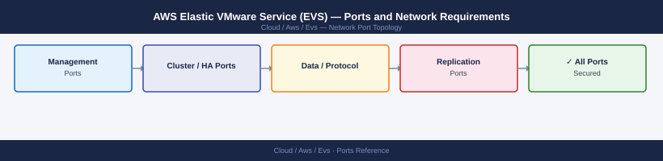

---
tags:
  - aws-evs
  - aws
  - vmware
  - networking
  - firewall
  - ports
---
# AWS Elastic VMware Service (EVS) — Ports and Network Requirements

<div class="kb-summary">
Firewall port reference for AWS Elastic VMware Service (EVS). EVS runs VMware vSphere, vSAN, and NSX-T natively on AWS bare-metal infrastructure inside customer VPCs. Port requirements are identical to a standard VMware SDDC — traffic flows within the VPC using the same protocols as on-premises VMware.

*Applies to: AWS EVS (generally available 2025)*
</div>


## Before you begin

- EVS hosts run inside the customer's **VPC** — all inter-host traffic (vSAN, vMotion, NSX Geneve) is VPC-internal and not subject to AWS internet firewalls.
- AWS **Security Groups** on the EVS management network must allow the same ports as a standard vSphere deployment.
- External access to vCenter and NSX Manager goes through the **VPC** (no internet exposure required — use Direct Connect or VPN for corporate access).
- EC2 instances in the same VPC can access EVS datastores via iSCSI or NFS through the VPC fabric.

## Management Access (VPN/Direct Connect → EVS VPC)

| Port | Protocol | Source | Destination | Purpose |
|---|---|---|---|---|
| 443 | TCP | Admin workstations (via DX/VPN) | vCenter Server | vSphere web client and API |
| 443 | TCP | Admin workstations (via DX/VPN) | NSX Manager | NSX-T web UI and API |
| 22 | TCP | Jump hosts | ESXi management IP | ESXi SSH (diagnostics) |
| 5480 | TCP | Admin workstations | vCenter VCSA | VCSA appliance management UI |

## ESXi Host Ports (VPC-Internal)

| Port | Protocol | Traffic | Purpose |
|---|---|---|---|
| 902 | TCP | vCenter → ESXi | ESXi authd agent |
| 8000 | TCP | ESXi ↔ ESXi | vMotion migration traffic |
| 2233 | TCP | ESXi ↔ ESXi | Fault Tolerance |
| 6081 | UDP | ESXi ↔ ESXi | NSX Geneve overlay (TEP traffic) |
| 12345, 12346 | UDP | ESXi ↔ ESXi | vSAN CMMDS cluster membership |
| 2233 | TCP | ESXi ↔ ESXi | vSAN RDT data traffic |
| 3260 | TCP | ESXi ↔ storage | iSCSI (if additional iSCSI storage used) |
| 2049 | TCP | ESXi ↔ storage | NFS (if NFS datastores used) |

## NSX-T (VPC-Internal)

| Port | Protocol | Source | Destination | Purpose |
|---|---|---|---|---|
| 443 | TCP | ESXi transport nodes | NSX Manager | MPA — management plane agent connection |
| 5671 | TCP | ESXi transport nodes | NSX Manager | RabbitMQ — NSX messaging bus |
| 6081 | UDP | Transport node ↔ Transport node | Geneve overlay traffic (inter-VM east-west) |
| 179 | TCP | NSX edge nodes | Upstream BGP peer | BGP peering for north-south routing |

## AWS EVS API (Outbound — Control Plane)

| Port | Protocol | Source | Destination | Purpose |
|---|---|---|---|---|
| 443 | TCP | EVS management network | evs.<region>.amazonaws.com | AWS EVS control plane API — lifecycle management, instance operations |
| 443 | TCP | vCenter / NSX | *.amazonaws.com | Cloud connectivity for licensing, updates |

## Firewall Zone Summary

| From | To | Ports | Notes |
|---|---|---|---|
| Admin (via DX/VPN) | vCenter / NSX Manager | 443, 5480 | Management access — must traverse VPN or Direct Connect |
| vCenter | ESXi hosts | 443, 902 | vSphere management |
| ESXi ↔ ESXi (VPC-internal) | ESXi ↔ ESXi | 8000, 2233, 6081, 12345-12346 | vMotion, vSAN, NSX — VPC security group |
| Transport nodes | NSX Manager | 443, 5671 | NSX fabric control |
| EVS mgmt | evs.<region>.amazonaws.com | 443 | AWS control plane |

## Verify

```bash
# From admin workstation (via DX/VPN) — test vCenter
curl -sk -o /dev/null -w "%{http_code}" https://<vcenter-ip>/

# From admin workstation — test NSX Manager
curl -sk -o /dev/null -w "%{http_code}" https://<nsx-manager-ip>/

# From ESXi host (VPC-internal) — test vSAN port to peer
nc -zv <peer-esxi-ip> 2233

# Verify AWS EVS security group allows vSAN ports
aws ec2 describe-security-groups --group-ids <evs-sg-id>
```


```text title="Expected output"
200
200
Connection to 10.42.18.15 port 2233 [tcp/*] succeeded!
{
    "SecurityGroups": [
        {
            "GroupId": "sg-0a7f2c8e9d1b4f3c2",
            "GroupName": "evs-vsan-cluster",
            "IpPermissions": [
                {
                    "IpProtocol": "tcp",
                    "FromPort": 2233,
                    "ToPort": 2233,
                    "IpRanges": [
                        {
                            "CidrIp": "10.42.18.0/24",
                            "Description": "vSAN peer communication"
                        }
                    ]
                },
                {
                    "IpProtocol": "tcp",
                    "FromPort": 8182,
                    "ToPort": 8182,
                    "IpRanges": [
                        {
                            "CidrIp": "10.42.18.0/24"
                        }
                    ]
                }
            ]
        }
    ]
}
```

!!! warning "Common errors"
    **`curl: (60) SSL certificate problem: self signed certificate`** — Add `-k` flag to skip certificate verification (already present in example; if error persists, verify vCenter/NSX Manager is running and accessible).
    **`Connection to <peer-esxi-ip> port 2233 [tcp/*] failed!`** — Verify the peer ESXi host IP is correct, the security group allows inbound port 2233 from the source ESXi host's security group, and the host is running.
    **`An error occurred (InvalidGroupId.NotFound) when calling the DescribeSecurityGroups operation: The security group 'sg-xxxxx' does not exist`** — Confirm the EVS security group ID is correct and exists in the same AWS region and VPC as your EVS cluster.
## See also

- [AWS EVS — Architecture](../how-it-works/)
- [AWS — Ports](../architecture/ports.md)
- [VMware vSphere — Ports](../../../../virtualization/vmware/products/vcenter/architecture/ports.md)
- [VMware vSAN — Ports](../../../../virtualization/vmware/products/vsan/architecture/ports.md)
- [VMware NSX — Ports](../../../../virtualization/vmware/products/nsx/architecture/ports.md)
