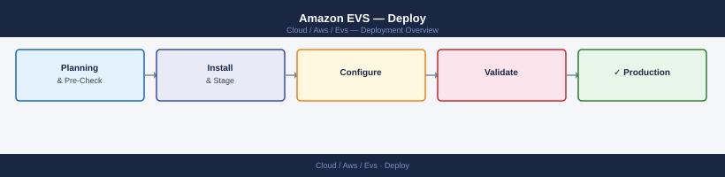
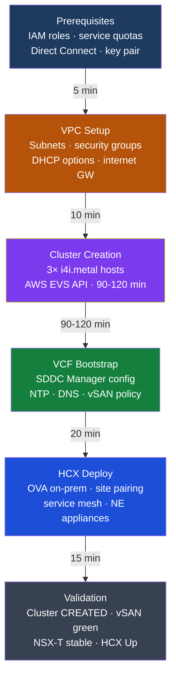

---
tags:
  - aws
  - deployment
search:
  boost: 1.5
---
# Amazon EVS — Deploy

<!-- diagram:evs-deploy -->

<div class="kb-summary">
EVS cluster deployment: prerequisites, VPC setup, cluster creation via AWS console or CLI, initial VCF configuration, HCX deployment, network extension, and post-deploy validation checklist.

*Applies to: Amazon EVS*
</div>



```d2
direction: right

plan: "Plan" {shape: oval}
prerequisites: "Prerequisites" {shape: rectangle}
create_evs_cluster_aws_cli: "Create EVS Cluster (AWS CLI)" {shape: rectangle}
vcf_initial_configuration: "VCF Initial Configuration" {shape: rectangle}
hcx_deployment_onpremises_side: "HCX Deployment (On-Premises Side)" {shape: rectangle}
network_extension_setup: "Network Extension Setup" {shape: rectangle}
postdeploy_validation_checklist: "Post-Deploy Validation Checklist" {shape: rectangle}
validate: "Validate" {shape: oval}

plan -> prerequisites
prerequisites -> create_evs_cluster_aws_cli
create_evs_cluster_aws_cli -> vcf_initial_configuration
vcf_initial_configuration -> hcx_deployment_onpremises_side
hcx_deployment_onpremises_side -> network_extension_setup
network_extension_setup -> postdeploy_validation_checklist
postdeploy_validation_checklist -> validate
```

## Before you begin

- **Access:** admin credentials for the target system and any upstream dependencies (DNS, NTP, vCenter, directory services)
- **Timing:** safe to run during a scheduled maintenance window; allow 1-2 hours for initial deployment
- **Dependencies:** network connectivity verified; DNS resolvable; NTP configured; any licence keys available
- **Logging:** record every IP address, hostname, and credential set assigned during this deployment

---




## Prerequisites

### AWS Account Prerequisites

Before submitting a cluster creation request, verify that your account has sufficient capacity for `i4i.metal` instances. The default quota is 0 in most regions. Request the quota increase early — AWS typically takes 1-3 business days to approve i4i.metal increases.

```bash
aws service-quotas request-service-quota-increase \
  --service-code ec2 \
  --quota-code L-34B43A08 \
  --desired-value 6 \
  --region us-east-1
```

Track the request until it reaches `CASE_CLOSED` with the new limit applied:

```bash
aws service-quotas get-requested-service-quota-change \
  --request-id <request-id> \
  --query 'RequestedQuota.Status'
```

### Networking Prerequisites

The VPC must have DNS resolution and DNS hostnames enabled. EVS relies on AWS-provided DNS for internal service discovery during bootstrapping.

```bash
# Create VPC with DNS enabled
aws ec2 create-vpc \
  --cidr-block 10.0.0.0/16 \
  --tag-specifications 'ResourceType=vpc,Tags=[{Key=Name,Value=evs-vpc}]'

aws ec2 modify-vpc-attribute --vpc-id vpc-xxx --enable-dns-support
aws ec2 modify-vpc-attribute --vpc-id vpc-xxx --enable-dns-hostnames

# Set DHCP options to point to your DNS server (required for VCF name resolution)
aws ec2 create-dhcp-options \
  --dhcp-configurations \
    "Key=domain-name-servers,Values=[10.0.0.2,169.254.169.253]" \
    "Key=domain-name,Values=[vcf.internal]"
aws ec2 associate-dhcp-options --dhcp-options-id dopt-xxx --vpc-id vpc-xxx

# Create required subnets
aws ec2 create-subnet --vpc-id vpc-xxx --cidr-block 10.0.0.0/20 \
  --availability-zone us-east-1a \
  --tag-specifications 'ResourceType=subnet,Tags=[{Key=Name,Value=evs-management}]'

aws ec2 create-subnet --vpc-id vpc-xxx --cidr-block 10.0.16.0/20 \
  --availability-zone us-east-1a \
  --tag-specifications 'ResourceType=subnet,Tags=[{Key=Name,Value=evs-vtep}]'

# Internet gateway — required for initial ESXi host provisioning even if you use Direct Connect
aws ec2 create-internet-gateway \
  --tag-specifications 'ResourceType=internet-gateway,Tags=[{Key=Name,Value=evs-igw}]'
aws ec2 attach-internet-gateway --internet-gateway-id igw-xxx --vpc-id vpc-xxx
```

### Direct Connect Prerequisites

HCX requires low-latency connectivity between on-premises and EVS. Create a private VIF and attach it to your Virtual Gateway or Transit Gateway before starting HCX deployment. Test connectivity from on-premises to the EVS management subnet before proceeding.

```bash
# Verify private VIF is in available state
aws directconnect describe-virtual-interfaces \
  --query 'virtualInterfaces[?virtualInterfaceType==`private`].[virtualInterfaceId,virtualInterfaceState]'

# Confirm route is advertised to the EVS management subnet from your VGW
aws ec2 describe-route-tables --filters Name=vpc-id,Values=vpc-xxx \
  --query 'RouteTables[].Routes[?GatewayId!=null]'
```

### IAM Prerequisites

The user or role performing cluster operations needs the following minimum permissions. Attach this policy to your deployment role before running `create-environment`.

```json
{
  "Version": "2012-10-17",
  "Statement": [
    {
      "Effect": "Allow",
      "Action": [
        "evs:*",
        "ec2:*",
        "secretsmanager:GetSecretValue",
        "iam:CreateServiceLinkedRole"
      ],
      "Resource": "*"
    }
  ]
}
```

Create the EVS service-linked role manually if it does not already exist in the account:

```bash
aws iam create-service-linked-role --aws-service-name elasticvmwareservice.amazonaws.com

# Verify it was created
aws iam get-role --role-name AWSServiceRoleForAmazonEVS \
  --query 'Role.Arn'
```

Security groups for EVS require specific ports. Create the management SG before cluster creation:

```bash
aws ec2 create-security-group \
  --group-name evs-management-sg \
  --description "EVS Management Security Group" \
  --vpc-id vpc-xxx

# Add minimum required ingress rules
SGID=$(aws ec2 describe-security-groups \
  --filters Name=group-name,Values=evs-management-sg \
  --query 'SecurityGroups[0].GroupId' --output text)

aws ec2 authorize-security-group-ingress --group-id $SGID \
  --ip-permissions \
    'IpProtocol=tcp,FromPort=443,ToPort=443,IpRanges=[{CidrIp=10.0.0.0/8}]' \
    'IpProtocol=tcp,FromPort=902,ToPort=902,IpRanges=[{CidrIp=10.0.0.0/8}]' \
    'IpProtocol=tcp,FromPort=5671,ToPort=5671,IpRanges=[{CidrIp=10.0.0.0/8}]' \
    'IpProtocol=tcp,FromPort=8301,ToPort=8301,IpRanges=[{CidrIp=10.0.0.0/8}]'
```

Create the SSH key pair for ESXi DCUI access:

```bash
aws ec2 create-key-pair --key-name evs-cluster-key --output text > evs-cluster-key.pem
chmod 400 evs-cluster-key.pem
```

## Create EVS Cluster (AWS CLI)

Submit the cluster with all required parameters. The `connectivityInfo` block references the VPC created in the previous step. The `initialVlanSubnetTags` tells EVS which existing subnets to use for management and VTEP traffic.

```bash
aws evs create-environment \
  --environment-name prod-evs-cluster-01 \
  --vcf-version VCF-5.1 \
  --connectivity-info '{
    "vpcId": "vpc-xxx",
    "privateRouteServerPeerings": [
      {
        "routeServerId": "rs-xxx"
      }
    ]
  }' \
  --initial-vlan-subnet-tags '[
    {
      "key": "Name",
      "value": "evs-management"
    },
    {
      "key": "Name",
      "value": "evs-vtep"
    }
  ]' \
  --hosts '[
    {"instanceType": "i4i.metal", "keyName": "evs-cluster-key"},
    {"instanceType": "i4i.metal", "keyName": "evs-cluster-key"},
    {"instanceType": "i4i.metal", "keyName": "evs-cluster-key"}
  ]' \
  --tags 'Environment=prod,Cluster=evs-01'
```

Capture the environment ID from the response, then poll until the state reaches `CREATED`. The transition from `CREATING` to `CREATED` normally takes 90-120 minutes.

```bash
ENV_ID=$(aws evs list-environments \
  --query 'environments[?name==`prod-evs-cluster-01`].environmentId' \
  --output text)

until [ "$(aws evs get-environment --environment-id $ENV_ID \
  --query 'environment.state' --output text)" = "CREATED" ]; do
  echo "$(date): still creating..."
  sleep 120
done
echo "Cluster CREATED"
```

Verify all hosts reached the `CREATED` state before proceeding:

```bash
aws evs list-environment-hosts \
  --environment-id $ENV_ID \
  --query 'environmentHosts[].{HostId:hostId,State:state,InstanceType:instanceType}' \
  --output table
```

Retrieve the SDDC Manager URL from the environment details:

```bash
aws evs get-environment \
  --environment-id $ENV_ID \
  --query 'environment.sddcManagerUrl' \
  --output text
```

## VCF Initial Configuration

### Retrieve Credentials

```bash
aws secretsmanager get-secret-value \
  --secret-id /evs/prod-evs-cluster-01/sddc-manager-credentials \
  --query SecretString --output text | jq .

aws secretsmanager get-secret-value \
  --secret-id /evs/prod-evs-cluster-01/vcenter-credentials \
  --query SecretString --output text | jq .
```

### Access SDDC Manager and vCenter

Log in to SDDC Manager at the URL returned above. Change the default passwords immediately after first login. The vCenter URL is visible under SDDC Manager → vCenters; use `administrator@vsphere.local` with the password from Secrets Manager.

### Configure NTP Servers

NTP configuration is critical. Skewed time breaks SSO token validation and certificate issuance across all VCF components. Configure NTP in SDDC Manager before making any other changes.

SDDC Manager UI path: Administration → Network Settings → NTP Configuration → Add NTP Server

Use at minimum two NTP sources. Prefer AWS Time Sync Service (`169.254.169.123`) as the primary source for EVS environments.

Verify all hosts are synchronized after applying:

```bash
for HOST in $(aws evs list-environment-hosts \
  --environment-id $ENV_ID \
  --query 'environmentHosts[].hostId' --output text); do
  echo "Host: $HOST"
  aws evs get-environment-host \
    --environment-id $ENV_ID \
    --host-id $HOST \
    --query 'environmentHost.ipAddress' --output text
done
```

SSH to each ESXi host and confirm:

```bash
esxcli system time get
ntpq -p
```

### Configure DNS Entries

Create forward and reverse DNS records for all VCF components before running any SDDC Manager workflows. Missing DNS entries cause workflow failures during domain deployment and certificate generation.

Required records (adjust IPs to match your management subnet allocations):

| Hostname | IP |
|---|---|
| sddc-manager.vcf.internal | 10.0.0.10 |
| vcenter.vcf.internal | 10.0.0.11 |
| nsx-mgr-01.vcf.internal | 10.0.0.12 |
| nsx-mgr-02.vcf.internal | 10.0.0.13 |
| nsx-mgr-03.vcf.internal | 10.0.0.14 |

Verify DNS resolution is functional from within the EVS management subnet before proceeding:

```bash
nslookup sddc-manager.vcf.internal <your-dns-server>
nslookup vcenter.vcf.internal <your-dns-server>
nslookup nsx-mgr-01.vcf.internal <your-dns-server>
```

### Verify vSAN Cluster Health

```bash
# vCenter → Cluster → vSAN → Skyline Health
# All checks must pass before deploying workloads
# Pay attention to: disk balance, capacity, network health, and data integrity
```

### Enable vSphere HA

Enable HA on the cluster immediately after verifying vSAN health. Configure admission control to reserve capacity for at least one host failure.

vCenter UI path: Cluster → Configure → vSphere Availability → Edit

Recommended settings for a 3-node cluster:

- Failures and responses: Host failures cluster tolerates = 1
- Admission control: Reserve a percentage of cluster resources — CPU 33%, Memory 33%
- Heartbeat datastores: Use datastores only from the specified list (select vSAN datastore)

### Create Initial vSAN Storage Policy

Create a baseline VM storage policy before provisioning any workload VMs. This ensures all VMs are protected at the correct redundancy level from the start.

vCenter UI path: Policies and Profiles → VM Storage Policies → Create VM Storage Policy

Recommended baseline policy for a 3-node cluster:

- Name: `evs-baseline-raid1`
- Rules: vSAN — Failures to tolerate = 1, RAID-1 (Mirroring)
- Apply to: all vSAN datastores in the cluster

## HCX Deployment (On-Premises Side)

```bash
# 1. Download HCX OVA from EVS console → HCX tab
# 2. Deploy HCX Manager OVA on on-premises vCenter
#    - Assign management IP, DNS, NTP
#    - Activate with HCX license key from EVS console

# 3. Pair on-prem HCX Manager with EVS HCX Cloud
#    - HCX Manager UI → Site Pairing → Add Site
#    - URL: https://<evs-hcx-cloud-ip>
#    - Credentials from EVS Secrets Manager

# 4. Create Service Mesh (compute profile + service mesh)
#    - Compute profile: select on-prem hosts and datastores
#    - Service mesh: pair with EVS site → deploys IX, WAN opt, NE appliances
```

## Network Extension Setup

Create a Network Extension before migrating any VMs that cannot be re-IPed. NE stretches a Layer 2 segment between on-premises and EVS so that VMs retain their original IP addresses after migration. The NE appliance is deployed as part of the HCX Service Mesh.

Create a Network Extension from the HCX Manager UI:

1. HCX Manager → Network Extension → Extend Networks
2. Select the on-premises dvPortGroup or logical switch to extend
3. Select the EVS site as the destination
4. Choose the T1 gateway to connect the extended network to in EVS
5. Submit — the extension deploys in 3-5 minutes

Verify the extension status from HCX Manager:

```bash
# HCX Manager REST API — retrieve NE status
curl -sk -u "admin:<password>" \
  "https://<hcx-manager-ip>/hybridity/api/networks/extension" \
  -H "Accept: application/json" | jq '.data[] | {network: .displayName, state: .state}'
```

Expected state: `UP`. A state of `DEGRADED` indicates a connectivity issue between the NE appliances. Check that UDP 4500 (IPSEC NAT-T) and TCP 443 are open between the on-premises HCX appliance and the EVS HCX Cloud appliance.

## Post-Deploy Validation Checklist

### Check 1: EVS Environment State

```bash
aws evs get-environment \
  --environment-id $ENV_ID \
  --query 'environment.state' \
  --output text
```

Expected output: `CREATED`. Any other state requires investigation in AWS CloudTrail and SDDC Manager logs.

### Check 2: All Hosts Connected in vCenter

Log in to vCenter and navigate to the cluster. All three ESXi hosts must appear in `Connected` state. A host in `Disconnected` or `Not Responding` state indicates a management network or DNS issue.

```bash
# PowerCLI equivalent (run from a jump host with network access to vCenter)
Get-VMHost | Select Name, ConnectionState, PowerState | Format-Table -AutoSize
```

### Check 3: vSAN Health Green

vCenter → Cluster → Monitor → vSAN → Skyline Health. Every health check must show green before deploying workload VMs. Pay particular attention to:

- Network health (VTEP connectivity between all hosts)
- Disk health (all NVMe devices claimed by vSAN)
- Data integrity (no data corruption detected)

### Check 4: NSX-T Components Stable

NSX Manager UI → System → Overview. All three NSX Manager nodes must show `Stable`. Transport nodes (the ESXi hosts) must show `Success` under the Transport Nodes tab.

### Check 5: Test VM Internet Reachability

Deploy a minimal test VM on the vSAN datastore and verify it can reach the internet through the T0 router. This confirms the NSX-T uplink, T0, and T1 routing are functional end-to-end.

```bash
# From the test VM
ping -c 4 8.8.8.8
curl -s https://ifconfig.me
```

### Check 6: HCX Service Mesh Status

HCX Manager → Interconnect → Service Mesh. All appliances (IX, WAN Opt, NE) must show `Green` under the Status column. A yellow or red status requires checking the HCX system events log.

### Check 7: Secrets Rotation Verification

Verify that SDDC Manager can rotate VCF component passwords. This confirms Secrets Manager integration is functioning and that SDDC Manager has the credentials it needs to manage all components.

SDDC Manager UI path: Security → Password Management → Rotate

Select one non-critical component (for example, an NSX Manager local account) and run a test rotation. Confirm the new credential is reflected in AWS Secrets Manager after the rotation completes:

```bash
aws secretsmanager get-secret-value \
  --secret-id /evs/prod-evs-cluster-01/sddc-manager-credentials \
  --query 'SecretString' --output text | jq .lastRotated
```

### Check 8: Bidirectional DNS Resolution

Verify DNS works in both directions: from a VM inside EVS to on-premises hostnames, and from on-premises hosts to EVS component names.

```bash
# From a test VM inside EVS — resolve on-premises hostname
nslookup <on-prem-hostname> <on-prem-dns-server-ip>

# From on-premises jump host — resolve EVS components
nslookup vcenter.vcf.internal <evs-dns-server-ip>
nslookup sddc-manager.vcf.internal <evs-dns-server-ip>

# Verify vCenter is reachable from on-premises over Direct Connect
curl -k -o /dev/null -w "%{http_code}" https://vcenter.vcf.internal/ui/
```

Expected: `200` for the curl check. DNS failures in either direction indicate a DHCP options or forwarder misconfiguration that must be resolved before running any migrations.

---

## See also

- [Amazon EVS — How It Works](../architecture/how-it-works/)
- [Amazon EVS — Health Checks](../operations/health-checks/)
- [Amazon EVS — Common Issues](../troubleshooting/common-issues/)

## Verify

- Confirm the service or component is running and reachable
- Check management UI for any errors or warnings
- Run a basic functional test (login, read, write) to confirm end-to-end operation
