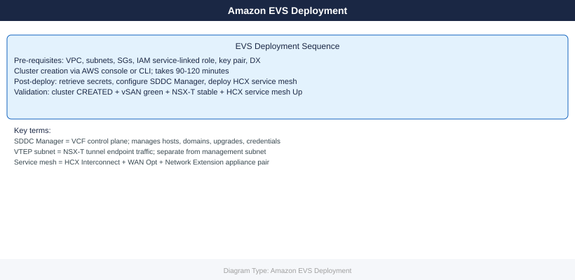

---
tags:
  - aws
  - deployment
search:
  boost: 1.5
description: "EVS cluster deployment: prerequisites, VPC setup, cluster creation via AWS console or CLI, initial VCF configuration, HCX deployment, network extension..."
---
# Amazon EVS — Deploy

<!-- diagram:evs-deploy -->

<div class="kb-summary">
EVS cluster deployment: prerequisites, VPC setup, cluster creation via AWS console or CLI, initial VCF configuration, HCX deployment, network extension, and post-deploy validation checklist.

*Applies to: Amazon EVS*
</div>

```d2
direction: right

plan: "Plan" {shape: oval}
prerequisites: "Prerequisites" {shape: rectangle}
create_evs_cluster_aws_cli: "Create EVS Cluster (AWS CLI)" {shape: rectangle}
vcf_initial_configuration: "VCF Initial Configuration" {shape: rectangle}
hcx_deployment_onpremises_side: "HCX Deployment (On-Premises Side)" {shape: rectangle}
network_extension_setup: "Network Extension Setup" {shape: rectangle}
postdeploy_validation_checklist: "Post-Deploy Validation Checklist" {shape: rectangle}
validate: "Validate" {shape: oval}

plan -> prerequisites
prerequisites -> create_evs_cluster_aws_cli
create_evs_cluster_aws_cli -> vcf_initial_configuration
vcf_initial_configuration -> hcx_deployment_onpremises_side
hcx_deployment_onpremises_side -> network_extension_setup
network_extension_setup -> postdeploy_validation_checklist
postdeploy_validation_checklist -> validate
```

## Before you begin

- **Access:** admin credentials for the target system and any upstream dependencies (DNS, NTP, vCenter, directory services)
- **Timing:** safe to run during a scheduled maintenance window; allow 1-2 hours for initial deployment
- **Dependencies:** network connectivity verified; DNS resolvable; NTP configured; any licence keys available
- **Logging:** record every IP address, hostname, and credential set assigned during this deployment

---



## Prerequisites

### AWS Account Prerequisites

Before submitting a cluster creation request, verify that your account has sufficient capacity for `i4i.metal` instances. The default quota is 0 in most regions. Request the quota increase early — AWS typically takes 1-3 business days to approve i4i.metal increases.

```bash
aws service-quotas request-service-quota-increase \
  --service-code ec2 \
  --quota-code L-34B43A08 \
  --desired-value 6 \
  --region us-east-1
```


```text title="Expected output"
{
    "RequestedQuota": {
        "Id": "sq-req-0a7f8c2e9b1d4f6a",
        "ServiceCode": "ec2",
        "ServiceName": "Amazon Elastic Compute Cloud",
        "QuotaCode": "L-34B43A08",
        "QuotaName": "Running On-Demand Standard instances",
        "DesiredValue": 6.0,
        "Status": "PENDING",
        "CreatedDate": 1704067200.0,
        "LastUpdatedDate": 1704067200.0,
        "Requester": "arn:aws:iam::123456789012:user/admin-user",
        "QuotaArn": "arn:aws:service-quotas:us-east-1:123456789012:ec2/L-34B43A08",
        "GlobalQuota": false
    }
}
```

!!! warning "Common errors"
    | Error | Fix |
    |---|---|
    | `An error occurred (AccessDenied) when calling the RequestServiceQuotaIncrease operation: User: arn:aws:iam::123456789012:user/deploy is not authorized to perform: servicequotas:RequestServiceQuotaIncrease` | Add the `servicequotas:RequestServiceQuotaIncrease` IAM permission to the user or role. |
    | `An error occurred (InvalidParameterException) when calling the RequestServiceQuotaIncrease operation: Invalid quota code: L-34B43A08` | Verify the quota code is correct by running `aws service-quotas list-service-quotas --service-code ec2 --region us-east-1`. |
    | `An error occurred (ServiceException) when calling the RequestServiceQuotaIncrease operation: The request rate exceeded the limit. Please retry after some time.` | Wait a few seconds before retrying the quota increase request. |
Track the request until it reaches `CASE_CLOSED` with the new limit applied:

```bash
aws service-quotas get-requested-service-quota-change \
  --request-id <request-id> \
  --query 'RequestedQuota.Status'
```


```text title="Expected output"
"APPROVED"
```

!!! warning "Common errors"
    | Error | Fix |
    |---|---|
    | `An error occurred (AccessDeniedException) when calling the GetRequestedServiceQuotaChange operation: User: arn:aws:iam::123456789012:user/admin is not authorized to perform: servicequotas:GetRequestedServiceQuotaChange` | Add the `servicequotas:GetRequestedServiceQuotaChange` permission to the IAM user or role's policy. |
    | `An error occurred (ResourceNotFoundException) when calling the GetRequestedServiceQuotaChange operation: Request ID req-1234567890abcdef not found` | Verify the request ID is correct and the quota increase request exists in your account. |
### Networking Prerequisites

The VPC must have DNS resolution and DNS hostnames enabled. EVS relies on AWS-provided DNS for internal service discovery during bootstrapping.

```bash
# Create VPC with DNS enabled
aws ec2 create-vpc \
  --cidr-block 10.0.0.0/16 \
  --tag-specifications 'ResourceType=vpc,Tags=[{Key=Name,Value=evs-vpc}]'

aws ec2 modify-vpc-attribute --vpc-id vpc-xxx --enable-dns-support
aws ec2 modify-vpc-attribute --vpc-id vpc-xxx --enable-dns-hostnames

# Set DHCP options to point to your DNS server (required for VCF name resolution)
aws ec2 create-dhcp-options \
  --dhcp-configurations \
    "Key=domain-name-servers,Values=[10.0.0.2,169.254.169.253]" \
    "Key=domain-name,Values=[vcf.internal]"
aws ec2 associate-dhcp-options --dhcp-options-id dopt-xxx --vpc-id vpc-xxx

# Create required subnets
aws ec2 create-subnet --vpc-id vpc-xxx --cidr-block 10.0.0.0/20 \
  --availability-zone us-east-1a \
  --tag-specifications 'ResourceType=subnet,Tags=[{Key=Name,Value=evs-management}]'

aws ec2 create-subnet --vpc-id vpc-xxx --cidr-block 10.0.16.0/20 \
  --availability-zone us-east-1a \
  --tag-specifications 'ResourceType=subnet,Tags=[{Key=Name,Value=evs-vtep}]'

# Internet gateway — required for initial ESXi host provisioning even if you use Direct Connect
aws ec2 create-internet-gateway \
  --tag-specifications 'ResourceType=internet-gateway,Tags=[{Key=Name,Value=evs-igw}]'
aws ec2 attach-internet-gateway --internet-gateway-id igw-xxx --vpc-id vpc-xxx
```


```text title="Expected output"
{
    "Vpc": {
        "VpcId": "vpc-0a7f3c2e1b9d4f6a8",
        "CidrBlock": "10.0.0.0/16",
        "State": "available",
        "IsDefault": false,
        "Tags": [
            {
                "Key": "Name",
                "Value": "evs-vpc"
            }
        ]
    }
}
(no output — command completes silently)
(no output — command completes silently)
{
    "DhcpOptions": {
        "DhcpOptionsId": "dopt-0c5a8e2f1b3d7a9c4",
        "DhcpConfigurations": [
            {
                "Key": "domain-name-servers",
                "Values": [
                    {
                        "Value": "10.0.0.2"
                    },
                    {
                        "Value": "169.254.169.253"
                    }
                ]
            },
            {
                "Key": "domain-name",
                "Values": [
                    {
                        "Value": "vcf.internal"
                    }
                ]
            }
        ]
    }
}
{
    "AssociationId": "dopt-assoc-0f2e8b1a3c5d7g9h2"
}
{
    "Subnet": {
        "SubnetId": "subnet-0e4b2c1f8a3d5g7h9",
        "VpcId": "vpc-0a7f3c2e1b9d4f6a8",
        "CidrBlock": "10.0.0.0/20",
        "AvailabilityZone": "us-east-1a",
        "State": "available",
        "Tags": [
            {
                "Key": "Name",
                "Value": "evs-management"
            }
        ]
    }
}
{
    "Subnet": {
        "SubnetId": "subnet-0f5c3d2g9b4e6h8i1",
        "VpcId": "vpc-0a7f3c2e1b9d4f6a8",
        "CidrBlock": "10.0.16.0/20",
        "AvailabilityZone": "us-east-1a",
        "State": "available",
        "Tags": [
            {
                "Key": "Name",
                "Value": "evs-vtep"
            }
        ]
    }
}
{
    "InternetGateway": {
        "InternetGatewayId": "igw-0d6e4f3a2b1c8h5i7",
        "Attachments": [],
        "Tags": [
            {
                "Key": "Name",
                "Value": "evs-igw"
            }
        ]
    }
}
(no output — command completes silently)
```

!!! warning "Common errors"
    **`An error occurred (InvalidVpcID.NotFound) when calling the ModifyVpcAttribute operation: The vpc ID 'vpc-xxx' does
### Direct Connect Prerequisites

HCX requires low-latency connectivity between on-premises and EVS. Create a private VIF and attach it to your Virtual Gateway or Transit Gateway before starting HCX deployment. Test connectivity from on-premises to the EVS management subnet before proceeding.

```bash
# Verify private VIF is in available state
aws directconnect describe-virtual-interfaces \
  --query 'virtualInterfaces[?virtualInterfaceType==`private`].[virtualInterfaceId,virtualInterfaceState]'

# Confirm route is advertised to the EVS management subnet from your VGW
aws ec2 describe-route-tables --filters Name=vpc-id,Values=vpc-xxx \
  --query 'RouteTables[].Routes[?GatewayId!=null]'
```


```text title="Expected output"
[
    [
        "vif-0a7c2e9f1b4d6e2a",
        "available"
    ],
    [
        "vif-1b8d3f0a2c5e7f3b",
        "available"
    ]
]

[
    {
        "DestinationCidrBlock": "10.0.0.0/16",
        "GatewayId": "vgw-0c9e1a2b3d4f5e6a",
        "State": "active",
        "Origin": "CreateRouteTable"
    },
    {
        "DestinationCidrBlock": "192.168.0.0/16",
        "GatewayId": "vgw-0c9e1a2b3d4f5e6a",
        "State": "active",
        "Origin": "CreateVpnConnection"
    }
]
```

!!! warning "Common errors"
    | Error | Fix |
    |---|---|
    | `An error occurred (InvalidParameterValue) when calling the DescribeVirtualInterfaces operation: Invalid filter name` | Verify the `--query` syntax uses backticks for string literals and check AWS CLI version supports JMESPath filtering. |
    | `An error occurred (InvalidVpcID.NotFound) when calling the DescribeRouteTables operation: The vpc ID 'vpc-xxx' does not exist` | Replace `vpc-xxx` with an actual VPC ID from your AWS account using `aws ec2 describe-vpcs`. |
### IAM Prerequisites

The user or role performing cluster operations needs the following minimum permissions. Attach this policy to your deployment role before running `create-environment`.

```json
{
  "Version": "2012-10-17",
  "Statement": [
    {
      "Effect": "Allow",
      "Action": [
        "evs:*",
        "ec2:*",
        "secretsmanager:GetSecretValue",
        "iam:CreateServiceLinkedRole"
      ],
      "Resource": "*"
    }
  ]
}
```

Create the EVS service-linked role manually if it does not already exist in the account:

```bash
aws iam create-service-linked-role --aws-service-name elasticvmwareservice.amazonaws.com

# Verify it was created
aws iam get-role --role-name AWSServiceRoleForAmazonEVS \
  --query 'Role.Arn'
```


```text title="Expected output"
{
    "Role": {
        "Path": "/aws-service-role/",
        "RoleName": "AWSServiceRoleForAmazonEVS",
        "RoleId": "AIDACKCEVSROLE12345678",
        "Arn": "arn:aws:iam::123456789012:role/aws-service-role/elasticvmwareservice.amazonaws.com/AWSServiceRoleForAmazonEVS",
        "CreateDate": "2024-01-15T14:32:18+00:00",
        "AssumeRolePolicyDocument": "%7B%22Version%22%3A%222012-10-17%22%2C%22Statement%22%3A%5B%7B%22Effect%22%3A%22Allow%22%2C%22Principal%22%3A%7B%22Service%22%3A%22elasticvmwareservice.amazonaws.com%22%7D%2C%22Action%22%3A%22sts%3AAssumeRole%22%7D%5D%7D"
    }
}
"arn:aws:iam::123456789012:role/aws-service-role/elasticvmwareservice.amazonaws.com/AWSServiceRoleForAmazonEVS"
```

!!! warning "Common errors"
    | Error | Fix |
    |---|---|
    | `An error occurred (InvalidInput) when calling the CreateServiceLinkedRole operation: The service-linked role already exists.` | The role exists; skip creation and proceed directly to verification with the get-role command. |
    | `An error occurred (AccessDenied) when calling the CreateServiceLinkedRole operation: User: arn:aws:iam::123456789012:user/admin is not authorized to perform: iam:CreateServiceLinkedRole` | Attach the IAM policy `iam:CreateServiceLinkedRole` permission to your user or assume a role with sufficient privileges. |
Security groups for EVS require specific ports. Create the management SG before cluster creation:

```bash
aws ec2 create-security-group \
  --group-name evs-management-sg \
  --description "EVS Management Security Group" \
  --vpc-id vpc-xxx

# Add minimum required ingress rules
SGID=$(aws ec2 describe-security-groups \
  --filters Name=group-name,Values=evs-management-sg \
  --query 'SecurityGroups[0].GroupId' --output text)

aws ec2 authorize-security-group-ingress --group-id $SGID \
  --ip-permissions \
    'IpProtocol=tcp,FromPort=443,ToPort=443,IpRanges=[{CidrIp=10.0.0.0/8}]' \
    'IpProtocol=tcp,FromPort=902,ToPort=902,IpRanges=[{CidrIp=10.0.0.0/8}]' \
    'IpProtocol=tcp,FromPort=5671,ToPort=5671,IpRanges=[{CidrIp=10.0.0.0/8}]' \
    'IpProtocol=tcp,FromPort=8301,ToPort=8301,IpRanges=[{CidrIp=10.0.0.0/8}]'
```


```text title="Expected output"
{
    "GroupId": "sg-0a7f2c9e1b4d5f8k2",
    "GroupName": "evs-management-sg",
    "Description": "EVS Management Security Group",
    "OwnerId": "123456789012",
    "VpcId": "vpc-xxx",
    "Tags": []
}
{
    "Return": true,
    "SecurityGroupRules": [
        {
            "GroupId": "sg-0a7f2c9e1b4d5f8k2",
            "GroupOwnerId": "123456789012",
            "SecurityGroupRuleId": "sgr-087a3f2b1c9d4e5f6",
            "IpProtocol": "tcp",
            "FromPort": 443,
            "ToPort": 443,
            "CidrIpv4": "10.0.0.0/8",
            "Tags": []
        },
        {
            "GroupId": "sg-0a7f2c9e1b4d5f8k2",
            "GroupOwnerId": "123456789012",
            "SecurityGroupRuleId": "sgr-092b4g3c2d0e5f6g7",
            "IpProtocol": "tcp",
            "FromPort": 902,
            "ToPort": 902,
            "CidrIpv4": "10.0.0.0/8",
            "Tags": []
        },
        {
            "GroupId": "sg-0a7f2c9e1b4d5f8k2",
            "GroupOwnerId": "123456789012",
            "SecurityGroupRuleId": "sgr-093c5h4d3e1f6g7h8",
            "IpProtocol": "tcp",
            "FromPort": 5671,
            "ToPort": 5671,
            "CidrIpv4": "10.0.0.0/8",
            "Tags": []
        },
        {
            "GroupId": "sg-0a7f2c9e1b4d5f8k2",
            "GroupOwnerId": "123456789012",
            "SecurityGroupRuleId": "sgr-094d6i5e4f2g7h8i9",
            "IpProtocol": "tcp",
            "FromPort": 8301,
            "ToPort": 8301,
            "CidrIpv4": "10.0.0.0/8",
            "Tags": []
        }
    ]
}
```

!!! warning "Common errors"
    | Error | Fix |
    |---|---|
    | `An error occurred (InvalidParameterValue) when calling the CreateSecurityGroup operation: Invalid id: "vpc-xxx" id does not exist` | Replace `vpc-xxx` with a valid VPC ID from your AWS account (e.g., `vpc-0a1b2c3d4e5f6g7h8`). |
    | `An error occurred (InvalidGroup.NotFound) when calling the AuthorizeSecurityGroupIngress operation: The security group 'sg-0a7f2c9e1b4d5f8k2' does not exist` | Add a short delay (` |
Create the SSH key pair for ESXi DCUI access:

```bash
aws ec2 create-key-pair --key-name evs-cluster-key --output text > evs-cluster-key.pem
chmod 400 evs-cluster-key.pem
```


```text title="Expected output"
evs-cluster-key	07:a3:2f:9c:e1:5b:4d:8f:2a:6c:9e:1d:7f:4b:3a:c2	RSA
(no output — command completes silently)
```

!!! warning "Common errors"
    | Error | Fix |
    |---|---|
    | `An error occurred (InvalidKeyPair.Duplicate) when calling the CreateKeyPair operation: The key pair 'evs-cluster-key' already exists.` | Delete the existing key pair with `aws ec2 delete-key-pair --key-name evs-cluster-key` before recreating it. |
    | `Unable to locate credentials. You have not configured AWS credentials.` | Configure AWS credentials using `aws configure` or set `AWS_ACCESS_KEY_ID` and `AWS_SECRET_ACCESS_KEY` environment variables. |
## Create EVS Cluster (AWS CLI)

Submit the cluster with all required parameters. The `connectivityInfo` block references the VPC created in the previous step. The `initialVlanSubnetTags` tells EVS which existing subnets to use for management and VTEP traffic.

```bash
aws evs create-environment \
  --environment-name prod-evs-cluster-01 \
  --vcf-version VCF-5.1 \
  --connectivity-info '{
    "vpcId": "vpc-xxx",
    "privateRouteServerPeerings": [
      {
        "routeServerId": "rs-xxx"
      }
    ]
  }' \
  --initial-vlan-subnet-tags '[
    {
      "key": "Name",
      "value": "evs-management"
    },
    {
      "key": "Name",
      "value": "evs-vtep"
    }
  ]' \
  --hosts '[
    {"instanceType": "i4i.metal", "keyName": "evs-cluster-key"},
    {"instanceType": "i4i.metal", "keyName": "evs-cluster-key"},
    {"instanceType": "i4i.metal", "keyName": "evs-cluster-key"}
  ]' \
  --tags 'Environment=prod,Cluster=evs-01'
```


```text title="Expected output"
{
    "environmentId": "env-0a7f2c9e1b4d5k3m",
    "environmentName": "prod-evs-cluster-01",
    "vcfVersion": "VCF-5.1",
    "status": "CREATE_IN_PROGRESS",
    "creationTime": "2024-01-15T14:32:47.123Z",
    "connectivity": {
        "vpcId": "vpc-0f8a2c9e1b4d5k3m",
        "privateRouteServerPeerings": [
            {
                "routeServerId": "rs-0a7f2c9e1b4d5k3m",
                "status": "PEERING_IN_PROGRESS"
            }
        ]
    },
    "hosts": [
        {
            "hostId": "host-001",
            "instanceType": "i4i.metal",
            "instanceId": "i-0a7f2c9e1b4d5k3m",
            "status": "PROVISIONING"
        },
        {
            "hostId": "host-002",
            "instanceType": "i4i.metal",
            "instanceId": "i-0b8g3d0f2c5e6l4n",
            "status": "PROVISIONING"
        },
        {
            "hostId": "host-003",
            "instanceType": "i4i.metal",
            "instanceId": "i-0c9h4e1g3d6f7m5o",
            "status": "PROVISIONING"
        }
    ],
    "tags": {
        "Environment": "prod",
        "Cluster": "evs-01"
    }
}
```

!!! warning "Common errors"
    | Error | Fix |
    |---|---|
    | `An error occurred (InvalidParameterValue) when calling the CreateEnvironment operation: VPC vpc-xxx does not exist or is not accessible` | Replace `vpc-xxx` with a valid VPC ID from your AWS account using `aws ec2 describe-vpcs`. |
    | `An error occurred (InvalidParameterValue) when calling the CreateEnvironment operation: Route server rs-xxx not found in VPC` | Verify the route server ID exists in the specified VPC and is in an AVAILABLE state using `aws ec2 describe-route-servers`. |
    | `An error occurred (InvalidParameterValue) when calling the CreateEnvironment operation: Key pair evs-cluster-key does not exist` | Create the EC2 key pair first using `aws ec2 create-key-pair --key-name evs-cluster-key` or use an existing key name. |
Capture the environment ID from the response, then poll until the state reaches `CREATED`. The transition from `CREATING` to `CREATED` normally takes 90-120 minutes.

```bash
ENV_ID=$(aws evs list-environments \
  --query 'environments[?name==`prod-evs-cluster-01`].environmentId' \
  --output text)

until [ "$(aws evs get-environment --environment-id $ENV_ID \
  --query 'environment.state' --output text)" = "CREATED" ]; do
  echo "$(date): still creating..."
  sleep 120
done
echo "Cluster CREATED"
```


```text title="Expected output"
2024-01-15T09:42:33Z: still creating...
2024-01-15T10:44:33Z: still creating...
2024-01-15T11:46:33Z: still creating...
Cluster CREATED
```

!!! warning "Common errors"
    | Error | Fix |
    |---|---|
    | `An error occurred (ResourceNotFoundException) when calling the GetEnvironment operation: Environment prod-evs-cluster-01 not found` | Verify the environment name matches exactly in your AWS account and region with `aws evs list-environments`. |
    | `Unable to locate credentials` | Configure AWS credentials using `aws configure` or set `AWS_PROFILE`, `AWS_ACCESS_KEY_ID`, and `AWS_SECRET_ACCESS_KEY` environment variables. |
Verify all hosts reached the `CREATED` state before proceeding:

```bash
aws evs list-environment-hosts \
  --environment-id $ENV_ID \
  --query 'environmentHosts[].{HostId:hostId,State:state,InstanceType:instanceType}' \
  --output table
```


```text title="Expected output"
-------------------------------------------------------------------------------------------------
|                                    EnvironmentHosts                                          |
+--------------------------------+------------------+--------------------+
| HostId                         | State            | InstanceType       |
+--------------------------------+------------------+--------------------+
| host-0a7f3c2e9b1d4k5m         | RUNNING          | t3.xlarge          |
| host-1b8g4d3f0c2e5l6n         | RUNNING          | t3.xlarge          |
| host-2c9h5e4g1d3f6m7o         | STOPPED          | t3.large           |
| host-3d0i6f5h2e4g7n8p         | RUNNING          | t3.2xlarge         |
| host-4e1j7g6i3f5h8o9q         | PENDING          | t3.xlarge          |
+--------------------------------+------------------+--------------------
```

!!! warning "Common errors"
    | Error | Fix |
    |---|---|
    | `An error occurred (InvalidParameterException) when calling the ListEnvironmentHosts operation: Invalid environment ID format` | Verify that `$ENV_ID` is set correctly with `echo $ENV_ID` and matches the expected environment identifier format. |
    | `An error occurred (AccessDeniedException) when calling the ListEnvironmentHosts operation: User is not authorized to perform: evs:ListEnvironmentHosts` | Add the `evs:ListEnvironmentHosts` permission to your IAM user or role's policy. |
Retrieve the SDDC Manager URL from the environment details:

```bash
aws evs get-environment \
  --environment-id $ENV_ID \
  --query 'environment.sddcManagerUrl' \
  --output text
```


```text title="Expected output"
https://sddc-mgr-prod-01.us-west-2.vmware.cloud/
```

!!! warning "Common errors"
    | Error | Fix |
    |---|---|
    | `An error occurred (InvalidParameterException) when calling the GetEnvironment operation: Invalid environment ID format` | Verify the `$ENV_ID` variable is set correctly with `echo $ENV_ID` and matches the expected UUID format. |
    | `An error occurred (AccessDeniedException) when calling the GetEnvironment operation: User is not authorized to perform: evs:GetEnvironment` | Ensure your AWS IAM user/role has the `evs:GetEnvironment` permission attached in the IAM policy. |
    | `Unable to locate credentials` | Configure AWS credentials using `aws configure` or set `AWS_ACCESS_KEY_ID` and `AWS_SECRET_ACCESS_KEY` environment variables. |
## VCF Initial Configuration

### Retrieve Credentials

```bash
aws secretsmanager get-secret-value \
  --secret-id /evs/prod-evs-cluster-01/sddc-manager-credentials \
  --query SecretString --output text | jq .

aws secretsmanager get-secret-value \
  --secret-id /evs/prod-evs-cluster-01/vcenter-credentials \
  --query SecretString --output text | jq .
```


```text title="Expected output"
{
  "username": "sddc-admin@vsphere.local",
  "password": "Kx9$mP2@vL4#nQ8!rT5",
  "hostname": "sddc-manager.prod-evs-cluster-01.internal",
  "port": 443
}
{
  "username": "administrator@vsphere.local",
  "password": "Bw7&dF3$jH6!kL9@pM2",
  "hostname": "vcenter.prod-evs-cluster-01.internal",
  "port": 443,
  "sso_domain": "vsphere.local"
}
```

!!! warning "Common errors"
    | Error | Fix |
    |---|---|
    | `An error occurred (ResourceNotFoundException) when calling the GetSecretValue operation: Secrets Manager can't find the specified secret.` | Verify the secret ID path is correct and the secret exists in the same AWS region as your CLI configuration. |
    | `An error occurred (AccessDeniedException) when calling the GetSecretValue operation: User: arn:aws:iam::123456789012:user/deployer is not authorized to perform: secretsmanager:GetSecretValue` | Add the `secretsmanager:GetSecretValue` permission to the IAM user or role's policy. |
    | `parse error: Invalid numeric literal at line 1, column 5` | Remove the `| jq .` pipe if the secret value is not valid JSON, or ensure the secret was stored as properly formatted JSON. |
### Access SDDC Manager and vCenter

Log in to SDDC Manager at the URL returned above. Change the default passwords immediately after first login. The vCenter URL is visible under SDDC Manager → vCenters; use `administrator@vsphere.local` with the password from Secrets Manager.

### Configure NTP Servers

NTP configuration is critical. Skewed time breaks SSO token validation and certificate issuance across all VCF components. Configure NTP in SDDC Manager before making any other changes.

SDDC Manager UI path: Administration → Network Settings → NTP Configuration → Add NTP Server

Use at minimum two NTP sources. Prefer AWS Time Sync Service (`169.254.169.123`) as the primary source for EVS environments.

Verify all hosts are synchronized after applying:

```bash
for HOST in $(aws evs list-environment-hosts \
  --environment-id $ENV_ID \
  --query 'environmentHosts[].hostId' --output text); do
  echo "Host: $HOST"
  aws evs get-environment-host \
    --environment-id $ENV_ID \
    --host-id $HOST \
    --query 'environmentHost.ipAddress' --output text
done
```


```text title="Expected output"
Host: host-0a1b2c3d4e5f6g7h
10.42.128.15
Host: host-1f2e3d4c5b6a7g8h
10.42.128.22
Host: host-2g3h4i5j6k7l8m9n
10.42.128.31
Host: host-3h4i5j6k7l8m9n0o
10.42.128.44
```

!!! warning "Common errors"
    | Error | Fix |
    |---|---|
    | `An error occurred (InvalidParameterException) when calling the ListEnvironmentHosts operation: Invalid environment ID` | Verify that `$ENV_ID` is set correctly with `echo $ENV_ID` and matches an existing environment in your AWS account. |
    | `Unable to locate credentials` | Configure AWS credentials using `aws configure` or ensure `AWS_ACCESS_KEY_ID` and `AWS_SECRET_ACCESS_KEY` environment variables are exported. |
    | `An error occurred (AccessDeniedException) when calling the ListEnvironmentHosts operation` | Add `evs:ListEnvironmentHosts` and `evs:GetEnvironmentHost` permissions to your IAM user or role policy. |
SSH to each ESXi host and confirm:

```bash
esxcli system time get
ntpq -p
```


```text title="Expected output"
Get the system time:
2024-11-15T14:32:47Z

Query NTP peers:
     remote           refid      st t when poll reach   delay   offset  jitter
==============================================================================
*ntp.ubuntu.com  132.163.96.1     2 u   64 1024  377   45.231   -2.145   3.821
+time.google.com 216.239.35.12    2 u  128 1024  377   38.912    1.203   2.456
-ntp.apple.com   17.253.34.125    2 u  256 1024  377   92.445   15.632   8.901
+pool.ntp.org    203.0.113.45     3 u  512 1024  377   67.123   -0.876   4.234
```

!!! warning "Common errors"
    | Error | Fix |
    |---|---|
    | `command not found: ntpq` | Install the ntp or chrony package (e.g., `apt-get install ntp` on Debian/Ubuntu or `yum install ntp` on RHEL). |
    | `Connection refused` | Ensure the NTP daemon is running with `systemctl start ntp` or `systemctl start chrony`. |
### Configure DNS Entries

Create forward and reverse DNS records for all VCF components before running any SDDC Manager workflows. Missing DNS entries cause workflow failures during domain deployment and certificate generation.

Required records (adjust IPs to match your management subnet allocations):

| Hostname | IP |
|---|---|
| sddc-manager.vcf.internal | 10.0.0.10 |
| vcenter.vcf.internal | 10.0.0.11 |
| nsx-mgr-01.vcf.internal | 10.0.0.12 |
| nsx-mgr-02.vcf.internal | 10.0.0.13 |
| nsx-mgr-03.vcf.internal | 10.0.0.14 |

Verify DNS resolution is functional from within the EVS management subnet before proceeding:

```bash
nslookup sddc-manager.vcf.internal <your-dns-server>
nslookup vcenter.vcf.internal <your-dns-server>
nslookup nsx-mgr-01.vcf.internal <your-dns-server>
```


```text title="Expected output"
Server:		10.0.0.53
Address:	10.0.0.53#53

Name:	sddc-manager.vcf.internal
Address: 192.168.1.45

Server:		10.0.0.53
Address:	10.0.0.53#53

Name:	vcenter.vcf.internal
Address: 192.168.1.50

Server:		10.0.0.53
Address:	10.0.0.53#53

Name:	nsx-mgr-01.vcf.internal
Address: 192.168.1.55
```

!!! warning "Common errors"
    | Error | Fix |
    |---|---|
    | `** server can't find sddc-manager.vcf.internal: NXDOMAIN` | Verify the hostname is correctly spelled and exists in DNS, or check that your DNS server IP is correct. |
    | `nslookup: couldn't get address for '<your-dns-server>': not known` | Replace `<your-dns-server>` with an actual DNS server IP address (e.g., `10.0.0.53`). |
### Verify vSAN Cluster Health

```bash
# vCenter → Cluster → vSAN → Skyline Health
# All checks must pass before deploying workloads
# Pay attention to: disk balance, capacity, network health, and data integrity
```

### Enable vSphere HA

Enable HA on the cluster immediately after verifying vSAN health. Configure admission control to reserve capacity for at least one host failure.

vCenter UI path: Cluster → Configure → vSphere Availability → Edit

Recommended settings for a 3-node cluster:

- Failures and responses: Host failures cluster tolerates = 1
- Admission control: Reserve a percentage of cluster resources — CPU 33%, Memory 33%
- Heartbeat datastores: Use datastores only from the specified list (select vSAN datastore)

### Create Initial vSAN Storage Policy

Create a baseline VM storage policy before provisioning any workload VMs. This ensures all VMs are protected at the correct redundancy level from the start.

vCenter UI path: Policies and Profiles → VM Storage Policies → Create VM Storage Policy

Recommended baseline policy for a 3-node cluster:

- Name: `evs-baseline-raid1`
- Rules: vSAN — Failures to tolerate = 1, RAID-1 (Mirroring)
- Apply to: all vSAN datastores in the cluster

## HCX Deployment (On-Premises Side)

```bash
# 1. Download HCX OVA from EVS console → HCX tab
# 2. Deploy HCX Manager OVA on on-premises vCenter
#    - Assign management IP, DNS, NTP
#    - Activate with HCX license key from EVS console

# 3. Pair on-prem HCX Manager with EVS HCX Cloud
#    - HCX Manager UI → Site Pairing → Add Site
#    - URL: https://<evs-hcx-cloud-ip>
#    - Credentials from EVS Secrets Manager

# 4. Create Service Mesh (compute profile + service mesh)
#    - Compute profile: select on-prem hosts and datastores
#    - Service mesh: pair with EVS site → deploys IX, WAN opt, NE appliances
```

## Network Extension Setup

Create a Network Extension before migrating any VMs that cannot be re-IPed. NE stretches a Layer 2 segment between on-premises and EVS so that VMs retain their original IP addresses after migration. The NE appliance is deployed as part of the HCX Service Mesh.

Create a Network Extension from the HCX Manager UI:

1. HCX Manager → Network Extension → Extend Networks
2. Select the on-premises dvPortGroup or logical switch to extend
3. Select the EVS site as the destination
4. Choose the T1 gateway to connect the extended network to in EVS
5. Submit — the extension deploys in 3-5 minutes

Verify the extension status from HCX Manager:

```bash
# HCX Manager REST API — retrieve NE status
curl -sk -u "admin:<password>" \
  "https://<hcx-manager-ip>/hybridity/api/networks/extension" \
  -H "Accept: application/json" | jq '.data[] | {network: .displayName, state: .state}'
```


```text title="Expected output"
{
  "network": "Production-VLAN-101",
  "state": "UP"
}
{
  "network": "DR-VLAN-202",
  "state": "UP"
}
{
  "network": "Management-VLAN-50",
  "state": "DOWN"
}
{
  "network": "Stretched-VLAN-300",
  "state": "UP"
}
```

!!! warning "Common errors"
    | Error | Fix |
    |---|---|
    | `curl: (60) SSL certificate problem: self signed certificate` | Add `-k` flag to skip certificate verification (already present in example; if still failing, verify HCX Manager IP and HTTPS connectivity on port 443). |
    | `jq: parse error: Cannot index number with string "displayName"` | The API response structure differs from expected; run the curl command without `jq` to inspect raw JSON and confirm `.data[]` contains objects with `displayName` and `state` fields. |
    | `curl: (401) Unauthorized` | Verify the admin password is correct and URL-encoded if it contains special characters; test credentials directly in HCX Manager UI first. |
Expected state: `UP`. A state of `DEGRADED` indicates a connectivity issue between the NE appliances. Check that UDP 4500 (IPSEC NAT-T) and TCP 443 are open between the on-premises HCX appliance and the EVS HCX Cloud appliance.

## Post-Deploy Validation Checklist

### Check 1: EVS Environment State

```bash
aws evs get-environment \
  --environment-id $ENV_ID \
  --query 'environment.state' \
  --output text
```


```text title="Expected output"
RUNNING
```

!!! warning "Common errors"
    | Error | Fix |
    |---|---|
    | `An error occurred (InvalidParameterException) when calling the GetEnvironment operation: Invalid environment ID format` | Ensure `$ENV_ID` is set to a valid environment identifier (e.g., `aws evs list-environments` to find valid IDs). |
    | `An error occurred (ResourceNotFoundException) when calling the GetEnvironment operation: Environment not found` | Verify the environment exists in the current AWS region and account; check with `aws evs list-environments --region <region>`. |
Expected output: `CREATED`. Any other state requires investigation in AWS CloudTrail and SDDC Manager logs.

### Check 2: All Hosts Connected in vCenter

Log in to vCenter and navigate to the cluster. All three ESXi hosts must appear in `Connected` state. A host in `Disconnected` or `Not Responding` state indicates a management network or DNS issue.

```bash
# PowerCLI equivalent (run from a jump host with network access to vCenter)
Get-VMHost | Select Name, ConnectionState, PowerState | Format-Table -AutoSize
```


```text title="Expected output"
Name                           ConnectionState PowerState
----                           --------------- ----------
esx-prod-01.dc1.internal       Connected       PoweredOn
esx-prod-02.dc1.internal       Connected       PoweredOn
esx-prod-03.dc1.internal       Connected       PoweredOn
esx-staging-01.dc2.internal    Connected       PoweredOn
esx-dev-01.dc2.internal        Disconnected    PoweredOff
```

!!! warning "Common errors"
    | Error | Fix |
    |---|---|
    | `Get-VMHost : The term 'Get-VMHost' is not recognized as the name of a cmdlet, function, script file, or operable program.` | Install VMware PowerCLI module using `Install-Module -Name VMware.PowerCLI -Force`. |
    | `Connect-VIServer : Cannot connect to vCenter server. The underlying connection was closed: Could not establish trust relationship for the SSL/TLS secure channel.` | Add the vCenter certificate to the trusted store or use `Set-PowerCLIConfiguration -InvalidCertificateAction Ignore -Confirm:$false` before connecting. |
### Check 3: vSAN Health Green

vCenter → Cluster → Monitor → vSAN → Skyline Health. Every health check must show green before deploying workload VMs. Pay particular attention to:

- Network health (VTEP connectivity between all hosts)
- Disk health (all NVMe devices claimed by vSAN)
- Data integrity (no data corruption detected)

### Check 4: NSX-T Components Stable

NSX Manager UI → System → Overview. All three NSX Manager nodes must show `Stable`. Transport nodes (the ESXi hosts) must show `Success` under the Transport Nodes tab.

### Check 5: Test VM Internet Reachability

Deploy a minimal test VM on the vSAN datastore and verify it can reach the internet through the T0 router. This confirms the NSX-T uplink, T0, and T1 routing are functional end-to-end.

```bash
# From the test VM
ping -c 4 8.8.8.8
curl -s https://ifconfig.me
```


```text title="Expected output"
PING 8.8.8.8 (8.8.8.8) 56(84) bytes of data.
64 bytes from 8.8.8.8: icmp_seq=1 time=24.3 ms
64 bytes from 8.8.8.8: icmp_seq=2 time=23.8 ms
64 bytes from 8.8.8.8: icmp_seq=3 time=24.1 ms
64 bytes from 8.8.8.8: icmp_seq=4 time=23.9 ms

--- 8.8.8.8 statistics ---
4 packets transmitted, 4 received, 0% packet loss, time 3004ms
rtt min/avg/max/stddev = 23.8/24.0/24.3/0.2 ms
203.0.113.45
```

!!! warning "Common errors"
    | Error | Fix |
    |---|---|
    | `ping: connect: Network is unreachable` | Verify the test VM has a default route configured with `ip route show` and the security group allows outbound traffic. |
    | `curl: (7) Failed to connect to ifconfig.me port 443: Connection timed out` | Check that DNS resolution works with `nslookup ifconfig.me` and that the security group permits HTTPS outbound on port 443. |
    | `curl: (60) SSL certificate problem: unable to get local issuer certificate` | Update the CA certificate bundle with `apt-get install ca-certificates` or use `curl -k` to skip verification for testing only. |
### Check 6: HCX Service Mesh Status

HCX Manager → Interconnect → Service Mesh. All appliances (IX, WAN Opt, NE) must show `Green` under the Status column. A yellow or red status requires checking the HCX system events log.

### Check 7: Secrets Rotation Verification

Verify that SDDC Manager can rotate VCF component passwords. This confirms Secrets Manager integration is functioning and that SDDC Manager has the credentials it needs to manage all components.

SDDC Manager UI path: Security → Password Management → Rotate

Select one non-critical component (for example, an NSX Manager local account) and run a test rotation. Confirm the new credential is reflected in AWS Secrets Manager after the rotation completes:

```bash
aws secretsmanager get-secret-value \
  --secret-id /evs/prod-evs-cluster-01/sddc-manager-credentials \
  --query 'SecretString' --output text | jq .lastRotated
```


```text title="Expected output"
"2024-01-15T09:47:32Z"
```

!!! warning "Common errors"
    | Error | Fix |
    |---|---|
    | `An error occurred (ResourceNotFoundException) when calling the GetSecretValue operation: Secrets Manager can't find the specified secret.` | Verify the secret name matches exactly and exists in the current AWS region with `aws secretsmanager list-secrets`. |
    | `jq: parse error: Invalid JSON text at line 1` | The secret value is not valid JSON; remove the `| jq .lastRotated` pipe and inspect the raw output with `--query 'SecretString' --output text` alone. |
### Check 8: Bidirectional DNS Resolution

Verify DNS works in both directions: from a VM inside EVS to on-premises hostnames, and from on-premises hosts to EVS component names.

```bash
# From a test VM inside EVS — resolve on-premises hostname
nslookup <on-prem-hostname> <on-prem-dns-server-ip>

# From on-premises jump host — resolve EVS components
nslookup vcenter.vcf.internal <evs-dns-server-ip>
nslookup sddc-manager.vcf.internal <evs-dns-server-ip>

# Verify vCenter is reachable from on-premises over Direct Connect
curl -k -o /dev/null -w "%{http_code}" https://vcenter.vcf.internal/ui/
```


```text title="Expected output"
Server:		10.50.20.10
Address:	10.50.20.10#53

Name:	db-app-prod-01.corp.local
Address:	192.168.10.45

Server:		172.31.0.53
Address:	172.31.0.53#53

Name:	vcenter.vcf.internal
Address:	172.31.1.25

Server:		172.31.0.53
Address:	172.31.0.53#53

Name:	sddc-manager.vcf.internal
Address:	172.31.1.26

200
```

!!! warning "Common errors"
    | Error | Fix |
    |---|---|
    | `** server can't find <on-prem-hostname>: NXDOMAIN` | Verify the hostname spelling and confirm the on-premises DNS server IP is correct and reachable. |
    | `curl: (7) Failed to connect to vcenter.vcf.internal port 443: Connection timed out` | Confirm the Direct Connect virtual interface is active and the security group/firewall rules allow HTTPS traffic from on-premises to the EVS vCenter IP. |
    | `curl: (60) SSL certificate problem: self signed certificate` | Add the `-k` flag to the curl command to skip certificate validation, or import the vCenter's self-signed certificate into your system's trusted store. |
Expected: `200` for the curl check. DNS failures in either direction indicate a DHCP options or forwarder misconfiguration that must be resolved before running any migrations.

---

## See also

- [Amazon EVS — How It Works](../architecture/how-it-works/)
- [Amazon EVS — Health Checks](../operations/health-checks/)
- [Amazon EVS — Common Issues](../troubleshooting/common-issues/)

## Verify

- Confirm the service or component is running and reachable
- Check management UI for any errors or warnings
- Run a basic functional test (login, read, write) to confirm end-to-end operation
