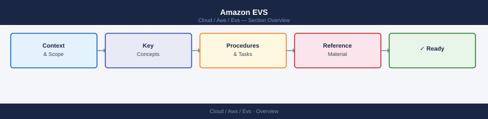

---
tags:
  - aws
---
# Amazon EVS

<!-- diagram:evs -->

<div class="kb-summary">
Amazon Elastic VMware Service (EVS): VMware Cloud Foundation on AWS bare-metal — vSphere, vSAN, NSX-T, and HCX running natively on dedicated EC2 bare-metal instances in your VPC.

*Applies to: Amazon EVS*
</div>



```text
┌───────────────────────────────── Amazon EVS — Elastic VMware Service ─────────────────────────────────┐
│                                                                                                       │
│   ┌───────────────────────────────────────────────────────────────────────────────────────────────┐   │
│   │                              Amazon Elastic VMware Service (EVS)                              │   │
│   │         VMware Cloud Foundation (VCF) running on dedicated bare-metal EC2 in your VPC         │   │
│   │             Hosts: i4i.metal / i3en.metal; ESXi installed by AWS; vSAN HCI storage            │   │
│   │              Network: OVN via NSX-T overlay on ENIs; T0 BGP to VPC routing tables             │   │
│   │          Migration: HCX vMotion / bulk migration from on-premises; no re-IP required          │   │
│   └───────────────────────────────────────────────────────────────────────────────────────────────┘   │
│                                                                                                       │
│    Control plane and storage are VCF-managed; host lifecycle is AWS-managed                           │
│                                                                                                       │
│                          ▼                                                 ▼                          │
│                                                                                                       │
│   ┌──────────────────────────────────────────────┐  ┌─────────────────────────────────────────────┐   │
│   │            VCF Management Domain             │  │                  AWS Layer                  │   │
│   │                  SDDC Manager                │  │              Bare-metal EC2 hosts           │   │
│   │                 vCenter Server               │  │              VPC + subnets + ENIs           │   │
│   │             NSX-T Manager (3-node)           │  │              Direct Connect / TGW           │   │
│   │            vSAN (NVMe disk groups)           │  │              S3, KMS, Secrets Mgr           │   │
│   └──────────────────────────────────────────────┘  └─────────────────────────────────────────────┘   │
│                                                                                                       │
│                      │                  │                   │                  │                      │
│                                                                                                       │
│   ┌──────────────────────────────────────────────┐  ┌─────────────────────────────────────────────┐   │
│   │                   Security                   │  │           Migration & Connectivity          │   │
│   │            IAM roles (cluster mgmt)          │  │          HCX: vMotion + bulk migrate        │   │
│   │             vSphere RBAC + SSO/AD            │  │         Network Extension (L2 stretch)      │   │
│   │            NSX-T DFW micro-segment           │  │           DX private VIF to EVS VPC         │   │
│   │             vSAN encryption (KMS)            │  │          Transit Gateway (multi-VPC)        │   │
│   └──────────────────────────────────────────────┘  └─────────────────────────────────────────────┘   │
│                                                                                                       │
│    Key terms:                                                                                         │
│    EVS         = Amazon Elastic VMware Service; managed VCF on dedicated bare-metal EC2               │
│    i4i.metal   = Primary EVS host type; 128 vCPU, 1 TB RAM, 30 TB NVMe; supports vSAN ESA             │
│    VCF         = VMware Cloud Foundation; SDDC Manager + vCenter + vSAN + NSX-T stack                 │
│    HCX         = VMware Hybrid Cloud Extension; live + cold VM migration to/from on-prem              │
│    ENI         = Elastic Network Interface; used for NSX-T VTEP and management VMkernels              │
│    DX          = Direct Connect; private 1G or 10G link between on-premises and AWS                   │
│                                                                                                       │
```
<div class="kb-grid">
  <a class="kb-card" href="architecture/">
    <span class="kb-card-title">Architecture</span>
    <span class="kb-card-desc">EVS cluster design, vSAN stretched, NSX-T overlay, VPC integration</span>
  </a>
  <a class="kb-card" href="deploy/">
    <span class="kb-card-title">Deploy</span>
    <span class="kb-card-desc">Cluster deployment, HCX migration, VPC prerequisites, day-0 checklist</span>
  </a>
  <a class="kb-card" href="operations/">
    <span class="kb-card-title">Operations</span>
    <span class="kb-card-desc">Health checks, capacity, vSAN operations, lifecycle management</span>
  </a>
  <a class="kb-card" href="security/">
    <span class="kb-card-title">Security</span>
    <span class="kb-card-desc">IAM integration, vSphere RBAC, NSX-T micro-segmentation, encryption</span>
  </a>
  <a class="kb-card" href="troubleshooting/">
    <span class="kb-card-title">Troubleshooting</span>
    <span class="kb-card-desc">Common failures, host replacement, HCX connectivity, AWS support</span>
  </a>
</div>
