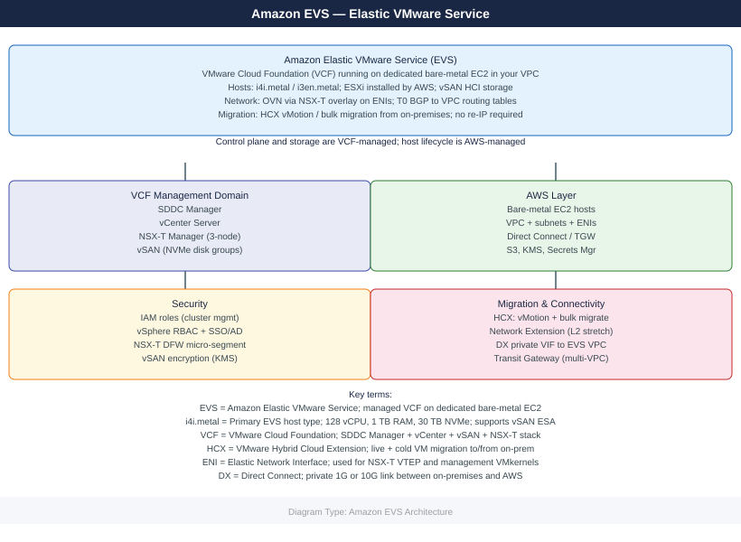

---
tags:
  - aws
---
# Amazon EVS

<!-- diagram:evs -->

Amazon Elastic VMware Service (EVS): VMware Cloud Foundation on AWS bare-metal — vSphere, vSAN, NSX-T, and HCX running natively on dedicated EC2 bare-metal instances in your VPC.

*Applies to: Amazon EVS*

  <a class="kb-card" href="architecture/">
    Architecture
    EVS cluster design, vSAN stretched, NSX-T overlay, VPC integration
  </a>
  <a class="kb-card" href="deploy/">
    Deploy
    Cluster deployment, HCX migration, VPC prerequisites, day-0 checklist
  </a>
  <a class="kb-card" href="operations/">
    Operations
    Health checks, capacity, vSAN operations, lifecycle management
  </a>
  <a class="kb-card" href="security/">
    Security
    IAM integration, vSphere RBAC, NSX-T micro-segmentation, encryption
  </a>
  <a class="kb-card" href="troubleshooting/">
    Troubleshooting
    Common failures, host replacement, HCX connectivity, AWS support
  </a>

