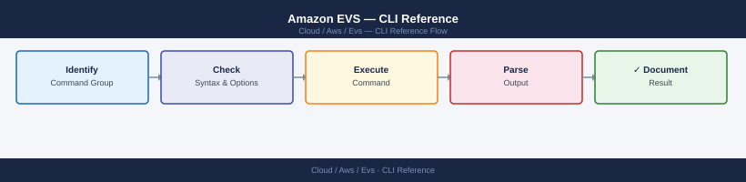

---
tags:
  - aws
  - operations
---
# Amazon EVS — CLI Reference

<div class="kb-summary">
AWS CLI commands for EVS cluster and host management, PowerCLI for vSphere operations, NSX-T REST API for network queries, and HCX API for migration management on EVS bare-metal hosts.

*Applies to: Amazon EVS*
</div>



## Before you begin

- **Access:** Admin credentials on all affected systems
- **Timing:** safe to run during business hours unless a step is marked ⚠ (causes interruption)
- **Dependencies:** no active upgrades or migrations on the same infrastructure
- **Logging:** capture command output — paste into the change record on completion

---

## EVS CLI Quick Reference

| Action | Command |
|---|---|
| List all environments | `aws evs list-environments --output table` |
| Get environment details | `aws evs get-environment --environment-id env-xxx` |
| List hosts in environment | `aws evs list-environment-hosts --environment-id env-xxx --output table` |
| Get a specific host | `aws evs get-environment-host --environment-id env-xxx --host-id host-xxx` |
| Add a host | `aws evs create-environment-host --environment-id env-xxx --host '{...}'` |
| Remove a host | `aws evs delete-environment-host --environment-id env-xxx --host-id host-xxx` |
| List environment VLANs | `aws evs list-environment-vlans --environment-id env-xxx` |
| Create new environment | `aws evs create-environment --cli-input-json file://evs-env.json` |
| Check environment tags | `aws evs list-tags-for-resource --resource-arn arn:aws:evs:...` |
| Update environment tags | `aws evs tag-resource --resource-arn arn:aws:evs:... --tags Key=Env,Value=prod` |

## AWS EVS CLI

### list-environments

```bash
aws evs list-environments \
  --query 'environmentSummaries[*].[environmentId,environmentName,state,createdAt]' \
  --output table
```

Expected output structure:

```text
----------------------------------------------------------
|               ListEnvironments                         |
+----------------+-------------------+---------+---------+
|  env-0a1b2c3d  |  evs-prod-cluster |  ACTIVE | 2024-01 |
|  env-9z8y7x6w  |  evs-dev-cluster  |  ACTIVE | 2024-03 |
+----------------+-------------------+---------+---------+
```

### get-environment

```bash
aws evs get-environment --environment-id env-0a1b2c3d
```

Extract key fields with `--query`:

```bash
aws evs get-environment --environment-id env-0a1b2c3d \
  --query 'environment.{ID:environmentId,Name:environmentName,State:state,VcfVersion:vcfVersion,VPCID:vpcId}' \
  --output table
```

### create-environment

```bash
aws evs create-environment \
  --environment-name evs-prod-cluster \
  --kms-key-id arn:aws:kms:us-east-1:123456789012:key/mrk-xxx \
  --vcf-version VCF-5.1 \
  --connectivity-info '{"privateRouteServerPeerings":[{"routeServerId":"rts-xxx"}]}' \
  --vcf-host-names '["evs-host-01","evs-host-02","evs-host-03","evs-host-04"]' \
  --vcenter-configuration '{"datastoreName":"vsanDatastore","rootPassword":"P@ssw0rd!","vmFolderName":"management-vms"}' \
  --nsx-configuration '{"nsxManagerRootPassword":"P@ssw0rd!","overlaySubnetwork":"192.168.100.0/26"}' \
  --initial-vlans '[{"cidr":"10.0.10.0/24","mtu":9000,"vlanId":10,"vlanType":"vmotionVlan"}]'
```

### create-environment-host

```bash
aws evs create-environment-host \
  --environment-id env-0a1b2c3d \
  --host '{
    "instanceType": "i4i.metal",
    "keyName": "evs-cluster-key",
    "hostName": "evs-host-05",
    "placementGroupId": "pg-xxx"
  }'
```

Expected output:

```json
{
    "host": {
        "hostId": "host-05abcdef",
        "environmentId": "env-0a1b2c3d",
        "instanceType": "i4i.metal",
        "state": "CREATING",
        "createdAt": "2024-06-11T10:00:00Z"
    }
}
```

### list-environment-hosts

```bash
aws evs list-environment-hosts --environment-id env-0a1b2c3d \
  --query 'hostSummaries[*].[hostId,hostName,instanceType,state,createdAt]' \
  --output table
```

Filter only ACTIVE hosts:

```bash
aws evs list-environment-hosts --environment-id env-0a1b2c3d \
  --query 'hostSummaries[?state==`ACTIVE`].[hostId,hostName,instanceType]' \
  --output table
```

### delete-environment-host

Always put the ESXi host in vSphere maintenance mode and verify vSAN BytesToSync is 0 before running this command.

```bash
aws evs delete-environment-host \
  --environment-id env-0a1b2c3d \
  --host-id host-01abcdef
```

Poll until the host is removed:

```bash
watch -n 30 "aws evs list-environment-hosts --environment-id env-0a1b2c3d \
  --query 'hostSummaries[*].[hostId,hostName,state]' --output table"
```

## vSphere PowerCLI

Connect to vCenter before running any PowerCLI commands:

```powershell
Connect-VIServer -Server vcenter.vcf.internal \
  -User administrator@vsphere.local \
  -Password 'P@ssw0rd'
```

### Cluster and Host Queries

```powershell
# All clusters with HA and DRS status
Get-Cluster | Select Name, HAEnabled, DRSEnabled, @{N="Hosts";E={($_ | Get-VMHost).Count}}

# Hosts in a specific cluster
Get-Cluster -Name "EVS-Management-Cluster" | Get-VMHost | `
  Select Name, ConnectionState, PowerState, NumCpu, MemoryTotalGB, MemoryUsageGB

# Hosts filtered by connection state
Get-VMHost | Where-Object { $_.ConnectionState -eq "Connected" } | `
  Select Name, NumCpu, MemoryTotalGB

# Hosts with low free memory (flag those with <10% free)
Get-VMHost | Select Name, MemoryTotalGB, MemoryUsageGB, `
  @{N="MemFreePct";E={[math]::Round((1-($_.MemoryUsageGB/$_.MemoryTotalGB))*100,1)}} | `
  Where-Object { $_.MemFreePct -lt 10 }
```

### VM Queries

```powershell
# All VMs with host and power state
Get-VM | Select Name, PowerState, NumCpu, MemoryGB, @{N="Host";E={$_.VMHost.Name}} | Sort Name

# VMs on a specific datastore
Get-Datastore -Name "vsanDatastore" | Get-VM | Select Name, PowerState, VMHost

# Powered-off VMs only
Get-VM | Where-Object { $_.PowerState -eq "PoweredOff" } | Select Name, VMHost

# VMs by CPU usage (descending)
Get-VM | Where-Object { $_.PowerState -eq "PoweredOn" } | `
  Select Name, @{N="CPUUsageMHz";E={$_.ExtensionData.Summary.QuickStats.OverallCpuUsage}} | `
  Sort CPUUsageMHz -Descending | Select -First 10
```

### Datastore Queries

```powershell
# All datastores with capacity
Get-Datastore | Select Name, Type, CapacityGB, FreeSpaceGB, `
  @{N="UsedGB";E={[math]::Round($_.CapacityGB - $_.FreeSpaceGB,1)}}, `
  @{N="UsedPct";E={[math]::Round((1-($_.FreeSpaceGB/$_.CapacityGB))*100,1)}}

# vSAN datastore free space alert (flag if <20% free)
Get-Datastore -Name "vsanDatastore" | `
  Select Name, CapacityGB, FreeSpaceGB, `
  @{N="FreePct";E={[math]::Round(($_.FreeSpaceGB/$_.CapacityGB)*100,1)}}
```

### vSAN Health and Resync

```powershell
# vSAN cluster health summary
$cluster = Get-Cluster -Name "EVS-Management-Cluster"
$vsanHealth = Get-VsanView -Id "VsanVcClusterHealthSystem-vsan-cluster-health-system"
$result = $vsanHealth.QueryVsanClusterHealthSummary($cluster.Id,$null,$null,$true,$null,$null,"defaultView")
$result.Groups | Select GroupName, GroupHealth

# vSAN disk groups per host
Get-VsanDiskGroup | Select VMHost, `
  @{N="CacheDisks";E={($_.ExtensionData.SSD).Count}}, `
  @{N="CapacityDisks";E={($_.ExtensionData.NonSSD).Count}}

# vSAN resync status (BytesToSync must be 0 before removing a host)
Get-VsanResyncDashboard -Cluster (Get-Cluster "EVS-Management-Cluster") | `
  Select BytesToSync, RecoveryETA
```

### vMotion and Maintenance Mode

```powershell
# Move VM to a specific host (vMotion)
Move-VM -VM "myvm" -Destination (Get-VMHost "evs-host-02.vcf.internal")

# Move all VMs from a host to the cluster (DRS-based placement)
$src = Get-VMHost "evs-host-01.vcf.internal"
Get-VM -Location $src | Move-VM -Destination (Get-Cluster "EVS-Management-Cluster")

# Put host in maintenance mode with vSAN full data evacuation
Set-VMHost -VMHost "evs-host-01.vcf.internal" -State Maintenance -Evacuate $true

# Exit maintenance mode
Set-VMHost -VMHost "evs-host-01.vcf.internal" -State Connected
```

## NSX-T API

Set variables before running curl commands:

```bash
NSX_MANAGER="https://nsx-manager.vcf.internal"
NSX_USER="admin"
NSX_PASS="VMware1!VMware1!"
```

### Cluster Status

```bash
curl -sk -u "${NSX_USER}:${NSX_PASS}" \
  "${NSX_MANAGER}/api/v1/cluster/status" | \
  python3 -c "import sys,json; d=json.load(sys.stdin); \
  [print(f'{k}: {v}') for k,v in d.items() if k in ['control_cluster_status','mgmt_cluster_status']]"
```

### Transport Nodes

```bash
# List all transport nodes
curl -sk -u "${NSX_USER}:${NSX_PASS}" \
  "${NSX_MANAGER}/api/v1/transport-nodes" | \
  python3 -c "
import sys, json
d = json.load(sys.stdin)
for n in d.get('results', []):
    print(n['display_name'], n.get('resource_type',''), n.get('state',''))
"

# Filter Edge Nodes only
curl -sk -u "${NSX_USER}:${NSX_PASS}" \
  "${NSX_MANAGER}/api/v1/transport-nodes?node_types=EdgeNode" | \
  python3 -c "
import sys, json
d = json.load(sys.stdin)
for n in d.get('results', []):
    print(n['display_name'], n.get('state',''))
"

# Filter Host Nodes only
curl -sk -u "${NSX_USER}:${NSX_PASS}" \
  "${NSX_MANAGER}/api/v1/transport-nodes?node_types=HostNode" | \
  python3 -c "
import sys, json
d = json.load(sys.stdin)
for n in d.get('results', []):
    print(n['display_name'], n.get('state',''))
"
```

### Logical Routers

```bash
curl -sk -u "${NSX_USER}:${NSX_PASS}" \
  "${NSX_MANAGER}/api/v1/logical-routers" | \
  python3 -c "
import sys, json
d = json.load(sys.stdin)
for r in d.get('results', []):
    print(r['display_name'], r['router_type'], r.get('high_availability_mode',''))
"
```

### Firewall Sections

```bash
curl -sk -u "${NSX_USER}:${NSX_PASS}" \
  "${NSX_MANAGER}/api/v1/firewall/sections" | \
  python3 -c "
import sys, json
d = json.load(sys.stdin)
for s in d.get('results', []):
    rule_count = s.get('rule_count', 0)
    print(f\"{s['display_name']:<40} rules={rule_count:<5} type={s.get('section_type','')}\")
"
```

## HCX API

Set variables before running HCX commands:

```bash
HCX_MANAGER="https://hcx-cloud.vcf.internal"
HCX_USER="administrator@vsphere.local"
HCX_PASS="P@ssw0rd"
```

Authenticate and get a session token:

```bash
HCX_TOKEN=$(curl -sk -X POST \
  "${HCX_MANAGER}/hybridity/api/sessions" \
  -H "Content-Type: application/json" \
  -d "{\"username\":\"${HCX_USER}\",\"password\":\"${HCX_PASS}\"}" | \
  python3 -c "import sys,json; print(json.load(sys.stdin).get('data',{}).get('token',''))")
```

### Service Mesh Status

```bash
curl -sk -H "x-hm-authorization: ${HCX_TOKEN}" \
  "${HCX_MANAGER}/hybridity/api/interconnect/links" | \
  python3 -c "
import sys, json
d = json.load(sys.stdin)
for link in d.get('data', []):
    print(link.get('displayName',''), link.get('status',''), link.get('endpointType',''))
"
```

### Migration Job Status

```bash
curl -sk -H "x-hm-authorization: ${HCX_TOKEN}" \
  "${HCX_MANAGER}/hybridity/api/vmotion/jobs" | \
  python3 -c "
import sys, json
d = json.load(sys.stdin)
for job in d.get('data', []):
    print(job.get('displayName',''), job.get('state',''), job.get('progressPercent',''), '%')
"
```

### Start a vMotion Migration

```bash
curl -sk -X POST \
  -H "x-hm-authorization: ${HCX_TOKEN}" \
  -H "Content-Type: application/json" \
  "${HCX_MANAGER}/hybridity/api/vmotion" \
  -d '{
    "migrationType": "vMotion",
    "migrations": [
      {
        "srcVM": {
          "objectType": "VirtualMachine",
          "id": "vm-123",
          "name": "myvm"
        },
        "destNetworkMapping": [
          {
            "srcNetwork": { "name": "on-prem-pg" },
            "destNetwork": { "name": "evs-segment-prod" }
          }
        ],
        "destDatastore": { "name": "vsanDatastore" },
        "destFolder": { "name": "Migrated-VMs" },
        "destCluster": { "name": "EVS-Management-Cluster" }
      }
    ]
  }'
```

## esxcli — ESXi Host Diagnostics

SSH to an ESXi host (enable SSH via vCenter or DCUI first):

```bash
ssh root@evs-host-01.vcf.internal
```

```bash
# Storage adapter list
esxcli storage core adapter list

# vSAN disk list on this host
esxcli vsan storage list

# NVMe device list (EVS hosts use NVMe for vSAN cache and capacity)
esxcli nvme device list

# VMkernel interface list
esxcli network ip interface list

# VMkernel routing table
esxcli network ip route list

# vSAN health check from host level
esxcli vsan health cluster list

# Test VMkernel reachability (MTU-aware)
vmkping -I vmk0 <target-ip>
vmkping -I vmk1 <vtep-gateway-ip>   # NSX-T VTEP VMkernel

# Check NVMe device health
esxcli nvme device get -A vmhba1

# List running VMs on this host
vim-cmd vmsvc/getallvms
```

---

## See also

- [Amazon EVS — Procedures](procedures/)
- [Amazon EVS — Scripts](scripts/)
- [Amazon EVS — Health Checks](health-checks/)

## Verify

- Confirm the operation completed without errors in the log or management UI
- Verify the expected state change is visible (service running, object created, config applied)
- Document the outcome in the change record
