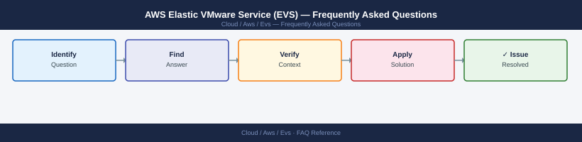

---
tags:
  - aws-evs
  - faq
  - operations
---
# AWS Elastic VMware Service (EVS) — Frequently Asked Questions

Common questions about AWS Elastic VMware Service (EVS) operations, configuration, and troubleshooting. For step-by-step procedures, see the <a href="index.md">Operations</a> section.

## General

**Q: How do I check which vSphere version is running on my EVS cluster?**
A: In the AWS Console, navigate to EVS → Clusters → select the cluster → Details tab. The vSphere and ESXi versions are shown. You can also run `vim-cmd hostsvc/hostsummary` from an ESXi SSH session.

**Q: How do I check the current AWS Elastic VMware Service (EVS) version?**
A: `vim-cmd hostsvc/hostsummary | grep version`

## Configuration

**Q: What is the default SDDC networking model for EVS and when should it change?**
A: EVS uses VMware NSX for overlay networking. The default uses GENEVE encapsulation (requires MTU 1600+). Change the uplink profile MTU if your physical network cannot support jumbo frames.

**Q: How do I enable stretched clusters across two AWS Availability Zones in EVS?**
A: EVS stretched clusters are available in supported regions. Configure a witness host in a third AZ via the AWS Console. Stretched cluster requires Enterprise Plus licensing and NSX Advanced Edge.

## Operations

**Q: How do I upgrade the vSphere components in EVS without downtime?**
A: AWS manages the underlying hardware. vSphere lifecycle upgrades follow the standard VMware vLCM process via the embedded vCenter. Use Maintenance Mode per host; migrate VMs before patching.

**Q: What is the correct procedure to add a new host to an EVS cluster?**
A: In the AWS Console, go to EVS → Clusters → Add Hosts. Select the instance type and count. AWS provisions the hardware and joins it to the cluster. The host appears in vCenter within 30 minutes.

## Troubleshooting

**Q: vCenter shows 'Host not responding' for an EVS host. What does it mean?**
A: Check the host health in the AWS Console. EVS hosts may be temporarily unreachable during AWS infrastructure maintenance. If persistent, use the AWS Console to reboot the host from the EC2 host management page.

**Q: VM performance degraded in EVS — where do I start?**
A: Check vCenter performance charts for CPU ready, memory balloon, and storage latency. Review NSX flow logs for network saturation. Check EBS volume performance for the vSAN datastore if applicable.

## Backup and Recovery

**Q: How often should I back up EVS vCenter configuration?**
A: Enable file-based backup in VCSA (Administration → Backup) on a daily schedule. EVS vCenter is a standard VCSA — the same backup procedures apply. Store backups in an S3 bucket.

**Q: Can I restore a single VM from an EVS backup without restoring the entire vCenter?**
A: Yes — restore via your backup solution (Veeam, AWS Backup for VMware). vCenter itself can be restored from VCSA file-based backup independently of VM workloads.

## See Also

- [AWS Elastic VMware Service (EVS) Operations](index.md)
- [AWS Elastic VMware Service (EVS) Troubleshooting](../../troubleshooting/index.md)
