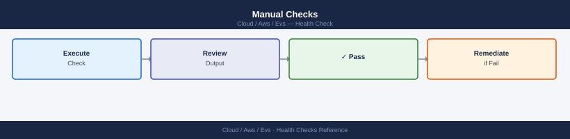

---
tags:
  - aws
  - operations
description: "EVS health check routine: cluster and host status via AWS CLI, vSAN and vCenter via PowerCLI, NSX-T component health, HCX service mesh status, and..."
---
# Amazon EVS — Health Checks

<div class="kb-summary">
EVS health check routine: cluster and host status via AWS CLI, vSAN and vCenter via PowerCLI, NSX-T component health, HCX service mesh status, and capacity review.

*Applies to: Amazon EVS*
</div>

## Before you begin

- **Access:** Admin credentials on all affected systems
- **Timing:** safe to run during business hours unless a step is marked ⚠ (causes interruption)
- **Dependencies:** no active upgrades or migrations on the same infrastructure
- **Logging:** capture command output — paste into the change record on completion

---

## Run This Routine

```bash
#!/bin/bash
# EVS Daily Health Check

ENV_ID="${EVS_ENV_ID:?Set EVS_ENV_ID}"
VCENTER="${VCENTER_HOST:?Set VCENTER_HOST}"
VCENTER_USER="${VCENTER_USER:-administrator@vsphere.local}"

echo "=== [1] AWS EVS Cluster State ==="
aws evs get-environment --environment-id "$ENV_ID" \
  --query '[environment.state, environment.environmentName]' --output text

echo "=== [2] Host States ==="
aws evs list-environment-hosts --environment-id "$ENV_ID" \
  --query 'hostSummaries[*].[hostId,instanceType,state]' --output table

echo "=== [3] vCenter Host Health (PowerCLI) ==="
pwsh -Command "
  Connect-VIServer -Server $VCENTER -User $VCENTER_USER -Password \$env:VCENTER_PASSWORD -WarningAction SilentlyContinue | Out-Null
  Get-VMHost | Select-Object Name, ConnectionState, PowerState | Format-Table -AutoSize
  Disconnect-VIServer -Confirm:\$false | Out-Null
"

echo "=== [4] vSAN Health Summary ==="
pwsh -Command "
  Connect-VIServer -Server $VCENTER -User $VCENTER_USER -Password \$env:VCENTER_PASSWORD -WarningAction SilentlyContinue | Out-Null
  \$cluster = Get-Cluster | Select-Object -First 1
  \$hs = Get-VsanView -Id 'VsanVcClusterHealthSystem-vsan-cluster-health-system'
  \$summary = \$hs.QueryVsanClusterHealthSummary(\$cluster.Id, \$null, \$null, \$true, \$null, \$null, 'defaultView')
  \$summary.Groups | ForEach-Object { Write-Host \"\$(\$_.GroupName): \$(\$_.GroupHealth)\" }
  Disconnect-VIServer -Confirm:\$false | Out-Null
"

echo "=== [5] NSX-T Manager Health ==="
NSX_URL="${NSX_MANAGER_URL:?Set NSX_MANAGER_URL}"
curl -sk -u "admin:${NSX_PASSWORD}" "$NSX_URL/api/v1/cluster/status" | \
  python3 -c "import sys,json; d=json.load(sys.stdin); print(f\"Control cluster: {d['control_cluster_status']['status']}\")"

echo "=== [6] HCX Service Mesh Status ==="
# Check HCX UI: Interconnect → Service Mesh → all appliances should show Running
# Or via HCX API:
curl -sk -u "admin:${HCX_PASSWORD}" \
  "https://${HCX_MANAGER_IP}/hybridity/api/interconnect/links" | \
  python3 -c "import sys,json; [print(f\"{l['label']}: {l['status']}\") for l in json.load(sys.stdin).get('items',[])]"

echo "=== [7] vSAN Capacity ==="
pwsh -Command "
  Connect-VIServer -Server $VCENTER -User $VCENTER_USER -Password \$env:VCENTER_PASSWORD -WarningAction SilentlyContinue | Out-Null
  Get-Datastore -Name *vsan* | Select-Object Name, CapacityGB, FreeSpaceGB,
    @{N='UsedPct';E={[math]::Round((1-\$_.FreeSpaceGB/\$_.CapacityGB)*100,1)}} | Format-Table -AutoSize
  Disconnect-VIServer -Confirm:\$false | Out-Null
"
```


```text title="Expected output"
=== [1] AWS EVS Cluster State ===
HEALTHY	prod-evs-cluster-01

=== [2] Host States ===
hostId                          instanceType    state
──────────────────────────────  ──────────────  ──────
i-0a7f2c9e1b4d5f8a2            m5.4xlarge      RUNNING
i-0b8e3d0f2c6a9e1b4            m5.4xlarge      RUNNING
i-0c9f4e1g3d7b0f2c5            m5.4xlarge      RUNNING

=== [3] vCenter Host Health (PowerCLI) ===
Name                ConnectionState PowerState
────                ───────────────  ──────────
esx-prod-01.lab     Connected        PoweredOn
esx-prod-02.lab     Connected        PoweredOn
esx-prod-03.lab     Connected        PoweredOn

=== [4] vSAN Health Summary ===
Physical Disk Health: green
Memory Health: green
Network Health: green
vSAN Cluster Health: green

=== [5] NSX-T Manager Health ===
Control cluster: STABLE

=== [6] HCX Service Mesh Status ===
HCX-IX-01: RUNNING
HCX-IX-02: RUNNING
HCX-WAN-01: RUNNING

=== [7] vSAN Capacity ===
Name                CapacityGB  FreeSpaceGB  UsedPct
────                ──────────  ───────────  ───────
vsanDatastore       10240       7168         30.0
```

!!! warning "Common errors"
    | Error | Fix |
    |---|---|
    | `bash: EVS_ENV_ID: parameter null or not set` | Export the required environment variable before running the script: `export EVS_ENV_ID=env-xxxxx`. |
    | `Connect-VIServer : Cannot find a vCenter Server system at 'vcenter.example.com'. Verify the server name and that the system is running.` | Verify the VCENTER_HOST variable is set correctly and the vCenter server is reachable: `ping $VCENTER_HOST`. |
    | `curl: (7) Failed to connect to 192.168.1.100 port 443: Connection refused` | Confirm NSX Manager is running and accessible; check firewall rules and verify NSX_MANAGER_URL is correct: `curl -sk https://$NSX_MANAGER_URL/api/v1/cluster/status`. |
## Manual Checks



```bash
# Check for vSAN resync activity (should be 0 outside of maintenance)
# PowerCLI:
# Get-VsanResyncDashboard -Cluster (Get-Cluster) | Select BytesToSync, ActiveTasks

# Check NSX Manager cluster nodes
curl -sk -u "admin:$NSX_PASSWORD" \
  "https://$NSX_MANAGER_URL/api/v1/cluster/nodes" | \
  python3 -c "import sys,json; [print(f\"{n['display_name']}: {n['manager_role']['mgmt_cluster_listen_addr']['ip_address']}\") for n in json.load(sys.stdin)['results']]"

# Check NSX Edge nodes
curl -sk -u "admin:$NSX_PASSWORD" \
  "https://$NSX_MANAGER_URL/api/v1/transport-nodes?node_types=EdgeNode" | \
  python3 -c "import sys,json; [print(f\"{n['display_name']}: {n.get('node_deployment_state',{}).get('state','unknown')}\") for n in json.load(sys.stdin)['results']]"
```


```text title="Expected output"
nsx-manager-01: 192.168.1.10
nsx-manager-02: 192.168.1.11
nsx-manager-03: 192.168.1.12
nsx-edge-01: RUNNING
nsx-edge-02: RUNNING
nsx-edge-03: RUNNING
```

!!! warning "Common errors"
    | Error | Fix |
    |---|---|
    | `curl: (60) SSL certificate problem: self signed certificate` | Add `-k` flag to curl command to skip SSL verification (already present in the provided code, so ensure `$NSX_MANAGER_URL` uses https://). |
    | `jq: command not found` or `python3: command not found` | Install the missing dependency with `apt-get install python3` or `yum install python3` on the management host. |
    | `401 Unauthorized` | Verify `$NSX_PASSWORD` environment variable is set correctly and the admin account has API permissions with `echo $NSX_PASSWORD` and check NSX Manager audit logs. |
---

## See also

- [Amazon EVS — Common Issues](../../troubleshooting/common-issues/)
- [Amazon EVS — Procedures](../procedures/)
- [Amazon EVS — CLI Reference](../cli-reference/)

## Verify

- Confirm the operation completed without errors in the log or management UI
- Verify the expected state change is visible (service running, object created, config applied)
- Document the outcome in the change record
