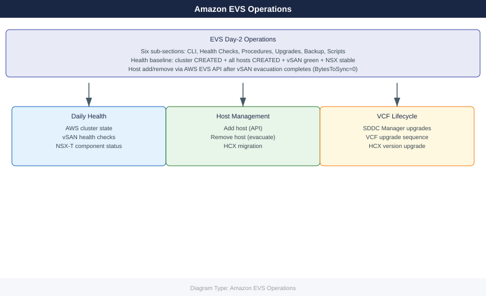

---
tags:
  - aws
  - operations
---
# Amazon EVS — Operations

<!-- diagram:evs-operations -->

EVS day-2 operations: cluster health, host management, vSAN capacity, lifecycle upgrades, backup procedures, and runbook scripts for routine administration.

*Applies to: Amazon EVS*

  <a class="kb-card" href="cli-reference/">
    CLI Reference
    AWS CLI and PowerCLI commands for EVS cluster, host, and vSAN management
  </a>
  <a class="kb-card" href="health-checks/">
    Health Checks
    Run This Routine: cluster, vSAN, NSX-T, HCX, and host health verification
  </a>
  <a class="kb-card" href="procedures/">
    Procedures
    Add/remove hosts, maintenance mode, vSAN rebalance, NSX policy updates
  </a>
  <a class="kb-card" href="install-upgrade/">
    Lifecycle & Upgrades
    VCF upgrades via SDDC Manager, ESXi lifecycle, NSX upgrade sequence
  </a>
  <a class="kb-card" href="backup-restore/">
    Backup & Restore
    SDDC Manager config backup, vCenter DB backup, VM backup to S3
  </a>
  <a class="kb-card" href="scripts/">
    Scripts
    health-check.sh, host-add.sh, vsan-rebalance.sh, hcx-status.sh
  </a>
  <a class="kb-card" href="faq/">
    FAQ
    Frequently asked questions, common issues, and quick answers for day-to-day operations.
  </a>

