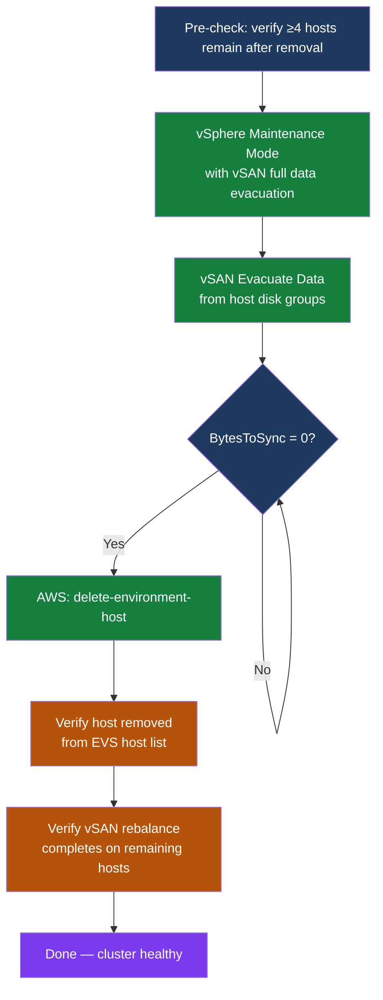

---
tags:
  - aws
  - operations
---
# Amazon EVS — Procedures

<div class="kb-summary">
EVS operational procedures: adding and removing hosts, host replacement, vSAN rebalance, NSX-T segment and edge cluster management, VCF password rotation, vSAN storage policy updates, and HCX migration workflows.
</div>

```text
┌─────────────────────────────────────── Amazon EVS — Procedures ───────────────────────────────────────┐
│                                                                                                       │
│   ┌───────────────────────────────────────────────────────────────────────────────────────────────┐   │
│   │   Adding a host: vSAN resyncs data automatically; allow 2-4 hours before another change       │   │
│   │   Removing a host: maintenance mode + vSAN evacuation first; then AWS delete-host             │   │
│   │   Host replacement: AWS handles physical swap; you reclaim vSAN disks and verify config       │   │
│   │   Password rotation: SDDC Manager → Credentials; required quarterly for security compliance   │   │
│   │   HCX vMotion: verify bandwidth and HCX service mesh green before migrating production VMs    │   │
│   └───────────────────────────────────────────────────────────────────────────────────────────────┘   │
│                                                                                                       │
│  Key terms:                                                                                           │
│                                                                                                       │
│  create-environment-host = AWS CLI command to provision a new bare-metal host into the cluster        │
│  delete-environment-host = AWS CLI command to terminate and return a bare-metal host to AWS           │
│  Maintenance mode = ESXi state where all VMs are migrated off before hardware or patch work           │
│  vSAN evacuation = Moving all data components off a host to ensure no data loss during removal        │
│  vSAN rebalance  = Auto-redistribution of objects after host addition; monitor BytesToSync            │
│  NSX segment     = Logical L2 network in NSX-T; attached to a T1 gateway for routing                  │
│  DFW             = Distributed Firewall; NSX-T feature enforcing rules at each VM NIC                 │
│  BytesToSync     = vSAN resync metric; must be 0 before next host removal or maintenance step         │
│  HCX vMotion     = Live migration over Direct Connect; verify bandwidth before production use         │
│  SPBM            = Storage Policy-Based Management; vSphere framework for VM storage policies         │
│  Edge Cluster    = Group of NSX Edge nodes providing N-S gateway and load balancing services          │
│  SDDC Manager    = VCF management appliance; orchestrates component upgrades and credentials          │
│  Change window   = Scheduled maintenance period; host add/remove requires CAB-approved window         │
│                                                                                                       │
└───────────────────────────────────────────────────────────────────────────────────────────────────────┘
```

## Before you begin

- **Access:** Admin credentials on all affected systems
- **Timing:** safe to run during business hours unless a step is marked ⚠ (causes interruption)
- **Dependencies:** no active upgrades or migrations on the same infrastructure
- **Logging:** capture command output — paste into the change record on completion

---

## Remove a Host



```bash
# 1. Verify vSAN has enough hosts remaining (minimum 3 after removal; 4 for FTT=1 with full tolerance)
aws evs list-environment-hosts --environment-id $ENV_ID --query 'length(hostSummaries)'

# 2. Put host in maintenance mode with full data evacuation (PowerCLI)
Set-VMHost -VMHost "evs-host-01.vcf.internal" -State Maintenance -Evacuate $true
# Wait for VMs to vMotion off and vSAN to resync — check: Get-VMHost | Select Name, State

# 3. Wait for vSAN resync to complete (BytesToSync = 0)
Get-VsanResyncDashboard -Cluster (Get-Cluster) | Select BytesToSync, ActiveTasks

# 4. Delete host via EVS API
aws evs delete-environment-host --environment-id $ENV_ID --host-id host-xxx

# 5. Verify host is gone from host list
aws evs list-environment-hosts --environment-id $ENV_ID \
  --query 'hostSummaries[*].[hostId,hostName,state]' --output table

# 6. Verify vSAN rebalance on remaining hosts
Get-VsanResyncDashboard -Cluster (Get-Cluster) | Select BytesToSync, RecoveryETA
```

## Add a Host

```bash
# 1. Verify current cluster capacity before adding
aws evs list-environment-hosts --environment-id $ENV_ID \
  --query 'hostSummaries[*].state' --output text

# 2. Request new host via AWS EVS API
aws evs create-environment-host \
  --environment-id $ENV_ID \
  --host '{"instanceType":"i4i.metal","keyName":"evs-cluster-key"}'

# 3. Monitor host provisioning (takes ~30-60 min)
watch -n 30 'aws evs list-environment-hosts --environment-id $ENV_ID \
  --query "hostSummaries[*].[hostId,state]" --output table'

# 4. Once host state = CREATED, verify it appears in vCenter
# vCenter → Cluster → Hosts → new host should be Connected

# 5. Verify vSAN automatically adds the host disk groups
Get-VsanDiskGroup | Where-Object { $_.VMHost.Name -eq "new-host.vcf.internal" }

# 6. Allow vSAN to rebalance (may take 1-4 hours depending on data volume)
Get-VsanResyncDashboard -Cluster (Get-Cluster) | Select BytesToSync
```

## Host Replacement (AWS-Initiated)

AWS performs the physical host replacement when a bare-metal host fails a hardware health check. AWS will notify you when the replacement host is available. Your responsibility is the VMware layer.

**Trigger:** AWS notifies via EVS event or CloudWatch alarm that a host has been replaced.

```bash
# 1. Confirm the new host appears in the EVS host list with state = ACTIVE
aws evs list-environment-hosts --environment-id $ENV_ID \
  --query 'hostSummaries[*].[hostId,hostName,state]' --output table

# 2. Verify the new host appears in vCenter as Connected
# vCenter → Hosts and Clusters → new host should be present and Connected
# If not connected after 15 min, verify VPC network connectivity to the host ENI

# 3. Verify ESXi configuration (NTP, syslog, DNS) was re-applied by VCF
# SDDC Manager automatically pushes host config during add; verify in vCenter

# 4. Verify vSAN disk groups were claimed on the new host
Get-VsanDiskGroup | Where-Object { $_.VMHost.Name -like "*new-host*" } | `
  Select VMHost, @{N="CacheDisks";E={($_.ExtensionData.SSD).Count}}, `
  @{N="CapacityDisks";E={($_.ExtensionData.NonSSD).Count}}

# If vSAN disk groups are missing, claim disks manually:
# vCenter → Cluster → Configure → vSAN → Disk Management → Claim Disks

# 5. Verify vSAN has resynced all objects to the new host (BytesToSync = 0)
Get-VsanResyncDashboard -Cluster (Get-Cluster) | Select BytesToSync, ActiveTasks, RecoveryETA

# 6. Verify NSX-T host transport node state is UP
# NSX Manager → System → Fabric → Nodes → Host Transport Nodes → new host = Success
curl -sk -u "admin:$NSX_PASS" "$NSX_URL/api/v1/transport-nodes" | \
  python3 -c "
import sys, json
d = json.load(sys.stdin)
for n in d.get('results', []):
    print(n['display_name'], n.get('state',''))
"

# 7. Verify VMs have been rebalanced via DRS (if DRS is set to Fully Automated)
Get-VM | Select Name, VMHost | Sort VMHost
```

## VCF Password Rotation

Password rotation is required quarterly for most security policies. SDDC Manager manages all VCF component credentials.

**UI Method:** SDDC Manager → Administration → Credentials → Select all → Rotate

**API Method (for automation):**

```bash
SDDC_MANAGER="https://sddc-manager.vcf.internal"
SDDC_TOKEN=$(curl -sk -X POST \
  "${SDDC_MANAGER}/v1/tokens" \
  -H "Content-Type: application/json" \
  -d '{"username":"administrator@vsphere.local","password":"P@ssw0rd"}' | \
  python3 -c "import sys,json; print(json.load(sys.stdin).get('accessToken',''))")

# List all credentials managed by SDDC Manager
curl -sk -H "Authorization: Bearer ${SDDC_TOKEN}" \
  "${SDDC_MANAGER}/v1/credentials" | \
  python3 -c "
import sys, json
d = json.load(sys.stdin)
for c in d.get('elements', []):
    print(c.get('entityName',''), c.get('credentialType',''), c.get('username',''))
"

# Initiate rotation for all credentials
TASK_ID=$(curl -sk -X PATCH \
  -H "Authorization: Bearer ${SDDC_TOKEN}" \
  -H "Content-Type: application/json" \
  "${SDDC_MANAGER}/v1/credentials" \
  -d '{"operationType":"ROTATE","elements":[{"resourceName":"ALL"}]}' | \
  python3 -c "import sys,json; print(json.load(sys.stdin).get('id',''))")

echo "Rotation task ID: ${TASK_ID}"

# Poll task status until complete
watch -n 30 "curl -sk -H 'Authorization: Bearer ${SDDC_TOKEN}' \
  ${SDDC_MANAGER}/v1/tasks/${TASK_ID} | \
  python3 -c \"import sys,json; d=json.load(sys.stdin); print(d.get('status',''), d.get('completionTimestamp',''))\""
```

After rotation completes, update any external automation or scripts that reference VCF credentials.

## NSX-T Edge Cluster Scale-Out

Add Edge nodes when workloads have high North-South throughput requirements, or when existing Edge nodes are CPU or bandwidth saturated.

**When to scale out:** Edge node CPU sustained above 70%, or when adding gateway services (load balancers, NAT) that require additional capacity.

```bash
# Step 1: Deploy a new Edge VM from SDDC Manager or NSX Manager
# SDDC Manager handles Edge deployment in VCF environments — use SDDC Manager UI
# SDDC Manager → Workload Domains → Cluster → Add Edge Node

# If adding manually via NSX Manager (non-VCF-managed):
# NSX Manager → System → Fabric → Nodes → Edge Transport Nodes → Add Node
# Select form factor: Large (16 vCPU, 64 GB RAM recommended for production)
# Assign uplink profiles and transport zones matching existing Edge nodes

# Step 2: Once Edge node is deployed, verify it appears as a transport node
curl -sk -u "admin:$NSX_PASS" \
  "$NSX_URL/api/v1/transport-nodes?node_types=EdgeNode" | \
  python3 -c "
import sys, json
d = json.load(sys.stdin)
for n in d.get('results', []):
    print(n['display_name'], n.get('state',''))
"

# Step 3: Add the new Edge node to the existing Edge Cluster
# Get existing Edge Cluster ID
EDGE_CLUSTER_ID=$(curl -sk -u "admin:$NSX_PASS" \
  "$NSX_URL/api/v1/edge-clusters" | \
  python3 -c "import sys,json; d=json.load(sys.stdin); print(d['results'][0]['id'])")

# Get new Edge node transport node ID
NEW_EDGE_TN_ID=$(curl -sk -u "admin:$NSX_PASS" \
  "$NSX_URL/api/v1/transport-nodes?node_types=EdgeNode" | \
  python3 -c "import sys,json; d=json.load(sys.stdin); [print(n['id']) for n in d['results'] if 'new-edge' in n['display_name']]")

# Add member to Edge Cluster via PUT (full replacement of member list)
curl -sk -X PUT -u "admin:$NSX_PASS" \
  -H "Content-Type: application/json" \
  "$NSX_URL/api/v1/edge-clusters/${EDGE_CLUSTER_ID}" \
  -d "{
    \"members\": [
      {\"transport_node_id\": \"<existing-edge-tn-id>\"},
      {\"transport_node_id\": \"${NEW_EDGE_TN_ID}\"}
    ]
  }"

# Step 4: Verify Edge Cluster member count and status
curl -sk -u "admin:$NSX_PASS" \
  "$NSX_URL/api/v1/edge-clusters/${EDGE_CLUSTER_ID}/status" | \
  python3 -c "import sys,json; d=json.load(sys.stdin); print(d.get('member_statuses',[]))"
```

## vSAN Storage Policy Update

Storage policies (SPBM) control the data protection level for VM objects. Update policies when changing FTT, RAID type, or adding encryption requirements.

```bash
# Step 1: Create a new SPBM policy via PowerCLI
$policy = New-SpbmStoragePolicy -Name "EVS-FTT2-RAID1" -Description "FTT=2 RAID-1 mirroring" `
  -AnyOfRuleSets @(
    New-SpbmRuleSet -AllOfRules @(
      New-SpbmRule -Capability (Get-SpbmCapability -Name "VSAN.hostFailuresToTolerate") -Value 2,
      New-SpbmRule -Capability (Get-SpbmCapability -Name "VSAN.replicaPreference") -Value "RAID-1 (Mirroring) - Performance"
    )
  )

# Step 2: Check compliance of existing VMs against the new policy
Get-VM | Get-SpbmEntityConfiguration | `
  Select Entity, StoragePolicy, @{N="Compliant";E={$_.ComplianceStatus}}

# Step 3: Apply the new policy to a specific VM
$vm = Get-VM -Name "myvm"
Set-SpbmEntityConfiguration -Configuration (Get-SpbmEntityConfiguration $vm) `
  -StoragePolicy $policy

# Step 4: Apply policy to all VMDKs of a VM
Get-VM -Name "myvm" | Get-HardDisk | `
  Set-SpbmEntityConfiguration -StoragePolicy $policy

# Step 5: Check compliance status after applying
Get-VM -Name "myvm" | Get-SpbmEntityConfiguration | `
  Select Entity, StoragePolicy, ComplianceStatus

# Step 6: Run a cluster-wide compliance check
Get-Cluster -Name "EVS-Management-Cluster" | Get-VM | Get-SpbmEntityConfiguration | `
  Where-Object { $_.ComplianceStatus -ne "compliant" } | `
  Select Entity, StoragePolicy, ComplianceStatus
```

## NSX-T Segment Management

```bash
# Create a new logical segment (workload network)
curl -sk -u "admin:$NSX_PASSWORD" \
  -X POST "$NSX_URL/api/v1/logical-switches" \
  -H "Content-Type: application/json" \
  -d '{
    "display_name": "workload-web-01",
    "transport_zone_id": "<overlay-tz-id>",
    "replication_mode": "MTEP",
    "admin_state": "UP",
    "vni": 70001
  }' | python3 -m json.tool

# Attach segment to T1 router (via router port)
# Recommended: do this via NSX-T UI for first-time config; use API for automation

# Update distributed firewall policy to allow new segment
# NSX-T → Security → Distributed Firewall → Add rule targeting new segment group
```

## vSAN Rebalance

```bash
# Trigger manual vSAN rebalance (PowerCLI)
$cluster = Get-Cluster -Name "EVS-Management-Cluster"

# Check current vSAN disk balance across hosts
$vsanHealth = Get-VsanView -Id "VsanVcClusterHealthSystem-vsan-cluster-health-system"
$health = $vsanHealth.QueryVsanClusterHealthSummary($cluster.Id,$null,$null,$true,$null,$null,"defaultView")
$health.Groups | Select GroupName, GroupHealth

# Trigger proactive rebalance via vSAN API
Invoke-VsanCommand -Cluster $cluster -VsanCommand "proactive-rebalance start"

# Monitor rebalance progress
Get-VsanResyncDashboard -Cluster $cluster | Select BytesToSync, ActiveTasks, RecoveryETA
```

## HCX Migration Procedure

```bash
# Pre-migration checks:
# 1. Verify HCX service mesh is Green
# 2. Confirm Direct Connect bandwidth is adequate (1 Gbps for live vMotion)
# 3. Verify L2 network extension (NE) is active for the VM network
# 4. Check that destination vSAN has sufficient free capacity

# Migrate a VM via HCX vMotion (zero-downtime)
# HCX UI → Migration → Migrate VMs
#   Source site: on-premises
#   Destination site: EVS
#   Migration type: vMotion
#   Target datastore: vsanDatastore
#   Target network: same as source (via NE) or new segment

# Post-migration:
# 1. Verify VM is reachable at same IP (if NE used)
# 2. Check vSAN policy applied to migrated VM
# 3. Remove NE for migrated networks once all VMs are moved
```

---

## Verify

- Confirm the operation completed without errors in the log or management UI
- Verify the expected state change is visible (service running, object created, config applied)
- Document the outcome in the change record
