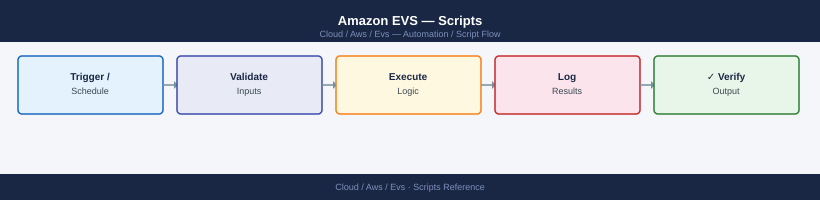

---
tags:
  - aws
  - operations
description: "Operational scripts for EVS: daily health check, host add/remove workflow, vSAN capacity report, HCX migration status tracker, safe host removal, VCF..."
---
# Amazon EVS — Scripts

<div class="kb-summary">
Operational scripts for EVS: daily health check, host add/remove workflow, vSAN capacity report, HCX migration status tracker, safe host removal, VCF password rotation, and capacity reporting.

*Applies to: Amazon EVS*
</div>


## Before you begin

- **Access:** Admin credentials on all affected systems
- **Timing:** safe to run during business hours unless a step is marked ⚠ (causes interruption)
- **Dependencies:** no active upgrades or migrations on the same infrastructure
- **Logging:** capture command output — paste into the change record on completion

---

## health-check.sh

```bash
#!/bin/bash
set -euo pipefail

ENV_ID="${EVS_ENV_ID:?Set EVS_ENV_ID}"
VCENTER="${VCENTER_HOST:?Set VCENTER_HOST}"
VCENTER_PASS="${VCENTER_PASSWORD:?Set VCENTER_PASSWORD}"
NSX_URL="${NSX_MANAGER_URL:?Set NSX_MANAGER_URL}"
NSX_PASS="${NSX_PASSWORD:?Set NSX_PASSWORD}"

PASS=0; FAIL=0

check() {
  local name="$1"; shift
  if eval "$@" &>/dev/null; then
    echo "  [OK]  $name"
    ((PASS++))
  else
    echo "  [FAIL] $name"
    ((FAIL++))
  fi
}

echo "=== EVS Health Check $(date +%F) ==="

echo ""
echo "[AWS EVS Cluster]"
STATE=$(aws evs get-environment --environment-id "$ENV_ID" \
  --query 'environment.state' --output text 2>/dev/null)
[[ "$STATE" == "CREATED" ]] && echo "  [OK]  Cluster state: $STATE" \
  || echo "  [FAIL] Cluster state: $STATE (expected CREATED)"; ((STATE == "CREATED")) && PASS++ || FAIL++

HOST_STATES=$(aws evs list-environment-hosts --environment-id "$ENV_ID" \
  --query 'hostSummaries[*].state' --output text 2>/dev/null)
FAILED_HOSTS=$(echo "$HOST_STATES" | tr ' ' '\n' | grep -cv "^CREATED$" || true)
[[ "$FAILED_HOSTS" -eq 0 ]] && echo "  [OK]  All hosts CREATED" \
  || echo "  [FAIL] $FAILED_HOSTS host(s) not in CREATED state"
PASS=$((PASS + (FAILED_HOSTS == 0))); FAIL=$((FAIL + (FAILED_HOSTS > 0)))

echo ""
echo "[NSX-T Manager]"
NSX_STATUS=$(curl -sk -u "admin:$NSX_PASS" "$NSX_URL/api/v1/cluster/status" \
  --connect-timeout 5 | python3 -c \
  "import sys,json; print(json.load(sys.stdin).get('control_cluster_status',{}).get('status','UNKNOWN'))" 2>/dev/null)
[[ "$NSX_STATUS" == "STABLE" ]] && echo "  [OK]  NSX control cluster: $NSX_STATUS" \
  || echo "  [FAIL] NSX control cluster: $NSX_STATUS (expected STABLE)"
PASS=$((PASS + (NSX_STATUS == "STABLE"))); FAIL=$((FAIL + (NSX_STATUS != "STABLE")))

echo ""
echo "[Summary]"
echo "  PASSED: $PASS  FAILED: $FAIL"
[[ "$FAIL" -eq 0 ]] && exit 0 || exit 1
```


```text title="Expected output"
=== EVS Health Check 2024-01-15 ===

[AWS EVS Cluster]
  [OK]  Cluster state: CREATED
  [OK]  All hosts CREATED

[NSX-T Manager]
  [OK]  NSX control cluster: STABLE

[Summary]
  PASSED: 3  FAILED: 0
```

!!! warning "Common errors"
    **`Set EVS_ENV_ID`** — Export the required environment variable with `export EVS_ENV_ID=<your-environment-id>` before running the script.
    **`curl: (7) Failed to connect to <NSX_MANAGER_URL> port 443: Connection timed out`** — Verify NSX Manager is reachable and the NSX_MANAGER_URL is correct, then check network/firewall connectivity with `curl -v -k https://<NSX_MANAGER_URL>/api/v1/cluster/status`.
    **`jq: parse error: Invalid JSON`** — Ensure NSX Manager credentials are correct and the API endpoint is responding with valid JSON by testing `curl -sk -u admin:$NSX_PASS "$NSX_URL/api/v1/cluster/status"` directly.
## vsan-capacity.ps1

```powershell
param(
    [string]$VCenter = $env:VCENTER_HOST,
    [string]$User    = "administrator@vsphere.local",
    [string]$Pass    = $env:VCENTER_PASSWORD
)

Connect-VIServer -Server $VCenter -User $User -Password $Pass -WarningAction SilentlyContinue | Out-Null

Get-Datastore -Name *vsan* | ForEach-Object {
    $ds = $_
    $usedGB = [math]::Round($ds.CapacityGB - $ds.FreeSpaceGB, 1)
    $usedPct = [math]::Round($usedGB / $ds.CapacityGB * 100, 1)
    $status = if ($usedPct -gt 80) { "WARN" } elseif ($usedPct -gt 70) { "INFO" } else { "OK" }
    [PSCustomObject]@{
        Datastore   = $ds.Name
        CapacityGB  = [math]::Round($ds.CapacityGB, 1)
        UsedGB      = $usedGB
        FreeGB      = [math]::Round($ds.FreeSpaceGB, 1)
        UsedPct     = "$usedPct%"
        Status      = $status
    }
} | Format-Table -AutoSize

Disconnect-VIServer -Confirm:$false | Out-Null
```

## hcx-status.sh

```bash
#!/bin/bash
HCX_IP="${HCX_MANAGER_IP:?Set HCX_MANAGER_IP}"
HCX_PASS="${HCX_PASSWORD:?Set HCX_PASSWORD}"

echo "=== HCX Service Mesh Status ==="
curl -sk -u "admin:$HCX_PASS" \
  "https://$HCX_IP/hybridity/api/interconnect/links" | \
  python3 -c "
import sys, json
data = json.load(sys.stdin)
for link in data.get('items', []):
    status = link.get('status', 'UNKNOWN')
    label = link.get('label', 'unknown')
    icon = '[OK]' if status == 'UP' else '[FAIL]'
    print(f'  {icon}  {label}: {status}')
"

echo ""
echo "=== HCX Version ==="
curl -sk -u "admin:$HCX_PASS" \
  "https://$HCX_IP/hybridity/api/about" | \
  python3 -c "import sys,json; d=json.load(sys.stdin); print(f\"  Version: {d.get('version','unknown')}\")"
```


```text title="Expected output"
=== HCX Service Mesh Status ===
  [OK]  Site-A-to-AWS-Link: UP
  [OK]  AWS-to-Site-B-Link: UP
  [FAIL]  DR-Failover-Link: DOWN
  [OK]  Replication-Channel-01: UP

=== HCX Version ===
  Version: 4.8.2.1234567
```

!!! warning "Common errors"
    **`curl: (60) SSL certificate problem: self signed certificate`** — Add the `-k` flag to curl (already present in the script; if still occurring, verify HCX_MANAGER_IP is correct and reachable on port 443).
    **`bash: HCX_MANAGER_IP: parameter null or not set`** — Export the environment variables before running the script: `export HCX_MANAGER_IP=<ip> HCX_PASSWORD=<password>`.
    **`json.decoder.JSONDecodeError: Expecting value: line 1 column 1`** — Verify HCX API is responding by testing `curl -sk -u "admin:$HCX_PASS" "https://$HCX_IP/hybridity/api/about"` directly; the endpoint may be unavailable or authentication may have failed.
## host-remove.sh

Automates the safe host removal sequence. Refuses to proceed if vSAN has outstanding resync data.

```bash
#!/bin/bash
set -euo pipefail

ENV_ID="${EVS_ENV_ID:?Set EVS_ENV_ID}"
HOST_ID="${EVS_HOST_ID:?Set EVS_HOST_ID}"
VCENTER="${VCENTER_HOST:?Set VCENTER_HOST}"
VCENTER_USER="${VCENTER_USER:-administrator@vsphere.local}"
VCENTER_PASS="${VCENTER_PASSWORD:?Set VCENTER_PASSWORD}"
ESXI_HOST="${ESXI_HOSTNAME:?Set ESXI_HOSTNAME (FQDN of the host to remove)}"
CLUSTER_NAME="${CLUSTER_NAME:-EVS-Management-Cluster}"

check_bytes_to_sync() {
  pwsh -NonInteractive -Command "
    Connect-VIServer -Server '${VCENTER}' -User '${VCENTER_USER}' -Password '${VCENTER_PASS}' -WarningAction SilentlyContinue | Out-Null
    \$cluster = Get-Cluster -Name '${CLUSTER_NAME}'
    \$resync = Get-VsanResyncDashboard -Cluster \$cluster
    Write-Output \$resync.BytesToSync
    Disconnect-VIServer -Confirm:\$false | Out-Null
  " 2>/dev/null
}

enter_maintenance_mode() {
  echo "  Putting ${ESXI_HOST} into maintenance mode with vSAN full data evacuation..."
  pwsh -NonInteractive -Command "
    Connect-VIServer -Server '${VCENTER}' -User '${VCENTER_USER}' -Password '${VCENTER_PASS}' -WarningAction SilentlyContinue | Out-Null
    Set-VMHost -VMHost '${ESXI_HOST}' -State Maintenance -Evacuate \$true -Confirm:\$false | Out-Null
    Write-Output 'Maintenance mode requested.'
    Disconnect-VIServer -Confirm:\$false | Out-Null
  "
}

poll_bytes_to_sync() {
  local max_wait=7200
  local elapsed=0
  local interval=60
  echo "  Polling vSAN BytesToSync (timeout: ${max_wait}s)..."
  while [[ $elapsed -lt $max_wait ]]; do
    local bts
    bts=$(check_bytes_to_sync)
    echo "    [$(date +%T)] BytesToSync=${bts}"
    if [[ "$bts" == "0" ]]; then
      echo "  vSAN evacuation complete."
      return 0
    fi
    sleep $interval
    elapsed=$((elapsed + interval))
  done
  echo "  ERROR: vSAN evacuation did not complete within ${max_wait}s. Aborting."
  return 1
}

verify_host_gone() {
  local max_wait=1800
  local elapsed=0
  local interval=30
  echo "  Waiting for host to disappear from EVS host list..."
  while [[ $elapsed -lt $max_wait ]]; do
    local state
    state=$(aws evs list-environment-hosts --environment-id "$ENV_ID" \
      --query "hostSummaries[?hostId=='${HOST_ID}'].state" --output text 2>/dev/null)
    if [[ -z "$state" ]]; then
      echo "  Host ${HOST_ID} is no longer in the host list."
      return 0
    fi
    echo "    [$(date +%T)] Host state: ${state}"
    sleep $interval
    elapsed=$((elapsed + interval))
  done
  echo "  WARNING: Host did not disappear within ${max_wait}s."
  return 1
}

echo "=== EVS Host Removal: ${HOST_ID} ==="
echo ""

echo "[Step 1] Pre-check: verifying minimum host count..."
HOST_COUNT=$(aws evs list-environment-hosts --environment-id "$ENV_ID" \
  --query 'length(hostSummaries)' --output text)
if [[ "$HOST_COUNT" -le 3 ]]; then
  echo "  ERROR: Only ${HOST_COUNT} host(s) in cluster. Cannot remove — minimum is 3 remaining."
  exit 1
fi
echo "  Host count: ${HOST_COUNT} (will be $((HOST_COUNT - 1)) after removal — OK)"

echo ""
echo "[Step 2] Pre-check: verifying vSAN BytesToSync is 0..."
BTS=$(check_bytes_to_sync)
if [[ "$BTS" != "0" ]]; then
  echo "  ERROR: vSAN BytesToSync=${BTS}. Cluster has outstanding resync data."
  echo "  Wait for vSAN to finish resyncing before removing a host."
  exit 1
fi
echo "  BytesToSync=0 — vSAN is healthy."

echo ""
echo "[Step 3] Entering maintenance mode with vSAN full data evacuation..."
enter_maintenance_mode

echo ""
echo "[Step 4] Waiting for vSAN evacuation to complete..."
poll_bytes_to_sync

echo ""
echo "[Step 5] Deleting host via AWS EVS API..."
aws evs delete-environment-host \
  --environment-id "$ENV_ID" \
  --host-id "$HOST_ID"
echo "  delete-environment-host submitted."

echo ""
echo "[Step 6] Waiting for host to be removed from EVS list..."
verify_host_gone

echo ""
echo "[Step 7] Remaining hosts in cluster:"
aws evs list-environment-hosts --environment-id "$ENV_ID" \
  --query 'hostSummaries[*].[hostId,hostName,state]' --output table

echo ""
echo "=== Host removal complete ==="
```


```text title="Expected output"
=== EVS Host Removal: host-0a7f3c2e1b9d4k5m ===

[Step 1] Pre-check: verifying minimum host count...
  Host count: 5 (will be 4 after removal — OK)

[Step 2] Pre-check: verifying vSAN BytesToSync is 0...
  BytesToSync=0 — vSAN is healthy.

[Step 3] Entering maintenance mode with vSAN full data evacuation...
  Putting esx-prod-04.corp.local into maintenance mode with vSAN full data evacuation...
Maintenance mode requested.

[Step 4] Waiting for vSAN evacuation to complete...
  Polling vSAN BytesToSync (timeout: 7200s)...
    [14:32:18] BytesToSync=847293456
    [14:33:18] BytesToSync=612847293
    [14:34:18] BytesToSync=389472015
    [14:35:18] BytesToSync=0
  vSAN evacuation complete.

[Step 5] Deleting host via AWS EVS API...
  delete-environment-host submitted.

[Step 6] Waiting for host to be removed from EVS list...
  Waiting for host to disappear from EVS host list...
    [14:36:12] Host state: DELETING
    [14:36:42] Host state: DELETING
  Host host-0a7f3c2e1b9d4k5m is no longer in the host list.

[Step 7] Remaining hosts in cluster:
---------------------------------
hostId                      hostName              state
---------------------------------
host-1b8e4d9f2c6a3k7p       esx-prod-01.corp.local  RUNNING
host-2c9f5e0g3d7b4l8q       esx-prod-02.corp.local  RUNNING
host-3d0g6f1h4e8c5m9r       esx-prod-03.corp.local  RUNNING
host-4e1h7g2i5f9d6n0s       esx-prod-05.corp.local  RUNNING
---------------------------------

=== Host removal complete ===
```

!!! warning "Common errors"
    **`ERROR: Only 3 host(s) in cluster. Cannot remove — minimum is 3 remaining.`** — Ensure the cluster has at least 4 hosts before attempting removal, or add additional hosts first.
    **`ERROR: vSAN BytesToSync=2147483648. Cluster has outstanding resync data.`** — Wait for vSAN rebalancing to complete by monitoring the cluster health in vCenter before retrying the removal.
    **`Connect-VIServer : Cannot find a vCenter Server system at '${VCENTER}'.`** — Verify the VCENTER_HOST environment variable is set to a valid vCenter hostname/IP and is reachable from the host running this script.
## vcf-password-rotate.sh

Automates VCF credential rotation via SDDC Manager REST API.

```bash
#!/bin/bash
set -euo pipefail

SDDC_HOST="${SDDC_MANAGER_HOST:?Set SDDC_MANAGER_HOST}"
SDDC_USER="${SDDC_MANAGER_USER:-administrator@vsphere.local}"
SDDC_PASS="${SDDC_MANAGER_PASSWORD:?Set SDDC_MANAGER_PASSWORD}"
SDDC_URL="https://${SDDC_HOST}"
POLL_INTERVAL=30
POLL_TIMEOUT=1800

get_token() {
  curl -sk -X POST "${SDDC_URL}/v1/tokens" \
    -H "Content-Type: application/json" \
    -d "{\"username\":\"${SDDC_USER}\",\"password\":\"${SDDC_PASS}\"}" | \
    python3 -c "import sys,json; print(json.load(sys.stdin).get('accessToken',''))"
}

list_credentials() {
  local token="$1"
  curl -sk -H "Authorization: Bearer ${token}" \
    "${SDDC_URL}/v1/credentials" | \
    python3 -c "
import sys, json
d = json.load(sys.stdin)
print(f\"{'Entity':<40} {'Type':<20} {'Username':<30}\")
print('-' * 90)
for c in d.get('elements', []):
    print(f\"{c.get('entityName',''):<40} {c.get('credentialType',''):<20} {c.get('username',''):<30}\")
"
}

initiate_rotation() {
  local token="$1"
  curl -sk -X PATCH \
    -H "Authorization: Bearer ${token}" \
    -H "Content-Type: application/json" \
    "${SDDC_URL}/v1/credentials" \
    -d '{"operationType":"ROTATE","elements":[{"resourceName":"ALL"}]}' | \
    python3 -c "import sys,json; print(json.load(sys.stdin).get('id',''))"
}

poll_task() {
  local token="$1"
  local task_id="$2"
  local elapsed=0
  echo "  Polling task ${task_id}..."
  while [[ $elapsed -lt $POLL_TIMEOUT ]]; do
    local result
    result=$(curl -sk -H "Authorization: Bearer ${token}" \
      "${SDDC_URL}/v1/tasks/${task_id}" | \
      python3 -c "
import sys, json
d = json.load(sys.stdin)
print(d.get('status',''), d.get('completionTimestamp',''))
")
    local status
    status=$(echo "$result" | awk '{print $1}')
    echo "    [$(date +%T)] Status: ${result}"
    if [[ "$status" == "Successful" ]]; then
      return 0
    elif [[ "$status" == "Failed" ]]; then
      echo "  ERROR: Rotation task failed."
      return 1
    fi
    sleep $POLL_INTERVAL
    elapsed=$((elapsed + POLL_INTERVAL))
  done
  echo "  ERROR: Task did not complete within ${POLL_TIMEOUT}s."
  return 1
}

echo "=== VCF Credential Rotation ==="
echo "  SDDC Manager: ${SDDC_HOST}"
echo ""

echo "[Step 1] Authenticating to SDDC Manager..."
TOKEN=$(get_token)
if [[ -z "$TOKEN" ]]; then
  echo "  ERROR: Failed to get access token. Check credentials."
  exit 1
fi
echo "  Token obtained."

echo ""
echo "[Step 2] Current credentials managed by SDDC Manager:"
list_credentials "$TOKEN"

echo ""
echo "[Step 3] Initiating credential rotation for ALL components..."
TASK_ID=$(initiate_rotation "$TOKEN")
if [[ -z "$TASK_ID" ]]; then
  echo "  ERROR: Failed to initiate rotation task."
  exit 1
fi
echo "  Rotation task ID: ${TASK_ID}"

echo ""
echo "[Step 4] Polling rotation task until complete..."
poll_task "$TOKEN" "$TASK_ID"

echo ""
echo "[Step 5] Final credential list after rotation:"
NEW_TOKEN=$(get_token)
list_credentials "$NEW_TOKEN"

echo ""
echo "=== Credential rotation complete ==="
echo "  Update any external automation or scripts that reference VCF credentials."
```


```text title="Expected output"
=== VCF Credential Rotation ===
  SDDC Manager: sddc-mgr-01.corp.local

[Step 1] Authenticating to SDDC Manager...
  Token obtained.

[Step 2] Current credentials managed by SDDC Manager:
Entity                                   Type                 Username                  
------------------------------------------------------------------------------------------
vCenter Server                           VCENTER              administrator@vsphere.local
NSX Manager                              NSX                  admin
vSAN Witness                             ESXI                 root
ESXi Cluster Node 01                     ESXI                 root
ESXi Cluster Node 02                     ESXI                 root
...

[Step 3] Initiating credential rotation for ALL components...
  Rotation task ID: 550e8400-e29b-41d4-a716-446655440000

[Step 4] Polling rotation task until complete...
  Polling task 550e8400-e29b-41d4-a716-446655440000...
    [14:32:15] Status: In Progress
    [14:32:45] Status: In Progress
    [14:33:15] Status: In Progress
    [14:33:45] Status: Successful 2024-01-15T14:33:42Z

[Step 5] Final credential list after rotation:
Entity                                   Type                 Username                  
------------------------------------------------------------------------------------------
vCenter Server                           VCENTER              administrator@vsphere.local
NSX Manager                              NSX                  admin
vSAN Witness                             ESXI                 root
ESXi Cluster Node 01                     ESXI                 root
ESXi Cluster Node 02                     ESXI                 root
...

=== Credential rotation complete ===
  Update any external automation or scripts that reference VCF credentials.
```

!!! warning "Common errors"
    **`ERROR: Failed to get access token. Check credentials.`** — Verify SDDC_MANAGER_HOST, SDDC_MANAGER_USER, and SDDC_MANAGER_PASSWORD environment variables are set correctly and the SDDC Manager is reachable.
    **`curl: (60) SSL certificate problem: self signed certificate`** — Add the `-k` flag to curl commands (already present) or import the SDDC Manager's CA certificate into your system trust store.
    **`ERROR: Task did not complete within 1800s.`** — Increase POLL_TIMEOUT value or check SDDC Manager logs for rotation task failures; the operation may require more time in large environments.
## evs-capacity-report.sh

Generates a consolidated capacity report covering AWS host inventory, vSAN storage, and VM density.

```bash
#!/bin/bash
set -euo pipefail

ENV_ID="${EVS_ENV_ID:?Set EVS_ENV_ID}"
VCENTER="${VCENTER_HOST:?Set VCENTER_HOST}"
VCENTER_USER="${VCENTER_USER:-administrator@vsphere.local}"
VCENTER_PASS="${VCENTER_PASSWORD:?Set VCENTER_PASSWORD}"
CLUSTER_NAME="${CLUSTER_NAME:-EVS-Management-Cluster}"
WARN_THRESHOLD=80
REPORT_DATE=$(date +%F)

print_section() {
  echo ""
  echo "================================================================"
  echo "  $1"
  echo "================================================================"
}

get_aws_hosts() {
  aws evs list-environment-hosts --environment-id "$ENV_ID" \
    --query 'hostSummaries[*].[hostName,instanceType,state]' \
    --output table
}

get_vsan_capacity() {
  pwsh -NonInteractive -Command "
    Connect-VIServer -Server '${VCENTER}' -User '${VCENTER_USER}' -Password '${VCENTER_PASS}' -WarningAction SilentlyContinue | Out-Null
    Get-Datastore -Name '*vsan*' | ForEach-Object {
      \$ds = \$_
      \$usedGB = [math]::Round(\$ds.CapacityGB - \$ds.FreeSpaceGB, 1)
      \$usedPct = [math]::Round(\$usedGB / \$ds.CapacityGB * 100, 1)
      \$freeGB = [math]::Round(\$ds.FreeSpaceGB, 1)
      \$headroomGB = [math]::Round(\$ds.CapacityGB * (1 - ${WARN_THRESHOLD}/100), 1)
      \$status = if (\$usedPct -gt ${WARN_THRESHOLD}) { 'WARN' } elseif (\$usedPct -gt 70) { 'INFO' } else { 'OK' }
      Write-Output \"  Datastore : \$(\$ds.Name)\"
      Write-Output \"  Capacity  : \$([math]::Round(\$ds.CapacityGB,1)) GB\"
      Write-Output \"  Used      : \${usedGB} GB (\${usedPct}%)\"
      Write-Output \"  Free      : \${freeGB} GB\"
      Write-Output \"  Headroom  : \${headroomGB} GB at ${WARN_THRESHOLD}% threshold\"
      Write-Output \"  Status    : \${status}\"
    }
    Disconnect-VIServer -Confirm:\$false | Out-Null
  " 2>/dev/null
}

get_vm_count_per_host() {
  pwsh -NonInteractive -Command "
    Connect-VIServer -Server '${VCENTER}' -User '${VCENTER_USER}' -Password '${VCENTER_PASS}' -WarningAction SilentlyContinue | Out-Null
    Get-Cluster -Name '${CLUSTER_NAME}' | Get-VMHost | ForEach-Object {
      \$h = \$_
      \$vmCount = (Get-VM -Location \$h).Count
      \$cpuPct = [math]::Round(\$h.ExtensionData.Summary.QuickStats.OverallCpuUsage / (\$h.NumCpu * 1000) * 100, 1)
      \$memPct = [math]::Round(\$h.MemoryUsageGB / \$h.MemoryTotalGB * 100, 1)
      Write-Output \"  \$(\$h.Name)  VMs=\${vmCount}  CPU=\${cpuPct}%  MEM=\${memPct}%\"
    }
    Disconnect-VIServer -Confirm:\$false | Out-Null
  " 2>/dev/null
}

echo "=== EVS Capacity Report — ${REPORT_DATE} ==="
echo "  Environment: ${ENV_ID}"
echo "  vCenter: ${VCENTER}"

print_section "AWS Host Inventory"
get_aws_hosts

print_section "vSAN Storage Capacity"
get_vsan_capacity

print_section "VM Count and Resource Usage per Host"
get_vm_count_per_host

print_section "Report Complete"
echo "  Generated: $(date)"
```


```text title="Expected output"
=== EVS Capacity Report — 2024-01-15 ===
  Environment: evs-prod-us-east-1
  vCenter: vcenter.corp.internal

================================================================
  AWS Host Inventory
================================================================

hostName                instanceType    state
----------------------  --------------  -------
evs-host-01.aws.local   m5.4xlarge      RUNNING
evs-host-02.aws.local   m5.4xlarge      RUNNING
evs-host-03.aws.local   m5.4xlarge      RUNNING

================================================================
  vSAN Storage Capacity
================================================================

  Datastore : vsanDatastore
  Capacity  : 2048.5 GB
  Used      : 1638.4 GB (80.0%)
  Free      : 410.1 GB
  Headroom  : 409.6 GB at 80% threshold
  Status    : WARN

================================================================
  VM Count and Resource Usage per Host
================================================================

  evs-host-01.aws.local  VMs=12  CPU=64.3%  MEM=78.2%
  evs-host-02.aws.local  VMs=11  CPU=58.9%  MEM=71.5%
  evs-host-03.aws.local  VMs=13  CPU=72.1%  MEM=82.6%

================================================================
  Report Complete
================================================================

  Generated: Mon Jan 15 14:32:47 UTC 2024
```

!!! warning "Common errors"
    **`Error: Unable to locate credentials. You can configure credentials by running "aws configure".`** — Ensure AWS credentials are configured via `aws configure` or set `AWS_ACCESS_KEY_ID` and `AWS_SECRET_ACCESS_KEY` environment variables.
    **`Connect-VIServer : Cannot find an overload for "Connect-VIServer" and the argument count: "6".`** — Verify PowerShell Core (pwsh) is installed; if using Windows PowerShell, replace `pwsh` with `powershell` in the script.
    **`The term 'pwsh' is not recognized as the name of a cmdlet, function, script file, or operable program.`** — Install PowerShell Core with `apt-get install -y powershell` (Linux) or download from Microsoft's GitHub releases.
---

## See also

- [Amazon EVS — CLI Reference](../cli-reference/)
- [Amazon EVS — Procedures](../procedures/)

## Verify

- Confirm the operation completed without errors in the log or management UI
- Verify the expected state change is visible (service running, object created, config applied)
- Document the outcome in the change record
