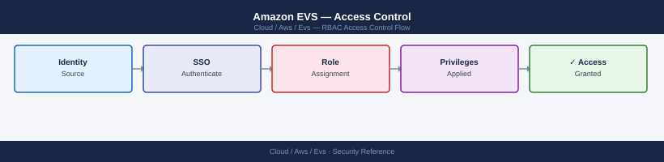

---
tags:
  - aws
  - security
---
# Amazon EVS — Access Control

<div class="kb-summary">
AWS IAM permissions for EVS cluster management, vSphere RBAC roles for VMs and infrastructure, SDDC Manager roles, and least-privilege design principles.

*Applies to: Amazon EVS*
</div>


## Before you begin

- **Access:** Admin credentials on all affected systems
- **Change management:** security changes require CAB approval in most environments
- **Rollback plan:** document current state before any security control change
- **Testing:** validate in a non-production environment first where possible

---

## AWS IAM for EVS

```json
{
  "Version": "2012-10-17",
  "Statement": [
    {
      "Sid": "EVSReadOnly",
      "Effect": "Allow",
      "Action": [
        "evs:ListEnvironments",
        "evs:GetEnvironment",
        "evs:ListEnvironmentHosts",
        "evs:ListEnvironmentVlans"
      ],
      "Resource": "*"
    }
  ]
}
```

```json
{
  "Version": "2012-10-17",
  "Statement": [
    {
      "Sid": "EVSAdminScoped",
      "Effect": "Allow",
      "Action": [
        "evs:CreateEnvironmentHost",
        "evs:DeleteEnvironmentHost",
        "evs:UpdateEnvironment"
      ],
      "Resource": "arn:aws:evs:us-east-1:123456789:environment/env-xxx"
    }
  ]
}
```

```bash
# Check IAM role used for EVS operations
aws sts get-caller-identity

# Verify access to EVS
aws evs list-environments

# Create IAM role for EVS read-only access (for monitoring/ops team)
aws iam create-role --role-name EVS-ReadOnly \
  --assume-role-policy-document '{"Version":"2012-10-17","Statement":[{"Effect":"Allow","Principal":{"AWS":"arn:aws:iam::123456789012:root"},"Action":"sts:AssumeRole"}]}'
aws iam attach-role-policy --role-name EVS-ReadOnly \
  --policy-arn arn:aws:iam::aws:policy/AmazonEVSReadOnlyAccess
```

## IAM Policy Design

### Minimal Cluster Management Policy

Scope IAM permissions to a specific environment ARN using a condition key. This prevents a compromised role from acting on other EVS environments in the account.

```json
{
  "Version": "2012-10-17",
  "Statement": [
    {
      "Sid": "EVSClusterManagement",
      "Effect": "Allow",
      "Action": [
        "evs:DescribeEnvironment",
        "evs:CreateEnvironmentHost",
        "evs:DeleteEnvironmentHost",
        "evs:ListEnvironmentHosts"
      ],
      "Resource": "arn:aws:evs:us-east-1:123456789012:environment/env-0a1b2c3d4e5f",
      "Condition": {
        "StringEquals": {
          "aws:ResourceTag/Environment": "production"
        }
      }
    },
    {
      "Sid": "EVSListForDiscovery",
      "Effect": "Allow",
      "Action": [
        "evs:ListEnvironments"
      ],
      "Resource": "*"
    }
  ]
}
```

### Auditor Read-Only Policy

```json
{
  "Version": "2012-10-17",
  "Statement": [
    {
      "Sid": "EVSAuditReadOnly",
      "Effect": "Allow",
      "Action": [
        "evs:ListEnvironments",
        "evs:GetEnvironment",
        "evs:ListEnvironmentHosts",
        "evs:ListEnvironmentVlans",
        "evs:ListTagsForResource"
      ],
      "Resource": "*"
    }
  ]
}
```

### Production Guardrail: Deny-Delete SCP

Apply this as a Service Control Policy in AWS Organizations to prevent accidental EVS cluster deletion in tagged production accounts.

```json
{
  "Version": "2012-10-17",
  "Statement": [
    {
      "Sid": "DenyEVSDeleteInProd",
      "Effect": "Deny",
      "Action": [
        "evs:DeleteEnvironmentHost",
        "evs:DeleteEnvironment"
      ],
      "Resource": "*",
      "Condition": {
        "StringEquals": {
          "aws:ResourceTag/Environment": "production"
        }
      }
    }
  ]
}
```

Attach this SCP to the production OU in AWS Organizations. Even account administrators cannot delete EVS resources tagged `Environment=production` without first removing the tag — which itself can be denied by a separate SCP.

## vSphere RBAC Roles

Standard vSphere roles used in EVS deployments and their intended scope:

| Role | Privileges | Scope | Typical Assignment |
|---|---|---|---|
| Administrator | All vCenter privileges | Global | Platform team only; avoid daily use |
| Read-Only | View all inventory; no changes | Global | Monitoring systems, audit accounts |
| No cryptographer | Admin minus crypto operations | Cluster | Admins who should not manage encryption keys |
| VM-Operator (custom) | Power on/off, console, snapshot | VM folder | Application support teams |
| VM-Provisioner (custom) | Deploy from template, clone | Datacenter | DevOps CI/CD service accounts |

The `No cryptographer` role is important for EVS environments using vSAN encryption: it prevents operators from accidentally rotating KEKs or disabling encryption while still giving full cluster management access.

```powershell
# Connect to vCenter
Connect-VIServer -Server $VCENTER -User administrator@vsphere.local -Password $PASS

# List existing roles
Get-VIRole | Select Name, Description

# Create a scoped operator role (VM power operations only)
New-VIRole -Name "VM-Operator" -Privilege (Get-VIPrivilege -Id "VirtualMachine.Interact.PowerOn",
  "VirtualMachine.Interact.PowerOff", "VirtualMachine.Interact.Suspend",
  "VirtualMachine.State.CreateSnapshot", "VirtualMachine.State.RemoveSnapshot",
  "System.View", "System.Anonymous", "System.Read")

# Assign role to AD group on a specific folder (scoped, not global)
$folder = Get-Folder -Name "Production"
$principal = "DOMAIN\vsphere-operators"
New-VIPermission -Entity $folder -Principal $principal -Role "VM-Operator" -Propagate $true

# List current permissions on cluster
Get-VIPermission -Entity (Get-Cluster) | Select Principal, Role, Propagate
```

```powershell
# Create VM-Provisioner role for CI/CD pipelines
New-VIRole -Name "VM-Provisioner" -Privilege (Get-VIPrivilege -Id `
  "VirtualMachine.Inventory.Create",
  "VirtualMachine.Inventory.CreateFromExisting",
  "VirtualMachine.Config.AddNewDisk",
  "VirtualMachine.Config.Resource",
  "VirtualMachine.Interact.PowerOn",
  "Datastore.AllocateSpace",
  "Network.Assign",
  "System.View", "System.Anonymous", "System.Read")

# Assign to CI/CD service account — scope to specific datacenter
New-VIPermission -Entity (Get-Datacenter -Name "EVS-DC") `
  -Principal "DOMAIN\svc-cicd" -Role "VM-Provisioner" -Propagate $true
```

## SDDC Manager Roles

SDDC Manager has its own role system separate from vCenter RBAC. These roles control access to VCF lifecycle operations: cluster expansion, host commissioning, workload domain management, and firmware updates.

| Role | Access Level | Typical User |
|---|---|---|
| ADMIN | Full SDDC Manager access; cluster management | Platform team lead |
| OPERATOR | Read + workflow execution; no destructive operations | Platform engineer |
| VIEWER | Read-only; dashboard and inventory | Monitoring, security |
| AUDITOR | Read-only + audit log access | Compliance team |

Role mapping to job functions:

| Job Function | SDDC Manager Role | vCenter Role | AWS IAM |
|---|---|---|---|
| Platform team lead | ADMIN | Administrator | EVS full access (scoped) |
| Platform engineer | OPERATOR | No cryptographer | EVS full access (scoped) |
| App support | VIEWER | VM-Operator (folder-scoped) | EVS read-only |
| Security/audit | AUDITOR | Read-Only | EVS read-only |
| CI/CD pipeline | — | VM-Provisioner (DC-scoped) | No EVS access |

```bash
# Add user to SDDC Manager role via API
curl -sk -u "$SDDC_USER:$SDDC_PASS" \
  -X POST "https://sddc-manager.vcf.internal/v1/users" \
  -H "Content-Type: application/json" \
  -d '{"name": "ops-user@domain.com", "role": {"name": "OPERATOR"}, "type": "USER"}'

# List current SDDC Manager users and roles
curl -sk -u "$SDDC_USER:$SDDC_PASS" \
  "https://sddc-manager.vcf.internal/v1/users" | \
  python3 -c "import sys,json; [print(f\"{u['name']}: {u['role']['name']}\") for u in json.load(sys.stdin)['elements']]"
```

## Principle of Least Privilege

Separate IAM identities by function. Do not use a single IAM role for both EVS cluster management and vSphere VM management — these are independent planes of control.

| Identity | Manages | Does Not Have |
|---|---|---|
| `role/evs-cluster-admin` | EVS host add/remove; cluster state | vSphere VM operations; NSX config |
| `role/evs-readonly` | EVS describe/list | Any mutating evs:* action |
| `role/vcenter-svc-account` | vCenter API for automation | EVS host lifecycle |
| AD group `vsphere-operators` | VM power/console in vCenter | vCenter config; ESXi direct access |

Apply SCPs in AWS Organizations to enforce the separation at the account boundary:

```json
{
  "Version": "2012-10-17",
  "Statement": [
    {
      "Sid": "PreventEVSDeletionInProd",
      "Effect": "Deny",
      "Action": [
        "evs:DeleteEnvironment",
        "evs:DeleteEnvironmentHost"
      ],
      "Resource": "*",
      "Condition": {
        "ArnNotLike": {
          "aws:PrincipalArn": "arn:aws:iam::*:role/evs-break-glass"
        }
      }
    }
  ]
}
```

This SCP blocks all EVS deletion except from a designated `evs-break-glass` role that requires MFA to assume and is audited through CloudTrail.

## See also

- [Amazon EVS — Authentication](authentication/)
- [Amazon EVS — Hardening](hardening/)
