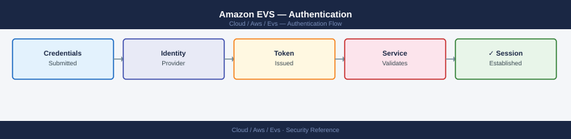
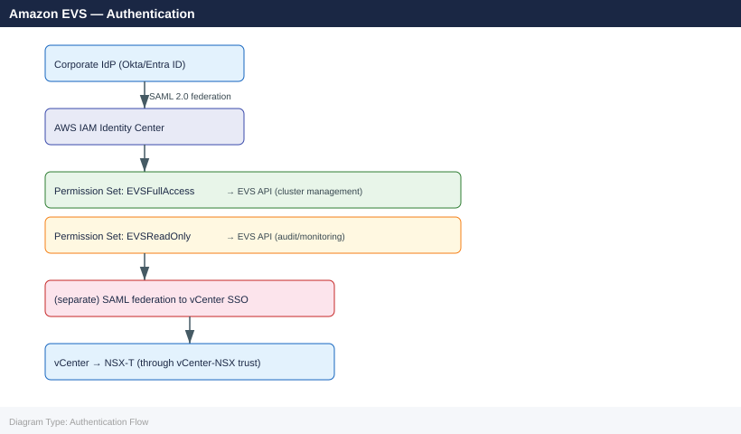

---
tags:
  - aws
  - security
---
# Amazon EVS — Authentication

<div class="kb-summary">
vCenter SSO configuration, Active Directory integration for vSphere and NSX-T, MFA for AWS console access, SSH key rotation for EVS bare-metal hosts, and service account management.

*Applies to: Amazon EVS*
</div>


## Before you begin

- **Access:** Admin credentials on all affected systems
- **Change management:** security changes require CAB approval in most environments
- **Rollback plan:** document current state before any security control change
- **Testing:** validate in a non-production environment first where possible

---

## vCenter SSO Domain

VCF bootstrap creates a `vsphere.local` SSO domain with a single administrator account (`administrator@vsphere.local`). This account has unrestricted access to all vCenter operations and cannot be deleted.

Do not use `administrator@vsphere.local` for daily operations. The account has no audit trail linkage to a person, its activity cannot be attributed, and it bypasses any AD-based password policy. Reserve it for break-glass scenarios only and store the password in AWS Secrets Manager with rotation disabled and access tightly restricted.

Normal operational flow:
1. Add AD/LDAP as an identity source to vCenter SSO.
2. Create AD security groups mapped to vCenter roles (e.g., `vsphere-admins`, `vsphere-operators`).
3. Assign vCenter permissions to the AD groups.
4. All daily logins use `username@corp.example.com` credentials — fully auditable via AD logs and vCenter events.

## AD/LDAP Integration

Both SDDC Manager and vCenter require separate AD identity source configuration. They share the same underlying AD but are configured independently.

```powershell
# Add AD as identity source in vCenter SSO
# vCenter UI → Administration → Single Sign On → Configuration → Identity Sources → Add

# Via API (recommended for automation):
$body = @{
  type = "ActiveDirectory"
  settings = @{
    userBaseDn = "OU=Users,DC=corp,DC=example,DC=com"
    groupBaseDn = "OU=Groups,DC=corp,DC=example,DC=com"
    searchTimeoutSeconds = 300
    serverEndpoints = @(@{ ldapUrl = "ldap://dc01.corp.example.com:389" })
    username = "svc-vsphere@corp.example.com"
    password = $env:AD_SVC_PASSWORD
  }
  domainAlias = "corp"
  name = "corp.example.com"
}
# Submit via vCenter REST API: POST /api/vcenter/identity/providers

# Verify AD groups appear in vCenter
# vCenter → Administration → Single Sign On → Users and Groups → select corp domain
```

Common errors when adding an AD identity source:

| Error | Likely Cause | Fix |
|---|---|---|
| SSL certificate error | vCenter cannot verify LDAP server cert | Use `ldap://` (port 389) or import DC cert into vCenter trusted store |
| Connection timeout | LDAP port blocked by Security Group | Allow TCP 389 (LDAP) or TCP 636 (LDAPS) from EVS management subnet to DC |
| Invalid credentials | Service account password wrong or expired | Reset svc-vsphere password; update in vCenter identity source config |
| Groups not resolving | Wrong `groupBaseDn` | Verify the OU path contains the security groups used for vCenter role assignment |

For LDAPS (port 636), the domain controller's SSL certificate must be trusted by vCenter. Export the root CA certificate and import it via vCenter → Administration → Certificate Management → Trusted Root Certificates.

## NSX-T LDAP Integration

```bash
# Add LDAP identity source to NSX-T
curl -sk -u "admin:$NSX_PASSWORD" \
  -X POST "$NSX_URL/api/v1/node/aaa/providers/ldap" \
  -H "Content-Type: application/json" \
  -d '{
    "display_name": "corp-ad",
    "ldap_servers": [{"bind_dn": "CN=svc-nsx,OU=ServiceAccounts,DC=corp,DC=example,DC=com",
                       "bind_password": "PASSWORD",
                       "ldap_url": "ldap://dc01.corp.example.com:389"}],
    "domain_name": "corp.example.com",
    "base_dn": "OU=Users,DC=corp,DC=example,DC=com",
    "type": "ActiveDirectory",
    "enabled": true
  }' | python3 -m json.tool

# Test LDAP connectivity
curl -sk -u "admin:$NSX_PASSWORD" \
  -X POST "$NSX_URL/api/v1/node/aaa/providers/ldap?action=test" | python3 -m json.tool
```

## AWS IAM Identity Center Integration

For organizations using AWS IAM Identity Center (formerly AWS SSO), EVS console and API access is governed through IAM Identity Center permission sets. The vCenter and NSX-T UIs, however, maintain their own SSO — IAM Identity Center does not automatically provide access to these.

Architecture of authentication layers:



To connect IAM Identity Center to vCenter SSO using SAML federation:
1. In vCenter → Administration → SSO → Configuration → Identity Provider, configure an external SAML identity provider.
2. Point it at the IAM Identity Center SAML metadata URL for the application you create in IAM Identity Center.
3. Map SAML attributes (e.g., group membership) to vCenter SSO groups.
4. Assign vCenter roles to those SSO groups.

This gives users a single login from their corporate IdP that works for both AWS console access and vCenter access.

## Service Account Management

EVS requires several service accounts for internal component communication. These are created during VCF bringup and managed by SDDC Manager.

| Account | Used By | Managed By | Rotation |
|---|---|---|---|
| `administrator@vsphere.local` | vCenter bootstrap; break-glass | Manual | Do not rotate without planning — VCF uses this internally |
| `svc-vcenter` | SDDC Manager → vCenter API | SDDC Manager | SDDC Manager password rotation workflow |
| NSX admin local account | NSX-T management API | Manual or SDDC Manager | SDDC Manager password rotation |
| HCX admin | HCX Manager local auth | Manual | Separate rotation procedure |
| SDDC Manager admin | VCF API and lifecycle ops | Manual | Manual; store in Secrets Manager |

SDDC Manager can rotate all VCF component passwords (vCenter, NSX-T, ESXi) through a built-in workflow:

```bash
# Initiate VCF service account password rotation via SDDC Manager API
curl -sk -u "$SDDC_USER:$SDDC_PASS" \
  -X PATCH "https://sddc-manager.vcf.internal/v1/credentials" \
  -H "Content-Type: application/json" \
  -d '{
    "elements": [
      {
        "resourceType": "VCENTER",
        "credentials": [{"username": "svc-vcenter", "credentialType": "SSO"}]
      }
    ],
    "type": "ROTATE"
  }' | python3 -m json.tool

# Check rotation task status
curl -sk -u "$SDDC_USER:$SDDC_PASS" \
  "https://sddc-manager.vcf.internal/v1/tasks/<task-id>" | \
  python3 -c "import sys,json; d=json.load(sys.stdin); print(f\"Status: {d['status']} - {d.get('name','')}\")"
```

HCX credentials must be rotated separately because HCX Manager stores its own local admin password and the service mesh uses HCX-specific credentials for inter-site authentication:

```bash
# Rotate HCX Manager local admin password
# HCX Manager UI → Administration → User Management → Edit admin user password

# After changing HCX password, update the stored credential in AWS Secrets Manager
aws secretsmanager put-secret-value \
  --secret-id evs/hcx-admin-password \
  --secret-string '{"username":"admin","password":"NEW_PASSWORD"}'

# Verify HCX service mesh still healthy after rotation
curl -sk -u "admin:$NEW_HCX_PASSWORD" \
  "https://$HCX_MANAGER_IP/hybridity/api/interconnect/links" | \
  python3 -c "import sys,json; [print(f\"{l['label']}: {l['status']}\") for l in json.load(sys.stdin).get('items',[])]"
```

## AWS Console MFA Enforcement

```json
{
  "Version": "2012-10-17",
  "Statement": [
    {
      "Sid": "DenyAllExceptListedIfNoMFA",
      "Effect": "Deny",
      "NotAction": [
        "iam:CreateVirtualMFADevice",
        "iam:EnableMFADevice",
        "iam:GetUser",
        "iam:ListMFADevices",
        "iam:ListVirtualMFADevices",
        "iam:ResyncMFADevice",
        "sts:GetSessionToken"
      ],
      "Resource": "*",
      "Condition": {
        "BoolIfExists": {
          "aws:MultiFactorAuthPresent": "false"
        }
      }
    }
  ]
}
```

```bash
# Enforce MFA for EVS operations — attach this policy to the EVS operator role/group
aws iam put-user-policy \
  --user-name evs-operator \
  --policy-name RequireMFA \
  --policy-document file://require-mfa.json

# Verify MFA is configured for user
aws iam list-mfa-devices --user-name evs-operator
```

vCenter SSO cannot enforce MFA natively. The correct approach is to use AD as the identity source and enforce MFA at the AD layer (e.g., Microsoft Entra ID Conditional Access, or Okta MFA for AD-integrated login). When users authenticate to vCenter using their `username@corp.example.com` credentials, MFA is enforced by the IdP before the LDAP bind succeeds. This makes MFA coverage consistent across both AWS console and vSphere access without requiring vCenter-specific MFA configuration.

## SSH Key Management (ESXi Hosts)

```bash
# EVS hosts use SSH keys for initial ESXi DCUI access.
# Rotate the key pair periodically:

# 1. Generate new key pair
aws ec2 create-key-pair --key-name evs-cluster-key-new --output text > evs-cluster-key-new.pem
chmod 400 evs-cluster-key-new.pem

# 2. Deploy new public key to each ESXi host
# Note: requires current SSH access or DCUI session
for HOST in $(aws evs list-environment-hosts --environment-id $ENV_ID \
  --query 'hostSummaries[*].hostId' --output text); do
  echo "Updating key on host: $HOST"
  # Add new public key to /etc/ssh/keys-root/authorized_keys via current SSH session
done

# 3. Update EVS host records to reference new key
# (Next host additions will use the new key name)

# 4. Delete old key pair after verification
aws ec2 delete-key-pair --key-name evs-cluster-key
```

## See also

- [Amazon EVS — Access Control](../access-control/)
- [Amazon EVS — Hardening](../hardening/)
