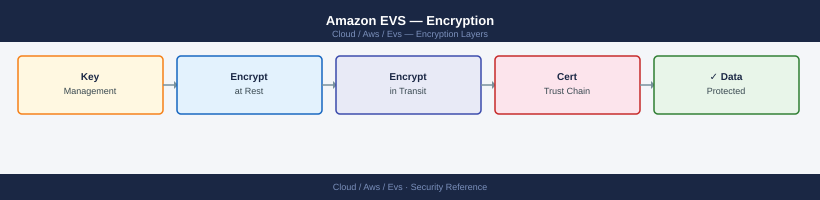

---
tags:
  - aws
  - security
description: "EVS encryption: vSAN encryption at rest, VM encryption via vSphere Encryption, TLS for all VCF management APIs, AWS KMS integration, and in-transit..."
---
# Amazon EVS — Encryption

<div class="kb-summary">
EVS encryption: vSAN encryption at rest, VM encryption via vSphere Encryption, TLS for all VCF management APIs, AWS KMS integration, and in-transit encryption for vMotion and vSAN traffic.

*Applies to: Amazon EVS*
</div>


## Before you begin

- **Access:** Admin credentials on all affected systems
- **Change management:** security changes require CAB approval in most environments
- **Rollback plan:** document current state before any security control change
- **Testing:** validate in a non-production environment first where possible

---

## Encryption Layers

EVS encryption operates across multiple layers. Understanding which layer covers what helps when designing a compliance posture or troubleshooting an encryption-related issue.

| Layer | What Is Encrypted | Mechanism | Key Location |
|---|---|---|---|
| vSAN data at rest | All vSAN objects on NVMe drives | vSAN encryption (AES-256-XTS) | NKP in vCenter or external KMS |
| VM data in transit (vMotion) | Live migration traffic | AES-256 per-vMotion stream | Negotiated per migration |
| vSAN data in transit | Storage replication between hosts | NVMe-oF over TCP with TLS | vSAN managed |
| Management API traffic | vCenter, NSX-T, SDDC Manager APIs | TLS 1.2+ | CA-signed or self-signed certs |
| AWS ENI traffic | Traffic between EVS hosts and AWS services | Encrypted by AWS within region | AWS managed |
| HCX migration traffic | Workload migration over DX/internet | TLS encrypted per service mesh | HCX managed |

AWS-side ENI traffic between EVS hosts in the same region is always encrypted by AWS at the network layer regardless of application-level encryption. This provides an additional baseline even before vSAN or VM encryption is enabled.

## vSAN Encryption at Rest

vSAN encryption has two key provider options:

**Native Key Provider (NKP):** Built into vCenter 7.0 U2 and later. Keys are derived from vCenter and backed up with the vCenter configuration. No external KMS dependency. This is the recommended starting point for EVS because it eliminates the external KMS as a dependency for cluster availability.

**External KMS:** Connects to an external key management server via the KMIP protocol. Provides hardware-backed key storage and centralized key management across multiple vCenter instances. Required for compliance standards that mandate hardware security module (HSM) key storage.

```powershell
# Prerequisites:
# 1. Configure vSphere Native Key Provider (NKP) — built into vCenter 7.0 U2+
#    OR connect an external KMS (e.g., HashiCorp Vault, Thales, AWS CloudHSM)

# Option A: vSphere Native Key Provider (NKP) — simplest for EVS
# vCenter UI → Administration → Key Providers → Add Native Key Provider
# Backed up with vCenter; no external KMS dependency

# Enable vSAN encryption via PowerCLI
$cluster = Get-Cluster -Name "EVS-Management-Cluster"
$vsanConfig = Get-VsanClusterConfiguration -Cluster $cluster
Set-VsanClusterConfiguration -VsanClusterConfiguration $vsanConfig -EncryptionEnabled $true
# Note: enabling encryption triggers full data rekey; 30-60 min for small clusters

# Verify encryption status
Get-VsanClusterConfiguration -Cluster $cluster | Select EncryptionEnabled

# Check which key provider is active
$vsanConfig = Get-VsanClusterConfiguration -Cluster $cluster
Write-Host "Encryption enabled: $($vsanConfig.EncryptionEnabled)"
Write-Host "Key provider: $($vsanConfig.KeyProviderId)"

# Check per-host encryption state
Get-VMHost | ForEach-Object {
    $hostView = Get-View -Id $_.Id
    Write-Host "$($_.Name): $($hostView.Config.VsanHostConfig.NetworkInfo)"
}
```

Enabling encryption on an existing cluster triggers a rolling disk reformat. Every vSAN object must be re-written in encrypted form. For a cluster with significant data, this can take hours. Plan a maintenance window and ensure at least one full FTT (Failures to Tolerate) worth of headroom before starting. Monitor resync progress with:

```powershell
# Monitor vSAN resync progress during encryption enablement
while ($true) {
    $resync = Get-VsanView -Id "VsanVcClusterHealthSystem-vsan-cluster-health-system"
    $stats = $resync.QueryVsanClusterHealthSummary($cluster.Id, $null, @("vsanRebalanceHealth"), $true, $null, $null, "defaultView")
    $stats.Groups | ForEach-Object { Write-Host "$($_.GroupName): $($_.GroupHealth)" }
    Start-Sleep -Seconds 60
}
```

## AWS KMS Integration (KMIP)

AWS KMS is not natively KMIP-compatible. To use AWS KMS as the external key manager for vSAN encryption, a KMIP-compatible proxy is required between vCenter and KMS.

Two supported approaches:

**AWS CloudHSM with KMIP:** CloudHSM clusters support the KMIP protocol natively. Configure vCenter's external KMS to point to the CloudHSM cluster endpoint. Keys are stored in dedicated HSM hardware meeting FIPS 140-2 Level 3.

**KMIP proxy (e.g., HashiCorp Vault, Thales):** Run a KMIP proxy VM in the management cluster VPC. The proxy forwards KMIP requests from vCenter to AWS KMS using the KMS Encrypt/Decrypt API. Thales CipherTrust Manager and HashiCorp Vault Enterprise both support this pattern.

```bash
# Create KMS key for vSAN/VM encryption
aws kms create-key \
  --description "EVS vSAN Encryption Key" \
  --key-usage ENCRYPT_DECRYPT \
  --key-spec SYMMETRIC_DEFAULT \
  --tags TagKey=Project,TagValue=evs

# Get key ID for vCenter KMS configuration
aws kms describe-key --key-id <key-id> --query 'KeyMetadata.[KeyId,Arn]'

# Configure external KMS in vCenter
# vCenter → Administration → Key Providers → Add Standard Key Provider
# KMS vendor: select appropriate vendor (Thales, IBM, etc.)
# For AWS KMS native: use vSphere Native Key Provider backed by AWS KMS via custom key store

# Enable automatic key rotation on the KMS CMK (annual rotation)
aws kms enable-key-rotation --key-id <key-id>

# Verify key rotation status
aws kms get-key-rotation-status --key-id <key-id>
```


```text title="Expected output"
{
    "KeyMetadata": {
        "AWSAccountId": "123456789012",
        "KeyId": "arn:aws:kms:us-east-1:123456789012:key/a1b2c3d4-e5f6-7890-abcd-ef1234567890",
        "Arn": "arn:aws:kms:us-east-1:123456789012:key/a1b2c3d4-e5f6-7890-abcd-ef1234567890",
        "CreationDate": "2024-01-15T14:32:18.123000+00:00",
        "Enabled": true,
        "Description": "EVS vSAN Encryption Key",
        "KeyUsage": "ENCRYPT_DECRYPT",
        "KeySpec": "SYMMETRIC_DEFAULT",
        "KeyState": "Enabled",
        "Origin": "AWS_KMS"
    }
}

KeyId: a1b2c3d4-e5f6-7890-abcd-ef1234567890
Arn: arn:aws:kms:us-east-1:123456789012:key/a1b2c3d4-e5f6-7890-abcd-ef1234567890

(no output — command completes silently)

{
    "KeyRotationEnabled": true
}
```

!!! warning "Common errors"
    | Error | Fix |
    |---|---|
    | `An error occurred (NotFoundException) when calling the DescribeKey operation: Key 'arn:aws:kms:us-east-1:123456789012:key/invalid-key-id' does not exist` | Replace `<key-id>` with the actual key ID or ARN returned from the create-key command. |
    | `An error occurred (InvalidStateException) when calling the EnableKeyRotation operation: arn:aws:kms:us-east-1:123456789012:key/a1b2c3d4-e5f6-7890-abcd-ef1234567890 is pending deletion.` | Wait for the key deletion period to complete or use a different key that is not scheduled for deletion. |
When using an external KMS, ensure the KMS cluster is highly available. A vSAN cluster that loses connectivity to its KMS cannot power on encrypted VMs or decrypt new reads from disk. Deploy the KMIP proxy or CloudHSM cluster with redundancy across Availability Zones.

## VM Encryption

vSphere VM Encryption encrypts individual VM files (`.vmdk`, `.nvram`, swap) independently of vSAN encryption. This is useful when:
- Only specific VMs need encryption (e.g., VMs holding regulated data in a mixed cluster).
- Compliance audits require per-VM encryption evidence rather than cluster-level evidence.
- The cluster does not have vSAN (VMs stored on NFS/VMFS datastores).

VM Encryption uses Storage Policy Based Management (SPBM). Create a storage policy with the VM Encryption capability, then apply that policy to target VMs.

```powershell
# Create VM Storage Policy with encryption
$policy = New-SpbmStoragePolicy -Name "VM-Encrypted" -Description "Encrypted VM policy"

# Associate encryption capability with policy
$rule = New-SpbmRule -AnyOfRuleSets @(
  New-SpbmRuleSet -AllOfRules @(
    New-SpbmRule -Capability (Get-SpbmCapability -Name "vmencryption.enabled") -Value $true
  )
)
Set-SpbmStoragePolicy -StoragePolicy $policy -RuleSet $rule

# Apply policy to VM
Set-VM -VM (Get-VM "my-vm") -StoragePolicy "VM-Encrypted"
# This triggers encryption of VM home + all disks — backup the VM first

# Check compliance status for VMs using the encrypted policy
Get-SpbmEntityConfiguration -VM (Get-VM) | Where-Object {
    $_.StoragePolicy.Name -eq "VM-Encrypted"
} | Select-Object VM, ComplianceStatus, ComplianceTaskStatus
```

VM Encryption and vSAN Encryption can coexist. With both enabled, VM data is encrypted at the VM layer and then stored in an already-encrypted vSAN object. This is sometimes called "double encryption" and may be required by certain compliance frameworks.

## TLS Certificate Management

VCF components use self-signed certificates by default after bringup. Replace these with CA-signed certificates for production environments to avoid certificate trust warnings and to satisfy compliance requirements.

SDDC Manager manages certificate lifecycle for all VCF components (vCenter, NSX-T, SDDC Manager itself, ESXi hosts).

```bash
# Generate a CSR for vCenter via SDDC Manager API
curl -sk -u "$SDDC_USER:$SDDC_PASS" \
  -X PUT "https://sddc-manager.vcf.internal/v1/certificates/csrs" \
  -H "Content-Type: application/json" \
  -d '{
    "csrGenerationSpec": {
      "country": "US",
      "state": "California",
      "locality": "San Jose",
      "organization": "Example Corp",
      "organizationUnit": "Platform Engineering",
      "keySize": 2048,
      "keyAlgorithm": "RSA"
    },
    "resources": [
      {"fqdn": "vcenter.vcf.internal", "type": "VCENTER", "name": "vcenter"}
    ]
  }' | python3 -m json.tool

# After signing the CSR with your CA, import the signed certificate
curl -sk -u "$SDDC_USER:$SDDC_PASS" \
  -X PUT "https://sddc-manager.vcf.internal/v1/certificates" \
  -H "Content-Type: application/json" \
  -d '{
    "caType": "Microsoft",
    "pemCertificates": [
      {
        "certificate": "<PEM-encoded-signed-cert>",
        "certChain": "<PEM-encoded-CA-chain>",
        "resource": {"fqdn": "vcenter.vcf.internal", "type": "VCENTER", "name": "vcenter"}
      }
    ]
  }' | python3 -m json.tool
```


```text title="Expected output"
{
  "id": "550e8400-e29b-41d4-a716-446655440000",
  "csrGenerationSpec": {
    "country": "US",
    "state": "California",
    "locality": "San Jose",
    "organization": "Example Corp",
    "organizationUnit": "Platform Engineering",
    "keySize": 2048,
    "keyAlgorithm": "RSA"
  },
  "resources": [
    {
      "fqdn": "vcenter.vcf.internal",
      "type": "VCENTER",
      "name": "vcenter",
      "certificateStatus": "PENDING"
    }
  ],
  "creationTimestamp": "2024-01-15T09:42:17.123Z",
  "status": "GENERATED"
}
{
  "id": "550e8400-e29b-41d4-a716-446655440001",
  "caType": "Microsoft",
  "resources": [
    {
      "fqdn": "vcenter.vcf.internal",
      "type": "VCENTER",
      "name": "vcenter",
      "certificateStatus": "INSTALLED",
      "expiryDate": "2026-01-15T09:42:17.000Z"
    }
  ],
  "status": "COMPLETED"
}
```

!!! warning "Common errors"
    | Error | Fix |
    |---|---|
    | `curl: (60) SSL certificate problem: self signed certificate` | Add `-k` flag to skip SSL verification, or configure proper CA certificates in your curl environment. |
    | `{"error":"Invalid credentials","status":401}` | Verify `$SDDC_USER` and `$SDDC_PASS` environment variables are set correctly and the user has API permissions in SDDC Manager. |
    | `{"error":"Certificate chain validation failed","status":400}` | Ensure the PEM-encoded certificate and CA chain are properly formatted with correct BEGIN/END markers and match the CSR FQDN exactly. |
```bash
# Verify current TLS configuration on vCenter
openssl s_client -connect $VCENTER:443 </dev/null 2>/dev/null | grep -E "Protocol|Cipher"

# NSX-T management API — TLS 1.2 required
curl -sk --tlsv1.2 -u "admin:$NSX_PASSWORD" "$NSX_URL/api/v1/cluster/status" | \
  python3 -c "import sys,json; print(json.load(sys.stdin).get('mgmt_cluster_status',{}).get('status'))"

# Check certificate expiry for all VCF components via SDDC Manager
curl -sk -u "$SDDC_USER:$SDDC_PASS" \
  "https://sddc-manager.vcf.internal/v1/certificates" | \
  python3 -c "
import sys, json
certs = json.load(sys.stdin)
for c in certs.get('elements', []):
    print(f\"{c['resource']['fqdn']}: expires {c.get('notAfter', 'unknown')}\")"
```


```text title="Expected output"
Protocol  : TLSv1.2
Cipher    : ECDHE-RSA-AES256-GCM-SHA384
CONNECTED(00000003)
HEALTHY
vcenter.vcf.internal: expires 2025-08-14T23:59:59Z
nsx-manager-01.vcf.internal: expires 2025-09-22T23:59:59Z
sddc-manager.vcf.internal: expires 2025-07-30T23:59:59Z
esxi-01.vcf.internal: expires 2025-10-11T23:59:59Z
esxi-02.vcf.internal: expires 2025-10-11T23:59:59Z
```

!!! warning "Common errors"
    | Error | Fix |
    |---|---|
    | `curl: (60) SSL certificate problem: self signed certificate` | Add `-k` flag to curl command to skip certificate verification in lab/test environments, or import the CA certificate into your system trust store. |
    | `json.decoder.JSONDecodeError: Expecting value: line 1 column 1` | Verify the API endpoint URL is correct and the service is running; check credentials with `curl -sk -u "$SDDC_USER:$SDDC_PASS" https://sddc-manager.vcf.internal/v1/system/version` first. |
    | `Protocol  : TLSv1.0` or `Protocol  : TLSv1.1` | Update vCenter or NSX-T to a supported version that enforces TLS 1.2 minimum; check VMware release notes for required patches. |
## In-Transit Encryption

```bash
# vMotion encryption — enabled per VM or globally
# PowerCLI: Set-VM -VM $vm -EncryptedVMotion "Required"
# Options: Disabled, Opportunistic (default, encrypts if supported), Required (enforced)

# vSAN in-transit (data-in-transit encryption)
# Available in vSAN 7.0+ via vSAN Data-in-Transit Encryption
# PowerCLI:
$vsanConfig = Get-VsanClusterConfiguration -Cluster (Get-Cluster)
Set-VsanClusterConfiguration -VsanClusterConfiguration $vsanConfig \
  -DataInTransitEncryptionEnabled $true

# VCF management traffic — all APIs use TLS 1.2+ by default
# Verify TLS version on vCenter
openssl s_client -connect $VCENTER:443 </dev/null 2>/dev/null | grep -E "Protocol|Cipher"
```


```text title="Expected output"
depth=0 OU = US, O = VMware, CN = vcenter.corp.local, emailAddress = admin@corp.local
verify return:1
Protocol  : TLSv1.2
Cipher   : ECDHE-RSA-AES256-GCM-SHA384
Cipher Suite : TLS_ECDHE_RSA_WITH_AES_256_GCM_SHA384
```

!!! warning "Common errors"
    | Error | Fix |
    |---|---|
    | `unable to connect to $VCENTER:443` | Replace `$VCENTER` with the actual vCenter hostname or IP address (e.g., `vcenter.corp.local`). |
    | `Protocol  : TLSv1.1` | Update vCenter to the latest patch level or configure `sslProtocols` in `/etc/vmware-vpx/vpxd.cfg` to disable TLS 1.1 and earlier. |
## See also

- [Amazon EVS — Hardening](../hardening/)
- [Amazon EVS — Health Checks](../../operations/health-checks/)
