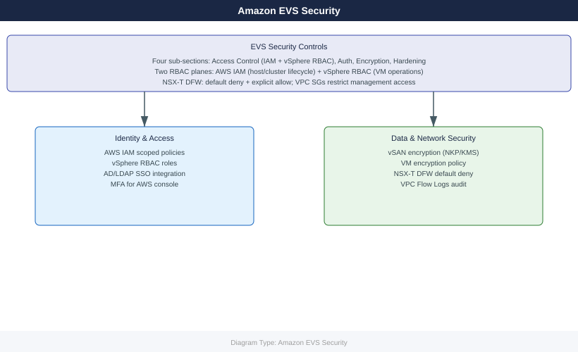

---
tags:
  - aws
  - security
description: "EVS security controls: AWS IAM for cluster management, vSphere RBAC, NSX-T micro-segmentation, encryption at rest and in transit, and CIS hardening for..."
---
# Amazon EVS — Security

<!-- diagram:evs-security -->

EVS security controls: AWS IAM for cluster management, vSphere RBAC, NSX-T micro-segmentation, encryption at rest and in transit, and CIS hardening for VCF components.

*Applies to: Amazon EVS*

  <a class="kb-card" href="access-control/">
    Access Control
    IAM roles for EVS, vSphere RBAC, SDDC Manager roles, least-privilege design
  </a>
  <a class="kb-card" href="authentication/">
    Authentication
    vCenter SSO, LDAP/AD integration, MFA for AWS console, SSH key management
  </a>
  <a class="kb-card" href="encryption/">
    Encryption
    vSAN encryption at rest, VM encryption, TLS for VCF APIs, KMS integration
  </a>
  <a class="kb-card" href="hardening/">
    Hardening
    NSX-T micro-segmentation, security groups, VPC flow logs, CIS controls
  </a>

