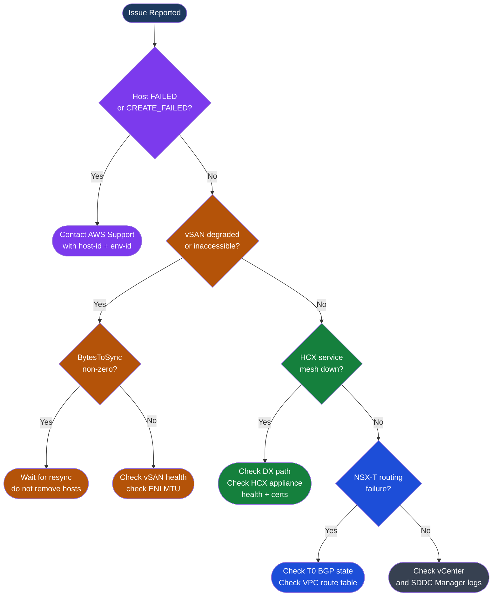
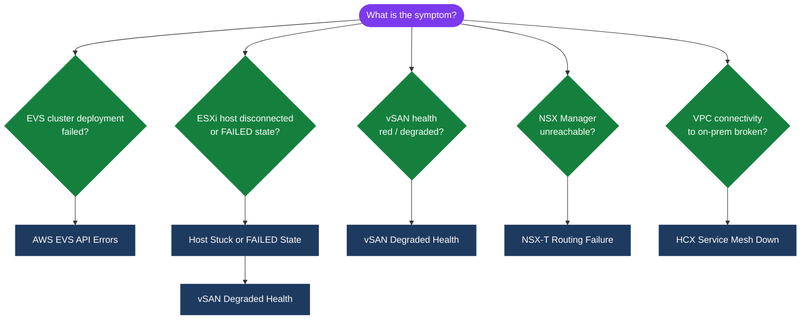

---
tags:
  - aws
  - troubleshooting
search:
  boost: 1.5
---
# Amazon EVS — Common Issues

<div class="kb-summary">
Troubleshooting guide for EVS failures: host stuck in non-CREATED state, vSAN degraded health, HCX service mesh down, NSX-T routing failures, and API errors.

*Applies to: Amazon EVS*
</div>




## Diagnostic Flow



---

## Before you begin

- **Access:** Admin credentials on all affected systems
- **Gather first:** recent error message text, event timestamps, and affected object names
- **Scope:** confirm whether the issue affects a single object, host, cluster, or site
- **Escalation:** open a vendor support ticket before running any destructive step
- **Logging:** document each command and output — required if escalation is needed

---

## Host Stuck or FAILED State

```bash
# Check host state
aws evs list-environment-hosts --environment-id $ENV_ID \
  --query 'hostSummaries[*].[hostId,state]' --output table

# If state is FAILED or CREATE_FAILED:
# 1. DO NOT delete the host immediately — preserve for AWS diagnostics
# 2. Check CloudTrail for EVS API error events
aws logs filter-log-events \
  --log-group-name CloudTrail \
  --filter-pattern "{ $.eventSource = \"evs.amazonaws.com\" && $.errorCode EXISTS }" \
  --start-time $(($(date +%s) - 86400))000

# 3. Check if corresponding EC2 instance is impaired
aws ec2 describe-instance-status \
  --filters Name=instance-state-name,Values=running \
  --query 'InstanceStatuses[?SystemStatus.Status!=`ok`]'

# 4. Open AWS support case with host-id and environment-id
# Provide: environment ID, host ID, approximate failure timestamp, CloudTrail export
```

Get the host's event history to understand the sequence of state transitions:

```bash
# Get recent EVS API events for a specific host
aws cloudtrail lookup-events \
  --lookup-attributes AttributeKey=ResourceName,AttributeValue=$HOST_ID \
  --start-time $(date -u -v-72H +%Y-%m-%dT%H:%M:%SZ) \
  --query 'Events[*].[EventTime,EventName,ErrorCode]' \
  --output table

# Check if the host's ENIs are still attached to the instance
INSTANCE_ID=$(aws evs get-environment-host \
  --environment-id $ENV_ID --host-id $HOST_ID \
  --query 'host.instanceId' --output text)

aws ec2 describe-network-interfaces \
  --filters Name=attachment.instance-id,Values=$INSTANCE_ID \
  --query 'NetworkInterfaces[*].[NetworkInterfaceId,Status,Attachment.Status]' \
  --output table
```

Determining recovery vs replacement:
- If ENIs are detached or the EC2 instance status shows a system failure, the host needs replacement — AWS support will coordinate.
- If the host's EC2 instance is running and ENIs are attached, the issue may be in the EVS control plane reporting — the host may be recoverable without replacement.
- Never attempt to manually delete and re-add a FAILED host without AWS guidance. The EVS control plane may not cleanly deregister the host, leaving orphaned state.

## vSAN Degraded Health

```powershell
# Get vSAN health status
$cluster = Get-Cluster -Name "EVS-Management-Cluster"
$vsanHealth = Get-VsanView -Id "VsanVcClusterHealthSystem-vsan-cluster-health-system"
$summary = $vsanHealth.QueryVsanClusterHealthSummary($cluster.Id, $null, $null, $true, $null, $null, "defaultView")
$summary.Groups | Where-Object { $_.GroupHealth -ne "green" } | ForEach-Object {
    Write-Host "DEGRADED: $($_.GroupName) - $($_.GroupHealth)"
    $_.Tests | Where-Object { $_.TestHealth -ne "green" } | ForEach-Object {
        Write-Host "  Test: $($_.TestName) - $($_.TestHealth)"
    }
}

# Common vSAN issues:
# "Performance Service" degraded → enable vSAN Performance Service
#   Set-VsanClusterConfiguration -VsanClusterConfiguration $vsanConfig -PerformanceServiceEnabled $true

# "vSAN HCL DB up-to-date" → update HCL database in vCenter
#   vCenter → Cluster → vSAN → Skyline Health → Download HCL DB

# "Network misconfiguration" → check VTEP VMkernel on all hosts
#   Get-VMHostNetworkAdapter -VMHost * | Where { $_.VsanTrafficEnabled }
```

Common vSAN health check failures in EVS and their causes:

| Health Check | Failure Cause | Resolution |
|---|---|---|
| Network Latency Checks | ENI MTU mismatch; EVS requires jumbo frames (MTU 9000) | Verify VMkernel adapters have MTU 9000; check VPC subnet MTU |
| Operation Health | vSAN disk group capacity >75% | Expand cluster or migrate VMs off |
| Hardware Compatibility | NVMe firmware not on HCL | Update HCL DB in vCenter; AWS manages firmware on EVS hosts |
| vSAN Build Recommendation | VCF patch available | Apply via SDDC Manager lifecycle management |
| Component Metadata Health | Objects have missing components | Check BytesToSync; wait for resync to complete |
| ESXi vSAN Health | Host not contributing storage | Check ESXi host state; check disk group status |

```powershell
# Get degraded vSAN object details
$vsanDisk = Get-VsanView -Id "VsanVcClusterHealthSystem-vsan-cluster-health-system"
$objHealth = $vsanDisk.QueryVsanClusterHealthSummary(
    $cluster.Id, $null, @("vsanObjectHealth"), $true, $null, $null, "defaultView")
$objHealth.Groups | ForEach-Object {
    $_.Tests | ForEach-Object {
        Write-Host "$($_.TestName): $($_.TestHealth)"
        if ($_.TestDetails) { Write-Host "  Details: $($_.TestDetails)" }
    }
}

# Check BytesToSync across all disk groups
Get-VsanDiskGroup | ForEach-Object {
    $resync = $_ | Get-VsanResyncingComponent
    if ($resync) { Write-Host "$($_.VMHost.Name): BytesToSync=$($resync | Measure-Object -Sum BytesToSync | Select -Expand Sum)" }
}
```

## HCX Service Mesh Down

```bash
# Verify HCX interconnect status
curl -sk -u "admin:$HCX_PASSWORD" \
  "https://$HCX_MANAGER_IP/hybridity/api/interconnect/links" | \
  python3 -c "
import sys, json
for link in json.load(sys.stdin).get('items', []):
    print(f\"{link['label']}: {link['status']}\")
"

# Common causes:
# a) Direct Connect down → check DX connection in AWS console
aws directconnect describe-connections --query 'connections[*].[connectionName,connectionState]'

# b) HCX appliance IP unreachable → verify SG rules on VTEP subnet allow UDP 4500, UDP 500
aws ec2 describe-security-groups --group-ids sg-hcx \
  --query 'SecurityGroups[*].IpPermissions'

# c) Certificate expired → regenerate service mesh certificates
#    HCX Manager UI → Interconnect → Service Mesh → Actions → Redeploy
```

To restart individual HCX appliances without redeploying the entire service mesh:

```bash
# From vCenter, power cycle the specific HCX appliance VM
# HCX appliance VMs are named: HCX-IX-*, HCX-NE-*, HCX-WO-*

# Via PowerCLI:
$hcxVm = Get-VM | Where-Object { $_.Name -like "HCX-IX-*" }
Stop-VM -VM $hcxVm -Confirm:$false
Start-Sleep -Seconds 30
Start-VM -VM $hcxVm

# Monitor HCX service mesh recovery (takes 3-5 min after appliance restart)
watch -n 30 "curl -sk -u admin:$HCX_PASSWORD https://$HCX_MANAGER_IP/hybridity/api/interconnect/links | python3 -c \"import sys,json; [print(f'{l[\\\"label\\\"]}: {l[\\\"status\\\"]}') for l in json.load(sys.stdin).get('items',[])]\" "
```

Common HCX outage causes:

| Cause | Symptom | Fix |
|---|---|---|
| Stale NTP (clock drift > 5 min) | Service mesh stuck "Connecting" | Sync NTP on HCX Manager and cloud-side VMs |
| Certificate expiry | Service mesh shows "Certificate error" | HCX UI → Interconnect → Service Mesh → Redeploy |
| VCF password rotation | HCX cloud credentials rejected | Update HCX cloud site credentials after vCenter password change |
| DX circuit down | All tunnels show "Down" | Check DX in AWS console; failover to backup circuit |

## NSX-T Routing Failure (VM Connectivity)

```bash
# Symptoms: VMs on NSX-T segments can't communicate with VPC resources or on-premises

# 1. Check T0 router BGP status (should be Established for DX/TGW)
curl -sk -u "admin:$NSX_PASSWORD" \
  "$NSX_URL/api/v1/logical-routers?router_type=TIER0" | \
  python3 -c "import sys,json; [print(f\"{r['display_name']}: {r['id']}\") for r in json.load(sys.stdin)['results']]"

# Get T0 BGP neighbors
curl -sk -u "admin:$NSX_PASSWORD" \
  "$NSX_URL/api/v1/logical-routers/<t0-id>/routing/bgp/neighbors/status" | \
  python3 -c "
import sys,json
for n in json.load(sys.stdin).get('results',[]):
    print(f\"{n['neighbor_address']}: {n['connection_state']}\")
"

# 2. Verify ENI routing in VPC route table
aws ec2 describe-route-tables \
  --filters Name=vpc-id,Values=$EVS_VPC_ID \
  --query 'RouteTables[*].Routes[?DestinationCidrBlock!=`local`]'

# 3. Ping from NSX-T Edge node to VPC gateway
# NSX-T UI → Networking → Tier-0 Gateways → Edge node → Test Connectivity
```

Check T0 BGP neighbor state via the NSX-T Policy API (preferred for NSX-T 3.x+):

```bash
# List T0 gateways
curl -sk -u "admin:$NSX_PASSWORD" \
  "$NSX_URL/policy/api/v1/infra/tier-0s" | \
  python3 -c "import sys,json; [print(f\"{g['id']}: {g['display_name']}\") for g in json.load(sys.stdin)['results']]"

# Get BGP neighbor state for a T0 gateway
curl -sk -u "admin:$NSX_PASSWORD" \
  "$NSX_URL/policy/api/v1/infra/tier-0s/<t0-id>/locale-services/<locale-svc-id>/bgp/neighbors/status" | \
  python3 -c "
import sys, json
d = json.load(sys.stdin)
for n in d.get('results', []):
    print(f\"Neighbor: {n['neighbor_address']} | State: {n['connection_state']} | AS: {n['remote_as_number']}\")"

# Check VPC route table — workload CIDR must point to T0 uplink ENI
# If the route is missing, NSX-T may have lost the ENI attachment
aws ec2 describe-route-tables \
  --filters Name=vpc-id,Values=$EVS_VPC_ID \
  --query 'RouteTables[*].Routes[?contains(DestinationCidrBlock, `172.16`) || contains(DestinationCidrBlock, `10.`)]'
```

## AWS EVS API Errors

| Error Code | Meaning | Resolution |
|---|---|---|
| `AccessDeniedException` | IAM role lacks required evs:* permission | Verify IAM policy includes the specific action and resource ARN |
| `ResourceInUseException` | Host still has vSAN evacuation in progress | Wait for BytesToSync = 0, then retry delete |
| `LimitExceededException` | Account quota for EVS hosts reached | Request quota increase via Service Quotas console |
| `ResourceNotFoundException` | Environment ID or host ID does not exist | Verify IDs with `aws evs list-environments` |
| `ValidationException` | Request parameters malformed | Check AWS CLI version; verify JSON structure of request body |
| `InternalServerException` | AWS-side EVS control plane error | Retry with exponential backoff; open support case if persistent |
| `ThrottlingException` | API call rate exceeded | Add jitter and backoff to automation scripts; EVS API limit is low |

```bash
# Common API error: AccessDeniedException
# Fix: verify IAM role has elasticvmwareservice:* on the specific environment ARN

# Common API error: ResourceInUseException when deleting host
# Cause: host still in maintenance mode with vSAN evacuation incomplete
# Fix: wait for vSAN BytesToSync = 0, then retry delete

# Common API error: LimitExceededException
# Check current quota
aws service-quotas get-service-quota \
  --service-code elasticvmwareservice \
  --quota-code L-XXXXXXXX   # check quota name in console

# Request quota increase
aws service-quotas request-service-quota-increase \
  --service-code elasticvmwareservice \
  --quota-code L-XXXXXXXX \
  --desired-value 10
```

---

## See also

- [Amazon EVS — Diagnostics](diagnostics/)
- [Amazon EVS — Escalation](escalation/)
- [Amazon EVS — Health Checks](../operations/health-checks/)

## Verify resolution

- Confirm the original symptom no longer occurs
- Check logs for any residual errors related to the issue
- Monitor for 10–15 minutes to confirm the fix is stable
