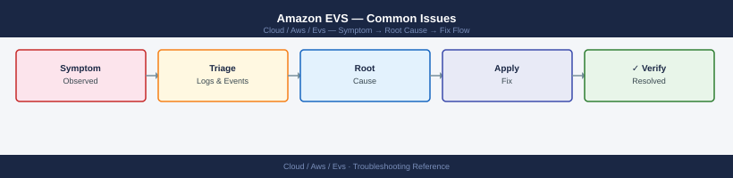

---
tags:
  - aws
  - troubleshooting
search:
  boost: 1.5
---
# Amazon EVS — Common Issues

<div class="kb-summary">
Troubleshooting guide for EVS failures: host stuck in non-CREATED state, vSAN degraded health, HCX service mesh down, NSX-T routing failures, and API errors.

*Applies to: Amazon EVS*
</div>


```d2
direction: right

A: "Issue Reported" {shape: rectangle}
C: "Contact AWS Support\nwith host-id + env-id" {shape: rectangle}
F: "Wait for resync\ndo not remove hosts" {shape: rectangle}
G: "Check vSAN health\ncheck ENI MTU" {shape: rectangle}
I: "Check DX path\nCheck HCX appliance\nhealth + certs" {shape: rectangle}
K: "Check T0 BGP state\nCheck VPC route table" {shape: rectangle}
L: "Check vCenter\nand SDDC Manager logs" {shape: rectangle}

```

```d2
direction: down

symptom: Identify Symptom {shape: diamond}
diagnostic_flow: "Diagnostic Flow" {shape: rectangle}
host_stuck_or_failed_state: "Host Stuck or FAILED State" {shape: rectangle}
vsan_degraded_health: "vSAN Degraded Health" {shape: rectangle}
hcx_service_mesh_down: "HCX Service Mesh Down" {shape: rectangle}
nsxt_routing_failure_vm_connectivity: "NSX-T Routing Failure (VM Connectivity)" {shape: rectangle}
aws_evs_api_errors: "AWS EVS API Errors" {shape: rectangle}
resolution: Resolve or Escalate {shape: oval}

symptom -> diagnostic_flow: investigate
symptom -> host_stuck_or_failed_state: investigate
symptom -> vsan_degraded_health: investigate
symptom -> hcx_service_mesh_down: investigate
symptom -> nsxt_routing_failure_vm_connectivity: investigate
symptom -> aws_evs_api_errors: investigate
diagnostic_flow -> resolution
host_stuck_or_failed_state -> resolution
vsan_degraded_health -> resolution
hcx_service_mesh_down -> resolution
nsxt_routing_failure_vm_connectivity -> resolution
aws_evs_api_errors -> resolution
```

## Diagnostic Flow

```d2
direction: right

D1: "D1" {shape: rectangle}
R1: "AWS EVS API Errors" {shape: rectangle}
D2: "D2" {shape: rectangle}
R2: "Host Stuck or FAILED State" {shape: rectangle}
D3: "D3" {shape: rectangle}
R3: "vSAN Degraded Health" {shape: rectangle}
D4: "D4" {shape: rectangle}
R4: "NSX-T Routing Failure" {shape: rectangle}
D5: "D5" {shape: rectangle}
R5: "HCX Service Mesh Down" {shape: rectangle}
R6: "vSAN Degraded Health" {shape: rectangle}
S: "What is the symptom?" {shape: rectangle}

D1 -> R1
D2 -> R2
D3 -> R3
D4 -> R4
D5 -> R5
R2 -> R6
```

---

## Before you begin

- **Access:** Admin credentials on all affected systems
- **Gather first:** recent error message text, event timestamps, and affected object names
- **Scope:** confirm whether the issue affects a single object, host, cluster, or site
- **Escalation:** open a vendor support ticket before running any destructive step
- **Logging:** document each command and output — required if escalation is needed

---

## Host Stuck or FAILED State

```bash
# Check host state
aws evs list-environment-hosts --environment-id $ENV_ID \
  --query 'hostSummaries[*].[hostId,state]' --output table

# If state is FAILED or CREATE_FAILED:
# 1. DO NOT delete the host immediately — preserve for AWS diagnostics
# 2. Check CloudTrail for EVS API error events
aws logs filter-log-events \
  --log-group-name CloudTrail \
  --filter-pattern "{ $.eventSource = \"evs.amazonaws.com\" && $.errorCode EXISTS }" \
  --start-time $(($(date +%s) - 86400))000

# 3. Check if corresponding EC2 instance is impaired
aws ec2 describe-instance-status \
  --filters Name=instance-state-name,Values=running \
  --query 'InstanceStatuses[?SystemStatus.Status!=`ok`]'

# 4. Open AWS support case with host-id and environment-id
# Provide: environment ID, host ID, approximate failure timestamp, CloudTrail export
```


```text title="Expected output"
---------------------------------
|      hostId      |    state    |
|---------------------------------|
| host-0a1b2c3d4e5f6g7h | RUNNING     |
| host-1f2g3h4i5j6k7l8m | RUNNING     |
| host-2k3l4m5n6o7p8q9r | FAILED      |
| host-3p4q5r6s7t8u9v0w | CREATE_FAILED |
---------------------------------

{
    "events": [
        {
            "eventId": "evt-12345678-1234-1234-1234-123456789012",
            "timestamp": 1699564800000,
            "message": "{\"eventSource\":\"evs.amazonaws.com\",\"errorCode\":\"InsufficientCapacity\",\"eventName\":\"CreateEnvironmentHost\"}"
        },
        {
            "eventId": "evt-87654321-4321-4321-4321-210987654321",
            "timestamp": 1699478400000,
            "message": "{\"eventSource\":\"evs.amazonaws.com\",\"errorCode\":\"InvalidParameterValue\",\"eventName\":\"CreateEnvironmentHost\"}"
        }
    ],
    "searchedLogStreams": 3
}

{
    "InstanceStatuses": [
        {
            "InstanceId": "i-0a1b2c3d4e5f6g7h",
            "SystemStatus": {
                "Status": "impaired",
                "Details": [
                    {
                        "Name": "reachability",
                        "Status": "failed"
                    }
                ]
            }
        }
    ]
}
```

!!! warning "Common errors"
    **`An error occurred (InvalidParameterValue) when calling the ListEnvironmentHosts operation: Invalid environment ID format`** — Verify the environment ID is set correctly with `echo $ENV_ID` and matches the format `env-xxxxxxxxxxxxxxxx`.
    **`An error occurred (AccessDenied) when calling the FilterLogEvents operation: User is not authorized to perform: logs:FilterLogEvents`** — Add the `logs:FilterLogEvents` permission to your IAM policy or use an IAM role with CloudTrail log access.
    **`An error occurred (UnauthorizedOperation) when calling the DescribeInstanceStatus operation: You are not authorized to perform this operation`** — Ensure your IAM user/role has `ec2:DescribeInstanceStatus` permission attached.
Get the host's event history to understand the sequence of state transitions:

```bash
# Get recent EVS API events for a specific host
aws cloudtrail lookup-events \
  --lookup-attributes AttributeKey=ResourceName,AttributeValue=$HOST_ID \
  --start-time $(date -u -v-72H +%Y-%m-%dT%H:%M:%SZ) \
  --query 'Events[*].[EventTime,EventName,ErrorCode]' \
  --output table

# Check if the host's ENIs are still attached to the instance
INSTANCE_ID=$(aws evs get-environment-host \
  --environment-id $ENV_ID --host-id $HOST_ID \
  --query 'host.instanceId' --output text)

aws ec2 describe-network-interfaces \
  --filters Name=attachment.instance-id,Values=$INSTANCE_ID \
  --query 'NetworkInterfaces[*].[NetworkInterfaceId,Status,Attachment.Status]' \
  --output table
```


```text title="Expected output"
2024-01-15 14:32:18+00:00 | CreateNetworkInterface      | None
2024-01-15 13:47:52+00:00 | ModifyNetworkInterfaceAttribute | None
2024-01-15 12:19:33+00:00 | DetachNetworkInterface     | InvalidParameterValue
2024-01-15 11:05:14+00:00 | DescribeNetworkInterfaces  | None
2024-01-15 09:41:22+00:00 | AttachNetworkInterface     | None

i-0a7f2c8d9e1b4f6a3

NetworkInterfaceId        | Status    | Attachment.Status
--------------------------+-----------+------------------
eni-0c3d5e8f2a1b9d4e6     | in-use    | attached
eni-1f7a2b4c8d9e0a3f5     | in-use    | attached
eni-2e8b3c5d9f0a1b4g6     | available | None
```

!!! warning "Common errors"
    **`An error occurred (InvalidParameterValue) when calling the LookupEvents operation: Invalid start time format`** — Ensure the date command uses the correct format flag for your OS (use `date -u -d "72 hours ago" +%Y-%m-%dT%H:%M:%SZ` on Linux instead of `-v-72H`).
    **`An error occurred (ResourceNotFoundException) when calling the GetEnvironmentHost operation: Host not found`** — Verify that `$ENV_ID` and `$HOST_ID` variables are set correctly and the host exists in the specified environment.
    **`An error occurred (UnauthorizedOperation) when calling the DescribeNetworkInterfaces operation: You are not authorized to perform this operation`** — Ensure your AWS IAM credentials have `ec2:DescribeNetworkInterfaces` and `evs:GetEnvironmentHost` permissions attached.
Determining recovery vs replacement:
- If ENIs are detached or the EC2 instance status shows a system failure, the host needs replacement — AWS support will coordinate.
- If the host's EC2 instance is running and ENIs are attached, the issue may be in the EVS control plane reporting — the host may be recoverable without replacement.
- Never attempt to manually delete and re-add a FAILED host without AWS guidance. The EVS control plane may not cleanly deregister the host, leaving orphaned state.

## vSAN Degraded Health

```powershell
# Get vSAN health status
$cluster = Get-Cluster -Name "EVS-Management-Cluster"
$vsanHealth = Get-VsanView -Id "VsanVcClusterHealthSystem-vsan-cluster-health-system"
$summary = $vsanHealth.QueryVsanClusterHealthSummary($cluster.Id, $null, $null, $true, $null, $null, "defaultView")
$summary.Groups | Where-Object { $_.GroupHealth -ne "green" } | ForEach-Object {
    Write-Host "DEGRADED: $($_.GroupName) - $($_.GroupHealth)"
    $_.Tests | Where-Object { $_.TestHealth -ne "green" } | ForEach-Object {
        Write-Host "  Test: $($_.TestName) - $($_.TestHealth)"
    }
}

# Common vSAN issues:
# "Performance Service" degraded → enable vSAN Performance Service
#   Set-VsanClusterConfiguration -VsanClusterConfiguration $vsanConfig -PerformanceServiceEnabled $true

# "vSAN HCL DB up-to-date" → update HCL database in vCenter
#   vCenter → Cluster → vSAN → Skyline Health → Download HCL DB

# "Network misconfiguration" → check VTEP VMkernel on all hosts
#   Get-VMHostNetworkAdapter -VMHost * | Where { $_.VsanTrafficEnabled }
```

Common vSAN health check failures in EVS and their causes:

| Health Check | Failure Cause | Resolution |
|---|---|---|
| Network Latency Checks | ENI MTU mismatch; EVS requires jumbo frames (MTU 9000) | Verify VMkernel adapters have MTU 9000; check VPC subnet MTU |
| Operation Health | vSAN disk group capacity >75% | Expand cluster or migrate VMs off |
| Hardware Compatibility | NVMe firmware not on HCL | Update HCL DB in vCenter; AWS manages firmware on EVS hosts |
| vSAN Build Recommendation | VCF patch available | Apply via SDDC Manager lifecycle management |
| Component Metadata Health | Objects have missing components | Check BytesToSync; wait for resync to complete |
| ESXi vSAN Health | Host not contributing storage | Check ESXi host state; check disk group status |

```powershell
# Get degraded vSAN object details
$vsanDisk = Get-VsanView -Id "VsanVcClusterHealthSystem-vsan-cluster-health-system"
$objHealth = $vsanDisk.QueryVsanClusterHealthSummary(
    $cluster.Id, $null, @("vsanObjectHealth"), $true, $null, $null, "defaultView")
$objHealth.Groups | ForEach-Object {
    $_.Tests | ForEach-Object {
        Write-Host "$($_.TestName): $($_.TestHealth)"
        if ($_.TestDetails) { Write-Host "  Details: $($_.TestDetails)" }
    }
}

# Check BytesToSync across all disk groups
Get-VsanDiskGroup | ForEach-Object {
    $resync = $_ | Get-VsanResyncingComponent
    if ($resync) { Write-Host "$($_.VMHost.Name): BytesToSync=$($resync | Measure-Object -Sum BytesToSync | Select -Expand Sum)" }
}
```

## HCX Service Mesh Down

```bash
# Verify HCX interconnect status
curl -sk -u "admin:$HCX_PASSWORD" \
  "https://$HCX_MANAGER_IP/hybridity/api/interconnect/links" | \
  python3 -c "
import sys, json
for link in json.load(sys.stdin).get('items', []):
    print(f\"{link['label']}: {link['status']}\")
"

# Common causes:
# a) Direct Connect down → check DX connection in AWS console
aws directconnect describe-connections --query 'connections[*].[connectionName,connectionState]'

# b) HCX appliance IP unreachable → verify SG rules on VTEP subnet allow UDP 4500, UDP 500
aws ec2 describe-security-groups --group-ids sg-hcx \
  --query 'SecurityGroups[*].IpPermissions'

# c) Certificate expired → regenerate service mesh certificates
#    HCX Manager UI → Interconnect → Service Mesh → Actions → Redeploy
```


```text title="Expected output"
link-01: UP
link-02: UP
link-03: DOWN

{
    "connections": [
        {
            "connectionName": "dx-us-east-1-primary",
            "connectionState": "available"
        },
        {
            "connectionName": "dx-us-east-1-backup",
            "connectionState": "available"
        }
    ]
}

[
    {
        "IpProtocol": "udp",
        "FromPort": 500,
        "ToPort": 500,
        "IpRanges": [{"CidrIp": "10.0.0.0/8"}]
    },
    {
        "IpProtocol": "udp",
        "FromPort": 4500,
        "ToPort": 4500,
        "IpRanges": [{"CidrIp": "10.0.0.0/8"}]
    }
]
```

!!! warning "Common errors"
    **`curl: (60) SSL certificate problem: self signed certificate`** — Add `-k` flag to curl command to skip certificate verification for self-signed HCX Manager certificates.
    **`An error occurred (InvalidGroupId.NotFound) when calling the DescribeSecurityGroups operation: The security group 'sg-hcx' does not exist`** — Replace `sg-hcx` with the actual security group ID (e.g., `sg-0a1b2c3d4e5f6g7h8`) from your AWS console.
    **`jq: command not found`** — Install jq with `sudo yum install jq` or `sudo apt-get install jq`, or use the provided Python JSON parser instead.
To restart individual HCX appliances without redeploying the entire service mesh:

```bash
# From vCenter, power cycle the specific HCX appliance VM
# HCX appliance VMs are named: HCX-IX-*, HCX-NE-*, HCX-WO-*

# Via PowerCLI:
$hcxVm = Get-VM | Where-Object { $_.Name -like "HCX-IX-*" }
Stop-VM -VM $hcxVm -Confirm:$false
Start-Sleep -Seconds 30
Start-VM -VM $hcxVm

# Monitor HCX service mesh recovery (takes 3-5 min after appliance restart)
watch -n 30 "curl -sk -u admin:$HCX_PASSWORD https://$HCX_MANAGER_IP/hybridity/api/interconnect/links | python3 -c \"import sys,json; [print(f'{l[\\\"label\\\"]}: {l[\\\"status\\\"]}') for l in json.load(sys.stdin).get('items',[])]\" "
```


```text title="Expected output"
Stopping VM HCX-IX-01...
VM HCX-IX-01 stopped successfully.
Starting VM HCX-IX-01...
VM HCX-IX-01 started successfully.
Every 30s: curl -sk -u admin:*** https://192.168.1.45/hybridity/api/interconnect/links | python3 -c "import sys,json; [print(f'{l[\"label\"]}: {l[\"status\"]}') for l in json.load(sys.stdin).get('items',[])]"

HCX-Link-01: CONNECTING
HCX-Link-02: CONNECTING
HCX-Link-03: CONNECTING
HCX-Link-01: UP
HCX-Link-02: UP
HCX-Link-03: UP
```

!!! warning "Common errors"
    **`Get-VM : The term 'Get-VM' is not recognized`** — Load the VMware PowerCLI module with `Import-Module VMware.PowerCLI` before running the script.
    **`curl: (7) Failed to connect to 192.168.1.45 port 443: Connection refused`** — Wait 2-3 minutes after the appliance starts for HCX services to fully initialize before monitoring the API endpoint.
    **`json.decoder.JSONDecodeError: Expecting value: line 1 column 1`** — Verify the HCX_PASSWORD variable is set correctly and the HCX manager IP is reachable with `ping $HCX_MANAGER_IP`.
Common HCX outage causes:

| Cause | Symptom | Fix |
|---|---|---|
| Stale NTP (clock drift > 5 min) | Service mesh stuck "Connecting" | Sync NTP on HCX Manager and cloud-side VMs |
| Certificate expiry | Service mesh shows "Certificate error" | HCX UI → Interconnect → Service Mesh → Redeploy |
| VCF password rotation | HCX cloud credentials rejected | Update HCX cloud site credentials after vCenter password change |
| DX circuit down | All tunnels show "Down" | Check DX in AWS console; failover to backup circuit |

## NSX-T Routing Failure (VM Connectivity)

```bash
# Symptoms: VMs on NSX-T segments can't communicate with VPC resources or on-premises

# 1. Check T0 router BGP status (should be Established for DX/TGW)
curl -sk -u "admin:$NSX_PASSWORD" \
  "$NSX_URL/api/v1/logical-routers?router_type=TIER0" | \
  python3 -c "import sys,json; [print(f\"{r['display_name']}: {r['id']}\") for r in json.load(sys.stdin)['results']]"

# Get T0 BGP neighbors
curl -sk -u "admin:$NSX_PASSWORD" \
  "$NSX_URL/api/v1/logical-routers/<t0-id>/routing/bgp/neighbors/status" | \
  python3 -c "
import sys,json
for n in json.load(sys.stdin).get('results',[]):
    print(f\"{n['neighbor_address']}: {n['connection_state']}\")
"

# 2. Verify ENI routing in VPC route table
aws ec2 describe-route-tables \
  --filters Name=vpc-id,Values=$EVS_VPC_ID \
  --query 'RouteTables[*].Routes[?DestinationCidrBlock!=`local`]'

# 3. Ping from NSX-T Edge node to VPC gateway
# NSX-T UI → Networking → Tier-0 Gateways → Edge node → Test Connectivity
```


```text title="Expected output"
T0-Router-Primary: 8d4c9e2f-1a3b-4c5d-9e2f-1a3b4c5d9e2f
T0-Router-Secondary: 7f3a2b1c-9d8e-4f5a-1b2c-3d4e5f6a7b8c

192.168.1.1: Established
192.168.1.2: Established
10.0.0.1: Idle

[
    {
        "DestinationCidrBlock": "10.20.0.0/16",
        "State": "blackhole",
        "GatewayId": "local"
    },
    {
        "DestinationCidrBlock": "172.16.0.0/12",
        "State": "active",
        "NetworkInterfaceId": "eni-0a1b2c3d4e5f6a7b8",
        "NetworkInterfaceOwnerId": "123456789012"
    },
    {
        "DestinationCidrBlock": "192.168.0.0/16",
        "State": "blackhole",
        "GatewayId": "local"
    }
]
```

!!! warning "Common errors"
    **`curl: (60) SSL certificate problem: self signed certificate`** — Add `-k` flag to curl command or import NSX Manager's CA certificate into your system trust store.
    **`jq: command not found`** — Install jq with `apt-get install jq` or `yum install jq`, or use the provided Python JSON parser instead.
    **`An error occurred (InvalidParameterValue) when calling the DescribeRouteTables operation: The vpc ID 'vpc-xxxxx' does not exist`** — Verify the `$EVS_VPC_ID` environment variable is set correctly with `echo $EVS_VPC_ID` and matches an actual VPC in your AWS account.
Check T0 BGP neighbor state via the NSX-T Policy API (preferred for NSX-T 3.x+):

```bash
# List T0 gateways
curl -sk -u "admin:$NSX_PASSWORD" \
  "$NSX_URL/policy/api/v1/infra/tier-0s" | \
  python3 -c "import sys,json; [print(f\"{g['id']}: {g['display_name']}\") for g in json.load(sys.stdin)['results']]"

# Get BGP neighbor state for a T0 gateway
curl -sk -u "admin:$NSX_PASSWORD" \
  "$NSX_URL/policy/api/v1/infra/tier-0s/<t0-id>/locale-services/<locale-svc-id>/bgp/neighbors/status" | \
  python3 -c "
import sys, json
d = json.load(sys.stdin)
for n in d.get('results', []):
    print(f\"Neighbor: {n['neighbor_address']} | State: {n['connection_state']} | AS: {n['remote_as_number']}\")"

# Check VPC route table — workload CIDR must point to T0 uplink ENI
# If the route is missing, NSX-T may have lost the ENI attachment
aws ec2 describe-route-tables \
  --filters Name=vpc-id,Values=$EVS_VPC_ID \
  --query 'RouteTables[*].Routes[?contains(DestinationCidrBlock, `172.16`) || contains(DestinationCidrBlock, `10.`)]'
```


```text title="Expected output"
t0-prod-us-east: Tier-0 Production US-East
t0-dr-us-west: Tier-0 DR US-West

Neighbor: 10.255.1.1 | State: ESTABLISHED | AS: 65001
Neighbor: 10.255.1.5 | State: ESTABLISHED | AS: 65001
Neighbor: 10.255.2.1 | State: ESTABLISHED | AS: 65002

[
    {
        "DestinationCidrBlock": "172.16.0.0/12",
        "State": "active",
        "GatewayId": "eni-0a2f8c9d1e4b5f7c2",
        "Origin": "CreateRoute"
    },
    {
        "DestinationCidrBlock": "10.0.0.0/8",
        "State": "active",
        "NetworkInterfaceId": "eni-0x9k3m2n1p0q8r7s5t",
        "Origin": "CreateRoute"
    }
]
```

!!! warning "Common errors"
    **`curl: (60) SSL certificate problem: self signed certificate`** — Add `-k` flag to skip SSL verification or configure proper CA certificates in your environment.
    **`jq: command not found`** — Install `python3-json` or use the provided Python one-liner instead of piping to `jq`.
    **`An error occurred (InvalidParameterValue) when calling the DescribeRouteTables operation: The filter 'vpc-id' does not exist`** — Use `--filters Name=vpc-id,Values=$EVS_VPC_ID` with correct filter syntax or verify the VPC ID variable is set with `echo $EVS_VPC_ID`.
## AWS EVS API Errors

| Error Code | Meaning | Resolution |
|---|---|---|
| `AccessDeniedException` | IAM role lacks required evs:* permission | Verify IAM policy includes the specific action and resource ARN |
| `ResourceInUseException` | Host still has vSAN evacuation in progress | Wait for BytesToSync = 0, then retry delete |
| `LimitExceededException` | Account quota for EVS hosts reached | Request quota increase via Service Quotas console |
| `ResourceNotFoundException` | Environment ID or host ID does not exist | Verify IDs with `aws evs list-environments` |
| `ValidationException` | Request parameters malformed | Check AWS CLI version; verify JSON structure of request body |
| `InternalServerException` | AWS-side EVS control plane error | Retry with exponential backoff; open support case if persistent |
| `ThrottlingException` | API call rate exceeded | Add jitter and backoff to automation scripts; EVS API limit is low |

```bash
# Common API error: AccessDeniedException
# Fix: verify IAM role has elasticvmwareservice:* on the specific environment ARN

# Common API error: ResourceInUseException when deleting host
# Cause: host still in maintenance mode with vSAN evacuation incomplete
# Fix: wait for vSAN BytesToSync = 0, then retry delete

# Common API error: LimitExceededException
# Check current quota
aws service-quotas get-service-quota \
  --service-code elasticvmwareservice \
  --quota-code L-XXXXXXXX   # check quota name in console

# Request quota increase
aws service-quotas request-service-quota-increase \
  --service-code elasticvmwareservice \
  --quota-code L-XXXXXXXX \
  --desired-value 10
```


```text title="Expected output"
{
    "Quota": {
        "ServiceCode": "elasticvmwareservice",
        "ServiceName": "AWS Elastic VMware Service",
        "QuotaArn": "arn:aws:service-quotas:us-west-2:123456789012:elasticvmwareservice/L-A1B2C3D4",
        "QuotaName": "Maximum number of hosts per SDDC",
        "Description": "The maximum number of hosts that can be added to a single SDDC",
        "Value": 5.0,
        "Unit": "None",
        "Adjustable": true,
        "GlobalQuota": false,
        "UsageMetric": {
            "MetricNamespace": "AWS/ElasticVMwareService",
            "MetricName": "HostCount",
            "MetricDimensions": {},
            "MetricStatisticRecommendation": "Maximum"
        }
    }
}
{
    "RequestedServiceQuotaChange": {
        "Id": "sqr-1a2b3c4d5e6f7g8h",
        "ServiceCode": "elasticvmwareservice",
        "ServiceName": "AWS Elastic VMware Service",
        "QuotaCode": "L-A1B2C3D4",
        "QuotaName": "Maximum number of hosts per SDDC",
        "DesiredValue": 10.0,
        "Status": "PENDING",
        "CreatedDate": "2024-01-15T14:32:18.000000+00:00",
        "LastUpdatedDate": "2024-01-15T14:32:18.000000+00:00",
        "Requester": "arn:aws:iam::123456789012:user/admin"
    }
}
```

!!! warning "Common errors"
    **`An error occurred (AccessDenied) when calling the GetServiceQuota operation: User: arn:aws:iam::123456789012:user/admin is not authorized to perform: service-quotas:GetServiceQuota`** — Add `service-quotas:GetServiceQuota` and `service-quotas:RequestServiceQuotaIncrease` permissions to the IAM user or role.
    **`An error occurred (InvalidParameterException) when calling the GetServiceQuota operation: Invalid quota code: L-XXXXXXXX`** — Replace the placeholder quota code with the actual code from the AWS console (e.g., `L-A1B2C3D4`).
    **`An error occurred (QuotaExceededException) when calling the RequestServiceQuotaIncrease operation: You have already requested a quota increase for this quota`** — Wait for the existing quota increase request to complete or be rejected before submitting a new one.
---

## See also

- [Amazon EVS — Diagnostics](../diagnostics/)
- [Amazon EVS — Escalation](../escalation/)
- [Amazon EVS — Health Checks](../../operations/health-checks/)

## Verify resolution

- Confirm the original symptom no longer occurs
- Check logs for any residual errors related to the issue
- Monitor for 10–15 minutes to confirm the fix is stable
